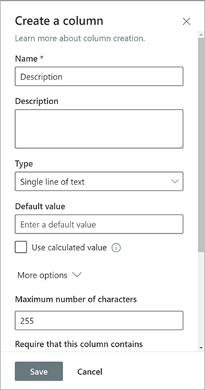

# In Kürze: Konfigurieren von SharePoint als Lerninhaltsquelle für Microsoft Viva Learning (Vorschau)Coming soon: Configure SharePoint as a learning content source for Microsoft Viva Learning (Preview)

> [!NOTE]
> Die Informationen in diesem Artikel beziehen sich auf ein Vorschauprodukt, das möglicherweise erheblich geändert wird, bevor es kommerziell veröffentlicht wird.The information in this article relates to a preview product that may be substantially modified before it's commercially released. 

Sie können SharePoint als Lerninhaltsquelle konfigurieren, um die eigenen Inhalte Ihrer Organisation in Viva Learning (Vorschau) verfügbar zu machen.You can configure SharePoint as a learning content source to make your organization's own content available in Viva Learning (Preview).

## ÜbersichtOverview

Der Wissensadministrator (oder globaler Administrator) stellt eine Website-URL zur Verfügung, zu der der Lerndienst einen leeren zentralen Speicherort – das Lern-App-Inhaltsrepository – in Form einer strukturierten SharePoint-Liste erstellen kann.The knowledge admin (or global administrator) provides a site URL to where the Learning Service can create an empty centralized location—the Learning App Content Repository—in the form of a structured SharePoint list. Diese Liste kann von Ihrer Organisation verwendet werden, um Links zu unternehmensübergreifenden SharePoint-Ordnern zu speichern, die Lerninhalte enthalten.This list can be used by your organization to house links to cross-company SharePoint folders that contain learning content. Administratoren sind für das Sammeln und Krümmen einer Liste von URLs für Ordner verantwortlich.Admins are responsible for collecting and curating a list of URLs for folders. Diese Ordner sollten nur Inhalte enthalten, die in Viva Learning (Vorschau) verfügbar gemacht werden können.These folders should only include content that can be made available in Viva Learning (Preview).

Viva Learning (Preview) unterstützt die folgenden Dokumenttypen:Viva Learning (Preview) supports the following document types:

- Word, PowerPoint, Excel, PDFWord, PowerPoint, Excel, PDF
- Audio (.m4a)Audio (.m4a)
- Video (.mov, .mp4, .avi)Video (.mov, .mp4, .avi)

Weitere Informationen finden Sie unter [SharePoint-Beschränkungen](/office365/servicedescriptions/sharepoint-online-service-description/sharepoint-online-limits?redirectSourcePath=%252farticle%252fSharePoint-Online-limits-8f34ff47-b749-408b-abc0-b605e1f6d498).For more information, see [SharePoint limits](/office365/servicedescriptions/sharepoint-online-service-description/sharepoint-online-limits?redirectSourcePath=%252farticle%252fSharePoint-Online-limits-8f34ff47-b749-408b-abc0-b605e1f6d498). 

## BerechtigungenPermissions

URLs für Dokumentbibliotheksordner können von jeder beliebigen SharePoint-Website in der Organisation gesammelt werden.Document library folder URLs can be collected from any SharePoint site in the organization. Viva Learning (Preview) folgt allen vorhandenen Inhaltsberechtigungen.Viva Learning (Preview) follows all existing content permissions. Daher sind nur Inhalte, für die ein Benutzer Zugriffsrechte hat, in Viva Learning (Vorschau) durchsuchbar und sichtbar.Therefore, only content for which a user has permission to access is searchable and visible within Viva Learning (Preview). Alle Inhalte in diesen Ordnern sind durchsuchbar, aber nur Inhalte, für die der einzelne Mitarbeiter Berechtigungen besitzt, können verwendet werden.Any content within these folders will be searchable, but only content to which the individual employee has permissions can be used.

Das Löschen von Inhalten aus dem Repository Ihrer Organisation wird derzeit nicht unterstützt.Content deletion from your organization’s repository is not currently supported.

Führen Sie die folgenden Schritte aus, um unbeabsichtigt angezeigte Inhalte zu entfernen:To remove unintentionally surfaced content, follow these steps:

1.  Um den Zugriff auf die Dokumentbibliothek einzuschränken, wählen Sie **die** Option Aktionen anzeigen aus, und wählen Sie dann Zugriff **verwalten aus.**To restrict access to the document library, select the **Show actions** option, and then select **Manage access**.
     
     

2.  Löschen Sie das ursprüngliche Dokument in der Dokumentbibliothek.Delete the original document within the document library.

Weitere Informationen finden Sie unter [Freigabe und Berechtigungen in der modernen SharePoint-Erfahrung.](/sharepoint/modern-experience-sharing-permissions)For more information, see [Sharing and permissions in the SharePoint modern experience](/sharepoint/modern-experience-sharing-permissions). 

## LerndienstLearning Service

Der Lerndienst verwendet die bereitgestellten Ordner-URLs, um Metadaten aus allen Inhalten zu erhalten, die in diesen Ordnern gespeichert sind.The Learning Service uses the provided folder URLs to get metadata from all content stored in those folders. Innerhalb von 24 Stunden nach der Bereitstellung der Ordner-URL im zentralen Repository können Mitarbeiter innerhalb von Viva Learning (Vorschau) nach den Inhalten Ihrer Organisation suchen und diese verwenden.Within 24 hours of supplying the folder URL in the centralized repository, employees can search for and use your organization’s content within Viva Learning (Preview). Alle Änderungen an Inhalten, einschließlich aktualisierter Metadaten und Berechtigungen, werden auch innerhalb von 24 Stunden im Lerndienst angewendet.All changes to content, including updated metadata and permissions, will also be applied in the Learning Service within 24 hours.

## Konfigurieren von SharePoint als QuelleConfigure SharePoint as a source

Sie müssen ein globaler Microsoft 365-Administrator, SharePoint-Administrator oder Wissensadministrator sein, um diese Aufgaben ausführen zu können.You must be a Microsoft 365 global administrator, SharePoint administrator, or knowledge admin to perform these tasks.

Führen Sie die folgenden Schritte aus, um SharePoint als Lerninhaltsquellen in für Viva Learning (Preview) zu konfigurieren:To configure SharePoint as a learning content sources in for Viva Learning (Preview), follow these steps:

1.  Wechseln Sie in der linken Navigation des Microsoft 365 Admin Centers zu **Einstellungen**  >  **Organisationseinstellungen**.In the left navigation of the Microsoft 365 admin center, go to **Settings** > **Org settings**.
 
2.  Wählen Sie **auf der** Seite Organisationseinstellungen auf der Registerkarte **Dienste** die Option Viva **Learning (Vorschau)** aus.On the **Org settings** page, on the **Services** tab, select **Viva Learning (Preview)**.

     

3.  Im **Bereich "Viva Learning(Preview)"** unter SharePoint wird die Website-URL zur SharePoint-Website angegeben, auf der Sie ein zentrales Repository von Viva Learning (Preview) erstellen möchten.On the **Viva Learning (Preview)** panel, under SharePoint, provides the site URL to the SharePoint site where you want Viva Learning (Preview) to create a centralized repository.

     

4.  Eine SharePoint-Liste wird automatisch auf der bereitgestellten SharePoint-Website erstellt.A SharePoint list is created automatically within the provided SharePoint site.

     

     Wählen Sie im linken Navigationsbereich der SharePoint-Website **Websiteinhalte**  >  **Lern-App-Inhaltsrepository aus.**In the left navigation of the SharePoint site, select **Site contents** > **Learning App Content Repository**. 

      

5. Füllen Sie auf der Seite Lern-App-Inhaltsrepository die SharePoint-Liste mit URLs in die Lerninhaltsordner auf. On the **Learning App Content Repository** page, populate the SharePoint list with URLs to the learning content folders.

   1. Wählen **Sie Neu** aus, um den Bereich Neues Element **anzeigen** zu können.Select **New** to view the **New item** panel. 

       
 
   2. Fügen Sie **im Bereich** Neues Element im Feld **Titel** einen Verzeichnisnamen Ihrer Wahl hinzu.On the **New item** panel, in the **Title** field, add a directory name of your choice. Fügen Sie **im Feld Ordner-URL** die URL dem Lerninhaltsordner hinzu.In the **Folder URL** field, add the URL to the learning content folder. Wählen Sie **Speichern** aus.Select **Save**.

       

   3. Die **Seite Lern-App-Inhaltsrepository** wird mit den neuen Lerninhalten aktualisiert.The **Learning App Content Repository** page is updated with the new learning content.

       

> [!NOTE]
> Um einen umfassenderen Zugriff auf das Inhaltsrepository der Lern-App zu ermöglichen, wird in Kürze ein Link zur Liste in der Benutzeroberfläche von Viva Learning (Vorschau) verfügbar sein, auf der Benutzer Zugriff anfordern und letztendlich dazu beitragen können, die Liste auffüllen zu können.To allow for broader access to the Learning App Content Repository, a link to the list soon will be available in the Viva Learning (Preview) interface where users can request access and ultimately help populate the list. Websitebesitzer und globale Administratoren müssen Zugriff auf die Liste gewähren.Site owners and global administrators will be required to grant access to the list. Der Zugriff ist nur für die Liste spezifisch und gilt nicht für die Website, auf der die Liste gespeichert ist.Access is specific to the list only and does not apply to the site where the list is stored. Weitere Informationen finden Sie weiter unten in diesem Artikel unter [Bereitstellen](#provide-your-own-organizations-content) der Inhalte Ihrer eigenen Organisation.For more information, see [Provide your own organization's content](#provide-your-own-organizations-content) later in this article.

### Krümmung der Ordner-URL-DokumentbibliothekFolder URL document library curation

Standardmetadaten (z. B. Geändertes Datum, erstellt durch, Dokumentname, Inhaltstyp und Organisationsname) werden automatisch von der Microsoft Graph-API in Viva Learning (Vorschau) gezogen.Default metadata (such as modified date, created by, document name, content type, and organization name) is automatically pulled into Viva Learning (Preview) by the Microsoft Graph API.
 
Um die allgemeine Such- und Suchrelevanz des Inhalts zu verbessern, empfehlen wir das Hinzufügen einer **Beschreibungsspalte.**To improve overall discovery and search relevance of the content, we recommend adding a **Description** column.

Führen Sie **die** folgenden Schritte aus, um der Dokumentbibliotheksseite eine Beschreibungsspalte hinzuzufügen:To add a **Description** column to the document library page, follow these steps:

1.  Wählen Sie **auf der** Seite Dokumente die Option Spalte **hinzufügen aus.**On the **Documents** page, select **Add column**.

2. Wählen Sie **die Option Aktionen** anzeigen aus, und wählen Sie dann Einzelne **Textzeile aus.**Select the **Show actions** option, and then select **Single line of text**.

     

3. Fügen Sie **im Bereich** Spalte erstellen im **Feld Name** einen beschreibenden Namen für die Spalte hinzu.On the **Create a column** panel, in the **Name** field, add a descriptive name for the column. Wählen Sie **Speichern** aus.Select **Save**.

     
 
4. Fügen Sie **auf** der Seite Dokumente in der **Spalte Beschreibung** benutzerdefinierte Beschreibungen für jedes Element hinzu.On the **Documents** page, in the **Description** column, add custom descriptions for each item. Wenn keine Beschreibung angegeben wird, stellt Viva Learning (Preview) eine Standardnachricht zur Verfügung, die den Inhalt als aus Ihrer eigenen SharePoint-Bibliothek hervorhebt.If no description is supplied, Viva Learning (Preview) will provide a default message that highlights the content as being from your own SharePoint library. 

     
 
### Bereitstellen der Inhalte Ihrer eigenen OrganisationProvide your own organization's content

Wissensadministratoren können auf das Lern-App-Inhaltsrepository ihrer Organisation in SharePoint zugreifen, wo sie Verweise auf organisationsübergreifende Dokumentbibliotheken bereitstellen können.Knowledge admins can access their organization’s Learning App Content Repository in SharePoint, where they can provide references to cross-organization document libraries. Inhalte in diesen Bibliotheken werden dann in "Viva Learning" (Vorschau) als Lerninhalte angezeigt.Content within these libraries will be then surfaced as learning content in Viva Learning (Preview).

1. Wählen Sie in Viva Learning (Vorschau) **weitere Optionen** (**...**) aus, und wählen Sie dann **Einstellungen aus.**In Viva Learning (Preview), select **More options** (**...**), and then select **Settings**.

     
     
2. Wählen **Sie unter Einstellungen** die Option Berechtigungen **aus.**Under **Settings**, select **Permissions**.

     

3. Wählen **Sie Zugriff überprüfen** aus, um eine Verbindung mit der zentralen Bibliothek Ihrer Organisation herzustellen.Select **Check access** to connect to your organization’s centralized library.
     
