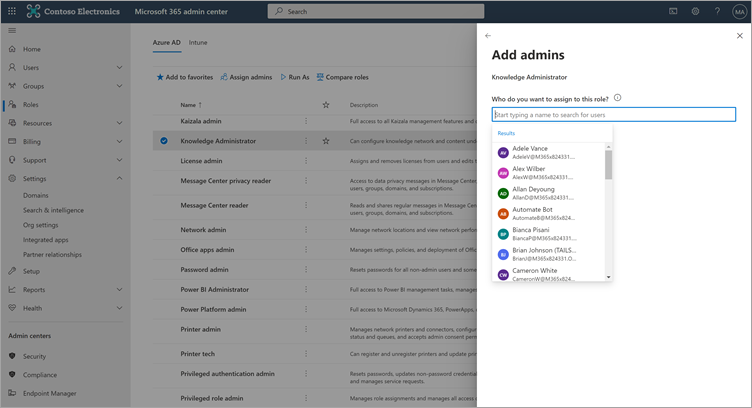

# Konfigurieren von Lerninhaltsquellen für Microsoft Viva Learning (Vorschau) im Microsoft 365 Admin CenterConfigure learning content sources for Microsoft Viva Learning (Preview) in the Microsoft 365 admin center

> [!NOTE]
> Die Informationen in diesem Artikel beziehen sich auf ein Vorschauprodukt, das möglicherweise erheblich geändert wird, bevor es kommerziell veröffentlicht wird.The information in this article relates to a preview product that may be substantially modified before it's commercially released. 

Die Administratoren für das Microsoft 365 Admin Center – entweder allein oder durch Zuweisen der Rolle "Wissensadministrator" zu ausgewählten Personen in Ihrer Organisation – können Einstellungen im Zusammenhang mit "Viva Learning" (Vorschau) verwalten und die Lerninhaltsquellen konfigurieren.The administrators for the Microsoft 365 admin center—either by themselves or by assigning the knowledge admin role to selected individuals in your organization—can manage settings related to Viva Learning (Preview) and can configure the learning content sources.

Der Administrator wählt aus, welche anderen Lerninhaltsquellen (z. B. SharePoint oder unterstützte Inhaltsanbieterquellen von Drittanbietern) benutzern von Viva Learning (Vorschau) zur Verfügung stehen.The administrator selects which other learning content sources (for example, SharePoint or supported third-party content provider sources) will be available to users of Viva Learning (Preview). Der Administrator konfiguriert dann diese Quellen, um sicherzustellen, dass die Inhalte für die Suche und Ermittlung verfügbar sind und von den Mitarbeitern durchsucht werden können, die "Viva Learning" (Vorschau) verwenden.The admin then configures those sources to make sure the content is available for search and discovery and can be browsed by the employees who use Viva Learning (Preview).

> [!NOTE]
>  Benutzer melden sich bei Nicht-Microsoft- und LinkedIn Learning-Pro in einem Browser oder eingebetteten Viewer an.Users sign in to non-Microsoft and LinkedIn Learning Pro learnings in a browser or embedded viewer. Dieses konfigurierte Lernen unterliegt den separaten Lizenz-, Datenschutz- und Dienstbedingungen zwischen Ihrer Organisation und dem Drittanbieter und nicht den Bedingungen von Viva Learning (Preview).This configured learning is subject to the separate license, privacy and service terms between your organization and the third party, and not the Viva Learning (Preview) terms. Vergewissern Sie sich vor der Auswahl dieser Art von Lernprozess, dass eine Vereinbarung für Ihre Organisation und Ihre Benutzer vor sich geht.Before selecting this type of learning, verify you have an agreement in place for your organization and users.

## Zuweisen der Rolle "Wissensadministrator" [Optional]Assign the knowledge admin role [Optional]

Sie müssen ein globaler Administrator Microsoft 365, um diese Aufgaben ausführen zu können.You must be a Microsoft 365 global administrator to perform these tasks.

> [!TIP]
> Der Wissensadministrator sollte moderat technisch sein und über vorhandene SharePoint Administratoranmeldeinformationen verfügen, vorzugsweise eine Person, die sich mit dem Bildungs-, Lern-, Schulungs- oder Mitarbeitererfahrungsteil der Organisation auskennt.The knowledge admin should be moderately technical and have existing SharePoint admin credentials, preferably someone who is well-versed in the education, learning, training, or employee experience part of the organization.

### Hinzufügen eines WissensadministratorsAdd a knowledge admin

Führen Sie die folgenden Schritte aus, um einen Wissensadministrator für Viva Learning (Preview) hinzuzufügen:To add a knowledge admin for Viva Learning (Preview), follow these steps:

1.  Wechseln Sie in der linken Navigation des Microsoft 365 Admin Center zu **Rollen**.In the left navigation of the Microsoft 365 admin center, go to **Roles**.

2.  Wählen Sie **auf der** Seite Rollen auf der Registerkarte **Azure AD** die Option Knowledge **Administrator aus.**On the **Roles** page, on the **Azure AD** tab, select **Knowledge Administrator**.
 
3.  Wählen Sie **im Bereich Wissensadministrator** die Option **Zugewiesene Administratoren** aus, und wählen Sie dann Hinzufügen **aus.**On the **Knowledge Administrator** panel, select **Assigned admins**, and then select **Add**.

     

3.  Wählen Sie **im Bereich** Administrator hinzufügen die Person aus, die Sie für die Rolle auswählen, und wählen Sie dann **Hinzufügen aus.**On the **Add admins** panel, select the person you choose for the role, and then select **Add**.

     

### Entfernen eines WissensadministratorsRemove a knowledge admin

Führen Sie die folgenden Schritte aus, um einen Wissensadministrator für Viva Learning (Preview) zu entfernen:To remove a knowledge admin for Viva Learning (Preview), follow these steps:

1.  Wechseln Sie in der linken Navigation des Microsoft 365 Admin Center zu **Rollen**.In the left navigation of the Microsoft 365 admin center, go to **Roles**.

2.  Wählen Sie **auf** der Seite Rollen auf der **Registerkarte Azure AD** die Option Knowledge Administrator **aus.**On the **Roles** page, on the **Azure AD** tab, and then select **Knowledge Administrator**.
 
3.  Wählen Sie im Bereich **Wissensadministrator** auf der Registerkarte Zugewiesene **Administratoren** die Option **Entfernen** aus, und wählen Sie dann die Person aus, die Sie aus der Rolle entfernen möchten.On the **Knowledge Administrator** panel, on the **Assigned Admins** tab, select **Remove**, and then select the person you want to remove from the role. Wählen Sie entfernen aus, um dies **zu bestätigen.**To confirm, select **Remove**.

     

## Konfigurieren von Einstellungen für die LerninhaltsquellenConfigure settings for the learning content sources

Sie müssen ein Microsoft 365 oder Wissensadministrator sein, um diese Aufgaben ausführen zu können.You must be a Microsoft 365 global administrator or knowledge admin to perform these tasks.

Führen Sie die folgenden Schritte aus, um Einstellungen für Lerninhaltsquellen in Viva Learning zu konfigurieren:To configure settings for learning content sources in Viva Learning, follow these steps:

1.  Wechseln Sie in der linken Navigation des Microsoft 365 Admin Center zu **Einstellungen**  >  **Organisationseinstellungen**.In the left navigation of the Microsoft 365 admin center, go to **Settings** > **Org settings**.

2.  Wählen Sie **auf der** Seite Organisationseinstellungen auf der Registerkarte **Dienste** die Option **Lern-App (Vorschau)** aus.On the **Org settings** page, on the **Services** tab, select **Learning app (Preview)**.

     

3.  Wählen Sie **im Bereich Lern-App (Vorschau)** die Lerninhaltsquellen aus, die Sie für die Organisation konfigurieren möchten, und wählen Sie dann **Speichern aus.**On the **Learning app (Preview)** panel, select the learning content sources you want to configure for the organization, and then select **Save**.

     

Unter allen vorhandenen Lernquellen werden einige standardmäßig aktiviert.Among all the learning sources that exist, some will be enabled by default. Zu diesen Lernquellen gehören:These learning sources include:

- LinkedIn Learning (kostenloser Inhalt)LinkedIn Learning (free content)
- Microsoft LearnMicrosoft Learn
- Microsoft 365 SchulungMicrosoft 365 Training

> [!NOTE]
> Kostenlose Inhalte von LinkedIn werden Benutzern im Rahmen der LinkedIn-Datenschutzrichtlinien und der Benutzervereinbarung zur Verfügung gestellt.LinkedIn free content is provided to users under the LinkedIn privacy policies and user agreement. LinkedIn erhält die IP-Adresse des Benutzers, alle zuvor von LinkedIn festgelegten Cookies und setzt ein neues Cookie, um die Verwendung kostenloser Inhalte nachverfolgt zu werden.LinkedIn will receive the user’s IP address, any cookies previously set by LinkedIn, and will set a new cookie to track use of free content. Benutzer müssen sich nicht mit LinkedIn anmelden, um kostenlose Inhalte zu erhalten.Users are not required to sign in with LinkedIn to receive free content.  
Für LinkedIn Premium-Inhalte benötigt Ihre Organisation ein Abonnement für Ihr Team, um auf diese Inhalte zu zugreifen.For LinkedIn premium content, your organization needs a subscription for your team to access that content. Benutzer müssen sich bei LinkedIn anmelden, um auf dieses Lernen zu zugreifen, das unter den Bedingungen der Nutzungsbedingungen Ihrer Organisation und der Benutzer mit LinkedIn bereitgestellt wird.Users will need to sign into LinkedIn to access that learning, which is provided under the terms of your organization’s and user terms with LinkedIn.   Stellen Sie für Nicht-Microsoft-Inhalte (mit Ausnahme von kostenlosen LinkedIn-Inhalten) sicher, dass Ihre Organisation über ein Abonnement verfügt, mit dem Ihre Benutzer über ein Arbeitskonto auf diese Inhalte zugreifen können, bevor Sie eine Verbindung mit Viva Learning (Vorschau) herstellen.For non-Microsoft content (except free LinkedIn content), ensure your organization has a subscription for your users to access that content using a work account before connecting it to Viva Learning (Preview). Die persönlichen Abonnements von Benutzern bei Nicht-Microsoft-Lernanbietern werden nicht in Viva Learning (Preview) integriert.Users’ personal subscriptions to non-Microsoft learning providers will not be integrated with Viva Learning (Preview). Benutzer melden sich bei Nicht-Microsoft- und LinkedIn Learning-Pro in einem Browser oder eingebetteten Viewer an.Users sign in to non-Microsoft and LinkedIn Learning Pro learnings in a browser or embedded viewer. Wenn Benutzer zu Inhalten navigieren, für die sie kein Organisationsabonnement haben, wird möglicherweise eine Anbieterseite angezeigt, auf der sie sich für ein einzelnes Abonnement registrieren können.If users navigate to content where they do not have an organizational subscription, they may see a provider page where they could sign up for an individual subscription. Alle Nicht-Microsoft-Lernprozesse werden unter den Bedingungen des Nicht-Microsoft-Anbieters und nicht als Teil von Viva Learning bereitgestellt.All non-Microsoft learning is provided under the non-Microsoft provider’s terms and not as part of Viva Learning. 

Um eine Lerninhaltsquelle zu aktivieren oder zu deaktivieren, aktivieren Sie das Kontrollkästchen neben der Quelle.To enable or disable a learning content source, select the check box next to the source. Wenn eine Quelle aktiviert ist, wird ein Häkchen angezeigt.If a source is enabled, a check mark will be visible.

## Inhaltsanbieter von DrittanbieternThird-party content providers 

Der Satz der verfügbaren verbundenen Lernanbieter kann sich jederzeit ändern.The set of available connected learning providers might change at any time. Wenn das Programm wächst, werden weitere Anbieter beitreten.More providers will join as the program grows. Verfügbare Anbieter können auch ihre Verbindung mit Viva Learning (Preview) beenden.Available providers might also choose to discontinue their connection with Viva Learning (Preview).

### Skillsoft als InhaltsquelleSkillsoft as a content source  

Für Viva Learning (Preview) landen Benutzer, die Skillsoft aktiviert haben und skillsoft-Inhalte anzeigen möchten, auf einer Percipio-Seite, auf der sie zur Eingabe des Percipio-Websitenamens Ihrer Organisation gefragt werden.For Viva Learning (Preview), users who have Skillsoft enabled and choose to view Skillsoft content will land on a Percipio page that asks them to input your organization's Percipio site name. Nachdem Benutzer den Websitenamen Ihrer Organisation eingegeben haben, werden sie zur Seite weitergeleitet, um sich bei der Percipio-Website Ihrer Organisation zu registrieren.After users input your organization's site name, they will be directed to page to sign in to your organization's Percipio site. Benutzer melden sich mit ihren vorhandenen Anmeldeinformationen an und sehen die inhalte, die sie ursprünglich ausgewählt haben.Users will sign in by using their existing credentials and see the content they originally selected. Benutzer werden aufgefordert, den Namen der Percipio-Website nur einmal ein eingaben, bis der Browsercache gelöscht ist.Users will be asked to input the Percipio site name only once, until their browser cache is cleared. Um diese Benutzererfahrung zu optimieren, empfehlen wir, Ihren Percipio-Websitenamen in die interne Kommunikation ein, die Sie zu Viva Learning (Vorschau) senden.To streamline this experience for your users, we recommend including your Percipio site name in internal communications you send about Viva Learning (Preview).

Dies soll eine temporäre Vorschauerfahrung sein, und wir arbeiten mit Skillsoft zusammen, um die mandantenspezifische Integration für die allgemeine Verfügbarkeit zu ermöglichen, wodurch der Schritt umgangen wird, bei dem Benutzer den Percipio-Websitenamen Ihrer Organisation bereitstellen müssen.This is intended to be a temporary experience for preview, and we are working with Skillsoft to enable tenant-specific integration for general availability, which will bypass the step that requires users to provide your organization's Percipio site name. 

### Details zum Microsoft-SubstrateDetails on Microsoft substrate  

Für Daten, die Sie aus einem Nicht-Microsoft-Dienst (Lernanbieter oder Lernverwaltungssystem) in Viva Learning (Vorschau) kopieren, können Sie diese Daten in Viva Learning (Vorschau) nicht direkt extrahieren, korrigieren oder löschen.For data that you copy to Viva Learning (Preview) from a non-Microsoft service (learning provider or learning management system), you are not able to directly extract, correct, or delete that data in Viva Learning (Preview). Wir aktualisieren die von Nicht-Microsoft-Anbietern importierten Daten prompt, um Änderungen und Löschungen in den Nicht-Microsoft-Quelldaten widerspiegeln zu können.We refresh the data you import from non-Microsoft providers promptly to reflect changes and deletions in the non-Microsoft source data.

Sie müssen mit dem Lieferanten des Nicht-Microsoft-Diensts zusammenarbeiten, um auf Daten zu zugreifen, sie zu korrigieren, zu löschen oder zu extrahieren, die unter den Lizenz-, Dienst- oder Datenschutzbedingungen des Nicht-Microsoft-Diensts enthalten sind.You need to work with the supplier of the non-Microsoft service to access, correct, delete or extract data under the license, service, or privacy terms of the non-Microsoft service. Die dort vorgenommenen Änderungen werden in den Daten widergespiegelt, die für Ihre Verwendung in Viva Learning (Preview) nach Abschluss der Datenaktualisierungszyklen des Nicht-Microsoft-Diensts und von Viva Learning (Preview) verarbeitet wurden.The changes made there will be reflected in the data processed for your use in Viva Learning (Preview) upon completion of the data update cycles of the non-Microsoft service and Viva Learning (Preview). Wenn Sie die Verbindung zwischen Viva Learning (Preview) und einem Nicht-Microsoft-Dienst deaktivieren, werden alle Daten, die Sie zuvor aus diesem Dienst importiert haben, gelöscht.If you turn off the connection between Viva Learning (Preview) and a non-Microsoft service, all data you had previously imported from that service will be deleted. 

## Nächster SchrittNext step

[Konfigurieren SharePoint als Lerninhaltsquelle für Microsoft Viva Learning (Vorschau)Configure SharePoint as a learning content source for Microsoft Viva Learning (Preview)](configure-sharepoint-content-source.md)