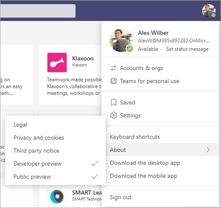
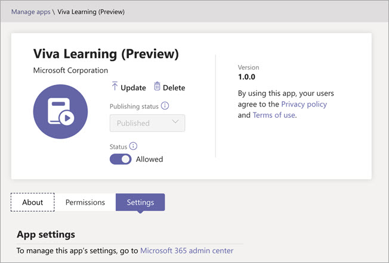

# Einrichten von Microsoft Viva Learning (Preview) im Teams Admin Center

> [!NOTE]
> Die Informationen in diesem Artikel beziehen sich auf ein Vorschauprodukt, das möglicherweise erheblich geändert wird, bevor es kommerziell veröffentlicht wird. 

Der Teams installiert Viva Learning (Preview) und wendet Berechtigungsrichtlinien über das Teams Admin Center an.

1. Für die öffentliche Vorschau müssen Sie zuerst die Updaterichtlinie festlegen. Weitere Informationen finden Sie unter Teams website [Microsoft Teams Public Preview](/MicrosoftTeams/public-preview-doc-updates).

    1. Melden Sie sich beim Teams Admin Center an.

    2. Wählen **Teams**  >  **Updaterichtlinien aus.**

    3. Klicken Sie auf **Hinzufügen**. 

    4. Benennen Sie die Updaterichtlinie, fügen Sie eine Richtlinie hinzu, und aktivieren Sie **Vorschaufeatures anzeigen.**

2. Der Administrator muss benutzer über das Richtlinienupdate benachrichtigen, damit er seinen Build in die öffentliche Vorschau für Teams. 

    1. Der Benutzer muss sein Profilbild auswählen – > Informationen – > Vorschau anzeigen.
   
        
    
    2. Der Benutzer muss die Bedingungen der öffentlichen Vorschau akzeptieren.

        
 
3. For organizations that have restrictive policies and need to enable Viva Learning, follow the process in the next section.

## Verwalten von Einstellungen für Viva Learning (Vorschau)

Sie müssen ein Administrator im Teams Admin Center sein, um diese Aufgaben ausführen zu können.

Führen Sie die folgenden Schritte aus, um Viva Learning (Vorschau) für Benutzer in Ihrer Organisation verfügbar zu machen:

1. Navigieren Sie in der linken Navigation des Teams Admin Center zu **Teams Apps**  >  **verwalten.**

   

2. Geben Sie **auf** der Seite Apps verwalten im Suchfeld *"Viva learning"* ein, und wählen Sie dann **Viva Learning (Vorschau) aus.**

   

3. Auf der **Seite "Viva Learning(Preview)"**

   1. Wählen **Sie unter Status** die Option **Zum** Aktivieren von "Viva Learning" (Vorschau) zugelassen aus.

   2. Wechseln Sie **Einstellungen** Registerkarte unter **App-Einstellungen** zum Microsoft 365 Admin Center, um [Lerninhaltsquellen zu konfigurieren.](content-sources-365-admin-center.md)

   

4. Wechseln **Sie nach** Verwalten  von App-Einstellungen zu Berechtigungsrichtlinien und **Setuprichtlinien,** um Mitarbeitern, die im Rahmen der Teilnahme Ihrer Organisation an der Vorschau Zugriff auf Viva Learning (Preview) haben sollen, Die Berechtigung zu erteilen.

> [!NOTE]
>  Wenn Sich Ihre Organisation im Rahmen des TEAMS TAP100-Programms in Ring 4.0 befindet, müssen Sie möglicherweise genehmigte Benutzer in Ring 3.0 für den Zugriff auf "Viva Learning" (Vorschau) aktivieren.   Im Rahmen der Vorschau wird Viva Learning (Preview) in Ring 3.0 veröffentlicht. Wenn Sich Ihre Organisation in Ring 4.0 befindet, wird auf der Seite Apps verwalten kein Viva Learning (Preview) **angezeigt.** Zum Testen der App müssen Sie eine benutzerdefinierte App-Berechtigungsrichtlinie erstellen, sie auf Alle Apps zulassen festlegen und sie genehmigten Benutzern in Ring 3.0 zuweisen.       

## Nächster Schritt

[Konfigurieren von Lerninhaltsquellen für Viva Learning (Vorschau) im Microsoft 365 Admin Center](content-sources-365-admin-center.md)
