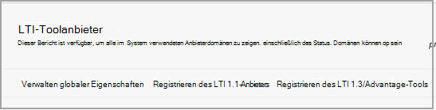

# Verwenden von Microsoft Teams Klassen mit Blackboard

> [!IMPORTANT]
> Einige Informationen beziehen sich auf Vorabversionen von Produkten, die vor der kommerziellen Veröffentlichung noch erheblich geändert werden können. Microsoft übernimmt mit diesen Informationen keinerlei Gewährleistung, sei sie ausdrücklich oder konkludent.

Microsoft Teams Klassen ist eine Learning Tools Interoperability (LTI)-App, die Lehrkräften und Schülern dabei hilft, problemlos zwischen ihrem Learning Management System (LMS) und Teams zu navigieren. Benutzer können direkt in ihrem LMS auf ihre Kursteams zugreifen, die ihrem Kurs zugeordnet sind.

## Genehmigen der App im Microsoft Azure Mandanten

Die folgenden Aufgaben werden vom Microsoft Office 365-Administrator und dem Blackboard Learn Ultra-Administrator abgeschlossen.

Vor der Verwaltung der Integration in Blackboard Learn Ultra muss der Microsoft Office 365-Administrator die Blackboard **MSFT-Teams für die Learn Ultra Azure-App** für den Microsoft Azure Mandanten der Bildungseinrichtung genehmigen.

1. Suchen Sie Ihre Microsoft-Mandanten-ID. Erfahren [Sie, wie Sie den Mandanten finden.](/azure/active-directory/fundamentals/active-directory-how-to-find-tenant)

2. Leiten Sie den Microsoft Identity Platform Admin Consent-Endpunkt gemäß dem folgenden Beispiel um:

   `https://login.microsoftonline.com/{tenant}/adminconsent?client_id=2d94989f-457a-47c1-a637-e75acdb11568`

   > [!NOTE]
   > Ersetzen Sie {tenant} durch die Microsoft-Mandanten-ID Ihrer Organisation.

## Registrieren der Integrations-Apps

Als Blackboard Learn Ultra-Administrator müssen Sie 2 LTI 1.3-Integrations-Apps in Ihrer Testumgebung registrieren:

- Die Blackboard Learn Class Teams Integration zur Unterstützung der Listensynchronisierung

- Die LTI-App des Microsoft Teams Klassenteams

1. Notieren Sie sich die folgenden LTI-Client-IDs für beide Apps:

    - Blackboard - f1561daa-1b21-4693-ba90-6c55f1a0eb41

    - Microsoft - 027328b7-c2e3-4c9e-aaa1-07802dae6c89

2. Greifen Sie auf den Admin-Bereich zu, und suchen Sie unter **"Integrationen"** nach den LTI-Toolanbietern.

   

3. Wählen Sie **"LTI1.3/Advantage-Tool registrieren" aus.**

4. Geben Sie die erste der bereitgestellten Client-IDs ein (Blackboard oder Microsoft), und wählen Sie **"Übermitteln"** aus.

5. Überprüfen Sie die vordefinierten Einstellungen, und stellen Sie sicher, dass der Toolstatus als genehmigt gekennzeichnet ist.

6. Scrollen Sie nach unten, und wählen Sie dann **"Absenden"** aus.

7. Wiederholen Sie die vorherigen Schritte, um die zweite der LTI-Apps in Ihrer Umgebung zu registrieren.

## Einrichten der REST-Anwendung und der ursprungsübergreifenden Ressourcenfreigabe

Der Blackboard Learn Ultra-Administrator muss auch die REST-Anwendung und die Konfiguration für die Ursprungsübergreifende Ressourcenfreigabe konfigurieren.

Führen Sie die folgenden Schritte aus, um die REST-Anwendung einzurichten.

1. Greifen Sie auf die Lernverwaltungstools zu, und wählen Sie dann im Abschnitt **"Integrationen"** DIE **REST-API-Integrationen** aus.

2. Wählen Sie **Integrationen erstellen** aus, und geben Sie die gleiche Anwendungs-/Client-ID ein, die Sie für das Blackboard Learn Class Teams Integration LTI-Tool eingegeben haben.

3. Geben Sie den Benutzer "Lernen" ein (dies könnte Ihr eigener Administratorbenutzernamen "Lernen" sein), oder wählen Sie **"Durchsuchen"** aus, um sie zu finden.

4. Wählen Sie **"Ja"** für **den Endbenutzerzugriff aus.**

5. Wählen Sie **"Ja"** **aus, um autorisiert zu sein, als Benutzer zu fungieren**

6. Wählen Sie Nach Abschluss **absenden** aus.

## Einrichten der ursprungsübergreifenden Ressourcenfreigabe

1. Greifen Sie auf die Lernverwaltungstools zu, und wählen Sie im Abschnitt **"Integrationen"** die Option **"Cross-Origin Resource Sharing"** aus.

2. Wählen Sie **"Konfiguration erstellen" aus.**

3. Geben Sie `https://bb-ms-teams-ultra-ext.api.blackboard.com` den Ursprung ein.

4. Fügen Sie das Wort **Autorisierung** in den **zulässigen Kopfzeilen** hinzu.

5. **Auf "Verfügbar"** auf **"Ja"** festgelegt.

6. Wählen Sie Nach Abschluss **absenden** aus.

## Aktivieren von Kurs-Teams in Blackboard Learn

Nachdem Sie die LTI-Tools aktiviert haben, müssen Sie im nächsten Schritt die Microsoft-Klasse Teams Integration von Ihrem eigenen Microsoft Office 365 Mandanten einrichten. Sie können dies tun, indem Sie diese Schritte als Blackboard Learn Ultra-Administrator ausführen.

1. Wählen Sie unter **"Administratortools**  >  **und Hilfsprogramme** lernen" **Microsoft Teams Integrationsadministrator** aus.

   

2. Aktivieren Sie das Kontrollkästchen zum **Aktivieren Microsoft Teams**.

3. Geben Sie Ihre Mandanten-ID ein, wie im Abschnitt unter "Microsoft O365-Administrator" angegeben.

 > [!NOTE]
 > Sie können die Einstellungen erst speichern, wenn die App vom O365-Administrator genehmigt wurde. Weitere Informationen finden Sie unter [Genehmigen der App in Microsoft Azure Mandanten.](#approve-the-app-in-the-microsoft-azure-tenant)

4. Wenn der globale O365-Administrator die Blackboard-Teams-Anwendung in Ihrem Microsoft-Mandanten genehmigt hat, wählen Sie **"Übermitteln"** aus.
