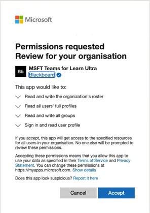

# Verwenden Microsoft Teams Klassen mit Blackboard Learn Ultra

Teamwork ist der Kern jeder modernen Organisation. Durch die Förderung der Zusammenarbeit ist dies ein definierendes Merkmal jeder erfolgreichen Institution. Sie können alle Funktionen und Features von Blackboard Learn Ultra verbessern, indem Sie sie mit Microsoft Teams Klassen kombinieren.

Ihre Klassen können Echtzeitunterhaltungen, Videobesprechungen oder asynchrone Interaktionen umfassen. Sie können Dateifreigabe- und -erstellungsfunktionen für Ihre Schüler/Studenten an einem zentralen Ort hinzufügen. Microsoft Teams Klassen mit Learn Ultra definieren die Dynamik des Lehrens neu und was effektives Lernen bedeutet.

> [!IMPORTANT]
> Stellen Sie sicher, dass Sie das Feld "Bildungs-E-Mail" in Ihrem [Schülerinformationssystem (SIS)](https://help.blackboard.com/Learn/Administrator/SaaS/Integrations/Student_Information_System/SIS_Planning) erfolgreich eingerichtet haben.
>
>Die Integration der Microsoft Teams Klassen basiert auf dem E-Mail-Feld der Bildungseinrichtung in Ihrem SIS, um dem [Benutzerprinzipalnamen (User Principle Name, UPN)](/azure/active-directory/hybrid/howto-troubleshoot-upn-changes)des richtigen Microsoft Azure Active Directory (AAD) zuzuordnen. Wenn keine Institutions-E-Mail bereitgestellt wurde, wird standardmäßig die vorhandene E-Mail verwendet. Es wird empfohlen, dieses Feld für jeden Benutzer festzulegen, um sicherzustellen, dass seine Daten korrekt synchronisiert werden und dass es keinen Konflikt zwischen AAD und Blackboard Learn Ultra gibt.
>
> Wenn Sie dieses Feld in Ihrer SIS-Zuordnung nicht entsprechend festgelegt haben, funktioniert die Integration weiterhin, benutzer werden jedoch möglicherweise nicht in den Teams erstellten Klassen angezeigt, und es können Fehler auftreten.

## Unterstützung der zuordnung von institutionsbasierten Daten – Sis-Feld für Institution-E-Mail

Im Rahmen der Weiterentwicklung der Cloudanbieterintegration hat Blackboard Learn Ultra sowohl in der Integration des Student Information System Framework als auch in öffentlichen REST-APIs ein neues **E-Mail-Feld** für Die Bildungseinrichtung erstellt, mit dem Einrichtungen den Datensynchronisierungsprozess zwischen Blackboard Learn Ultra und AAD effektiv verwalten können.

### Was bedeutet die E-Mail-Adresse der Bildungseinrichtung und was unterstützt sie?

Das **E-Mail-Feld "Institution"** ermöglicht angepasste Feldzuordnungen zwischen den extern unterstützten Datenquellen eines Clients und Blackboard Learn Ultra. Wenn Datenquellen Cloudanbieter sind, z. B. Microsoft, ist der Benutzerprinzipalname (User Principle Name, UPN) ein primärer eindeutiger Bezeichner für jeden Benutzer, der aus einem UPN-Präfix (kontoname des Benutzers) und einem UPN-Suffix (einem DNS-Domänennamen) besteht, die mit einem @-Symbol verbunden sind. Dadurch wird eine eindeutige E-Mail-Adresse für jeden bestimmten Benutzer innerhalb des Microsoft Azure Active Directory erstellt.

Um sicherzustellen, dass die Daten korrekt sind und Registrierungen oder Mitgliedschaften zwischen Blackboard Learn Ultra und Microsoft Teams Klassen ordnungsgemäß erreicht werden, muss die E-Mail-Adresse eines Benutzers zwischen beiden Systemen übereinstimmen. In Blackboard Learn Ultra können Benutzer ihre vorhandene E-Mail-Adresse auf der Benutzeroberfläche ändern oder überschreiben, was zu Synchronisierungsfehlern führen kann und der Benutzer einem Kursteam nicht ordnungsgemäß hinzugefügt wird. Die **E-Mail-Feldzuordnung** der Institution stellt sicher, dass diese Sicherheits- und Überprüfungsstufe ordnungsgemäß verwaltet werden kann, unabhängig davon, ob Benutzer ihre E-Mails innerhalb von Blackboard Learn Ultra geändert haben oder nicht.

 Wenn zwei E-Mail-Adressen unterschiedlich sind:

- Es muss eine Entscheidung darüber getroffen werden, welche Quelle Vorrang hat und sowohl als E-Mail-Person als auch als E-Mail-Institution getroffen wird.
  Oder
- Eine Institution kann eine benutzerdefinierte Feldzuordnung in ihrer Institution-E-Mail festlegen, die einen potenziellen Konflikt lösen kann.

Die **Institution Email field** mapping is now available for all existing SIS integration types at Advanced Configuration **Einstellungen** Users Learn  >  **Object Type** Field  >  **Mapping**.

> [!NOTE]
> Es ist wichtig zu beachten, dass die **Institutions-E-Mail** standardmäßig für alle **SIS-Formate auf "Personen-E-Mail"** festgelegt ist und für jede Person eindeutig sein muss. Alle vorhandenen Integrationen, die eingerichtet und ausgeführt werden, verfügen über diese Datenzuordnung, da SIS benutzer nicht importieren kann, wenn ihre E-Mails dupliziert sind. Wenn eine Bildungseinrichtung die Möglichkeit benötigt, die E-Mail-Adresse der Bildungseinrichtung in **"Benutzerdefiniert"** zu ändern, muss sie dies über die **erweiterte Konfiguration Einstellungen** im SIS verwalten.

## Anforderungen

Die Integration der Microsoft Teams Klassen ist nur für Kurse in **der Extremkursansicht** verfügbar. Ihre Bildungseinrichtung muss diese Anforderungen erfüllen, um sie zu verwenden:

- Blackboard Learn Ultra Learn SaaS mit aktivierter Ultra-Basisnavigation

  

- Aktivieren Sie LTI für die Verwendung in Kursen.

  a. Wechseln Sie zum **Administratorbereich**  >  **LTI-Toolanbieter**  >  **verwalten globale Eigenschaften.**

  b. Wählen Sie **"LTI Aktiviert" in "Kurse"** und optional **"In Organisationen aktiviert" aus.**

  c. Wählen Sie **Senden** aus.

- LTI muss konfiguriert sein

- Hinzufügen von Blackboard Learn Super Teams Klassen LTI-Integration

- Add Microsoft Teams Classes LTI 1.3 Tool

- Hinzufügen des REST-API-Tools und der ursprungsübergreifenden Ressourcenfreigabe

- Konfigurieren und Genehmigen Microsoft Teams Klassenintegration

## Hinzufügen des Tools "Blackboard Learn Super Teams Classes LTI 1.3"

1. Wählen Sie im **Administratorbereich** **LTI-Toolanbieter aus.**

2. Wählen Sie **"LTI 1.3-Tool registrieren" aus.**

3. Geben Sie im **Feld "Client-ID"** diese ID ein, oder kopieren Sie sie, und fügen Sie sie ein:

   `f1561daa-1b21-4693-ba90-6c55f1a0eb41`

4. Überprüfen Sie alle Einstellungen, die vorab ausgefüllt wurden, und wählen **Sie "Toolstatus"** aus, und wählen Sie dann **"Aktiviert"** aus.

5. Wählen Sie in **"Institution Policies"** **die Option "Rolle im Kurs", "Name"** und **"E-Mail-Adresse"** aus, und wählen Sie dann für beide die Option **"Ja"** aus.

6. Wählen Sie **"Dienstzugriff zulassen"** und **"Mitgliedschaftsdienstzugriff zulassen" aus.**

## Hinzufügen des Tools Microsoft Teams Klassen LTI 1.3

1. Wählen Sie im **Administratorbereich** **LTI-Toolanbieter aus.**

2. Wählen Sie **"LTI 1.3-Tool registrieren" aus.**

3. Geben Sie im **Feld "Client-ID"** diese ID ein, oder kopieren Sie sie, und fügen Sie sie ein:

   `027328b7-c2e3-4c9e-aaa1-07802dae6c89`

4. Überprüfen Sie alle Einstellungen, die bereits ausgefüllt wurden, und wählen *Sie "Toolstatus"* aus, und wählen Sie *"Aktiviert" aus.*

5. Wählen Sie in **"Institution Policies"** **die Rolle in "Kurs", "Name"** und **"E-Mail-Adresse"** aus. Wählen Sie für beides **"Ja"** aus.

6. Wählen Sie **"Dienstzugriff zulassen"** und **"Mitgliedschaftsdienstzugriff zulassen" aus.**

## Hinzufügen des REST-API-Tools

1. Navigieren Sie im **Administratorbereich** zu **"Integrationen",** und wählen Sie **"Rest-API-Integrationen" aus.**

2. Wählen Sie **Integration erstellen** aus.

3. Geben Sie im **Feld "Anwendungs-ID"** diese ID ein, oder kopieren Sie sie, und fügen Sie sie ein:

   `f1561daa-1b21-4693-ba90-6c55f1a0eb41`

4. Geben Sie einen Benutzer für diese Integration ein.

   Dieser Benutzer ist der Benutzer mit dem Zugriff auf die Home-API, dem die Anwendung zugeordnet ist.

5. Wählen Sie **Senden** aus.

## Hinzufügen der ursprungsübergreifenden Ressourcenfreigabe

1. Navigieren Sie im **Administratorbereich** zu **"Integrationen",** und wählen Sie **Ursprungsübergreifende Ressourcenfreigabe aus.*

2. Wählen Sie **"Konfiguration erstellen" aus.**

3. In the **Origin** field, type of copy and paste this URL:

   `https://bb-ms-teams-ultra-ext.api.blackboard.com`

4. Geben Sie im Feld **"Zulässige Kopfzeilen"** die Berechtigung **ein.**

5. **Auf "Verfügbar"** auf **"Ja"** festgelegt.

6. Wählen Sie **Senden** aus.

## Konfigurieren und Genehmigen Microsoft Teams Klassenintegration

Um Ihre Blackboard Learn Ultra-Instanz erfolgreich in Microsoft Teams Klassen zu integrieren, müssen Sie sicherstellen, dass die Blackboard Learn Ultra-Anwendung für den Zugriff innerhalb Ihres Microsoft Azure Mandanten genehmigt wurde. Dies ist ein Prozess, der vom Microsoft 365 globalen Administrator Ihrer Bildungseinrichtung abgeschlossen werden muss.

Dieser Vorgang kann entweder vor oder nach der Konfiguration der LTI-Anwendungen in Ihrer Blackboard Learn Ultra-Instanz erfolgen.

### Vor dem Konfigurieren der LTI-Anwendungen

Wenn Sie die Blackboard Learn Ultra Teams Classes Azure-App vor dem Konfigurieren der LTI-Integrationen genehmigen möchten, müssen Sie zum **Microsoft Identity Platform Admin Consent Endpoint umleiten.** Die URL wird angezeigt:

`https://login.microsoftonline.com/{tenant}/adminconsent?client\_id=2d94989f-457a-47c1-a637-e75acdb11568`

> [!NOTE]
> Sie ersetzen **{Tenant}** durch Ihre spezifische institutionsspezifische Microsoft Azure Mandanten-ID.

Es wird ein Berechtigungsfenster angezeigt, in dem erläutert wird, dass Sie Blackboard Learn Ultra die Berechtigung erteilen, auf Microsoft Teams zuzugreifen.

### Nach dem Konfigurieren der LTI-Anwendungen

1. Navigieren Sie im **Administratorbereich** zu **Tools und Hilfsprogrammen,** und wählen Sie **Microsoft Teams Integrationsadministrator** aus.

2. Wählen Sie **"Microsoft Teams aktivieren"** aus.

3. Fügen Sie Ihre **Microsoft-Mandanten-ID** in das verfügbare Textfeld ein.

4. Wählen Sie eine der folgenden Optionen aus:

   - Wenn die App vorab zugestimmt hat, wird ein kleines Häkchen angezeigt. Wenn das Häkchen angezeigt wird, wählen Sie **Absenden** aus.

   - Wenn die Zustimmung nicht genehmigt wurde, führen Sie die beschriebenen Schritte aus, um die URL für die Zustimmung zu generieren und zur Genehmigung an den Microsoft 365 globalen Administrator zu senden.

5. Nachdem Sie die Genehmigungsbestätigung erhalten haben, wählen Sie **"Erneut versuchen"** aus, um dies zu bestätigen, und wählen Sie dann **"Absenden"** aus.

   