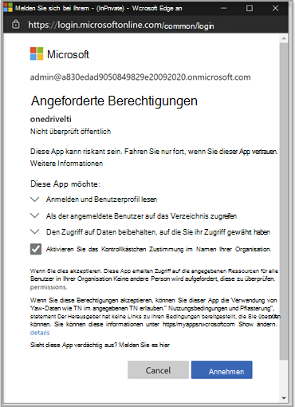

# Verwenden Microsoft OneDrive LTI mit Canvas

> [!IMPORTANT]
> Einige Informationen beziehen sich auf Vorabversionen von Produkten, die vor der kommerziellen Veröffentlichung noch erheblich geändert werden können. Microsoft übernimmt mit diesen Informationen keinerlei Gewährleistung, sei sie ausdrücklich oder konkludent.

## Integration in Canvas

Die Person, die diese Integration durchführt, sollte ein Administrator von Canvas und ein Administrator des Microsoft 365 Mandanten sein.

1. Melden Sie sich mit dem Mandantenadministratorkonto beim Microsoft Azure-Portal an. Der Azure-Mandantenadministrator sollte auch über die Rolle "Gruppenadministrator" verfügen.

    

2. Melden Sie sich beim Microsoft [OneDrive LTI-Portal](https://odltiappnl.azurewebsites.net/admin)an.

3. Akzeptieren Sie die Berechtigungen, um die Anmeldung abzuschließen.

    

4. Wählen **Sie "LTI-Mandant hinzufügen"** aus.

     

5. Wählen Sie in der Dropdownliste **LTI Consumer Platform** als **Canvas** aus.

6. Wählen Sie **"Canvas-Basis-URL"** und dann **"Weiter"** aus.

    

   Auf dem nächsten Bildschirm werden Felder angezeigt, die für Sie vertraulich sind.

7. Wählen Sie **"Weiter"** aus ?? den Link für resend the email auswählen. KÖNNEN PRÜFER HIER DIE LEERE AUSFÜLLEN?

8. Klicken Sie auf dem Bildschirm auf **"Weiter",** auf dem Informationen angezeigt werden, die Für Sie vertraulich sind.

   Der letzte Bildschirm des Azure-Portals zeigt die nächsten Schritte zum Hinzufügen Ihrer Canvas-Instanz.

9. Kopieren Sie die Entwicklerschlüssel von diesem Bildschirm. Sie werden beim Erstellen der Canvas-Instanz verwenden.

## Hinzufügen der Canvas-Instanz

1. Deaktivieren Sie in Ihrer Canvas-Instanz die Option **"Admin**  >  **Developer Keys".**

2. Wählen Sie **LTI-Schlüssel** in der Dropdownliste auf **"Entwicklerschlüssel" aus.**

   

3. Fügen Sie die Entwicklerschlüssel hier ein.

     

   Der Schlüssel wird im **AUS-Modus** erstellt.

   

4. Kopieren Sie den hervorgehobenen Text.
    Dies dient als Client-ID im Microsoft OneDrive LTI-Portal.

5. Fügen Sie den Text in das **Feld "Client-ID"** in Microsoft OneDrive LTI-Portal ein, und wählen Sie dann **"Weiter"** aus.

6. Klicken Sie auf **Speichern**.

7. Zeigen Sie die Einstellungen an, indem Sie **"LTI-Mandanten anzeigen"** auswählen.
