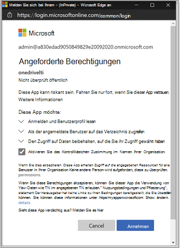
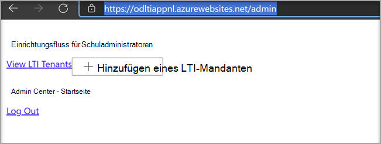

# Verwenden von Microsoft OneDrive mit Ihrem LernverwaltungssystemUse Microsoft OneDrive with your Learning Management System

> [!IMPORTANT]
> Einige Informationen beziehen sich auf Vorabversionen von Produkten, die vor der kommerziellen Veröffentlichung noch erheblich geändert werden können.Some information relates to prereleased product which may be substantially modified before it's commercially released. Microsoft übernimmt mit diesen Informationen keinerlei Gewährleistung, sei sie ausdrücklich oder konkludent.Microsoft makes no warranties, express or implied, with respect to the information provided here.

Erfahren Sie mehr über die Vorteile der Verwendung von Microsoft OneDrive mit Ihrem Learning Management System (LMS).Learn the benefits of using Microsoft OneDrive with your Learning Management System (LMS).

**Bringt Microsoft Office 365 direkt in Ihre Workflows****Brings Microsoft Office 365 directly into your workflows**

Die Microsoft OneDrive Learning Tools Interoperability (LTI)-App ist in Ihr LMS integriert, um Microsoft OneDrive und Microsoft Office 365 direkt in Ihre wichtigsten Workflows zu integrieren, die Folgendes umfassen:The Microsoft OneDrive Learning Tools Interoperability (LTI) App integrates with your LMS to bring Microsoft OneDrive and Microsoft Office 365 directly into your most important workflows that include:

- Anfügen von Ressourcen und Organisieren von Inhalten.Attaching resources and organizing content.
- Starten von gemeinsamen Dokumenten.Starting collaborative documents.
- Erstellen und Benoten von Zuordnungen.Creating and grading assignments.

**Sicher und vollständig kompatibel mit den neuesten LTI-Standards****Secure and fully compliant with latest LTI standards**

Die Microsoft OneDrive #A0 ist mit LTI 1.3 und LTI Advantage kompatibel.The Microsoft OneDrive LTI App is compatible with LTI 1.3 and LTI Advantage. Dieser Vorteil ermöglicht eine hochgradig sichere und eng integrierte Benutzeroberfläche.This advantage allows for a highly secure and tightly integrated user experience.

**Moderne und reichhaltige Benutzeroberfläche****Modern and Rich User Experience**

Die Microsoft OneDrive LTI App bringt das Beste von Microsoft direkt in Ihre #A0 ein.The Microsoft OneDrive LTI App brings the best of Microsoft right into your LMS experience. Wir verbessern die vorhandene Office 365-Integration in Ihrem LMS, indem wir eine modernere Benutzeroberfläche mit einer neuen und erweiterten Microsoft OneDrive-Dateiauswahl und einer erweiterten Bearbeitungserfahrung für #A0 bereitstellen.We're improving upon the existing Office 365 integration in your LMS by delivering a more modern user experience, complete with a new and expanded Microsoft OneDrive file picker and richer editing experiences for Office files. Microsoft wird auch die Microsoft OneDrive LTI App in Zukunft vollständig besitzen, was bedeutet, dass Sie immer automatisch das neueste und beste von Microsoft erhalten.Microsoft will also fully own the Microsoft OneDrive LTI App going forward, which means you’ll always get the latest and greatest from Microsoft automatically.

Mit der Microsoft OneDrive LTI App können Sie:The Microsoft OneDrive LTI App allows you to:

- Fügen Sie Office 365-Dateien einschließlich Word-Dokumenten, PowerPoint-Präsentationen und Excel aus dem Rich Content Editor an.Attach Office 365 files including Word documents, PowerPoint presentations, and Excel from the Rich Content Editor.

- Verteilen von Office 365-Cloudzuweisungen.Distribute Office 365 cloud assignments.

- Anzeigen und Organisieren Ihrer persönlichen Und Kurs Microsoft OneDrive-Dateien.View and organize your personal and course Microsoft OneDrive files.

- Erstellen Sie Zusammenarbeiten, in denen Kursmitglieder gemeinsam an freigegebenen Dokumenten in Echtzeit arbeiten können.Create collaborations where course members can work together on shared documents in real time.

- Greifen Sie auf mehrere Microsoft #A0 zu, einschließlich persönlicher und Schulkonten.Access multiple Microsoft OneDrive accounts, including personal and school accounts.

- Integrieren Sie Office 365-Dateien in Ihre Kursmodule.Integrate Office 365 files with your course modules.

- Verwenden Sie Ihr Microsoft-Konto für einmaliges Anmelden mit Ihrem LMS.Use your Microsoft account for single sign-on with your LMS.

## Integration in CanvasIntegrate with Canvas

Die Person, die diese Integration ausführt, sollte ein Administrator von Canvas und ein Administrator des Microsoft 365-Mandanten sein.The person who performs this integration should be an admin of Canvas and an admin of the Microsoft 365 tenant.

1. Melden Sie sich mit dem Mandantenadministratorkonto beim Microsoft Azure-Portal an.Sign in to the Microsoft Azure portal with the tenant admin account. Der Azure-Mandantenadministrator sollte auch die Rolle des Gruppenadministrators haben.The Azure tenant administrator should also have the Group administrator role.

    

2. Melden Sie sich beim Microsoft [OneDrive#A0 an.](https://odltiappnl.azurewebsites.net/admin)Sign in to the Microsoft [OneDrive LTI portal](https://odltiappnl.azurewebsites.net/admin).

3. Akzeptieren Sie die Berechtigungen zum Abschließen der Anmeldung.Accept the permissions to complete the sign-in.

    

4. Wählen **Sie LTI-Mandanten hinzufügen aus.**Select **Add LTI Tenant**.

     

5. Wählen **Sie im Dropdownmenü LTI Consumer Platform** as **Canvas** aus.Select **LTI Consumer Platform** as **Canvas** from the dropdown.

6. Wählen **Sie Canvas-Basis-URL** aus, und wählen Sie dann **Weiter aus.**Select **Canvas Base URL** and then select **Next**.

    

   Auf dem nächsten Bildschirm werden Felder angezeigt, die für Sie vertraulich sind.The next screen shows fields that are confidential to you.

7. Wählen **Sie Weiter** aus ?? aus.Select **Next** from ?? den Link für resend the email auswählen.page. KÖNNEN PRÜFER HIER DAS LEERE AUSFÜLLEN?CAN REVIEWERS FILL IN THE BLANK HERE?

8. Wählen **Sie weiter** auf dem Bildschirm aus, auf dem Informationen angezeigt werden, die für Sie vertraulich sind.Select **Next** in the screen that shows information that's confidential to you.

   Der letzte Bildschirm des Azure-Portals zeigt die nächsten Schritte zum Hinzufügen Ihrer Canvas-Instanz.The final screen of the Azure portal shows the next steps for adding your Canvas instance.

9. Kopieren Sie die Entwicklerschlüssel von diesem Bildschirm.Copy the Developer Keys from this screen. Sie werden beim Erstellen der Canvas-Instanz verwendet.You'll use when you create the Canvas instance.

## Hinzufügen der Canvas-InstanzAdd the Canvas instance

1. Deaktivieren Sie in Ihrer Canvas-Instanz die Option **Admin**  >  **Developer Keys**.In your Canvas instance, deselect **Admin** > **Developer Keys**.

2. Wählen **Sie LTI Key** im Dropdown unter Developer Key **aus.**Choose **LTI Key** in the dropdown on **Developer Key**.

   

3. Fügen Sie hier die Entwicklerschlüssel ein.Paste the developer keys here.

     

   Der Schlüssel wird im **AUS-Modus** erstelltThe key gets created in **OFF** mode

   

4. Kopieren Sie den hervorgehobenen Text.Copy the highlighted text.
    Dies dient als Client-ID im Microsoft OneDrive-LTI-Portal.This serves as Client ID in Microsoft OneDrive LTI portal.

5. Fügen Sie den Text in das **Feld Client-ID** im Microsoft OneDrive#A0 ein, und wählen Sie dann **Weiter aus.**Paste the text into the **Client ID** field in Microsoft OneDrive LTI portal, and then select **Next**.

6. Wählen Sie **Speichern** aus.Select **Save**.

7. Zeigen Sie die Einstellungen an, indem **Sie LTI-Mandanten anzeigen auswählen.**View the settings by selecting **View LTI Tenants**.
