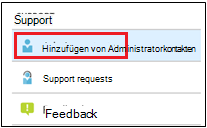

# Hinzufügen und Überprüfen von Administrator-Kontakten im Administratorportal

Es gibt mehrere Möglichkeiten, wie Microsoft Managed Desktop Service mit Kunden kommuniziert. Um die Kommunikation zu rationalisieren und sicherzustellen, dass die richtigen Personen überprüft werden, müssen Sie eine Reihe von Administrator Kontakten bereitstellen. Microsoft Managed Desktop-IT-Vorgänge wenden sich an diese Personen, um Hilfe bei der Problembehandlung für Ihren Mandanten zu erhalten.

> [!IMPORTANT]
> Möglicherweise haben Sie diese Kontakte bereits im Administratorportal hinzugefügt. Wenn dies der Fall ist, überprüfen Sie jetzt, ob die Kontaktliste korrekt ist, da Microsoft Managed Desktop Sie bei einem schweren Vorfall **erreichen kann.**

## Azure Active Directory Access für das Verwaltungsportal von Microsoft Managed Desktop

Microsoft Managed Desktop Admin Portal erfordert, dass Personen, die auf das Portal zugreifen, über eine dieser Azure Active Directory (AD)-Rollen verfügen:
- Globaler Administrator
- InTune-Dienst Administrator
- Globaler Leser
- Dienst Support Administrator

Der globale Administrator muss der einzige sein, der Ihre Organisation in Microsoft Managed Desktop registriert. Alle fünf Rollen haben im Administratorportal denselben Zugriff, um Aufgaben zu initiieren und anzuzeigen. Weitere Informationen zum Zuweisen dieser Rollen in Azure AD finden Sie unter [Administrator Role Permissions in Azure Active Directory](https://docs.microsoft.com/azure/active-directory/users-groups-roles/directory-assign-admin-roles). 

## Administrative Kontaktbereiche des Fokus

Administrator Kontakte sollten die beste Person oder Gruppe sein, die Fragen beantworten und Entscheidungen für unterschiedliche Fokusbereiche treffen kann. **Bei Microsoft Managed Desktop Operations werden diese Administrator Kontakte für Fragen im Zusammenhang mit Supportanfragen, die vom Kunden eingereicht wurden, kontaktiert.** Diese Administrator Kontakte erhalten Benachrichtigungen für Updates für Supportanfragen und neue Nachrichten. Diese Bereiche umfassen:

Fokusbereich | Fragen zu
--- | ---
App-Verpackung | Problembehandlung bei App-Verpackungen
Geräte | Geräte Integrität, Problembehandlung mit Microsoft Managed Desktop-Geräten
Sicherheit | Beheben von Sicherheitsproblemen mit Microsoft Managed Desktop-Geräten
IT-Helpdesk | in Fällen, in denen unser Supportmitarbeiter Benutzertickets außerhalb der Microsoft Managed Desktop-Support Bereiche übergibt 
Andere | Für Probleme, die nicht von anderen Bereichen abgedeckt werden

**Wer auch immer Sie für diese Kontakte ausgewählt haben, muss über das Wissen und die Autorität verfügen, um Entscheidungen für Ihre von Microsoft verwaltete Desktop Umgebung zu treffen.** Wenn Sie Ihre Microsoft Managed Desktop-Umgebung an Bord haben, werden Sie aufgefordert, Kontakte für den lokalen Helpdesk und die Sicherheit hinzuzufügen. 

Administrator Kontakte sind erforderlich, wenn Sie [eine Support Anfrage übermitteln](../service-description/support.md). Sie benötigen einen Administratorkontakt für den Fokusbereich der Support Anfrage. 

**So fügen Sie Administrator Kontakte hinzu**

1.  Melden Sie sich beim [Microsoft Managed Desktop-Verwaltungsportal](https://aka.ms/mwaasportal)an. 

2.  Wählen Sie unter **Support**die Option **Administrator Kontakte**aus. 

    

3. Klicken Sie auf **Hinzufügen**.

    

4.  Wählen Sie einen **Fokusbereich** aus, und geben Sie die Informationen für den Kontakt ein. 

    

5. Wiederholen Sie diese Schritte für jeden Bereich des Fokus. 

## Schritte zum Einstieg in Microsoft Managed Desktop

1. Hinzufügen und Überprüfen von Administrator Kontakten im Administratorportal (in diesem Thema)
2. [Bedingten Zugriff anpassen](conditional-access.md)
3. [Zuweisen von Lizenzen](assign-licenses.md)
4. [Installieren des Intune Company Portals auf Geräten](company-portal.md)
5. [Aktivieren von Enterprise State Roaming](enterprise-state-roaming.md)
6. [Richten Sie Microsoft Managed Desktop-Geräte ein](set-up-devices.md)
7. [Vorbereiten Ihrer Benutzer für die Verwendung von Geräten](get-started-devices.md)
8. [Stellen Sie Anwendungen auf Geräten bereit](deploy-apps.md)
