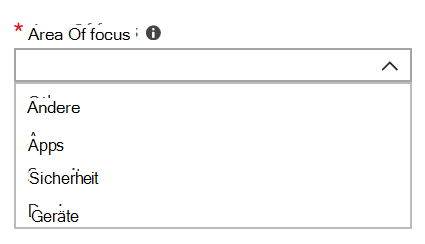

# Hinzufügen und Überprüfen von Administrator-Kontakten im AdministratorportalAdd and verify admin contacts in the Admin portal

Es gibt verschiedene Möglichkeiten, wie Microsoft Managed Desktop Dienst mit Kunden kommuniziert.There are several ways that Microsoft Managed Desktop service communicates with customers. Um die Kommunikation zu optimieren und sicherzustellen, dass wir die richtigen Personen überprüfen, müssen Sie eine Reihe von Administratorkontakten bereitstellen.To streamline communication and ensure we’re checking with the right people, you need to provide a set of admin contacts. Microsoft Managed Desktop IT-Vorgänge wenden sich an diese Personen, um Hilfe bei der Behandlung von Problemen für Ihren Mandanten zu erhalten.Microsoft Managed Desktop IT Operations will contact these people for assistance troubleshooting issues for your tenant.

> [!IMPORTANT]
> Möglicherweise haben Sie diese Kontakte bereits im Verwaltungsportal hinzugefügt.You might have already added these contacts in the Admin portal. Wenn dies der Fall ist, nehmen Sie sich einen Moment Zeit, um zu überprüfen, ob die Kontaktliste korrekt ist, da Microsoft Managed Desktop in der Lage sein **muss,** sie zu erreichen, wenn ein schwerwiegender Vorfall auftritt.If so, take a moment now to double-check that the contact list is accurate, since Microsoft Managed Desktop **must** be able to reach them if a severe incident occurs.

## Azure Active Directory Zugriff für Microsoft Managed Desktop VerwaltungsportalAzure Active Directory access for Microsoft Managed Desktop Admin portal

Microsoft Managed Desktop Das Verwaltungsportal erfordert, dass Personen, die auf das Portal zugreifen, über eine der folgenden Azure Active Directory (AD)-Rollen verfügen:Microsoft Managed Desktop Admin portal requires that people accessing the portal have one of these Azure Active Directory (AD) roles:
- Globaler AdministratorGlobal Administrator
- Intune-DienstadministratorIntune Service Administrator
- Globaler LeserGlobal Reader
- DienstsupportadministratorService Support Administrator

Der globale Administrator muss der Globale Administrator sein, der Ihre Organisation in Microsoft Managed Desktop registriert.The Global Administrator must be the one to enroll your organization in Microsoft Managed Desktop. Alle fünf Rollen haben den gleichen Zugriff innerhalb des Verwaltungsportals, um Aufgaben zu initiieren und anzuzeigen.All five roles have the same access within the Admin portal to initiate and view tasks. Weitere Informationen zum Zuweisen dieser Rollen in Azure AD finden Sie unter [Administratorrollenberechtigungen in Azure Active Directory.](/azure/active-directory/users-groups-roles/directory-assign-admin-roles)For more information on assigning these roles in Azure AD, see [Administrator role permissions in Azure Active Directory](/azure/active-directory/users-groups-roles/directory-assign-admin-roles). 

## Admin-Kontaktbereiche im FokusAdmin contact areas of focus

Administratorkontakte sollten die beste Person oder Gruppe sein, die Fragen beantworten und Entscheidungen für verschiedene Schwerpunktbereiche treffen kann.Admin contacts should be the best person or group that can answer questions and make decisions for different areas of focus. **Microsoft Managed Desktop Vorgänge wenden sich an diese Administratorkontakte, um Fragen zu Supportanfragen zu erhalten, die vom Kunden eingereicht wurden.****Microsoft Managed Desktop Operations will contact these Admin contacts for questions involving support requests filed by the customer.** Diese Administratorkontakte erhalten Benachrichtigungen für Supportanfragen und neue Nachrichten.These Admin contacts will receive notifications for support request updates and new messages. Zu diesen Bereichen gehören:These areas include:

FokusbereichArea of focus | Für Fragen zuFor questions about
--- | ---
App-VerpackungApp packaging | Problembehandlung beim Packen von AppsTroubleshooting app packaging
GeräteDevices | Geräteintegrität, Problembehandlung bei Microsoft Managed Desktop GerätenDevice health, troubleshooting with Microsoft Managed Desktop devices
SicherheitSecurity | Behandeln von Sicherheitsproblemen mit Microsoft Managed Desktop GerätenTroubleshooting security issues with Microsoft Managed Desktop devices
IT-HelpdeskIT help desk | in Fällen, in denen unsere Supportmitarbeiter Benutzertickets außerhalb von Microsoft Managed Desktop Supportbereichen übergebenin cases where our Support staff hands over user tickets outside of Microsoft Managed Desktop support areas 
AndereOther | Für Probleme, die nicht von anderen Bereichen abgedeckt werdenFor issues not covered by other areas

**Jeder, den Sie für diese Kontakte auswählen, muss über das Wissen und die Autorität verfügen, entscheidungen für Ihre Microsoft Managed Desktop Umgebung zu treffen.****Whoever you choose for these contacts needs to have the knowledge and authority to make decisions for your Microsoft Managed Desktop environment.** Wenn Sie Ihre Microsoft Managed Desktop Umgebung integrieren, werden Sie aufgefordert, Kontakte für Ihr lokales Helpdesk und Die Sicherheit hinzuzufügen.When you onboard your Microsoft Managed Desktop environment, you’re prompted to add contacts for your local Helpdesk and Security. 

Administratorkontakte sind erforderlich, wenn Sie [eine Supportanfrage senden.](../service-description/support.md)Admin contacts are required when you [submit a Support request](../service-description/support.md). Sie benötigen einen Administratorkontakt für den Fokusbereich der Supportanfrage.You’ll need to have an admin contact for the focus area of the Support request. 

**So fügen Sie Administratorkontakte hinzu****To add admin contacts**

1.  Melden Sie sich bei [Microsoft Endpoint Manager](https://endpoint.microsoft.com)an.Sign in to [Microsoft Endpoint Manager](https://endpoint.microsoft.com). 

2.  Suchen Sie unter **Mandantenverwaltung** nach dem **Abschnitt Microsoft Managed Desktop** und wählen Sie dann **Administratorkontakte** aus.Under **Tenant administration**, look for the **Microsoft Managed Desktop** section then select **Admin contacts**. 

3. Wählen Sie **Hinzufügen**.Select **Add**.

4.  Wählen Sie einen **Fokusbereich aus,** und geben Sie die Informationen für den Kontakt ein.Select an **Area of focus** and enter the info for the contact. 

    

5. Wiederholen Sie dies für jeden Fokusbereich.Repeat for each area of focus. 

## Schritte für die ersten Schritte mit Microsoft Managed DesktopSteps to get started with Microsoft Managed Desktop

1. Hinzufügen und Überprüfen von Administratorkontakten im Verwaltungsportal (dieses Thema)Add and verify admin contacts in the Admin portal (this topic)
2. [Bedingten Zugriff anpassenAdjust conditional access](conditional-access.md)
3. [Zuweisen von LizenzenAssign licenses](assign-licenses.md)
4. [Installieren des Intune Company Portals auf GerätenInstall Intune Company Portal on on devices](company-portal.md)
5. [Aktivieren von Enterprise State RoamingEnable Enterprise State Roaming](enterprise-state-roaming.md)
6. [Richten Sie Microsoft Managed Desktop-Geräte einSet up Microsoft Managed Desktop devices](set-up-devices.md)
7. [Vorbereiten Ihrer Benutzer für die Verwendung von GerätenGet your users ready to use devices](get-started-devices.md)
8. [Stellen Sie Anwendungen auf Geräten bereitDeploy apps to devices](deploy-apps.md)
