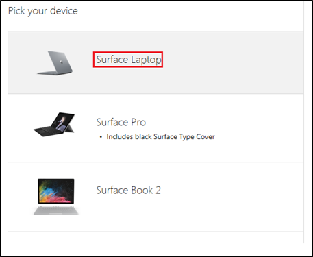

# Reihenfolge verwalteter Microsoft-Desktop-Geräte

Microsoft ist eine kleine Einkaufswagen Erfahrung in den Vereinigten Staaten (USA), derzeit Pilotphase, wie unten beschrieben. Wenn Sie sich außerhalb der USA befinden oder Ihr Gerät Auftrag für mehr als 50 Geräte wird, empfehlen wir arbeiten mit einem unserer Partner genehmigte Gerät. Sie können sich an Ihren Microsoft-Konto Kontakt, um weitere Hilfe beim Einrichten einer Gerätepartnerschaft treten.

Wie sollte ich Geräte für Microsoft verwalteter Desktop bestellen?

  |   
 --- | ---
Von innerhalb der USA Sortierung weniger als 50 Geräte | [Bei verwalteten Desktops Verwaltungsportal von Microsoft bestellen](https://aka.ms/mmdportal)
Außerhalb der USA | Wenden Sie sich an Ihrem Microsoft Account team
Mehr als 50 Geräte Sortierung | Wenden Sie sich an Ihrem Microsoft Account team

## Anordnen von Geräten
Verwenden Sie diese Anweisungen für Reihenfolge Geräte in den USA. Sie beginnen im Microsoft- **Desktop-Verwaltungsportal verwaltet**, aber Sie können die Käufe über **Microsoft Store für Business**. 

 **Reihenfolge-Geräte**
 1. Melden Sie sich bei [verwalteten Desktops Verwaltungsportal von Microsoft](https://aka.ms/mmdportal)
 2. Wählen Sie auf Erste Schritte, klicken Sie unter Reihenfolge Geräte **Open Microsoft Store for Business Reihenfolge Geräte**.
 
    
    
3. In Microsoft Store for Business können Sie Informationen zu Microsoft verwalteter Desktop und eine Vergleichstabelle der verfügbaren Geräte überprüfen. Klicken Sie auf **kaufen** , um ein Gerät auszuwählen. 

    

4. Wählen Sie auf **das Gerät auswählen**das gewünschte Gerät. 

    

5. Wählen Sie auf **Features des Geräts auswählen**einen **Dienst planen**, geben Sie die Anzahl der Geräte und klicken Sie dann auf **zur Einkaufswagen hinzufügen**.

6. Überprüfen Sie Ihre Einkaufswagen, und wählen Sie **Auschecken**oder **ein anderes Gerät hinzufügen**. 

7. Fortzusetzen Sie den Checkout-Vorgang, überprüfen Sie Ihre Preise, akzeptieren Sie Lizenzierung Bedingungen und wählen Sie **anmelden und bestellen**. 

Geräte zum innerhalb von drei Tagen in der Regel gehören. 

Wenn Sie die Reihenfolge Geräte fertig sind, können Sie die Geräte überprüfen, die Sie in [verwalteten Desktops Verwaltungsportal von Microsoft](https://aka.ms/mmdportal)bestellt. Wählen Sie unter **Inventar** **Geräte**. 

Wenn Geräte eingehen, an Ihre Mitarbeiter verteilen. Es ist keine zusätzliche einrichten oder Konfiguration erforderlich. 

