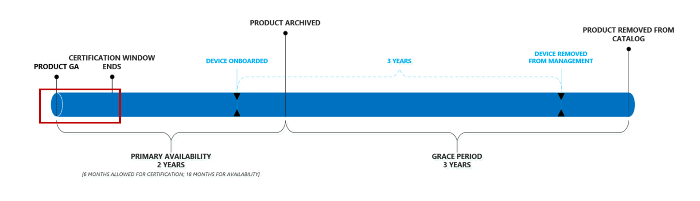

# Microsoft Managed Desktop-Produktlebenszyklus

Microsoft Managed Desktop profitiert von Endbenutzern, die sicherstellen, dass Sie immer Geräte verwenden, die die beste Leistung, Zuverlässigkeit, Design und Sicherheitsfunktionen bieten (beispielsweise Unterstützung für Features wie Windows Hello). Um dies zu erreichen, verwaltet Microsoft Managed Desktop einen kurzen Katalog mit kontinuierlich aktualisierten [genehmigten Geräten](device-list.md). 
 
In diesem Thema wird der Lebenszyklus von Geräten erläutert, die dem genehmigten Katalog hinzugefügt und daraus entfernt wurden. 

> [!NOTE]
> In diesem Thema wird eine Unterscheidung zwischen einem "Gerät" und einem "Produkt" vorgenommen. Mit "Gerät" meinen wir einen einzelnen spezifischen Computer. Beispiel: "Serial number 1234", "Bill es Laptop", "Shared VM XYZ" finden Sie unter Specific Devices. Ein "Produkt" hingegen bezieht sich auf eine Sammlung oder eine Gerätefamilie. Beispiel: "Fabrikam Laptop", "adatum ZX450 Laptop" usw. Dies ist wichtig, da Produkte unserer [genehmigten Liste](device-list.md)oder dem Katalog hinzugefügt werden, und Geräte sind, was Sie in Microsoft Managed Desktop registriert haben.

## Produktlebenszyklus

 Im Allgemeinen werden diese Lebenszyklusphasen durch Produkte durchlaufen:

- [Produktveröffentlichung und Evaluierung](#product-release-and-evaluation)
- [Primärer Produkt Verfügbarkeitszeitraum](#product-primary-availability-period)
- [Produkt Kulanzzeit](#product-grace-period)
- [Produkt Ruhestand](#product-retirement)

Die gesamte Sequenz wird in dieser Abbildung dargestellt:

![Lifecycle Timeline: beginnend mit der allgemeinen Verfügbarkeit des Produkts dauert die "primäre Verfügbarkeit" zwei Jahre. Während dieser Zeit endet das Zertifizierungs Fenster und an einem bestimmten Punkt ist das Gerät an Bord. Am Ende der primären Verfügbarkeit wird das Produkt archiviert, und die "Kulanzzeit" von drei Jahren beginnt. Ab dem Zeitpunkt, an dem das Gerät an Bord ist, hat es eine Nutzungsdauer von drei Jahren, bis es aus der Verwaltung entfernt wurde. Am Ende der Kulanzzeit entfernen wir das Produkt aus dem Katalog.](images/non-dark1-edits.PNG)

Die Produkte verbleiben bis zu 24 Monate im Katalog, die <em>Geräte</em> bleiben jedoch auf drei Jahre basierend auf Ihren individuellen Anmeldedaten unter Verwaltung. Jedes Produkt hat tatsächlich drei wichtige Daten, aber jedes Gerät hat nur einen. Bei Produkten werden alle drei Datumsangaben basierend auf dem <em>Genehmigungsdatum</em>berechnet, daher veröffentlichen wir diese Daten nach Genehmigung, sodass Sie immer nach vorn schauen und den gesamten Lebenszyklus des Produkts entsprechend planen können.

In dieser Tabelle sind die Beispieldaten für ein theoretisches Produkt aufgeführt:

|Produkt  |Genehmigtes Datum  |Ende der primären Verfügbarkeit  |Ende eligiblity  |
|---------|---------|---------|---------|
|Fabrikam-Laptop    | 1/1/2017 | 6/1/2019 | 6/1/2022 |
|Adatum-Laptop   | 1/1/2018 | 6/1/2020 | 6/1/2023  |

In dieser Tabelle sind die Beispieldaten für theoretische *Geräte*aufgeführt:

|Geräte-ID  |Anmeldedatum  |Ruhestands Datum  |
|---------|---------|---------|
|Laptop #123412     |  2/3/2018       |  2/3/2021       |
|Desktop #321513     | 6/2/2018        |  6/2/2021       |

## Produktveröffentlichung und Evaluierung

Der Produktlebenszyklus wird gestartet, wenn ein Hersteller das Produkt öffentlich veröffentlicht:

In dieser Phase führt das Microsoft Managed Desktop Engineering-Team die Bewertung und Zertifizierung eines Produkts durch. Das Team bewertet unter anderem Zuverlässigkeit und Leistung mit Windows, die Einhaltung einer Hardwarebasis, Marktstimmung sowie Inventar-und Kanal Bereitschaft. Dieser Vorgang dauert in der Regel ungefähr 6 Wochen.
  
Microsoft Managed Desktop prüft nur Geräte zur Zertifizierung innerhalb der ersten 6 Monate nach Verfügbarkeit. Dadurch wird sichergestellt, dass wir unsere Bemühungen stets auf die neueste Hardware Generation konzentrieren.
 
Am Ende dieser Phase wird das Produkt von Microsoft Managed Desktop zur [genehmigten Liste](device-list.md)hinzugefügt, wodurch das Produkt effektiv für Kunden Einschreibungen freigegeben wird. Unabhängig vom Datum, an dem ein Gerät zertifiziert wurde, wird sein **genehmigtes Datum** auf das eigene Allgemeine Verfügbarkeitsdatum des Produkts zurück datiert. 

## Primärer Produkt Verfügbarkeitszeitraum

Dieser Zeitraum stellt den Kern der Produktverfügbarkeit dar:

Jedes Gerät, das während dieses Zeitraums registriert ist, erhält die volle dreijährige Unterstützung von Microsoft Managed Desktop (wie in der blauen Zeitachse gezeigt). Dieser Zeitraum dauert bis zu einem Enddatum, das von dem allgemeinen Verfügbarkeitsdatum auf 24 Monate festgelegt wurde.

Sie können sich diesen Zeitraum als effektiv "offene Registrierung" vorstellen, um den Wert von Microsoft Managed Desktop zu maximieren, sollten Sie Ihre Beschaffungsmodelle und ausgewählten Produkte in diesem Zeitraum abzielen. Ein kleines Beispiel: ein Kunde sollte es vermeiden, mit einem Produkt, das sich in seinem letzten Monat der primären Verfügbarkeit befindet, einen zweijährigen Rollout durchführen zu müssen – die meisten dieser Geräte erhalten nicht die vollständige dreijährige Microsoft Managed Desktop-Verwaltung (Weitere Informationen finden Sie unter [Grace Period](#product-grace-period) ).  

## Produkt Kulanzzeit

Die Produkt Kulanzfrist beträgt drei Jahre nach der primären Verfügbarkeit. In dieser Phase können Sie Geräte, die von einer unterstützten Produktfamilie stammt, registrieren, aber weiterhin die Zusagen von Microsoft Managed Desktop hinsichtlich der modernen Hardware-und Geräteleistung festhalten. Diese Phase ist ideal für Kunden, die Beschaffungsentscheidungen getroffen haben, bevor Sie über Microsoft Managed Desktop Bescheid wissen. 

Wenn Sie vor der Anmeldung mit Microsoft Managed Desktop vor kurzem eine Reihe von genehmigten Geräten erworben haben, können Sie diese dennoch registrieren, jedoch erhalten Sie keine vollständige dreijährige Verwaltung. Stattdessen fallen Sie nicht unter Einhaltung des Renten Datums, unabhängig davon, wann Sie registriert wurden. Hinter den Kulissen werden diese Geräte von Microsoft Managed Desktop so behandelt, als wären Sie am letzten Tag der primären Verfügbarkeit registriert. In dieser Abbildung sehen Sie dieses Szenario, indem Sie feststellen, dass das blaue und das grüne Gerät trotz ihres einjährigen unter schiedes in der Registrierung am selben Tag enden:

Das Beispiel für ein Fabrikam-Laptop aus der vorherigen Tabelle veranschaulicht diese Situation: 

|Produkt  |Genehmigtes Datum  |Ende der primären Verfügbarkeit  |Ende eligiblity  |
|---------|---------|---------|---------|
|Fabrikam-Laptop    | 6/1/2017 | 6/1/2019 | 6/1/2022 |

Als Kunde können Sie Fabrikam-Laptops bis 6/1/2022 registrieren – Sie werden jedoch alle so behandelt, als ob Sie Sie in 6/1/2019 registriert haben. Wenn Sie einen Fabrikam-Laptop auf 6/1/2021 registrieren, erhalten Sie nur ein Jahr Management. Mit dieser Richtlinie können Sie partielle Lebenszyklen aus zuvor unterstützten Produkten extrahieren, statt neue Geräte vorzeitig zu beschaffen. 

Schließlich wird das Gerät in dieser Phase aus der [Geräteliste](device-list.md) entfernt und in die Liste der [archivierten Geräte](archived-device-list.md)verschoben.

## Produkt Ruhestand

Der Produkt Ruhestand ist die letzte Phase des Lebenszyklus. In dieser Phase können keine neuen Geräte dieses Produkttyps in Microsoft Managed Desktop registriert werden, und per Definition sind alle vorhandenen Geräte jetzt außerhalb ihrer zulässigen dreijährigen Laufzeit. Während dieser Zeit wird das Gerät von Microsoft Managed Desktop vollständig aus der öffentlichen Liste entfernt. Es ist auch in dieser Phase, in der Sie, wenn Sie noch keine Ersatzbeschaffung erhalten haben, verminderte Dienste sehen, während der von Microsoft Managed Desktop gestartet wird, um die Geräte herunterzufahren, die nicht mehr kompatibel sind. 

## Geräte, die nicht kompatibel sind

Ein Gerät ist nicht mehr konform, wenn das zulässige Fenster für die Microsoft Managed Desktop-Verwaltung abgelaufen ist. Dies ist der Fall, wenn das Gerät drei Jahre lang verwaltet wurde oder wenn dieser Produkttyp aus dem Gerätekatalog entfernt wurde, je nachdem, was zuerst eintritt. Sie sollten ihre Beschaffungszyklen immer so ausrichten, dass neue Geräte bereitgestellt werden, bevor aktuelle Geräte nicht mehr eingehaltenwerden.

Das Microsoft Managed Desktop-Team weiß, dass die Beschaffungszyklen lang sind und um lang andauernde Budgets herum geplant sind. Um sicherzustellen, dass Sie stets über den Status der Geräte Auffüllung informiert sind, stellen wir eine [Website](https://aka.ms/mmdportal) bereit, in der jedes Gerät unter Verwaltung, das zukünftige Renten Datum und ein Status aufgeführt ist, der seine Einhaltung angibt. Dies bedeutet, dass Sie immer über die neuesten Informationen zum Geräte Alter verfügen und den Bericht in einem beliebigen Auftrags Planungszyklus nutzen können. 

Außerdem führen wir die folgenden automatisierten Aktionen aus, um sicherzustellen, dass neue Geräte rechtzeitig bereitgestellt werden:

|Zeitachse  |Aktion  |
|---------|---------|
|T-90     | Dieses Gerät wird in Kürze mit einer gelben Markierung auf der Website für den Gerätebestand als **Ablaufdatum**gekennzeichnet.  |
|T-60     | Wir kennzeichnen dieses Gerät als **Ablauf** mit einem roten Marker auf der Website für den Gerätebestand.       |
|T-30     | Wir werden eine Nachricht an das Admin-Portal senden, die besagt, dass Geräte die Compliance unmittelbar beenden.       |
|0     |  Wir passen das Admin-Portal so an, dass die Geräte jetzt abgelaufen sind. Umleiten von Administratoren an Land in der Geräteliste zuerst.       |
|T + 30     |  Wir reduzieren die Funktionalität des Verwaltungsportals, bis neue Geräte bereitgestellt werden.       |
|T + 60     |  Wir reduzieren die Funktionalität des Verwaltungsportals, bis neue Geräte bereitgestellt werden.       |
|T + 90     |  Wir entfernen das Gerät aus der Verwaltung. An diesem Punkt ist das Gerät allein Ihre eigene Verantwortung, und Sie sollten es nicht länger als sicher und auf dem neuesten Stand halten. Außerdem befindet sich das Gerät in einem unbekannten Zustand, da jeder Konfigurationsdienst Anbieter seine eigenen Einstellungen steuert.|

