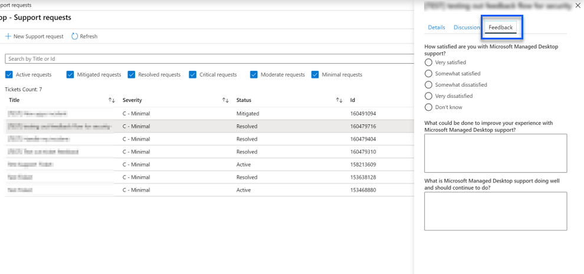

# Administratorunterstützung für Microsoft Managed Desktop

Sie können Support Tickets oder Feedback Anforderungen über das Microsoft Managed Desktop administrative Portal an Microsoft übermitteln. Support Anforderungen werden immer über Feedback Übermittlungen priorisiert. Support Anforderungen werden je nach Schweregrad behandelt, wie in der [Definitionstabelle für den Schweregrad](#sev)beschrieben. Feedback wird überprüft, und bei Bedarf wird eine Antwort angegeben. 

>[!IMPORTANT]
>Stellen Sie sicher, dass Sie [einen Administratorkontakt](../get-started/add-admin-contacts.md) für App-Verpackungen, Geräte, Sicherheit und andere einrichten. Sie können keine Supportanfragen in einen dieser Bereiche übermitteln, wenn kein Administratorkontakt konfiguriert ist.

**So übermitteln Sie eine Supportanfrage**
1. Melden Sie sich beim [Microsoft Managed Desktop-Verwaltungsportal](https://aka.ms/mwaasportal)an. 
2. Wählen Sie **unter Supportanfragen**die Option **+ Neues Support Ticket**aus.
3. Wählen Sie den **Support Anforderungstyp** aus, der der benötigten Hilfe entspricht. In der folgenden Tabelle werden die Optionen erläutert. 
4. Wählen Sie den **schwere**Grad aus. Weitere Informationen finden Sie unter [Support Request Severity Definitions](#sev). 

Unterstützung von Anforderungstyp | Geeignet in folgender Situation
--- | ---
Vorfall | Sie benötigen das Microsoft Managed Desktop Operations-Team, um wie weit verbreitete Auswirkungen einer Änderung oder eines Sicherheitsvorfalls zu untersuchen.
Informationsanforderung | Sie planen eine Änderung für Netzwerk, Proxykonfiguration, VPN-Systeme, Zertifikat Ablauf oder benötigen nur einige Informationen zum Dienst. Eine Antwort des Microsoft Managed Desktop Operations-Teams wird dringend empfohlen, wenn eine Änderung in Ihrer Organisation kommuniziert wird.
Änderungsanforderung | Sie benötigen das Microsoft Managed Desktop Operations-Team, um eine Änderung vorzunehmen, beispielsweise das Verschieben von Geräten Zwischenupdate Gruppen.

## Dringlichkeits Definitionen für Support Anforderungen

Die anfängliche Antwortzeit ist der Zeitraum, ab dem Sie Ihre Supportanfrage senden, wenn ein von Microsoft verwalteter Desktop Techniker Sie kontaktiert und mit der Bearbeitung Ihrer Supportanfrage beginnt. Die anfängliche Antwortzeit variiert je nach Schweregrad der Anforderung mit der geschäftlichen Auswirkung der Anforderung.

Schweregrad  | Kundensituation |  Anfängliche Antwortzeit   | Erwartete Kundenantwort
--- | --- | --- | ---
**Schweregrad A – kritische Auswirkungen** |  **Wichtige geschäftliche Auswirkungen**  Das Geschäft des Kunden hat erhebliche Verluste oder Beeinträchtigungen von Diensten und erfordert sofortige Aufmerksamkeit.  **Wichtige Auswirkungen auf die Anwendungskompatibilität**  Das gesamte Unternehmen des Kunden hat aufgrund von Absturz oder Verlust wichtiger Funktionen finanzielle Auswirkungen. | Initial: < 1 Stunde Update: 60 Minuten 24X7 verfügbar | Wenn Sie Severity A auswählen, bestätigen Sie, dass das Problem wichtige geschäftliche Auswirkungen mit schwerwiegenden Verlusten und Beeinträchtigungen von Diensten hat.   Das Problem erfordert eine sofortige Antwort, und Sie verpflichten sich, jeden Tag mit dem Microsoft-Team bis zur Lösung einen kontinuierlichen 24X7-Betrieb auszuführen, andernfalls kann Microsoft nach eigenem Ermessen den Schweregrad auf Stufe B verringern.   Außerdem stellen Sie sicher, dass Microsoft über Ihre genauen Kontaktinformationen verfügt. 
**Schweregrad B – mittlere Auswirkung** |  **Moderater geschäftlicher Einfluss**  Das Unternehmen des Kunden hat einen moderaten Verlust oder eine Verschlechterung der Dienste, aber die Arbeit kann vernünftigerweise auf eine eingeschränkte Weise fortgesetzt werden.  **Durchschnittliche Auswirkungen auf die Anwendungskompatibilität**  Eine bestimmte Unternehmensgruppe ist aufgrund von Absturz Verhalten oder Verlust wichtiger Funktionen nicht mehr produktiv. |  Initial: < 4 Stunden Update: 12 Stunden Geschäftszeiten (24X7 verfügbar) | Wenn Sie Severity B auswählen, stellen Sie sicher, dass das Problem eine mäßige Auswirkung auf Ihr Unternehmen mit Verlust und Beeinträchtigung von Diensten hat, aber Workarounds ermöglichen eine vernünftige, wenn auch vorübergehende Geschäftskontinuität.   Das Problem erfordert eine dringende Antwort. Wenn Sie bei der Übermittlung der Supportanfrage 24X7 ausgewählt haben, verpflichten Sie sich täglich mit dem Microsoft-Team zu einem kontinuierlichen 24X7-Betrieb bis zur Lösung, andernfalls kann Microsoft nach eigenem Ermessen den Schweregrad auf Ebene C verringern. Wenn Sie bei der Übermittlung eines Schweregrads B Unterstützung für die Geschäftszeiten ausgewählt haben, wird Microsoft Sie nur während der Geschäftszeiten kontaktieren.  Außerdem stellen Sie sicher, dass Microsoft über Ihre genauen Kontaktinformationen verfügt.
**Schweregrad C – minimale Auswirkung** |   **Minimale geschäftliche Auswirkungen**   Das Geschäftsfeld des Kunden funktioniert mit kleinen Behinderungen von Diensten.  **Geringe Auswirkungen auf die Anwendungskompatibilität**  Möglicherweise nicht verwandten Benutzern treten kleinere Kompatibilitätsprobleme auf, die die Produktivität nicht verhindern |    Initial: < 8 Stunden Update: 24 Stunden Geschäftszeiten  | Wenn Sie Severity C auswählen, stellen Sie sicher, dass das Problem minimale Auswirkungen auf Ihr Unternehmen mit kleinem Leistungshindernis hat.  Bei einem Vorfall mit Schweregrad C wird Microsoft Sie nur während der Geschäftszeiten kontaktieren.  Außerdem stellen Sie sicher, dass Microsoft über Ihre genauen Kontaktinformationen verfügt.

Weitere Details:
- **Support Sprachen** – alle Unterstützung wird in englischer Sprache bereitgestellt.
- **Änderungen des schwere** Grads – Microsoft kann den Schweregrad herabstufen, wenn der Kunde nicht in der Lage ist, angemessene Ressourcen oder Antworten bereitzustellen, damit Microsoft die Problem Lösungs Bemühungen fortsetzen kann. 
- **Geschäftszeiten** -für die meisten Länder sind die Geschäftszeiten von 9:00 Uhr bis 5:00 Uhr, Pacific Standard Time.
- **Anwendungskompatibilität** – für ein Problem mit der Anwendungskompatibilität muss ein reproduzierbarer Fehler derselben Version der Anwendung zwischen der vorherigen und der aktuellen Version von Windows oder Office vorliegen. Um Probleme mit der Anwendungskompatibilität zu beheben, benötigt Microsoft eine Kontaktstelle für Kunden, mit der Sie arbeiten können. Die einzelnen müssen direkt mit unserem Fast-Track-Team zusammenarbeiten, um das Problem zu untersuchen und zu beheben.
- **Kundenantwort Zeit** Wenn ein Kunde die erwarteten Antwort Anforderungen nicht erfüllen kann, wird die Anforderung von Microsoft um einen Schweregrad auf ein Minimum von Schweregrad C herabgestuft. Wenn ein Kunde nicht auf Aktionsanforderungen reagiert, wird Microsoft die Supportanfrage innerhalb von 48 Stunden nach der letzten Anforderung entschärfen und schließen.

## Feedback geben

Wir freuen uns über Ihr Feedback und verwenden es, um die Administrator Unterstützung zu verbessern.

Wenn sich ein **Ticket im Status "** behoben" oder " **gelöst** " befindet, können Sie Ihr Feedback zu ihren Erfahrungen mit diesem speziellen Problem freigeben. Wechseln Sie dazu im Administratorportal zur Seite **Support Anfragen** . Wählen Sie das jeweilige Ticket aus. Wählen Sie im einfliegen, das auf der rechten Seite angezeigt wird, die Registerkarte **Feedback** aus, und geben Sie die angeforderten Informationen an. Achten Sie darauf, keine persönlichen Informationen in das Feedback Formular einzubeziehen. Weitere Informationen zum Datenschutz finden Sie in der [Microsoft-Datenschutzerklärung](https://privacy.microsoft.com/privacystatement).

## Weitere Ressourcen
- [Benutzerunterstützung für Microsoft Managed Desktop](end-user-support.md). 
- [Unterstützung für Microsoft Managed Desktop](../service-description/support.md). 
- Wenn Sie bereits Microsoft Managed Desktop abonniert haben, finden Sie im Microsoft Managed Desktop Admin Guide im Abschnitt **Online Ressourcen** des [Microsoft Managed Desktop admin-Portals](https://aka.ms/mwaasportal)ausführliche Verfahren, Ablauf, Arbeitsanweisungen und FAQs.
