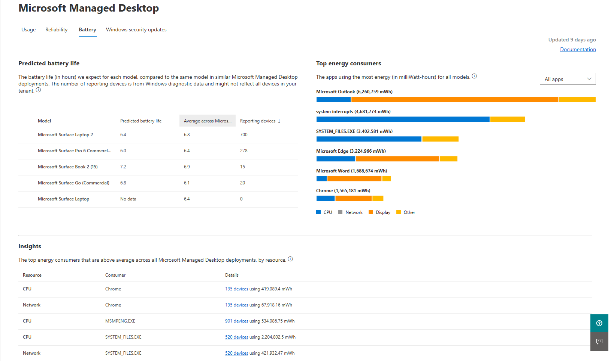

# Akku Einblicke
Diese Ansicht enthält Metriken für Energie, Akku und App-Nutzung für Ihre von Microsoft verwalteten Desktop Geräte. Für diese Zwecke wird eine App als "in Verwendung" betrachtet, wenn Sie aktiv ist und sich im Fokus befindet.

Um Verwendungsdaten anzuzeigen, wählen Sie die Registerkarte **Akku** aus.

## Prognostizierte Akkulaufzeit

Im Bereich der **prognostizierten Akkulaufzeit** stellen wir Vorhersagen für die erwartete Akkulaufzeit Ihrer Geräte bereitgestellt, geordnet nach dem Gerätemodell.

> [!NOTE]
> Diese Daten stammen aus einer Stichprobenahme von Energieverbrauch, Nutzungszeit und Batteriekapazität aus einer zufälligen <em>Auswahl</em> der Geräte in Ihrer Microsoft Managed Desktop-Bereitstellung, die auch Daten melden.

Die Tabelle enthält die prognostizierte Batterielebensdauer (in Stunden), die durchschnittliche Lebensdauer der Batterie für dieselben Modelle in anderen Microsoft Managed Desktop-Bereitstellungen sowie die Anzahl der Geräte, die diese Daten in Ihrer Umgebung melden. Sortieren Sie die Daten, indem Sie die Spaltenüberschriften auswählen.

## Top Energy Consumer

Im Bereich der **oberen Energieverbraucher** finden Sie die apps in Ihrer Umgebung, die die meiste Energie in milliWatt-Stunden (MWh) verbrauchen. Die gezeigten apps sind pro spezifischem Gerät, das Sie im Abschnitt " **voraussichtliche Lebensdauer der Batterie** " Links auswählen. Wenn Sie beispielsweise den pro-App-Verbrauch für Ihre Microsft Surface Book 2-Geräte anzeigen möchten, wählen Sie diese Zeile im Batterie Nutzungsbereich aus. Wenn Sie kein Modell auswählen, werden die angezeigten App-Nutzungsdaten für alle apps angezeigt, für die wir Daten gemeinsam haben.

 Für jede APP zeigen farbige Segmente die Verteilung der Energieverwendung der app in den folgenden Kategorien an:

- CPU
- Anzeige
- Netzwerk
- Andere

"Sonstiges" könnte den Energieverbrauch durch eine Vielzahl von Quellen wie Datenträgeraktivität, mobile Breitbandnutzung und Energieverlust im internen Widerstand einschließen. 

Die in * * Top Energy Consumers angezeigten apps

Sie können diese Ansicht filtern, um nur Vordergrund-apps, Hintergrund-Apps oder beides anzuzeigen, indem Sie das Menü in der oberen rechten Ecke verwenden. Apps im Vordergrund sind solche, die in den letzten 28 Tagen Benutzerinteraktion hatten, beispielsweise das Auswählen von etwas mit einer Maus.

## Insights

Der Bereich " **Insights** " zeigt die drei wichtigsten Energieverbraucher in den Kategorien CPU und Netzwerk an. Diese Elemente verbrauchen mehr als die durchschnittliche Energie im Vergleich zu allen Microsoft Managed Desktop-Bereitstellungen. Die Anzeige Ressource wird nicht angezeigt, da Sie stark von der Geräte Nutzungszeit und den Bildschirm Helligkeitseinstellungen abhängt. 

Wählen Sie die Auflistungen in der Spalte **Details** aus, um weitere Informationen zu erhalten.

## Batterieoptimierung

Windows 10 bietet zahlreiche [Geräteeinstellungen](https://support.microsoft.com/help/20443/windows-10-battery-saving-tips) , um den Energieverbrauch zu verbessern und die Akkulaufzeit Ihrer verwalteten Microsoft-Desktop Geräte zu erhöhen. Einige dieser Einstellungen können andere Windows-Funktionen verringern, sodass Sie auch andere Faktoren wie die Rolle des Geräts in Ihrer Organisation berücksichtigen müssen. Die Windows-Unterstützung enthält eine Liste dieser [Tipps zum Speichern von Akkus](https://support.microsoft.com/help/20443/windows-10-battery-saving-tips).

Benutzer können einige Einstellungen selbst anpassen, ohne dass Sie eine Administrator Erweiterung oder-Unterstützung benötigen. Andere Einstellungen erfordern Unterstützung durch den IT-Administrator Ihrer Organisation.
