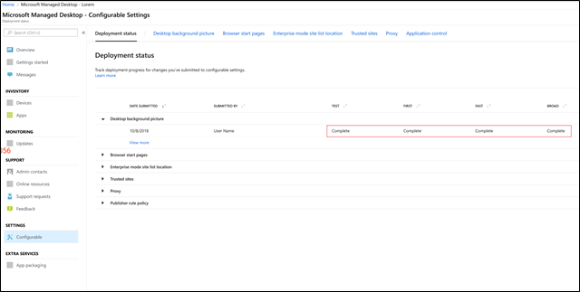

# Bereitstellen und Nachverfolgen von konfigurierbaren Einstellungen – Microsoft Managed Desktop

Nachdem Sie Änderungen an den Einstellungskategorien vorgenommen und eine Bereitstellung inszeniert haben, können Sie mit der Seite Bereitstellungsstatus mit der Bereitstellung der Einstellungen für Gruppen beginnen. Auf dieser Seite wird eine Zusammenfassung der einzelnen konfigurierbaren Einstellungen angezeigt. Durch Öffnen einer Einstellungskategorie können Sie Einstellungen für Gruppen bereitstellen und den Fortschritt dieser Bereitstellungen nachverfolgen.

## Bereitstellungsstatus 

Dies sind die Statuen, die für jede Bereitstellung angezeigt werden.

Status  | Erklärung 
--- | --- 
Bereitstellen | Ihre Änderung wartet darauf, für diese Gruppe bereitgestellt zu werden.
In Arbeit | Die Änderung wird auf aktive Geräte in dieser Gruppe angewendet. 
Abschließen | Die Änderung, die für alle aktiven Geräte in dieser Gruppe abgeschlossen wurde. 
Failed | Die Änderung ist bei 10 Prozent der aktiven Geräte in der Gruppe fehlgeschlagen, sodass die Bereitstellung angehalten wurde.   Eine Supportanforderung wird automatisch mit Microsoft Managed Desktop-Vorgängen geöffnet, um die Bereitstellung zu behandeln. 
Zurückgesetzt | Die Änderung wurde auf die letzte Änderung zurückgesetzt, die erfolgreich für alle Bereitstellungsgruppen bereitgestellt wurde.

## Bereitstellen von Änderungen

In diesen Anweisungen wird das Hintergrundbild des Desktops angezeigt. Nach dem Bereitstelleneiner Bereitstellung führen Sie Änderungen auf der Seite Bereitstellungsstatus aus. 

**So stellen Sie Änderungen bereit**

1. Anmelden beim [Microsoft Managed Desktop Admin Portal](http://aka.ms/mwaasportal)
2. Wählen Sie unter **Einstellungen**die Option **konfigurierbar**aus.
3. Wählen Sie im **Bereitstellungsstatus** -Arbeitsbereich die Einstellung aus, die Sie bereitstellen möchten, und wählen Sie dann die bereitgestellte Bereitstellung mit Staging aus.
4. Wählen Sie **Bereitstellen** aus, um die Änderung an einer der Bereitstellungsgruppen bereitzustellen.

Microsoft Managed Desktop empfiehlt die Bereitstellung in Bereitstellungsgruppen in dieser Reihenfolge: Test, First, fast und dann Broad. 

Wenn in jeder Gruppe Änderungen abgeschlossen sind, wird der Status in **abgeschlossen**geändert.

## Wiederherstellen der Bereitstellung

Nachdem Sie eine Änderung bereitgestellt haben, können Sie den **Bereitstellungsstatus**wiederherstellen. Wenn Sie eine Änderung zurücksetzen, die gerade **ausgeführt** wird oder **abgeschlossen**ist, wird die aktuelle Bereitstellung angehalten. Die Einstellung wird auf die letzte Version zurückgesetzt, die für alle Gruppen bereitgestellt wurde. 

Wir zeigen die Schritte zum Zurücksetzen einer Änderung mithilfe des Desktop Hintergrundbilds als Beispiel. 

**So stellen Sie eine Änderung wieder her**
1. Anmelden beim [Microsoft Managed Desktop Admin Portal](http://aka.ms/mwaasportal)
2. Wählen Sie unter **Einstellungen**die Option **konfigurierbar**aus.
3. Wählen Sie im **Bereitstellungsstatus** -Arbeitsbereich die Einstellung aus, die Sie wiederherstellen möchten, und wählen Sie dann die wiederherzustellende Staging-Bereitstellung aus.
4. Wenn Sie **diese Änderung rückgängig**machen möchten, wählen Sie **Bereitstellung zurück**setzen aus.

 

## Zusätzliche Ressourcen
- [Übersicht über konfigurierbare Einstellungen](config-setting-overview.md)
- [Referenz zu konfigurierbaren Einstellungen](config-setting-ref.md) 
