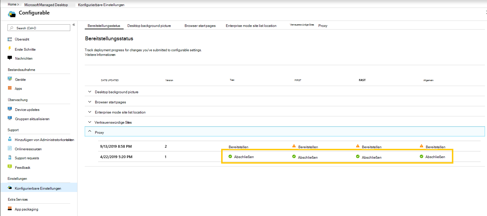

# Bereitstellen und Nachverfolgen konfigurierbarer Einstellungen – Microsoft Managed Desktop

Nachdem Sie Änderungen an den Einstellungskategorien vorgenommen und eine Bereitstellung bereitgestellt haben, können Sie auf der Seite "Bereitstellungsstatus" mit der Bereitstellung Ihrer Einstellungen für Gruppen beginnen. Auf dieser Seite wird eine Zusammenfassung der einzelnen konfigurierbaren Einstellungen angezeigt. Durch Öffnen einer Einstellungskategorie können Sie Einstellungen für Gruppen bereitstellen und den Fortschritt dieser Bereitstellungen nachverfolgen.

## Bereitstellungsstatus

Dies sind die Status, die Für jede Bereitstellung angezeigt werden.

Status | Erklärung
--- | ---
Bereitstellen | Ihre Änderung wartet darauf, für diese Gruppe bereitgestellt zu werden.
In Arbeit | Die Änderung wird auf aktive Geräte in dieser Gruppe angewendet.
Abschließen | Die Änderung wurde auf allen aktiven Geräten in dieser Gruppe abgeschlossen.
Fehlgeschlagen | Die Änderung ist auf 10 Prozent der aktiven Geräte in der Gruppe fehlgeschlagen, sodass die Bereitstellung beendet wurde.   Eine Supportanfrage wird automatisch mit Microsoft Managed Desktop-Vorgängen geöffnet, um die Bereitstellung zu beheben.
Wiederhergestellt | Die Änderung wurde auf die letzte Änderung zurückgesetzt, die erfolgreich für alle Bereitstellungsgruppen bereitgestellt wurde.

## Bereitstellen von Änderungen

In diesen Anweisungen wird das Hintergrundbild des Desktops angezeigt. Nachdem Sie eine Bereitstellung bereitgestellt haben, stellen Sie Änderungen über die Seite "Bereitstellungsstatus" bereit.

**So stellen Sie Änderungen bereit**

1. Melden Sie sich bei [Microsoft Endpoint Manager an,](https://endpoint.microsoft.com/) und navigieren Sie zum Menü **"Geräte".**
2. Suchen Sie nach dem Abschnitt Microsoft Managed Desktop, wählen Sie **Einstellungen** aus.
3. Wählen Sie im Arbeitsbereich **"Bereitstellungsstatus"** die Einstellung aus, die Sie bereitstellen möchten, und wählen Sie dann die bereitstellungsbezogene Bereitstellung aus.
4. Wählen Sie **"Bereitstellen"** aus, um die Änderung in einer der Bereitstellungsgruppen bereitzustellen.

> [!NOTE]
> Das orangefarbene Warnsymbol zeigt an, dass eine vorherige Gruppe für die Bereitstellung verfügbar ist, da es empfohlen wird, das Rollout in der angegebenen Reihenfolge durchzuführen.

<!-- Needs picture updated to show MEM  -->

Es wird empfohlen, die Bereitstellung für Bereitstellungsgruppen in der folgenden Reihenfolge durchzuführen: "Test", "First", "Fast" und "Broad". 

Wenn die Änderungen in jeder Gruppe abgeschlossen sind, wird der Status in **"Abgeschlossen"** geändert.

<!-- Needs picture updated to show MEM  -->

## Bereitstellung kehren zurück

Nachdem Sie eine Änderung bereitgestellt haben, können Sie den **Bereitstellungsstatus** kehren. Wenn Sie eine Änderung kehren, die **in Bearbeitung** oder **abgeschlossen** ist, wird die aktuelle Bereitstellung beendet. Die Einstellung wird auf die letzte Version zurückgesetzt, die für alle Gruppen bereitgestellt wurde.

Wir zeigen die Schritte zum Rückgängig machen einer Änderung mithilfe des Desktop-Hintergrundbilds als Beispiel. 

**So kehren Sie eine Änderung zurück**

1. Melden Sie sich bei [Microsoft Endpoint Manager an,](https://endpoint.microsoft.com/) und navigieren Sie zum Menü **"Geräte".**
2. Suchen Sie nach dem Abschnitt Microsoft Managed Desktop, wählen Sie **Einstellungen** aus.
3. Wählen Sie im Arbeitsbereich **"Bereitstellungsstatus"** die Einstellung aus, die Sie zurücksetzen möchten, und wählen Sie dann die mehrstufige Bereitstellung aus, die wiederhergestellt werden soll.
4. Wählen Sie unter **"Notwendigkeit, diese Änderung rückgängig zu machen?"** die Option **"Bereitstellung kehren"** aus.

<!-- Needs picture updated to show MEM  -->

## Weitere Ressourcen

- [Übersicht über konfigurierbare Einstellungen](config-setting-overview.md)
- [Referenz der konfigurierbaren Einstellungen](config-setting-ref.md) 
