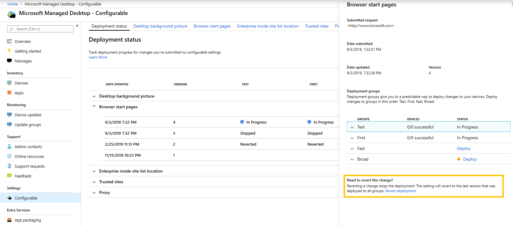

# Bereitstellen und Nachverfolgen konfigurierbarer Einstellungen – Microsoft Managed DesktopDeploy and track configurable settings - Microsoft Managed Desktop

Nachdem Sie Änderungen an den Einstellungskategorien vorgenommen und eine Bereitstellung bereitgestellt haben, können Sie auf der Seite Bereitstellungsstatus mit der Bereitstellung Ihrer Einstellungen für Gruppen beginnen.After you make changes to your setting categories and stage a deployment, the Deployment status page allows you to begin deploying your settings to groups. Diese Seite enthält eine Zusammenfassung der einzelnen konfigurierbaren Einstellungen.This page shows a summary of each configurable setting. Durch Öffnen einer Einstellungskategorie können Sie Einstellungen für Gruppen bereitstellen und den Fortschritt dieser Bereitstellungen nachverfolgen.By opening a setting category you can deploy settings to groups and track the progress of these deployments.

## BereitstellungsstatusDeployment statuses 

Dies sind die Status, die Für jede Bereitstellung angezeigt werden.These are the statuses you’ll see for each deployment.

StatusStatus  | ErklärungExplanation 
--- | --- 
BereitstellenDeploy | Ihre Änderung wartet darauf, für diese Gruppe bereitgestellt zu werden.Your change is waiting to be deployed to this group.
In ArbeitIn progress | Die Änderung wird auf aktive Geräte in dieser Gruppe angewendet.The change is being applied to active devices in this group. 
AbschließenComplete | Die Änderung wurde auf allen aktiven Geräten in dieser Gruppe abgeschlossen.The change completed on all active devices in this group. 
FehlgeschlagenFailed | Die Änderung ist auf 10 Prozent der aktiven Geräte in der Gruppe fehlgeschlagen, sodass die Bereitstellung beendet wurde.The change failed on a 10 percent of active devices in the group, so the deployment was stopped.   Eine Supportanfrage wird automatisch mit Microsoft Managed Desktop-Vorgängen geöffnet, um die Bereitstellung zu beheben.A support request will be automatically opened with Microsoft Managed Desktop operations to troubleshoot the deployment. 
RevertedReverted | Die Änderung wurde auf die letzte Änderung zurückgesetzt, die erfolgreich für alle Bereitstellungsgruppen bereitgestellt wurde.The change was reverted to the last change that was successfully deployed to all deployment groups.

## Bereitstellen von ÄnderungenDeploy changes

In diesen Anweisungen wird das Desktophintergrundbild angezeigt.We’ll show Desktop background picture in these instructions. Nachdem Sie eine Bereitstellung bereitgestellt haben, stellen Sie Änderungen auf der Seite Bereitstellungsstatus zur Bereitstellung zur Bereitstellungsstatusseite zur Bereitstellungsstatusseite.After you’ve staged a deployment, you deploy changes from the Deployment status page. 

**So stellen Sie Änderungen zur Bereitstellung****To deploy changes**

1. Melden Sie sich bei [Microsoft Endpoint Manager an,](https://endpoint.microsoft.com/) und navigieren Sie zum **Menü Geräte**Sign in to [Microsoft Endpoint Manager](https://endpoint.microsoft.com/) and navigate to the **Devices** menu
2. Suchen Sie nach dem Abschnitt Microsoft Managed Desktop, wählen Sie **Einstellungen aus.**Look for the Microsoft Managed Desktop section, select **Settings**.
3. Wählen **Sie im** Arbeitsbereich Bereitstellungsstatus die Einstellung aus, die Sie bereitstellen möchten, und wählen Sie dann die bereitstellungsstufige Bereitstellung aus.In **Deployment status** workspace, select the setting you want to deploy, and then select the staged deployment to deploy.
4. Wählen **Sie Bereitstellen** aus, um die Änderung in einer der Bereitstellungsgruppen bereitstellen.Select **Deploy** to deploy the change to one of the deployment groups.

> [!NOTE] 
> Das orangefarbene Warnsymbol zeigt an, dass eine vorherige Gruppe für die Bereitstellung verfügbar ist, da es empfohlen wird, den Rollup in der Reihenfolge zu erstellen.The orange caution icon indicates there is a previous group available for deployment as it’s recommended to roll out in order. 

<!-- Needs picture updated to show MEM  -->

Es wird empfohlen, bereitstellungsgruppen in der reihenfolge: Test, First, Fast, and then Broad.We recommend deploying to deployment groups in this order: Test, First, Fast, and then Broad. 

Wenn die Änderungen in jeder Gruppe abgeschlossen sind, wird der Status in **Abgeschlossen geändert.**When changes complete in each group, the status changes to **Complete**.

<!-- Needs picture updated to show MEM  -->

## Bereitstellung wiederherstellenRevert deployment

Nachdem Sie eine Änderung bereitgestellt haben, können Sie den Bereitstellungsstatus **wiederherstellen.**After you’ve deployed a change, you can revert from **Deployment status**. Wenn Sie eine Änderung wiederherstellen, die **in Bearbeitung ist** oder abgeschlossen **ist,** wird die aktuelle Bereitstellung beendet.When you revert a change that is **In progress** or **Complete**, the current deployment stops. Die Einstellung kehrt zur letzten Version zurück, die für alle Gruppen bereitgestellt wurde.The setting will revert to the last version that was deployed to all groups. 

Wir zeigen die Schritte zum Wiederherstellen einer Änderung mithilfe des Desktophintergrundbilds als Beispiel.We’ll show the steps to revert a change using the Desktop background picture as an example. 

**So wiederherstellen Sie eine Änderung****To revert a change**
1. Melden Sie sich bei [Microsoft Endpoint Manager an,](https://endpoint.microsoft.com/) und navigieren Sie zum **Menü Geräte**Sign in to [Microsoft Endpoint Manager](https://endpoint.microsoft.com/) and navigate to the **Devices** menu
2. Suchen Sie nach dem Abschnitt Microsoft Managed Desktop, wählen Sie **Einstellungen aus.**Look for the Microsoft Managed Desktop section, select **Settings**.
3. Wählen **Sie im** Arbeitsbereich Bereitstellungsstatus die Einstellung aus, die Sie wiederherstellen möchten, und wählen Sie dann die mehrstufige Bereitstellung aus, die wiederhergestellt werden soll.In **Deployment status** workspace, select the setting you want to revert, and then select the staged deployment to revert.
4. Wählen **Sie unter Diese Änderung wiederherstellen?** die Option Bereitstellung **wiederherstellen aus.**Under **Need to revert this change?**, select **Revert deployment**.

<!-- Needs picture updated to show MEM  -->

## Zusätzliche RessourcenAdditional resources
- [Übersicht über konfigurierbare EinstellungenConfigurable settings overview](config-setting-overview.md)
- [Referenz der konfigurierbaren EinstellungenConfigurable settings reference](config-setting-ref.md) 
