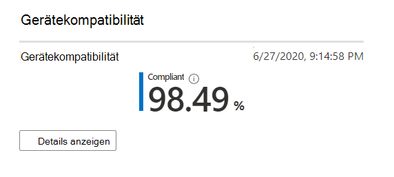
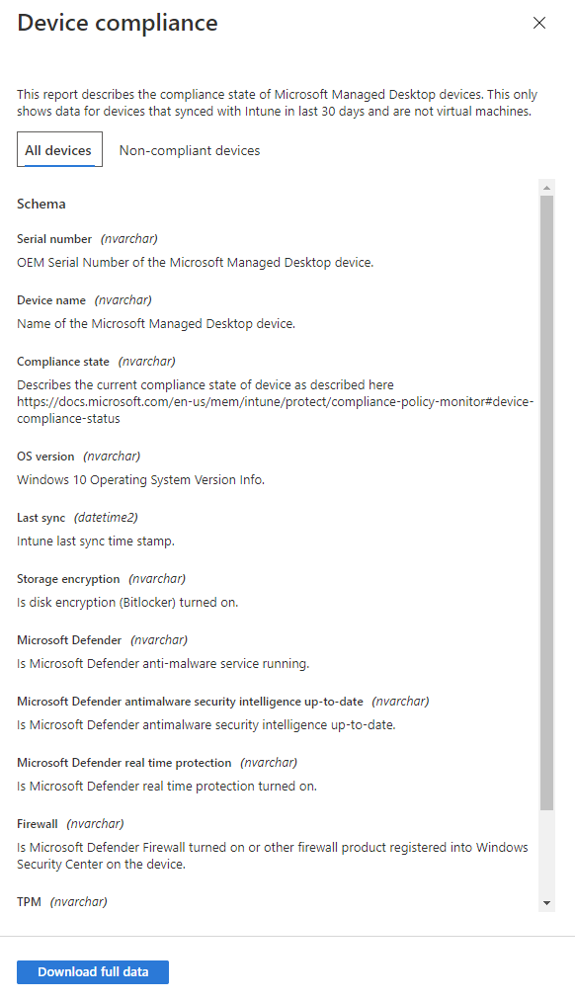

# Bericht über die GerätecomplianceDevice compliance report

In dieser Ansicht wird der Prozentsatz der Microsoft Managed Desktop-Geräte angezeigt, die den in Microsoft InTune festgelegten Konformitätsrichtlinien entsprechen.This view shows the percentage of your Microsoft Managed Desktop devices that conform to compliance policies set in Microsoft Intune.

Wählen Sie **Details anzeigen** aus, um bestimmte Informationen für alle von Microsoft verwalteten Desktop Geräte oder nur für Geräte anzuzeigen, die nicht den Konformitätsrichtlinien entsprechen.Select **View details** to view specific information for either all of your Microsoft Managed Desktop devices or only devices that do not conform to compliance policies. Verwenden Sie das Pulldown-Menü, um zwischen diesen Ansichten zu wechseln.Use the pulldown menu to switch between these views. Um in dieser Ansicht angezeigt zu werden, muss ein Gerät ein physischer Computer sein und in den letzten 30 Tagen mit InTune synchronisiert worden sein.To appear in this view, a device must be a physical machine and have synced with Intune in the last 30 days.

Wählen Sie in dieser Ansicht **vollständige Daten herunterladen** aus, um eine durch trennzeichengetrennte Datei mit denselben Informationen zu exportieren.From this view, select **Download full data** to export a comma-delimited file with the same information. In der Exportdatei werden die als **Schema** angezeigten Bereiche als Spalten angezeigt.In the export file, the areas displayed as **Schema** appear as columns.