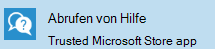

# Hilfe für Endbenutzer

Es gibt zwei Möglichkeiten, wie Benutzer in Ihrer Organisation Unterstützung für Ihre Microsoft Managed Desktop-Geräte erhalten können: **Abrufen der Hilfe** -APP oder Telefonsupport. Beide Supportoptionen stehen Benutzern 24 Stunden am Tag, 7 Tage die Woche zur Verfügung.
 
>[!NOTE]
>Diese Supportoptionen stehen für Geräte in der Test Gruppe nicht zur Verfügung.

## Hilfe-App abrufen

Die bevorzugte Methode für die Bereitstellung von Unterstützung für Ihre Benutzer ist **Get Help**, eine benutzerfreundliche Oberfläche, die in das endbenutzergerät integriert ist.  

Hierbei handelt es sich um eine Anwendung, die auf allen von Microsoft verwalteten Desktop Geräten installiert ist und an der Taskleiste fixiert ist. 

- Endbenutzer können einen Rückruf an eine bereitgestellte Telefonnummer anfordern oder online mit einem Dienstmitarbeiter chatten.
- Anforderungen, die außerhalb des Bereichs Microsoft Managed Desktop Support fallen, werden per Telefonanruf an den lokalen IT-Helpdesk umgeleitet.

### Voraussetzungen
Damit Ihre Endbenutzerhilfe über die APP erhalten können, stellen Sie sicher, dass diese Voraussetzungen erfüllt sind:

- Das Gerät muss bei Microsoft Managed Desktop mit einer der Methoden unter [Einrichten von Microsoft Managed Desktop-Geräten](../get-started/set-up-devices.md)registriert werden, beispielsweise [Registrieren neuer Geräte selbst](../get-started/register-devices-self.md).
- Die Anzeigesprache für das Gerät muss auf eine der folgenden englischsprachigen Gebietsschemas festgelegt sein: en-US, en-GB, en-au, en-NZ oder en-ca.
- Die Get-Hilfe-app sollte auf dem neuesten Stand sein. Um dies zu bestätigen, suchen Sie im Microsoft Store nach APP-Updates.
- Auf bestimmte [Endpunkte](../get-ready/network.md#endpoints-allowed-that-are-necessary-for-microsoft-managed-desktop) muss vom Gerät aus zugegriffen werden können.

> [!NOTE]
> Die Get-Hilfe-App kann bis zu einer Stunde dauern, nachdem ein Gerät bereitgestellt wurde, um voll funktionsfähig zu sein.

Wenn Sie diese Voraussetzungen überprüft haben und die Get-Hilfe-App immer noch nicht funktioniert, sollten Sie als IT-Administrator eine [Supportanfrage](admin-support.md)einreichen.

## Telefonunterstützung

Endbenutzer mit von Microsoft verwalteten Desktop Geräten haben auch Zugriff auf gebührenfreie Telefonnummern, die Sie anrufen können. Diese sollte verwendet werden, wenn Get Help nicht verfügbar ist. Beispielsweise, wenn Sie sich nicht am Gerät anmelden können oder das Gerät beschädigt ist. Hier sind die Telefonnummern für den Telefonsupport:

- Vereinigte Staaten: + 1 855 425 0216
- Kanada (ohne Quebec): + 1 855 425 0216
- Vereinigtes Königreich: + 44 800 026 0698
- Belgien: + 32 800 58533
- Luxemburg: + 352 800 40119
- Australien: + 61 180 037 0619
- Neuseeland: + 64 988 44380
- Schweden: + 46 20 120 3554
- Norwegen: + 47 800 62584
- Island: + 354 800 9006
- Irland: + 353 1 800 832272
- Dänemark: + 45 80 40 04 01
- Finnland: + 358 800 525088

>[!NOTE]
>Sie müssen ihre organisatorische e-Mail-Adresse parat haben, wenn Sie anrufen, um Ihre Identität zu überprüfen. 

## Zusätzliche Ressourcen
- [Administrator Unterstützung für Microsoft Managed Desktop](admin-support.md). 
- [Unterstützung für Microsoft Managed Desktop](../service-description/support.md).
- Wenn Sie bereits Microsoft Managed Desktop abonniert haben, finden Sie im Microsoft Managed Desktop Admin Guide im Abschnitt **Online Ressourcen** des [Microsoft Managed Desktop admin-Portals](https://aka.ms/mwaasportal)ausführliche Verfahren, Ablauf, Arbeitsanweisungen und FAQs.
