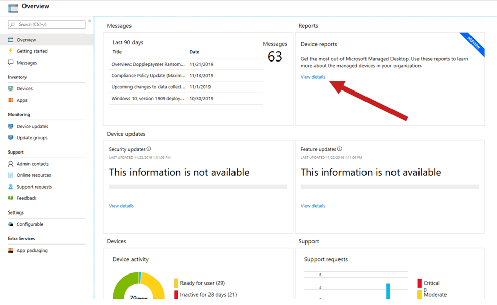

# Arbeiten mit EinblickenWork with insights

Microsoft Managed Desktop stellt eine Reihe von Dashboards bereit, die IT-Administratoren in Ihrem Mandanten verwenden können, um verschiedene Aspekte der Geräte Auffüllung zu verstehen.Microsoft Managed Desktop provides a number of dashboards that IT admins in your tenant can use to understand various aspects of the population of devices. Sie können über das Microsoft 365 Admin Center darauf zugreifen.You access these through the Microsoft 365 Admin Center.

Mit diesen Dashboards können Sie die Antworten auf Fragen wie die folgenden finden:With these dashboards you can find the answers to questions like these:

- Wie viele Geräte sind aktiv und wann wurden Sie zuletzt verwendet?How many devices are active and when were they last used?
- Welche apps werden am häufigsten verwendet und in welchen Zeiten?Which apps are most used and during which times?
- Welche apps verursachen Probleme durch Absturz oder Aufhängen einer Menge?Which apps are causing trouble by crashing or hanging a lot?
- Wie werden diese Probleme von Microsoft Managed Desktop Operations abgeschwächt oder behoben?How is Microsoft Managed Desktop Operations mitigating or resolving such problems?

Wenn Sie über das Microsoft 365 Admin Center auf diese Ansichten zugreifen möchten, wählen Sie Details im Bereich **Berichte** **anzeigen** aus:To access these views from the Microsoft 365 Admin Center, select **View details** in the **Reports** area:

## Einblicke in die NutzungUsage insights
In dieser Ansicht werden Verwendungs Metriken für Ihre von Microsoft verwalteten Desktop Geräte bereitgestellt.This view provides usage metrics for your Microsoft Managed Desktop devices. 

Um Verwendungsdaten anzuzeigen, wählen Sie die Registerkarte **Nutzung** aus.To view usage data, select the **Usage** tab.

Erfahren Sie mehr über [Einblicke](usage-insights.md)in die Nutzung.Learn more about [usage insights](usage-insights.md).

## Zuverlässigkeits EinblickeReliability insights
In dieser Ansicht erhalten Sie eine Zusammenfassung der Integrität Ihrer verwalteten Geräte.This view provides you with a health summary of your managed devices. Um Zuverlässigkeitsdaten anzuzeigen, wählen Sie die Registerkarte **Zuverlässigkeit** aus.To view reliability data, select the **Reliability** tab.

Erfahren Sie mehr über [Zuverlässigkeits Einblicke](reliability-insights.md)Learn more about [reliability insights](reliability-insights.md)