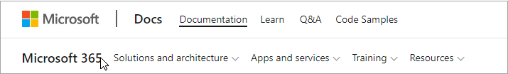

# Navigationshandbuch für Microsoft 365-DokumenteMicrosoft 365 docs navigation guide

Dieses Thema enthält einige Tipps und Tricks für die Navigation in den technischen Dokumentationsraum von Microsoft 365.This topic provides some tips and tricks for navigating the Microsoft 365 technical documentation space.  

## HubseiteHub page

Die Microsoft 365-Hubseite finden Sie unter und ist der Einstiegspunkt für die Suche nach relevanten [https://aka.ms/microsoft365docs](./index.yml) Microsoft 365-Inhalten.The Microsoft 365 hub page can be found at [https://aka.ms/microsoft365docs](./index.yml) and is the entry point for finding relevant Microsoft 365 content.

Sie können jederzeit zurück zu dieser Seite navigieren, indem Sie **Microsoft 365** in der Kopfzeile oben auf jeder Seite im Microsoft 365 Technical Documentation Set auswählen:You can always navigate back to this page by selecting **Microsoft 365** from the header at the top of every page within the Microsoft 365 technical documentation set:

## OfflinedokumentationOffline documentation

Wenn Sie die Microsoft 365-Dokumentation auf einem Offlinesystem anzeigen möchten, können Sie eine PDF erstellen, wo immer Sie sich in der technischen Dokumentation von Microsoft 365 befinden.If you would like to view the Microsoft 365 documentation on an offline system, you can create a PDF wherever you are in the Microsoft 365 technical documentation.

Wenn Sie eine PDF erstellen möchten, wählen Sie den **Link PDF** herunterladen unten in jedem Inhaltsverzeichnis aus.If you'd like to create a PDF, select the **Download PDF** link found at the bottom of every table of contents.

## TOC-SucheTOC search 
In docs.microsoft.com können Sie den Inhalt im Inhaltsverzeichnis mithilfe des Filtersuchfelds oben durchsuchen:On docs.microsoft.com, you can search the content in the table of contents by using the filter search box at the top:

## VersionsfilterVersion filter
Die technische Dokumentation von Microsoft 365 enthält Inhalte für zusätzliche Produkte, einschließlich Office 365 Deutschland und Office 365, betrieben von 21 Vianet (China).The Microsoft 365 technical documentation provides content for additional products, including Office 365 Germany and Office 365 operated by 21 Vianet (China). Die Features können zwischen diesen Versionen variieren, und manchmal kann der Inhalt selbst variieren.Features can vary between these versions, and as such, sometimes the content itself can vary.

Sie können den Versionsfilter verwenden, um sicherzustellen, dass Inhalte für die entsprechende Version von Microsoft 365 angezeigt werden:You can use the version filter to ensure that you are seeing content for the appropriate version of Microsoft 365:

## BreadcrumbsBreadcrumbs

Breadcrumbs finden Sie unter der Kopfzeile und über dem Inhaltsverzeichnis und geben an, wo sich der aktuelle Artikel im Inhaltsverzeichnis befindet.Breadcrumbs can be found below the header and above the table of contents, and indicate where the current article is located in the table of contents.  Dies hilft nicht nur beim Festlegen des Kontexts auf den Inhaltstyp, den Sie lesen, sondern ermöglicht es Ihnen auch, die Inhaltsverzeichnisstruktur zu sichern:Not only does this help set the context to what type of content you're reading, but it also allows you to navigate back up the table of contents tree:

## ArtikelabschnittsnavigationArticle section navigation

Im rechten Navigationsbereich können Sie schnell zu Abschnitten in einem Artikel navigieren und Ihren Speicherort innerhalb des Artikels identifizieren.The right-hand navigation pane allows you to quickly navigate to sections within an article, as well as identify your location within the article.  

## Feedback zu Dokumenten übermittelnSubmit docs feedback

Wenn Sie in einem Artikel etwas falsch finden, können Sie Feedback an das SQL Content Team für diesen Artikel senden, indem Sie einen Bildlauf nach unten auf der Seite durchführen und Inhaltsfeedback **auswählen.**If you find something wrong within an article, you can submit feedback to the SQL Content team for that article by scrolling down to the bottom of the page and selecting **Content feedback**.

## Beitrag zur Microsoft 365-DokumentationContribute to Microsoft 365 documentation

Wussten Sie, dass Sie die Inhalte auf ihrem docs.microsoft.com können?Did you know that you could edit the content on docs.microsoft.com yourself? Wenn Sie dies tun, wird nicht nur unsere Dokumentation verbessert, sondern Sie werden auch als Mitwirkender der Seite guthaben.If you do so, not only will our documentation improve, but you'll also be credited as a contributor to the page. Informationen zu den ersten Schritte finden Sie unter:To get started, see:

- [Microsoft Docs-Leitfaden für MitwirkendeMicrosoft Docs contributor guide](/contribute/)

## Nächste SchritteNext steps

- Erste Schritte mit der technischen Dokumentation zu [Microsoft 365](index.yml).Get started with the [Microsoft 365 technical documentation](index.yml).