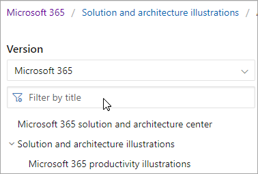

# Navigationshandbuch für Microsoft 365 Dokumente

Dieses Thema enthält einige Tipps und Tricks für die Navigation im Microsoft 365 technischen Dokumentationsbereichs.  

## Hubseite

Die Microsoft 365 Hubseite finden Sie unter [https://aka.ms/microsoft365docs](./index.yml) und ist der Einstiegspunkt für die Suche nach relevanten Microsoft 365 Inhalten.

Sie können jederzeit zurück zu dieser Seite navigieren, indem Sie **Microsoft 365** in der Kopfzeile oben auf jeder Seite innerhalb des Microsoft 365 technischen Dokumentationssatzes auswählen:

## Offlinedokumentation

Wenn Sie die Microsoft 365 Dokumentation auf einem Offlinesystem anzeigen möchten, können Sie eine PDF erstellen, unabhängig davon, wo Sie sich in der Microsoft 365 technischen Dokumentation befinden.

Wenn Sie eine PDF erstellen möchten, wählen Sie den Link **"PDF herunterladen"** unten in jedem Inhaltsverzeichnis aus.

## TOC-Suche 
Auf docs.microsoft.com können Sie den Inhalt im Inhaltsverzeichnis mithilfe des Filtersuchfelds oben durchsuchen:

## Versionsfilter
Die Microsoft 365 technische Dokumentation enthält Inhalte für zusätzliche Produkte, einschließlich Office 365 Deutschland und Office 365 betrieben von 21 Vianet (China). Features können zwischen diesen Versionen variieren, und daher kann der Inhalt selbst variieren.

Sie können den Versionsfilter verwenden, um sicherzustellen, dass Inhalte für die entsprechende Version von Microsoft 365 angezeigt werden:

## Paniermehl

Breadcrumbs befinden sich unterhalb der Kopfzeile und oberhalb des Inhaltsverzeichnisses und geben an, wo sich der aktuelle Artikel im Inhaltsverzeichnis befindet.  Dadurch wird nicht nur der Kontext auf den typ des gelesenen Inhalts festgelegt, sondern Sie können auch die Inhaltsverzeichnisstruktur wieder nach oben navigieren:

## Artikelabschnittsnavigation

Mit dem rechten Navigationsbereich können Sie schnell zu Abschnitten innerhalb eines Artikels navigieren und Ihren Speicherort innerhalb des Artikels identifizieren.  

## Übermitteln von Feedback zu Dokumenten

Wenn sie in einem Artikel etwas falsch finden, können Sie Feedback an das SQL Inhaltsteam für diesen Artikel senden, indem Sie nach unten auf der Seite scrollen und **Inhaltsfeedback** auswählen.

## Mitwirken an Microsoft 365 Dokumentation

Wissen Sie, dass Sie den Inhalt auf docs.microsoft.com selbst bearbeiten können? Wenn Sie dies tun, wird nicht nur unsere Dokumentation verbessert, sondern Sie werden auch als Mitwirkender auf der Seite angerechnet. Informationen zu den ersten Schritten finden Sie unter:

- [Microsoft Docs-Leitfaden für Mitwirkende](/contribute/)

## Nächste Schritte

- Erste Schritte mit der [Microsoft 365 technischen Dokumentation.](index.yml)