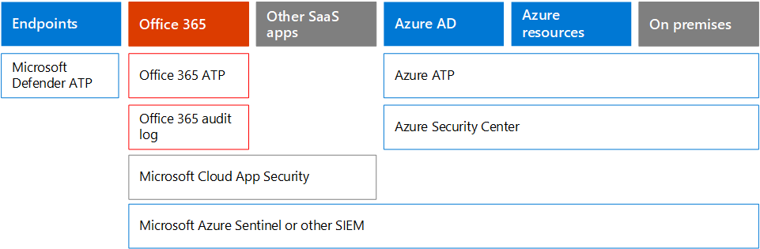

# Microsoft 365 Security for Business-Entscheidungsträger (BDMs)Microsoft 365 Security for Business Decision Makers (BDMs)

In diesem Artikel werden einige der häufigsten Bedrohungs-und Angriffsszenarien behandelt, denen Organisationen für Ihre Microsoft 365-Umgebungen derzeit ausgesetzt sind, sowie Empfohlene Aktionen zur Minderung dieser Risiken.This article discusses some of the most common threat and attack scenarios currently faced by organizations for their Microsoft 365 environments, and recommended actions for mitigating these risks. Während Microsoft 365 mit einer breiten Palette vorkonfigurierter Sicherheitsfeatures ausgeliefert wird, müssen Sie als Kunde auch die Verantwortung übernehmen, um Ihre eigenen Identitäten, Daten und Geräte zu schützen, die für den Zugriff auf Cloud-Dienste verwendet werden.While Microsoft 365 comes with a wide array of pre-configured security features, it also requires you as the customer to take responsibility to secure your own identities, data, and devices used to access cloud services. 

Dieser Artikel ist nach Priorität von Arbeit organisiert, beginnend mit dem Schutz dieser Konten, die für die Verwaltung der kritischsten Dienste und Ressourcen verwendet werden, beispielsweise Ihres Mandanten, ihrer e-Mail und SharePoint.This article is organized by priority of work, starting with protecting those accounts used to administer the most critical services and assets, such as your tenant, e-mail, and SharePoint. Sie bietet eine methodische Möglichkeit zur Annäherung an Sicherheit und arbeitet mit der folgenden Tabelle zusammen, damit Sie Ihren Fortschritt mit Beteiligten und Teams in Ihrer Organisation verfolgen können: [Microsoft 365 Security for BDMs Spreadsheet](https://github.com/MicrosoftDocs/microsoft-365-docs/raw/public/microsoft-365/downloads/Microsoft-365-BDM-security-recommendations-spreadsheet.xlsx).It  provides a methodical way for approaching security and works together with the following spreadsheet so you can track your progress with stakeholders and teams across your organization: [Microsoft 365 security for BDMs spreadsheet](https://github.com/MicrosoftDocs/microsoft-365-docs/raw/public/microsoft-365/downloads/Microsoft-365-BDM-security-recommendations-spreadsheet.xlsx). 

Microsoft stellt Ihnen das sichere Bewertungstool in Ihrem Mandanten zur Verfügung, mit dem Sie Ihre Sicherheitsposition basierend auf Ihren regulären Aktivitäten automatisch analysieren, eine Bewertung zuweisen und Empfehlungen zur Sicherheitsverbesserung stellen können.Microsoft provides you with the Secure Score tool within your tenant to automatically analyze your security posture based on your regular activities, assign a score, and provide security improvement recommendations. Beachten Sie vor dem Ausführen der in diesem Artikel empfohlenen Aktionen die aktuellen Ergebnisse und Empfehlungen.Before taking the actions recommended in this article, take note of your current score and recommendations. Die in diesem Artikel empfohlenen Aktionen verbessern Ihre Punktzahl.The actions recommended in this article will increase your score. Ziel ist nicht die maximale Punktzahl, sondern die Möglichkeiten zum Schutz Ihrer Umgebung, die sich nicht negativ auf die Produktivität Ihrer Benutzer auswirken.The goal is not to achieve the max score, but to be aware of opportunities to protect your environment that do not negatively affect productivity for your users. Siehe [Microsoft Secure Score](mtp/microsoft-secure-score.md).See [Microsoft Secure Score](mtp/microsoft-secure-score.md).

Noch eine Sache, bevor wir anfangen.One more thing before we get started . . . Achten Sie darauf, [das Office 365 Überwachungsprotokoll einzuschalten](../compliance/search-the-audit-log-in-security-and-compliance.md).be sure to [turn on the Office 365 audit log](../compliance/search-the-audit-log-in-security-and-compliance.md). Sie benötigen diese Daten später, für den Fall, dass Sie einen Vorfall oder eine Verletzung untersuchen müssen.You’ll need this data later, in the event you need to investigate an incident or a breach. 

## Schützen von privilegierten KontenProtect privileged accounts

Als ersten Schritt wird empfohlen, sicherzustellen, dass wichtige Konten in der Umgebung eine zusätzliche Schutzebene erhalten, da diese Konten Zugriff und Berechtigungen zum Verwalten und ändern wichtiger Dienste und Ressourcen haben, die sich negativ auf die gesamte Organisation auswirken können. Wenn kompromittiert.As a first step, we recommend ensuring critical accounts in the environment are given an extra layer of protection as these accounts have access and permissions to manage and alter critical services and resources which can negatively impact the entire organization, if compromised. Das Schützen von privilegierten Konten ist eine der effektivsten Methoden zum Schutz gegen einen Angreifer, der versucht, die Berechtigungen eines kompromittierten Kontos auf einen Administrator zu erhöhen.Protecting privileged accounts is one of the most effective ways to protect against an attacker who seeks to elevate the permissions of a compromised account to an administrative one. 

|EmpfehlungRecommendation  |E3E3 |E5E5  |
|---------|---------|---------|
|Erzwingen Sie die mehrstufige Authentifizierung (MFA) für alle Administratorkonten.Enforce multi-factor authentication (MFA) for all administrative accounts.||| 
|Implementieren Sie Azure Active Directory (Azure AD) Privileged Identity Management (PIM), um just-in-Time-privilegierten Zugriff auf Azure AD-und Azure-Ressourcen anzuwenden.Implement Azure Active Directory (Azure AD) Privileged Identity Management (PIM) to apply just-in-time privileged access to Azure AD and Azure resources. Sie können auch ermitteln, wer Zugriff hat, und überprüfen Sie den privilegierten Zugriff.You can also discover who has access and review privileged access.|         | |
|Implementieren einer privilegierten Zugriffsverwaltung in Office 365 zum Verwalten der granularen Zugriffssteuerung über privilegierte Administratoraufgaben in Office 365.Implement privileged access management in Office 365 to manage granular access control over privileged admin tasks in Office 365. |         | |
|Konfigurieren und Verwenden von PAW (privileged Access Workstations) zum Verwalten von Diensten.Configure and use Privileged Access Workstations (PAW) to administer services. Verwenden Sie nicht die gleichen Arbeitsstationen zum Durchsuchen des Internets und zum Überprüfen von e-Mails, die nicht mit Ihrem Administratorkonto in Zusammenhangstehen.Do not use the same workstations for browsing the Internet and checking email not related to your administrative account.|  | | 

Das folgende Diagramm veranschaulicht diese Funktionen.The following diagram illustrates these capabilities.

Weitere Empfehlungen:Additional recommendations:
- Stellen Sie sicher, dass Konten, die von lokal synchronisiert werden, nicht den Administratorrollen für Cloud-Dienste zugewiesen sind.Ensure accounts that are synchronized from on-premises are not assigned admin roles for cloud services. Dadurch kann verhindert werden, dass ein Angreifer lokale Konten nutzt, um administrativen Zugriff auf Cloud-Dienste zu erhalten.This helps prevent an attacker from leveraging on-premises accounts to gain administrative access to cloud services. 
- Stellen Sie sicher, dass Dienstkonten keine Administratorrollen zugewiesen sind.Ensure service accounts are not assigned admin roles. Diese Konten werden häufig nicht überwacht und mit Kennwörtern festgelegt, die nicht ablaufen.These accounts are often not monitored and set with passwords that do not expire. Stellen Sie zunächst sicher, dass die AADConnect-und ADFS-Dienste-Konten standardmäßig keine globalen Administratoren sind.Start by ensuring the AADConnect and ADFS services accounts are not Global Admins by default.
- Entfernen von Lizenzen von Administratorkonten.Remove licenses from admin accounts. Wenn es keinen bestimmten Benutzer Fall gibt, um Lizenzen bestimmten Administratorkonten zuzuweisen, entfernen Sie Lizenzen von diesen Konten.Unless there is a specific user case to assign licenses to specific admin accounts, remove licenses from these accounts. 

## Verringern der AngriffsflächeReduce the surface of attack

Im nächsten Fokusbereich wird die Angriffsfläche reduziert.The next focus area is reducing the surface of attack. Dies kann mit minimalem Aufwand und Auswirkungen auf Ihre Benutzer und Dienste erreicht werden.This can be accomplished with minimal effort and impact to your users and services. Durch die Verringerung der Angriffsfläche haben Angreifer weniger Möglichkeiten, einen Angriff auf Ihre Organisation zu starten.By reducing the surface area of attack, attackers have fewer ways to launch an attack against your organization.

Im Folgenden finden Sie einige Beispiele:Here are some examples:
- Deaktivieren Sie POP3-, IMAP-und SMTP-Protokolle.Disable POP3, IMAP, and SMTP protocols. Die meisten modernen Organisationen verwenden diese älteren Protokolle nicht mehr.Most modern organizations no longer use these older protocols. Sie können diese sicher deaktivieren und bei Bedarf nur Ausnahmen zulassen.You can safely disable these and allow only exceptions as needed. 
- Verringern Sie die Anzahl globaler Administratoren im Mandanten, und halten Sie Sie auf das absolut erforderliche Minimum.Reduce and keep the number of Global Admins in the tenant to the absolute minimum required. Dadurch wird die Angriffsfläche für alle Cloud-Anwendungen direkt reduziert.This directly reduces the surface area of attack for all Cloud applications. 
- Zurückziehen von Servern und Anwendungen, die in Ihrer Umgebung nicht mehr verwendet werden.Retire servers and applications that are no longer used in your environment. 
- Implementieren Sie einen Prozess zum Deaktivieren und Löschen von Konten, die nicht mehr verwendet werden.Implement a process for disabling and deleting accounts that are no longer used. 

## Schutz vor bekannten BedrohungenProtect against known threats

Zu den bekannten Bedrohungen gehören Schadsoftware, kompromittierte Konten und Phishing.Known threats include malware, compromised accounts, and phishing. Einige Schutzmaßnahmen gegen diese Bedrohungen können schnell ohne direkte Auswirkungen auf die Benutzer implementiert werden, während andere mehr Planung und Benutzerschulung erfordern.Some protections against these threats can be implemented quickly with no direct impact to your users, while others require more planning and user training. 

|EmpfehlungRecommendation  |E3E3  |E5E5  |
|---------|---------|---------|
|**Einrichten der mehrstufigen Authentifizierung und Verwenden von empfohlenen Richtlinien für den bedingten Zugriff, einschließlich der Anmelde Risikorichtlinien**.**Setup multi-factor authentication and use recommended conditional access policies, including sign-in risk policies**. Microsoft empfiehlt und hat eine Reihe von Richtlinien getestet, die zusammenarbeiten, um alle Cloud-apps zu schützen, einschließlich Office 365 und Microsoft 365-Dienste.Microsoft recommends and has tested a set of policies that work together to protect all cloud apps, including Office 365 and Microsoft 365 services. Siehe [Konfigurationen für den Identitäts-und Geräte Zugriff](../enterprise/microsoft-365-policies-configurations.md).See [Identity and device access configurations](../enterprise/microsoft-365-policies-configurations.md). | ||
|**Mehrstufige Authentifizierung für alle Benutzer erforderlich**.**Require multi-factor authentication for all users**. Wenn Sie nicht über die erforderliche Lizenzierung zum Implementieren der empfohlenen Richtlinien für den bedingten Zugriff verfügen, benötigen Sie mindestens die mehrstufige Authentifizierung für alle Benutzer.If you don’t have the licensing required to implement the recommended conditional access policies, at a minimum require multi-factor authentication for all users.|||
|**Erhöhen Sie das Schutzniveau vor Schadsoftware in Mail**.**Raise the level of protection against malware in mail**. Ihre Office 365-oder Microsoft 365-Umgebung umfasst Schutz vor Schadsoftware, aber Sie können diesen Schutz verbessern, indem Sie Anlagen mit Dateitypen blockieren, die häufig für Schadsoftware verwendet werden.Your Office 365 or Microsoft 365 environment includes protection against malware, but you can increase this protection by blocking attachments with file types that are commonly used for malware.|||
|**Schützen Sie Ihre e-Mails vor gezielten Phishing-Angriffen**.**Protect your email from targeted phishing attacks**. Wenn Sie eine oder mehrere benutzerdefinierte Domänen für Ihre Office 365-oder Microsoft 365-Umgebung konfiguriert haben, können Sie den gezielten Schutz gegen Phishing konfigurieren.If you've configured one or more custom domains for your Office 365 or Microsoft 365 environment, you can configure targeted anti-phishing protection. Der ATP-Schutz gegen Phishing, ein Teil Office 365 Advanced Threat Protection, kann zum Schutz Ihrer Organisation vor böswilligen Identitätswechsel basierten Phishing-Angriffen und anderen Phishing-Angriffen beitragen.ATP anti-phishing protection, part of Office 365 Advanced Threat Protection, can help protect your organization from malicious impersonation-based phishing attacks and other phishing attacks. Wenn Sie keine benutzerdefinierte Domäne konfiguriert haben, müssen Sie dies nicht tun.If you haven't configured a custom domain, you do not need to do this.| ||
|**Schützen Sie sich vor Ransomware-Angriffen in e-Mails**.**Protect against ransomware attacks in email**. Ransomware nimmt den Zugriff auf Ihre Daten durch Verschlüsseln von Dateien oder Sperren von Computerbildschirmen in Anspruch.Ransomware takes away access to your data by encrypting files or locking computer screens. Er versucht dann, Geld von den Opfern zu erpressen, indem er nach "Lösegeld" fragt, normalerweise in Form von cryptocurrencies wie Bitcoin, im Gegenzug zum Zurückgeben des Zugriffs auf Ihre Daten.It then attempts to extort money from victims by asking for "ransom," usually in form of cryptocurrencies like Bitcoin, in exchange for returning access to your data. Sie können zur Verteidigung gegen Ransomware beitragen, indem Sie eine oder mehrere Nachrichtenfluss Regeln erstellen, um Dateierweiterungen zu blockieren, die in der Regel für Ransomware verwendet werden, oder um Benutzer zu warnen, die diese Anlagen in e-Mails empfangen.You can help defend against ransomware by creating one or more mail flow rules to block file extensions that are commonly used for ransomware, or to warn users who receive these attachments in email.|||
|**Blockieren Sie Verbindungen aus Ländern, mit denen Sie nicht Geschäfte machen**.**Block connections from countries that you don’t do business with**. Erstellen Sie eine Azure AD Richtlinie für den bedingten Zugriff, um alle Verbindungen zu blockieren, die aus diesen Ländern stammen, und erstellen Sie effektiv eine Geo-Firewall um ihren Mandanten.Create an Azure AD conditional access policy to block any connections coming from these countries, effectively creating a geo firewall around your tenant.| ||

Das folgende Diagramm veranschaulicht diese Funktionen.The following diagram illustrates these capabilities.

## Schutz vor unbekannten BedrohungenProtect against unknown threats

Nachdem Sie Ihren privilegierten Konten zusätzlichen Schutz und Schutz vor bekannten Angriffen hinzugefügt haben, sollten Sie Ihre Aufmerksamkeit auf den Schutz vor unbekannten Bedrohungen lenken.After adding extra protections to your privileged accounts and protecting against known attacks, shift your attention to protecting against unknown threats. Die entschlosseneren und anspruchsvolleren Gegner verwenden innovative und neue, unbekannte Methoden, um Organisationen anzugreifen.The more determined and advanced adversaries use innovative and new, unknown methods to attack organizations. Mit der umfangreichen Telemetrie von Microsoft, die über Milliarden von Geräten, Anwendungen und Diensten gesammelt wurde, können wir fortschrittlichen Bedrohungsschutz für Windows, Office 365 und Azure durchführen, um gegen Zero-Day-Angriffe zu verhindern, indem Sie sandkastenumgebungen nutzen und Überprüfen der Gültigkeit, bevor Sie Zugriff auf Ihre Inhalte gewähren.With Microsoft’s vast telemetry of data gathered over billions of devices, applications, and services, we are able to perform Advanced Threat Protection on Windows, Office 365, and Azure to prevent against Zero Day attacks, utilizing sand box environments, and checking validity before allowing access to your content. 

|EmpfehlungRecommendation  |E3E3  |E5E5  |
|---------|---------|---------|
|**Konfigurieren Office 365 Advanced Threat Protection (ATP)**:**Configure Office 365 Advanced Threat Protection (ATP)**: • Sichere ATP-Anhänge•    ATP Safe Attachments • ATP-sichere Links•   ATP Safe Links • ATP für SharePoint, OneDrive und Microsoft Teams• ATP for SharePoint, OneDrive, and Microsoft Teams • ATP-Schutz gegen Phishing•  ATP anti-phishing protection|         | |
|**Konfigurieren von Microsoft Defender Advanced Threat Protection-Funktionen**:**Configure Microsoft Defender Advanced Threat Protection capabilities**: • Windows Defender-Antivirus• Windows Defender Antivirus  • Schutz vor Ausnutzung•    Exploit protection   • Reduzierung der Angriffsfläche•   Attack surface reduction   • Hardware basierte Isolierung• Hardware-based isolation  • Kontrollierter Ordner Zugriff•  Controlled folder access     |         | |
|**Verwenden Sie die Microsoft Cloud-App-Sicherheit** , um SaaS-apps zu entdecken und mit der Verhaltensanalyse und Anomalien-Erkennung zu beginnen.**Use Microsoft Cloud App Security** to discover SaaS apps and begin to use behavior analytics and anomaly detection. |         | |

Das folgende Diagramm veranschaulicht diese Funktionen.The following diagram illustrates these capabilities.

Weitere Empfehlungen:Additional recommendations:
- Sichere partnerkanal Kommunikation wie e-Mails mit TLS.Secure partner channel communications like Emails using TLS.
- Öffnen Sie den Teams-Partnerverbund nur für Partner, mit denen Sie kommunizieren.Open Teams Federation only to Partners you communicate with.
- Listen Sie keine Absenderdomänen, einzelne Absender oder Quell-IPs auf, da dadurch Spam-und Malware Überprüfungen umgangen werden können – eine gängige Vorgehensweise bei Kunden ist die Whitelist ihrer eigenen akzeptierten Domänen oder einer Reihe von anderen Domänen, in denen e-Mail-Fluss Probleme aufgetreten sind. gemeldet.Do not whitelist sender domains, individual senders, or source IPs as this allows these to bypass spam and malware checks — A common practice with customers is whitelisting their own accepted domains or a number of other domains where email flow issues may have been reported. Fügen Sie keine Domänen in die Liste der Spam-und Verbindungsfilterung ein, da dadurch möglicherweise alle Spam Überprüfungen umgangen werden.Do not add domains in the Spam and Connection Filtering list as this potentially bypasses all spam checks. 
- Ausgehende Spambenachrichtigungen aktivieren: Aktivieren Sie ausgehende Spambenachrichtigungen in einer Verteilerliste intern an das Helpdesk-oder IT-Verwaltungsteam, um zu melden, ob externe Spam-e-Mails von einem der internen Benutzer extern gesendet werden.Enable outbound spam notifications — Enable outbound spam notifications to a distribution list internally to the Helpdesk or IT Admin team to report if any of the internal users are sending out Spam emails externally. Dies kann ein Indikator dafür sein, dass das Konto kompromittiert wurde.This could be an indicator that the account has been compromised.
- Deaktivieren von Remote-PowerShell für alle Benutzer – Remote-PowerShell wird hauptsächlich von Administratoren für den Zugriff auf Office 365 Dienste zu administrativen Zwecken oder für den programmatischen API-Zugriff verwendet.Disable Remote PowerShell for all users — Remote PowerShell is mainly used by Admins to access Office 365 services for administrative purposes or programmatic API access. Wir empfehlen, diese Option für nicht-Administrator-Benutzer zu deaktivieren, um eine Aufklärung zu vermeiden, es sei denn, Sie haben eine geschäftliche Anforderung für den Zugriff darauf.We recommended disabling this option for non-Admin users to avoid reconnaissance unless they have a business requirement to access it. 
- Blockieren des Zugriffs auf das Microsoft Azure Verwaltungsportal für alle nicht-Administratoren.Block access to the Microsoft Azure Management portal to all non-administrators. Sie können dies erreichen, indem Sie eine Regel für bedingten Zugriff erstellen, um alle Benutzer zu blockieren, mit Ausnahme von Administratoren.You can accomplish this by creating a conditional access rule to block all users, with the exception of admins. 

## Annahme einer VerletzungAssume breach

Während Microsoft alle möglichen Maßnahmen zur Abwehr von Bedrohungen und Angriffen durchführt, wird empfohlen, immer unter der Denkweise "Übernehmen einer Verletzung" zu arbeiten.While Microsoft takes every possible measure to prevent against threats and attacks, we recommend always working under the “Assume Breach” mindset. Selbst wenn ein Angreifer in die Umgebung eindringen konnte, müssen wir sicherstellen, dass er keine Daten oder Identitätsinformationen aus der Umgebung exfiltrieren kann.Even if an Attacker has managed to intrude into the environment, we need to make sure they are unable to exfiltrate data or identity information from the environment. Aus diesem Grund wird empfohlen, Schutz vor vertraulichen Datenverlusten wie Sozialversicherungsnummern, Kreditkartennummern, zusätzlichen persönlichen Informationen und anderen vertraulichen Informationen auf Organisationsebene zu aktivieren.For this reason, we recommend enabling protection against sensitive data leaks such as Social Security numbers, credit cards numbers, additional personal information, and other organizational level confidential information. 

Die Denkweise "Annehmen einer Verletzung" erfordert die Implementierung einer NULL-vertrauenswürdigen Netzwerk Strategie, was bedeutet, dass Benutzer nicht vollständig vertrauenswürdig sind, nur weil Sie intern im Netzwerk sind.The “Assume Breach” mindset requires implementing a zero trust network strategy, which means users are not fully trusted just because they are internal to the network. Stattdessen werden im Rahmen der Autorisierung, was Benutzer tun können, festgelegte Bedingungen angegeben, und wenn solche Bedingungen erfüllt sind, werden bestimmte Steuerelemente erzwungen.Instead, as part of authorization of what users can do, sets of conditions are specified, and when such conditions are met, certain controls are enforced. Die Bedingungen können den Geräte Integritätsstatus, den Zugriff auf die Anwendung, den ausgeführten Betrieb und das Benutzer Risiko umfassen.Conditions may include device health status, application being accessed, operations being performed and user risk. Beispielsweise sollte eine Geräte Registrierungsaktion immer die MFA-Authentifizierung auslösen, um sicherzustellen, dass der Umgebung keine Rouge-Geräte hinzugefügt werden.For example, a device enrollment action should always trigger MFA authentication to ensure no rouge devices are added to your environment. 

Für eine NULL-vertrauenswürdige Netzwerk Strategie müssen Sie auch wissen, wo Ihre Informationen gespeichert sind, und geeignete Steuerelemente für Klassifizierung, Schutz und Aufbewahrung anwenden.A zero trust network strategy also requires that you know where your information is stored and apply appropriate controls for classification, protection, and retention. Um Ihre kritischsten und vertraulichen Ressourcen effektiv zu schützen, müssen Sie zuerst herausfinden, wo sich diese befinden und wie Sie inventarisieren, was eine Herausforderung darstellen kann.To effectively protect your most critical and sensitive assets you need to first identify where these are located and take inventory, which can be challenging. Als nächstes arbeiten Sie mit Ihrer Organisation zusammen, um eine Steuerungsstrategie zu definieren.Next, work with your organization to define a governance strategy. Das Definieren eines Klassifikationsschemas für eine Organisation und das Konfigurieren von Richtlinien, Bezeichnungen und Bedingungen erfordert eine sorgfältige Planung und Vorbereitung.Defining a classification schema for an organization and configuring policies, labels, and conditions requires careful planning and preparation. Es ist wichtig zu wissen, dass es sich dabei nicht um einen IT-basierten Prozess handelt.It is important to realize that this is not an IT driven process. Stellen Sie sicher, dass Sie mit Ihrem Legal and Compliance-Team zusammenarbeiten, um ein geeignetes Klassifizierungs-und Kennzeichnungs Schema für die Daten Ihrer Organisation zu entwickeln.Be sure to work with your legal and compliance team to develop an appropriate classification and labeling schema for your organization’s data.

Microsoft 365 Information Protection-Funktionen können Ihnen dabei helfen herauszufinden, welche Informationen Sie haben, wo Sie gespeichert sind und welche Informationen zusätzlichen Schutz erfordern.Microsoft 365 information protection capabilities can help you discover what information you have, where it is stored, and which information requires additional protection. Der Informationsschutz ist ein kontinuierlicher Prozess, und Microsoft 365-Funktionen bieten Ihnen Einblick in die Verwendung und Verteilung von vertraulichen Informationen durch Benutzer, wo Ihre Informationen aktuell gespeichert werden und wo Sie fließt.Information protection is a continuous process and Microsoft 365 capabilities provide you with visibility into how users are using and distributing sensitive information, where your information is currently stored, and where it flows. Sie können auch sehen, wie Benutzer mit Informationen umgehen, die reguliert werden, um sicherzustellen, dass die entsprechenden Bezeichnungen und Schutzmechanismen angewendet werden.You can also see how users handling information that is regulated to be sure the appropriate labels and protections are applied.

|EmpfehlungRecommendation |E3E3|E5E5 |
|---------|---------|---------|
|**Überprüfen und optimieren Sie Ihren bedingten Zugriff und zugehörige Richtlinien, damit Sie sich an Ihre Ziele für ein Zero-Trust-Netzwerk ausrichten können**.**Review and optimize your conditional access and related policies to align with your objectives for a zero trust network**. Zum Schutz vor bekannten Bedrohungen gehört das Implementieren einer Reihe [empfohlener Richtlinien](../enterprise/microsoft-365-policies-configurations.md).Protecting against known threats includes implementing a set of [recommended policies](../enterprise/microsoft-365-policies-configurations.md). Überprüfen Sie Ihre Implementierung dieser Richtlinien, um sicherzustellen, dass Sie Ihre apps und Daten vor Hackern schützen, die Zugriff auf Ihr Netzwerk erlangt haben.Review your implementation of these policies to ensure you’re protecting your apps and data against hackers who have gained access to your network. Beachten Sie, dass die empfohlene InTune-App-Schutzrichtlinie für Windows 10 Windows Information Protection (WIP) aktiviert.Note that the recommended Intune app protection policy for Windows 10 enables Windows Information Protection (WIP). WIP schützt vor versehentlichen Verlusten ihrer Organisationsdaten über apps und Dienste wie e-Mail, soziale Netzwerke und die öffentliche Cloud.WIP protects against accidental leaks of your organization data through apps and services, like email, social media, and the public cloud. |         ||
|**Externe e-Mail-Weiterleitung deaktivieren**.**Disable external email forwarding**. Hacker, die Zugriff auf das Postfach eines Benutzers erhalten, können Ihre e-Mails stehlen, indem Sie das Postfach so festlegen, dass e-Mails automatisch weitergeleitet werden.Hackers who gain access to a user's mailbox can steal your mail by setting the mailbox to automatically forward email. Dies kann auch ohne das Bewusstsein des Benutzers geschehen.This can happen even without the user's awareness. Sie können dies verhindern, indem Sie eine e-Mail-Fluss Regel konfigurieren.You can prevent this from happening by configuring a mail flow rule.| ||
|**Anonyme externe Kalenderfreigabe deaktivieren**.**Disable anonymous external calendar sharing**. Standardmäßig ist die externe anonyme Kalenderfreigabe zulässig.By default external anonymous calendar sharing is allowed. [Deaktivieren Sie die Kalenderfreigabe](https://docs.microsoft.com/en-us/exchange/sharing/sharing-policies/modify-a-sharing-policy) , um potenzielle Lecks an vertraulichen Informationen zu verringern.[Disable calendar sharing](https://docs.microsoft.com/en-us/exchange/sharing/sharing-policies/modify-a-sharing-policy) to reduce potential leaks of sensitive information.| ||
|**Konfigurieren von Richtlinien zur Verhinderung von Datenverlust für vertrauliche Daten****Configure data loss prevention policies for sensitive data**. Erstellen Sie eine Richtlinie zur Verhinderung von Datenverlust im Office 365 Security and Compliance Center, um vertrauliche Daten wie Kreditkartennummern, Sozialversicherungsnummern und Kontonummern zu ermitteln und zu schützen.Create a Data Loss Prevention Policy in the Office 365 Security and Compliance center to discover and protect sensitive data such as credit card numbers, Social Security numbers and bank account numbers. Office 365 enthält zahlreiche vordefinierte Typen vertraulicher Informationen, die Sie in Richtlinien zur Verhinderung von Datenverlust verwenden können.Office 365 includes many predefined sensitive information types you can use in data loss prevention policies. Sie können auch eigene vertrauliche Informationstypen für vertrauliche Daten erstellen, die für Ihre Umgebung Benutzerdefiniert sind.You can also create your own sensitive information types for sensitive data that is custom to your environment. |||
|**Implementieren von Daten Klassifizierungs-und Informationsschutz Richtlinien****Implement data classification and information protection policies**. Implementieren Sie Sensitivitäts Bezeichnungen in Office 365, und verwenden Sie diese, um Schutz auf vertrauliche Daten zu klassifizieren und anzuwenden.Implement sensitivity labels in Office 365 and use these to classify and apply protection to sensitive data. Sie können diese Bezeichnungen auch in Richtlinien zur Verhinderung von Datenverlust verwenden.You can also use these labels in data loss prevention policies. Wenn Sie Azure Information Protection-Bezeichnungen verwenden, sollten Sie vermeiden, neue Bezeichnungen in anderen Verwaltungszentren zu erstellen.If you are using Azure Information Protection labels, we recommend that you avoid creating new labels in other admin centers.|         ||
|**Schützen von Daten in Drittanbieter-apps und-Diensten mithilfe der Cloud-App-Sicherheit**.**Protect data in third-party apps and services by using Cloud App Security**. Konfigurieren von Cloud-App-Sicherheitsrichtlinien zum Schutz vertraulicher Informationen in Cloud-apps von Drittanbietern wie Salesforce, Box oder Dropbox.Configure Cloud App Security policies to protect sensitive information across third-party cloud apps, such as Salesforce, Box, or Dropbox. Sie können vertrauliche Informationstypen und die in Office 365 erstellten Vertraulichkeits Bezeichnungen in Cloud-App-Sicherheitsrichtlinien verwenden und diese auf Ihre SaaS-apps anwenden.You can use sensitive information types and the sensitivity labels you created in Office 365 in Cloud App Security policies and apply these across your SaaS apps.   Mit der Microsoft Cloud-App-Sicherheit können Sie eine Vielzahl von automatisierten Prozessen erzwingen.Microsoft Cloud App Security allow you to enforce a wide range of automated processes. Richtlinien können festgelegt werden, um kontinuierliche Konformitätsscans, gesetzliche eDiscovery-Aufgaben, DLP für öffentlich freigegebene vertrauliche Inhalte und vieles mehr bereitzustellen.Policies can be set to provide continuous compliance scans, legal eDiscovery tasks, DLP for sensitive content shared publicly, and more. Die Cloud-App-Sicherheit kann jeden Dateityp überwachen, der auf mehr als 20 Metadaten-Filtern basiert (beispielsweise Zugriffsebene, Dateityp).Cloud App Security can monitor any file type based on more than 20 metadata filters (for example, access level, file type). |         ||
|**Verwenden Sie [Microsoft Defender ATP](https://docs.microsoft.com/en-us/windows/security/threat-protection/microsoft-defender-atp/information-protection-in-windows-overview) , um festzustellen, ob Benutzer vertrauliche Informationen auf Ihren Windows-Geräten speichern**.**Use [Microsoft Defender ATP](https://docs.microsoft.com/en-us/windows/security/threat-protection/microsoft-defender-atp/information-protection-in-windows-overview) to identify if users store sensitive information on their Windows devices**. |         ||
|**Verwenden Sie den [AIP-Scanner](https://docs.microsoft.com/en-us/azure/information-protection/deploy-aip-scanner) zum Identifizieren und Klassifizieren von Informationen über Server und Dateifreigaben hinweg**.**Use [AIP Scanner](https://docs.microsoft.com/en-us/azure/information-protection/deploy-aip-scanner) to identify and classify information across servers and file shares**. Verwenden Sie das AIP-Berichtstool, um die Ergebnisse anzuzeigen und entsprechende Aktionen durchführen zu können.Use the AIP reporting tool to view the results and take appropriate actions.|         ||

Das folgende Diagramm veranschaulicht diese Funktionen.The following diagram illustrates these capabilities.

## Kontinuierliche Überwachung und ÜberwachungContinuous monitoring and auditing

Die letzte, aber nicht zuletzt kontinuierliche Überwachung und Überwachung der Microsoft 365-Umgebung zusammen mit den Fenstern und Geräten ist wichtig, um sicherzustellen, dass Sie Eindringlinge schnell erkennen und beheben können.Last, but not least Continuous Monitoring and Auditing of the Microsoft 365 environment along with the Windows and Devices is critical to making sure you are able to quickly detect and remediate any intrusions. Tools wie Secure Score, Security Center und Advanced Analytics von Microsoft Intelligent Graph bieten unschätzbare Informationen in Ihrem Mandanten und verknüpfen riesige Mengen an Threat Intelligence-und Sicherheitsdaten, um Ihnen einen unübertroffenen Bedrohungsschutz zu bieten. und-Erkennung.Tools such as Secure Score, Security Center, and Microsoft Intelligent Graph’s advanced analytics provide invaluable information into your tenant and link massive amounts of threat intelligence and security data to provide you unparalleled threat protection and detection.

|EmpfehlungRecommendation |E3E3 |E5E5 |
|---------|---------|---------|
|Stellen Sie sicher, dass das **Office 365 Überwachungsprotokoll** aktiviert ist.Ensure the **Office 365 audit log** is turned on.|||
|**Review Secure Score Weekly** — Secure Score ist ein zentraler Ort, um auf den Sicherheitsstatus Ihres Office 365 Mandanten zuzugreifen und Aktionen basierend auf Tipps für sichere Bewertungen durchführen zu können.**Review Secure Score weekly** — Secure score is a central location to access the Security status of your Office 365 tenant and take actions based on Secure score recommendations. Es wird empfohlen, diese Überprüfung wöchentlich durchzuführen.It is recommended to perform this check weekly.|||
|Verwenden Sie **Office 365 ATP** -Tools:Use **Office 365 ATP** tools: • Untersuchung und Antwortfunktionen für Bedrohungen• Threat investigation and response capabilities  • Automatische Untersuchung und Antwort•    Automated investigation and response |         ||
|Verwenden Sie **Microsoft Defender ATP**:Use **Microsoft Defender ATP**:  • [Endpunkterkennung und-Antwort](https://docs.microsoft.com/en-us/windows/security/threat-protection/microsoft-defender-atp/overview-endpoint-detection-response)•  [Endpoint detection and response](https://docs.microsoft.com/en-us/windows/security/threat-protection/microsoft-defender-atp/overview-endpoint-detection-response)   • Sichere Bewertung für automatisierte Untersuchungen und Korrekturen•   Automated investigation and remediation Secure score  • [Erweiterte Suche](https://docs.microsoft.com/en-us/windows/security/threat-protection/microsoft-defender-atp/advanced-hunting-overview)•  [Advanced hunting](https://docs.microsoft.com/en-us/windows/security/threat-protection/microsoft-defender-atp/advanced-hunting-overview)  |         ||
|Verwenden Sie **Microsoft Cloud App Security** , um ungewöhnliches Verhalten in Cloud-apps zu erkennen, um Ransomware, kompromittierte Benutzer oder nicht autorisierte Anwendungen zu identifizieren, die Verwendung von hohem Risiko zu analysieren und automatisch zu beheben, um das Risiko für Ihre Organisation zu begrenzen.Use **Microsoft Cloud App Security** to detect unusual behavior across cloud apps to identify ransomware, compromised users or rogue applications, analyze high-risk usage and remediate automatically to limit the risk to your organization.|         ||
|Verwenden Sie **Microsoft Azure Sentinel** oder Ihr **Aktuelles Siem** -Tool, um Bedrohungen in Ihrer Umgebung zu überwachen.Use **Microsoft Azure Sentinel** or your **current SIEM** tool to monitor for threats across your environment. Azure Sentinel kann während des Vorschauzeitraums kostenlos verwendet werden.Azure Sentinel is free to use during the preview period. |         ||
|\*\*Bereitstellen von [Azure ATP](https://docs.microsoft.com/en-us/azure-advanced-threat-protection/what-is-atp) \*\* zum Überwachen und schützen von Bedrohungen, die auf Ihre lokale Active Directory Umgebung zugeschnitten sind.**Deploy [Azure ATP](https://docs.microsoft.com/en-us/azure-advanced-threat-protection/what-is-atp)** to monitor and protect against threats targeted to your on-premises Active Directory environment.   |         | |
|Verwenden Sie das **Azure-Sicherheits Center** , um Bedrohungen für Hybrid-und Cloud-Arbeitslasten zu überwachen.Use the **Azure Security Center** to monitor for threats across hybrid and cloud workloads. Das Azure-Sicherheits Center umfasst eine kostenlose Funktionsebene und eine Standardebene von Funktionen, die basierend auf Ressourcenstunden oder Transaktionen bezahlt werden.Azure Security Center includes a free tier of capabilities and a standard tier of capabilities that are paid for based on resource hours or transactions.|         |         |

Das folgende Diagramm veranschaulicht diese Funktionen.The following diagram illustrates these capabilities.

Die wichtigsten empfohlenen Überwachungsaktionen:Top recommended monitoring actions:
- **Review Microsoft Secure Score Weekly** – Secure Score ist ein zentraler Ort, um auf den Sicherheitsstatus Ihres Office 365 Mandanten zuzugreifen und Aktionen basierend auf den wichtigsten Empfehlungen zu durchführen.**Review Microsoft Secure Score weekly** — Secure score is a central location to access the security status of your Office 365 tenant and to take actions based on top recommendations. Es wird empfohlen, diese Überprüfung wöchentlich durchzuführen.It is recommended to perform this check weekly. Secure Score enthält Empfehlungen aus Across Azure AD, InTune, Cloud App Security und Advanced Threat Protection von Microsoft Defender sowie Office 365.Secure Score includes recommendations from across Azure AD, Intune, Cloud App Security, and Microsoft Defender Advanced Threat Protection, as well as Office 365. 
- **Wöchentliche Überprüfung riskanter Anmeldungen** – verwenden Sie das Azure AD Admin Center, um wöchentliche riskante Anmeldungen zu überprüfen.**Review risky logins weekly** — Use the Azure AD admin center to review risky sign-ins weekly. Der empfohlene Regelsatz für Identitäts-und Geräte Zugriff enthält eine Richtlinie zum Erzwingen der Kennwortänderung bei riskanten Anmeldungen.The recommended identity and device access ruleset includes a policy to enforce password change on risky sign-ins.  
- **Wöchentliche Überprüfung der häufigsten Malware-und Phishing-Benutzer** – verwenden Sie Office Advanced Threat Protection Threat Explorer, um die wichtigsten Benutzer von Malware und Phishing zu überprüfen und die Ursache dafür zu ermitteln, warum diese Benutzer betroffen sind.**Review top malware and phished users weekly** — Use Office Advanced Threat Protection Threat Explorer to review top users targeted with malware and phish and to find out the root cause of why these users are affected.
