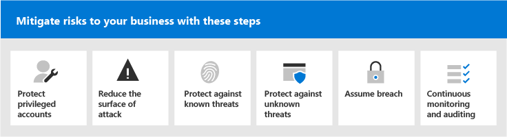

# Microsoft 365 Security for Business Decision Makers (BDMs)

In diesem Artikel werden einige der gängigsten Bedrohungs- und Angriffsszenarien behandelt, mit denen Organisationen derzeit für ihre Microsoft 365-Umgebungen konfrontiert sind, und empfohlene Maßnahmen zur Minderung dieser Risiken. Microsoft 365 verfügt zwar über eine breite Palette von vorkonfigurierten Sicherheitsfeatures, sie erfordert jedoch auch, dass Sie als Kunde die Verantwortung für die Sicherung Ihrer eigenen Identitäten, Daten und Geräte übernehmen, die für den Zugriff auf Clouddienste verwendet werden. Diese Anleitung wurde von Koseta Beam (Microsoft Cloud Security Architect) und Thiagaraj Sundararajan (Microsoft Senior Consultant) entwickelt.

Dieser Artikel ist nach Priorität der Arbeit organisiert, beginnend mit dem Schutz der Konten, die zum Verwalten der wichtigsten Dienste und Ressourcen verwendet werden, z. B. Ihren Mandanten, E-Mail und SharePoint. Es bietet eine methodische Möglichkeit, um sich der Sicherheit zu nähern, und arbeitet mit der folgenden Tabelle zusammen, damit Sie Ihren Fortschritt mit Beteiligten und Teams in Ihrer Organisation nachverfolgen können: [Microsoft 365 Security for BDMs spreadsheet](https://github.com/MicrosoftDocs/microsoft-365-docs/raw/public/microsoft-365/downloads/Microsoft-365-BDM-security-recommendations-spreadsheet.xlsx). 

Microsoft bietet Ihnen das Tool für die sichere Bewertung innerhalb Ihres Mandanten, um Ihre Sicherheitslage basierend auf Ihren regulären Aktivitäten automatisch zu analysieren, eine Bewertung zuzuordnen und Empfehlungen zur Verbesserung der Sicherheit zu geben. Bevor Sie die in diesem Artikel empfohlenen Aktionen ausführen, notieren Sie sich Ihre aktuelle Bewertung und Empfehlungen. Die in diesem Artikel empfohlenen Aktionen erhöhen Ihre Bewertung. Das Ziel ist nicht, die maximale Punktzahl zu erreichen, sondern die Möglichkeiten zum Schutz Ihrer Umgebung auf eine Weise zu nutzen, die sich nicht negativ auf die Produktivität ihrer Benutzer auswirken. Weitere [Informationen finden Sie unter Microsoft Secure Score](defender/microsoft-secure-score.md).

Noch eine Sache, bevor wir beginnen. . . Stellen Sie [sicher, dass Sie das Überwachungsprotokoll aktivieren.](../compliance/search-the-audit-log-in-security-and-compliance.md) Sie benötigen diese Daten später, wenn Sie einen Vorfall oder eine Verletzung untersuchen müssen. 

## Schützen privilegierter Konten

Als ersten Schritt wird empfohlen, dafür zu sorgen, dass kritische Konten in der Umgebung eine zusätzliche Schutzebene erhalten, da diese Konten über Zugriff und Berechtigungen zum Verwalten und Ändern kritischer Dienste und Ressourcen verfügen, die sich negativ auf die gesamte Organisation auswirken können, wenn sie gefährdet sind. Der Schutz privilegierter Konten ist eine der effektivsten Möglichkeiten zum Schutz vor einem Angreifer, der versucht, die Berechtigungen eines gefährdeten Kontos auf ein administratives Konto zu erhöhen. 

|Empfehlung  |E3 |E5  |
|---------|---------|---------|
|Erzwingen der mehrstufigen Authentifizierung (Multi-Factor Authentication, MFA) für alle Administratorkonten.||| 
|Implementieren Sie Azure Active Directory (Azure AD) Privileged Identity Management (PIM), um just-in-time privilegierten Zugriff auf Azure AD- und Azure-Ressourcen anzuwenden. Sie können auch ermitteln, wer Zugriff hat, und privilegierten Zugriff überprüfen.|         | |
|Implementieren Sie die Verwaltung des privilegierten Zugriffs, um die präzise Zugriffssteuerung über privilegierte Administratoraufgaben in Office 365 zu verwalten. |         | |
|Konfigurieren und Verwenden von Privileged Access Workstations (PAW) zum Verwalten von Diensten. Verwenden Sie nicht dieselben Arbeitsstationen, um im Internet zu surfen und E-Mails zu überprüfen, die nicht mit Ihrem Administratorkonto in Zusammenhang stehen.|  | | 

Das folgende Diagramm veranschaulicht diese Funktionen.

Weitere Empfehlungen:
- Stellen Sie sicher, dass Konten, die lokal synchronisiert werden, keine Administratorrollen für Clouddienste zugewiesen sind. Dadurch wird verhindert, dass ein Angreifer lokale Konten nutzt, um Administratorzugriff auf Clouddienste zu erhalten. 
- Stellen Sie sicher, dass Dienstkonten keine Administratorrollen zugewiesen sind. Diese Konten werden häufig nicht überwacht und mit Kennwörtern festgelegt, die nicht ablaufen. Stellen Sie zunächst sicher, dass die AADConnect- und ADFS-Dienstkonten standardmäßig keine globalen Administratoren sind.
- Entfernen von Lizenzen aus Administratorkonten. Wenn kein spezifischer Verwendungsfall zum Zuweisen von Lizenzen zu bestimmten Administratorkonten vor liegt, entfernen Sie Lizenzen aus diesen Konten. 

## Reduzieren der Angriffsfläche

Der nächste Fokusbereich besteht in der Reduzierung der Angriffsfläche. Dies kann mit minimalem Aufwand und Auswirkungen auf Ihre Benutzer und Dienste erreicht werden. Durch die Reduzierung der Angriffsfläche haben Angreifer weniger Möglichkeiten, einen Angriff auf Ihre Organisation zu starten.

Im Folgenden finden Sie einige Beispiele:
- Deaktivieren Sie POP3-, IMAP- und SMTP-Protokolle. Die meisten modernen Organisationen verwenden diese älteren Protokolle nicht mehr. Sie können diese sicher deaktivieren und Ausnahmen nur bei Bedarf zulassen. 
- Reduzieren und halten Sie die Anzahl der globalen Administratoren im Mandanten auf das absolute Minimum, das erforderlich ist. Dadurch wird die Angriffsfläche für alle Cloudanwendungen direkt reduziert. 
- Dient zum Zurückziehen von Servern und Anwendungen, die in Ihrer Umgebung nicht mehr verwendet werden. 
- Implementieren Sie einen Prozess zum Deaktivieren und Löschen von Konten, die nicht mehr verwendet werden. 

## Schutz vor bekannten Bedrohungen

Bekannte Bedrohungen sind Schadsoftware, gefährdete Konten und Phishing. Einige Schutzmaßnahmen gegen diese Bedrohungen können schnell implementiert werden, ohne direkte Auswirkungen auf Ihre Benutzer zu haben, während andere mehr Planung und Benutzerschulung erfordern. 

|Empfehlung  |E3  |E5  |
|---------|---------|---------|
|**Richten Sie die mehrstufige Authentifizierung ein, und verwenden Sie empfohlene Richtlinien** für bedingten Zugriff, einschließlich Anmelderisikorichtlinien. Microsoft empfiehlt und hat eine Reihe von Richtlinien getestet, die zum Schutz aller Cloud-Apps zusammenarbeiten, einschließlich Office 365- und Microsoft 365-Diensten. Weitere [Informationen finden Sie unter Identitäts- und Gerätezugriffskonfigurationen.](./office-365-security/microsoft-365-policies-configurations.md) | ||
|**Erfordern einer mehrstufigen Authentifizierung für alle Benutzer**. Wenn Sie nicht über die lizenzierungsanforderungen zum Implementieren der empfohlenen Richtlinien für bedingten Zugriff verfügen, ist mindestens eine mehrstufige Authentifizierung für alle Benutzer erforderlich.|||
|**Erhöhen des Schutzniveaus vor Schadsoftware in E-Mails**. Ihre Office 365- oder Microsoft 365-Umgebung umfasst Schutz vor Schadsoftware. Sie können diesen Schutz jedoch erhöhen, indem Sie Anlagen mit Dateitypen blockieren, die häufig für Schadsoftware verwendet werden.|||
|**Schützen Sie Ihre E-Mails vor gezielten Phishingangriffen.** Wenn Sie eine oder mehrere benutzerdefinierte Domänen für Ihre Office 365- oder Microsoft 365-Umgebung konfiguriert haben, können Sie gezielten Antiphishingschutz konfigurieren. Der Antiphishingschutz, der Teil von Defender for Office 365 ist, kann Ihre Organisation vor phishingbasierten Phishingangriffen und anderen Phishingangriffen durch böswilligen Identitätswechsel schützen. Wenn Sie keine benutzerdefinierte Domäne konfiguriert haben, müssen Sie dies nicht tun.| ||
|**Schützen sie sich vor Ransomware-Angriffen in E-Mails.** Ransomware nimmt den Zugriff auf Ihre Daten durch Verschlüsseln von Dateien oder Sperren von Computerbildschirmen. Anschließend versucht sie, Geld von Denkgeschädigten zu erpressen, indem sie "Lösegeld" fordert, in der Regel in Form von Kryptowährungen wie z. B. Bitcoin, im Gegenzug für die Rückgabe des Zugriffs auf Ihre Daten. Sie können gegen Ransomware schützen, indem Sie eine oder mehrere Nachrichtenflussregeln erstellen, um Dateierweiterungen zu blockieren, die häufig für Ransomware verwendet werden, oder um Benutzer zu warnen, die diese Anlagen in E-Mails erhalten.|||
|**Blockieren von Verbindungen aus Ländern, mit** denen Sie keine Geschäfte machen. Erstellen Sie eine Azure AD-Richtlinie für bedingten Zugriff, um Verbindungen aus diesen Ländern zu blockieren, wodurch effektiv eine Geofirewall um Ihren Mandanten herum erstellt wird.| ||

Das folgende Diagramm veranschaulicht diese Funktionen.

## Schutz vor unbekannten Bedrohungen

Nachdem Sie Ihren privilegierten Konten zusätzlichen Schutz hinzugefügt und vor bekannten Angriffen geschützt haben, sollten Sie ihre Aufmerksamkeit auf den Schutz vor unbekannten Bedrohungen enwenden. Die entschlosseneren und fortgeschritteneren Gegner verwenden innovative und neue, unbekannte Methoden, um Organisationen angreift. Mit den umfangreichen Telemetriedaten von Microsoft, die über Milliarden von Geräten, Anwendungen und Diensten gesammelt wurden, können wir Defender for Office 365 unter Windows, Office 365 und Azure ausführen, um Zero Day-Angriffe zu verhindern, Sandkastenumgebungen zu nutzen und die Gültigkeit zu überprüfen, bevor der Zugriff auf Ihre Inhalte ermöglicht wird. 

|Empfehlung  |E3  |E5  |
|---------|---------|---------|
|**Konfigurieren von Microsoft Defender für Office 365**: * Sichere Anlagen * Sichere Links * ATP für SharePoint, OneDrive und Microsoft Teams * Antiphishing in Defender for Office 365 Protection|         | |
|**Konfigurieren von Microsoft Defender for Endpoint-Funktionen:** * Windows Defender Antivirus  * Exploit-Schutz   * Reduzierung der Angriffsfläche   * Hardwarebasierte Isolation  * Kontrollierter Ordnerzugriff     |         | |
|**Verwenden Sie Microsoft Cloud App Security,** um SaaS-Apps zu ermitteln und mit der Verwendung von Verhaltensanalysen und Anomalieerkennung zu beginnen. |         | |

Das folgende Diagramm veranschaulicht diese Funktionen.

Weitere Empfehlungen:
- Sichere Partnerkanalkommunikation wie E-Mails mit TLS.
- Öffnen Sie den Teamverbund nur für Partner, mit dem Sie kommunizieren.
- Fügen Sie Ihrer Liste zugelassener E-Mails keine Absenderdomänen, einzelne Absender oder Quell-IPs hinzu, da diese Spam- und Schadsoftwareprüfungen umgehen können – Eine gängige Praxis bei Kunden ist das Hinzufügen ihrer eigenen akzeptierten Domänen oder einer Reihe anderer Domänen, bei denen E-Mail-Flussprobleme möglicherweise in der Liste zugelassener Domänen gemeldet wurden. Fügen Sie der Liste Spam- und Verbindungsfilter keine Domänen hinzu, da dadurch potenziell alle Spamprüfungen umgeht. 
- Ausgehende Spambenachrichtigungen aktivieren – Aktivieren Sie ausgehende Spambenachrichtigungen intern an eine Verteilerliste an das Helpdesk- oder IT-Administratorteam, um zu melden, ob interne Benutzer Spam-E-Mails extern senden. Dies kann ein Indikator dafür sein, dass das Konto gefährdet wurde.
- Remote PowerShell für alle Benutzer deaktivieren – Remote PowerShell wird hauptsächlich von Administratoren für den Zugriff auf Dienste für administrative Zwecke oder programmgesteuerten API-Zugriff verwendet. Es wird empfohlen, diese Option für Benutzer ohne Administratorrechte zu deaktivieren, um eine Aufklärung zu vermeiden, es sei denn, sie haben eine geschäftliche Anforderung, darauf zu zugreifen. 
- Blockieren des Zugriffs auf das Microsoft Azure-Verwaltungsportal für alle Nichtadministratoren. Sie können dies erreichen, indem Sie eine Regel für bedingten Zugriff erstellen, um alle Benutzer zu blockieren, mit Ausnahme von Administratoren. 

## Nehmen wir eine Verletzung an

Microsoft unternimmt zwar alle möglichen Maßnahmen, um Bedrohungen und Angriffen vorzubeugen, es wird jedoch empfohlen, immer unter der "Assume Breach"-Einstellung zu arbeiten. Auch wenn es einem Angreifer gelingt, in die Umgebung einzudringen, müssen wir sicherstellen, dass er keine Daten oder Identitätsinformationen aus der Umgebung ausfiltrieren kann. Aus diesem Grund wird empfohlen, den Schutz vor vertraulichen Datenlecks wie Sozialversicherungsnummern, Kreditkartennummern, zusätzlichen persönlichen Informationen und anderen vertraulichen Informationen auf Organisationsebene zu aktivieren. 

Die "Assume Breach"-Einstellung erfordert die Implementierung einer Netzwerkstrategie ohne Vertrauenswürdigkeit, was bedeutet, dass Benutzer nicht vollständig vertrauenswürdig sind, nur weil sie sich intern im Netzwerk befinden. Im Rahmen der Autorisierung der Benutzer können stattdessen Sätze von Bedingungen angegeben werden, und wenn diese Bedingungen erfüllt sind, werden bestimmte Steuerelemente erzwungen. Zu den Bedingungen können der Geräteintestatus, der Zugriff auf die Anwendung, ausgeführte Vorgänge und das Benutzerrisiko gehören. Beispielsweise sollte eine Geräteregistrierungsaktion immer die MFA-Authentifizierung auslösen, um sicherzustellen, dass Ihrer Umgebung keine nicht mehr verwendeten Geräte hinzugefügt werden. 

Eine Netzwerkstrategie ohne Vertrauenswürdigkeit erfordert außerdem, dass Sie wissen, wo Ihre Informationen gespeichert werden, und geeignete Steuerelemente für Klassifizierung, Schutz und Aufbewahrung anwenden. Um Ihre kritischsten und sensibelsten Ressourcen effektiv zu schützen, müssen Sie zuerst ermitteln, wo sich diese befinden, und Bestandsaufnahmen übernehmen, was eine Herausforderung darstellen kann. Als Nächstes arbeiten Sie mit Ihrer Organisation zusammen, um eine Steuerungsstrategie zu definieren. Das Definieren eines Klassifikationsschemas für eine Organisation und das Konfigurieren von Richtlinien, Bezeichnungen und Bedingungen erfordert eine sorgfältige Planung und Vorbereitung. Es ist wichtig zu wissen, dass dies kein IT-gesteuerter Prozess ist. Arbeiten Sie unbedingt mit Ihrem Rechts- und Complianceteam zusammen, um ein geeignetes Klassifizierungs- und Bezeichnungsschema für die Daten Ihrer Organisation zu entwickeln.

Mithilfe von Microsoft 365 Information Protection-Funktionen können Sie ermitteln, welche Informationen Sie haben, wo sie gespeichert sind und welche Informationen zusätzlichen Schutz erfordern. Der Informationsschutz ist ein kontinuierlicher Prozess, und Microsoft 365-Funktionen bieten Ihnen Einblick in die Verwendung und Verteilung vertraulicher Informationen durch Benutzer, wo Ihre Informationen derzeit gespeichert sind und wo sie fließen. Sie können auch sehen, wie Benutzer regulierte Informationen behandeln, um sicherzustellen, dass die entsprechenden Bezeichnungen und Schutzmaßnahmen angewendet werden.

|Empfehlung |E3|E5 |
|---------|---------|---------|
|**Überprüfen und optimieren Sie Ihren bedingten Zugriff und die** zugehörigen Richtlinien, um ihre Ziele für ein vertrauenswürdiges Netzwerk ohne Vertrauensstellung zu erfüllen. Der Schutz vor bekannten Bedrohungen umfasst die Implementierung einer Reihe [empfohlener Richtlinien.](./office-365-security/microsoft-365-policies-configurations.md) Überprüfen Sie Ihre Implementierung dieser Richtlinien, um sicherzustellen, dass Sie Ihre Apps und Daten vor Hackern schützen, die Zugriff auf Ihr Netzwerk erhalten haben. Beachten Sie, dass die empfohlene Intune-App-Schutzrichtlinie für Windows 10 Windows Information Protection (WIP) aktiviert. WIP schützt vor versehentlichen Lecks ihrer Organisationsdaten über Apps und Dienste, z. B. E-Mails, soziale Medien und die öffentliche Cloud. |         ||
|**Deaktivieren der externen E-Mail-Weiterleitung**. Hacker, die Zugriff auf das Postfach eines Benutzers erhalten, können Ihre E-Mails stehlen, indem sie das Postfach so festlegen, dass E-Mails automatisch weitergeleitet werden. Dies kann auch ohne das Bewusstsein des Benutzers geschehen. Sie können dies verhindern, indem Sie eine Nachrichtenflussregel konfigurieren.| ||
|**Deaktivieren der anonymen externen Kalenderfreigabe**. Standardmäßig ist die externe anonyme Kalenderfreigabe zulässig. [Deaktivieren sie die Kalenderfreigabe,](/exchange/sharing/sharing-policies/modify-a-sharing-policy) um potenzielle lecks an vertraulichen Informationen zu reduzieren.| ||
|**Konfigurieren von Richtlinien zur Verhinderung von Datenverlust für vertrauliche Daten**. Erstellen Sie eine Richtlinie zur Verhinderung von Datenverlust im Security Compliance Center, um vertrauliche Daten wie Kreditkartennummern, Sozialversicherungsnummern und Bankkontonummern zu ermitteln und &amp; zu schützen. Microsoft 365 enthält viele vordefinierte Typen vertraulicher Informationen, die Sie in Richtlinien zur Verhinderung von Datenverlust verwenden können. Sie können auch eigene Typen vertraulicher Informationen für vertrauliche Daten erstellen, die für Ihre Umgebung angepasst sind. |||
|**Implementieren von Datenklassifizierungs- und Informationsschutzrichtlinien**. Implementieren Sie Vertraulichkeitsbezeichnungen, und verwenden Sie diese, um vertrauliche Daten zu klassifizieren und zu schützen. Sie können diese Bezeichnungen auch in Richtlinien zur Verhinderung von Datenverlust verwenden. Wenn Sie Azure Information Protection-Bezeichnungen verwenden, wird empfohlen, das Erstellen neuer Bezeichnungen in anderen Admin Centern zu vermeiden.|         ||
|**Schützen von Daten in Apps und Diensten von Drittanbietern mithilfe von Cloud App Security**. Konfigurieren Sie Cloud App Security-Richtlinien, um vertrauliche Informationen in Cloud-Apps von Drittanbietern wie Salesforce, Box oder Dropbox zu schützen. Sie können Typen vertraulicher Informationen und die Vertraulichkeitsbezeichnungen verwenden, die Sie in Cloud App Security-Richtlinien erstellt haben, und diese auf Ihre SaaS-Apps anwenden.   Mit Microsoft Cloud App Security können Sie eine vielzahl von automatisierten Prozessen erzwingen. Richtlinien können so festgelegt werden, dass kontinuierliche Compliancescans, rechtliche eDiscovery-Aufgaben, DLP für öffentlich freigegebene vertrauliche Inhalte und mehr zur Verfügung stehen. Cloud App Security kann jeden Dateityp basierend auf mehr als 20 Metadatenfiltern überwachen (z. B. Zugriffsebene, Dateityp). |         ||
|**Verwenden [Sie Microsoft Defender for Endpoint,](/windows/security/threat-protection/microsoft-defender-atp/information-protection-in-windows-overview) um zu ermitteln, ob Benutzer vertrauliche Informationen auf ihren Windows-Geräten speichern.** |         ||
|**Verwenden [Sie AIP Scanner,](/azure/information-protection/deploy-aip-scanner) um Informationen über Server und Dateifreigaben hinweg zu identifizieren und zu klassifizieren.** Verwenden Sie das Tool für die AIP-Berichterstellung, um die Ergebnisse zu anzeigen und geeignete Aktionen zu ergreifen.|         ||

Das folgende Diagramm veranschaulicht diese Funktionen.

## Kontinuierliche Überwachung und Überwachung

Last, but not least ist die kontinuierliche Überwachung und Überwachung der Microsoft 365-Umgebung zusammen mit Windows und Geräten wichtig, um sicherzustellen, dass Sie Angriffe schnell erkennen und abwehren können. Tools wie Secure Score, Security Center und die erweiterte Analyse von Microsoft Intelligent Graph bieten wertvolle Informationen in Ihrem Mandanten und verknüpfen enorme Mengen an Bedrohungserkennungs- und Sicherheitsdaten, um Ihnen unvergleichlichen Schutz und Erkennung von Bedrohungen zu bieten.

|Empfehlung |E3 |E5 |
|---------|---------|---------|
|Stellen Sie **sicher, dass das Überwachungsprotokoll** aktiviert ist.|||
|**Wöchentliche Überprüfung** der Sicherheitsbewertung – Die sichere Bewertung ist ein zentraler Ort, um auf den Sicherheitsstatus Ihres Unternehmens zu zugreifen und Aktionen basierend auf Empfehlungen zur sicheren Bewertung zu ergreifen. Es wird empfohlen, diese Überprüfung wöchentlich durchzuführen.|||
|Verwenden **von Microsoft Defender für Office 365-Tools:** * Untersuchungs- und Reaktionsfunktionen für Bedrohungen  * Automatisierte Untersuchung und Reaktion |         ||
|Verwenden **von Microsoft Defender for Endpoint**:  *    [Endpunkterkennung und -antwort](/windows/security/threat-protection/microsoft-defender-atp/overview-endpoint-detection-response)   * Automatisierte Untersuchung und Behebung Sichere Bewertung  *    [Erweiterte Suche](/windows/security/threat-protection/microsoft-defender-atp/advanced-hunting-overview)  |         ||
|Verwenden **Sie Microsoft Cloud App Security,** um ungewöhnliches Verhalten über Cloud-Apps hinweg zu erkennen, um Ransomware, gefährdete Benutzer oder nicht autorisierte Anwendungen zu identifizieren, die Verwendung mit hohem Risiko zu analysieren und automatisch zu sanieren, um das Risiko für Ihre Organisation zu begrenzen.|         ||
|Verwenden **Sie Microsoft Azure Sentinel** oder Ihr aktuelles SIEM-Tool, um Bedrohungen in Ihrer Umgebung zu überwachen. |         ||
|**Bereitstellen [von Microsoft Defender for Identity](/azure-advanced-threat-protection/what-is-atp)** zum Überwachen und Schützen vor Bedrohungen, die auf Ihre lokale Active Directory-Umgebung ausgerichtet sind.   |         | |
|Verwenden Sie **Azure Defender** _, um Bedrohungen in Hybrid- und Cloudarbeitslasten zu überwachen. Azure Defender_ umfasst eine kostenlose Stufe von Funktionen und eine Standardebene von Funktionen, die basierend auf Ressourcenstunden oder Transaktionen bezahlt werden.|         |         |

Das folgende Diagramm veranschaulicht diese Funktionen.

Empfohlene Überwachungsaktionen:
- **Wöchentliche Überprüfung** der Microsoft Secure Score – Die Sicherheitsbewertung ist ein zentraler Ort, um auf den Sicherheitsstatus Ihres Mandanten zu zugreifen und Aktionen basierend auf den empfehlungen zu ergreifen. Es wird empfohlen, diese Überprüfung wöchentlich durchzuführen. Secure Score enthält Empfehlungen aus Azure AD, Intune, Cloud App Security und Microsoft Defender for Endpoint sowie Office 365. 
- **Wöchentliche Überprüfung** riskanter Anmeldungen – Verwenden Sie das Azure AD Admin Center, um riskante Anmeldungen wöchentlich zu überprüfen. Das empfohlene Identitäts- und Gerätezugriffsregelnet enthält eine Richtlinie zum Erzwingen der Kennwortänderung bei riskanter Anmeldung.  
- Wöchentliche Überprüfung der top malware **and phished users** – Verwenden Sie Microsoft Defender for Office 365 Threat Explorer, um die Topbenutzer zu überprüfen, die mit Schadsoftware und Phishing gezielt sind, und um die Ursache zu finden, warum diese Benutzer betroffen sind.