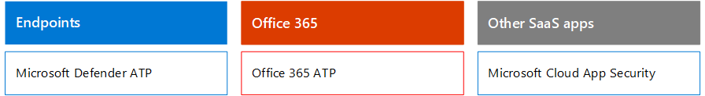

# Microsoft 365 Security for Business Decision Makers (BDMs)Microsoft 365 Security for Business Decision Makers (BDMs)

In diesem Artikel werden einige der gängigsten Bedrohungs- und Angriffsszenarien behandelt, mit denen Organisationen derzeit für ihre Microsoft 365-Umgebungen konfrontiert sind, und empfohlene Maßnahmen zur Minderung dieser Risiken.This article discusses some of the most common threat and attack scenarios currently faced by organizations for their Microsoft 365 environments, and recommended actions for mitigating these risks. Microsoft 365 verfügt zwar über eine breite Palette von vorkonfigurierten Sicherheitsfeatures, sie erfordert jedoch auch, dass Sie als Kunde die Verantwortung für die Sicherung Ihrer eigenen Identitäten, Daten und Geräte übernehmen, die für den Zugriff auf Clouddienste verwendet werden.While Microsoft 365 comes with a wide array of pre-configured security features, it also requires you as the customer to take responsibility to secure your own identities, data, and devices used to access cloud services. Diese Anleitung wurde von Koseta Beam (Microsoft Cloud Security Architect) und Thiagaraj Sundararajan (Microsoft Senior Consultant) entwickelt.This guidance was developed by Kozeta Beam (Microsoft Cloud Security Architect) and Thiagaraj Sundararajan (Microsoft Senior Consultant).

Dieser Artikel ist nach Priorität der Arbeit organisiert, beginnend mit dem Schutz der Konten, die zum Verwalten der wichtigsten Dienste und Ressourcen verwendet werden, z. B. Ihren Mandanten, E-Mail und SharePoint.This article is organized by priority of work, starting with protecting those accounts used to administer the most critical services and assets, such as your tenant, e-mail, and SharePoint. Es bietet eine methodische Möglichkeit, um sich der Sicherheit zu nähern, und arbeitet mit der folgenden Tabelle zusammen, damit Sie Ihren Fortschritt mit Beteiligten und Teams in Ihrer Organisation nachverfolgen können: [Microsoft 365 Security for BDMs spreadsheet](https://github.com/MicrosoftDocs/microsoft-365-docs/raw/public/microsoft-365/downloads/Microsoft-365-BDM-security-recommendations-spreadsheet.xlsx).It  provides a methodical way for approaching security and works together with the following spreadsheet so you can track your progress with stakeholders and teams across your organization: [Microsoft 365 security for BDMs spreadsheet](https://github.com/MicrosoftDocs/microsoft-365-docs/raw/public/microsoft-365/downloads/Microsoft-365-BDM-security-recommendations-spreadsheet.xlsx). 

Microsoft bietet Ihnen das Tool für die sichere Bewertung innerhalb Ihres Mandanten, um Ihre Sicherheitslage basierend auf Ihren regulären Aktivitäten automatisch zu analysieren, eine Bewertung zuzuordnen und Empfehlungen zur Verbesserung der Sicherheit zu geben.Microsoft provides you with the Secure Score tool within your tenant to automatically analyze your security posture based on your regular activities, assign a score, and provide security improvement recommendations. Bevor Sie die in diesem Artikel empfohlenen Aktionen ausführen, notieren Sie sich Ihre aktuelle Bewertung und Empfehlungen.Before taking the actions recommended in this article, take note of your current score and recommendations. Die in diesem Artikel empfohlenen Aktionen erhöhen Ihre Bewertung.The actions recommended in this article will increase your score. Das Ziel ist nicht, die maximale Punktzahl zu erreichen, sondern die Möglichkeiten zum Schutz Ihrer Umgebung auf eine Weise zu nutzen, die sich nicht negativ auf die Produktivität ihrer Benutzer auswirken.The goal is not to achieve the max score, but to be aware of opportunities to protect your environment in a way that do not negatively affect productivity for your users. Weitere [Informationen finden Sie unter Microsoft Secure Score](defender/microsoft-secure-score.md).See [Microsoft Secure Score](defender/microsoft-secure-score.md).

Noch eine Sache, bevor wir beginnen.One more thing before we get started . .. .. Stellen Sie [sicher, dass Sie das Überwachungsprotokoll aktivieren.](../compliance/search-the-audit-log-in-security-and-compliance.md)be sure to [turn on the audit log](../compliance/search-the-audit-log-in-security-and-compliance.md). Sie benötigen diese Daten später, wenn Sie einen Vorfall oder eine Verletzung untersuchen müssen.You'll need this data later, in the event you need to investigate an incident or a breach. 

## Schützen privilegierter KontenProtect privileged accounts

Als ersten Schritt wird empfohlen, dafür zu sorgen, dass kritische Konten in der Umgebung eine zusätzliche Schutzebene erhalten, da diese Konten über Zugriff und Berechtigungen zum Verwalten und Ändern kritischer Dienste und Ressourcen verfügen, die sich negativ auf die gesamte Organisation auswirken können, wenn sie gefährdet sind.As a first step, we recommend ensuring critical accounts in the environment are given an extra layer of protection as these accounts have access and permissions to manage and alter critical services and resources which can negatively impact the entire organization, if compromised. Der Schutz privilegierter Konten ist eine der effektivsten Möglichkeiten zum Schutz vor einem Angreifer, der versucht, die Berechtigungen eines gefährdeten Kontos auf ein administratives Konto zu erhöhen.Protecting privileged accounts is one of the most effective ways to protect against an attacker who seeks to elevate the permissions of a compromised account to an administrative one. 

|EmpfehlungRecommendation  |E3E3 |E5E5  |
|---------|---------|---------|
|Erzwingen der mehrstufigen Authentifizierung (Multi-Factor Authentication, MFA) für alle Administratorkonten.Enforce multi-factor authentication (MFA) for all administrative accounts.||| 
|Implementieren Sie Azure Active Directory (Azure AD) Privileged Identity Management (PIM), um just-in-time privilegierten Zugriff auf Azure AD- und Azure-Ressourcen anzuwenden.Implement Azure Active Directory (Azure AD) Privileged Identity Management (PIM) to apply just-in-time privileged access to Azure AD and Azure resources. Sie können auch ermitteln, wer Zugriff hat, und privilegierten Zugriff überprüfen.You can also discover who has access and review privileged access.|         | |
|Implementieren Sie die Verwaltung des privilegierten Zugriffs, um die präzise Zugriffssteuerung über privilegierte Administratoraufgaben in Office 365 zu verwalten.Implement privileged access management to manage granular access control over privileged admin tasks in Office 365. |         | |
|Konfigurieren und Verwenden von Privileged Access Workstations (PAW) zum Verwalten von Diensten.Configure and use Privileged Access Workstations (PAW) to administer services. Verwenden Sie nicht dieselben Arbeitsstationen, um im Internet zu surfen und E-Mails zu überprüfen, die nicht mit Ihrem Administratorkonto in Zusammenhang stehen.Do not use the same workstations for browsing the Internet and checking email not related to your administrative account.|  | | 

Das folgende Diagramm veranschaulicht diese Funktionen.The following diagram illustrates these capabilities.

Weitere Empfehlungen:Additional recommendations:
- Stellen Sie sicher, dass Konten, die lokal synchronisiert werden, keine Administratorrollen für Clouddienste zugewiesen sind.Ensure accounts that are synchronized from on-premises are not assigned admin roles for cloud services. Dadurch wird verhindert, dass ein Angreifer lokale Konten nutzt, um Administratorzugriff auf Clouddienste zu erhalten.This helps prevent an attacker from leveraging on-premises accounts to gain administrative access to cloud services. 
- Stellen Sie sicher, dass Dienstkonten keine Administratorrollen zugewiesen sind.Ensure service accounts are not assigned admin roles. Diese Konten werden häufig nicht überwacht und mit Kennwörtern festgelegt, die nicht ablaufen.These accounts are often not monitored and set with passwords that do not expire. Stellen Sie zunächst sicher, dass die AADConnect- und ADFS-Dienstkonten standardmäßig keine globalen Administratoren sind.Start by ensuring the AADConnect and ADFS services accounts are not Global Admins by default.
- Entfernen von Lizenzen aus Administratorkonten.Remove licenses from admin accounts. Wenn kein spezifischer Verwendungsfall zum Zuweisen von Lizenzen zu bestimmten Administratorkonten vor liegt, entfernen Sie Lizenzen aus diesen Konten.Unless there is a specific use case to assign licenses to specific admin accounts, remove licenses from these accounts. 

## Reduzieren der AngriffsflächeReduce the surface of attack

Der nächste Fokusbereich besteht in der Reduzierung der Angriffsfläche.The next focus area is reducing the surface of attack. Dies kann mit minimalem Aufwand und Auswirkungen auf Ihre Benutzer und Dienste erreicht werden.This can be accomplished with minimal effort and impact to your users and services. Durch die Reduzierung der Angriffsfläche haben Angreifer weniger Möglichkeiten, einen Angriff auf Ihre Organisation zu starten.By reducing the surface area of attack, attackers have fewer ways to launch an attack against your organization.

Im Folgenden finden Sie einige Beispiele:Here are some examples:
- Deaktivieren Sie POP3-, IMAP- und SMTP-Protokolle.Disable POP3, IMAP, and SMTP protocols. Die meisten modernen Organisationen verwenden diese älteren Protokolle nicht mehr.Most modern organizations no longer use these older protocols. Sie können diese sicher deaktivieren und Ausnahmen nur bei Bedarf zulassen.You can safely disable these and allow exceptions only as needed. 
- Reduzieren und halten Sie die Anzahl der globalen Administratoren im Mandanten auf das absolute Minimum, das erforderlich ist.Reduce and keep the number of Global Admins in the tenant to the absolute minimum required. Dadurch wird die Angriffsfläche für alle Cloudanwendungen direkt reduziert.This directly reduces the surface area of attack for all Cloud applications. 
- Dient zum Zurückziehen von Servern und Anwendungen, die in Ihrer Umgebung nicht mehr verwendet werden.Retire servers and applications that are no longer used in your environment. 
- Implementieren Sie einen Prozess zum Deaktivieren und Löschen von Konten, die nicht mehr verwendet werden.Implement a process for disabling and deleting accounts that are no longer used. 

## Schutz vor bekannten BedrohungenProtect against known threats

Bekannte Bedrohungen sind Schadsoftware, gefährdete Konten und Phishing.Known threats include malware, compromised accounts, and phishing. Einige Schutzmaßnahmen gegen diese Bedrohungen können schnell implementiert werden, ohne direkte Auswirkungen auf Ihre Benutzer zu haben, während andere mehr Planung und Benutzerschulung erfordern.Some protections against these threats can be implemented quickly with no direct impact to your users, while others require more planning and user training. 

|EmpfehlungRecommendation  |E3E3  |E5E5  |
|---------|---------|---------|
|**Richten Sie die mehrstufige Authentifizierung ein, und verwenden Sie empfohlene Richtlinien** für bedingten Zugriff, einschließlich Anmelderisikorichtlinien.**Setup multi-factor authentication and use recommended conditional access policies, including sign-in risk policies**. Microsoft empfiehlt und hat eine Reihe von Richtlinien getestet, die zum Schutz aller Cloud-Apps zusammenarbeiten, einschließlich Office 365- und Microsoft 365-Diensten.Microsoft recommends and has tested a set of policies that work together to protect all cloud apps, including Office 365 and Microsoft 365 services. Weitere [Informationen finden Sie unter Identitäts- und Gerätezugriffskonfigurationen.](./office-365-security/microsoft-365-policies-configurations.md)See [Identity and device access configurations](./office-365-security/microsoft-365-policies-configurations.md). | ||
|**Erfordern einer mehrstufigen Authentifizierung für alle Benutzer**.**Require multi-factor authentication for all users**. Wenn Sie nicht über die lizenzierungsanforderungen zum Implementieren der empfohlenen Richtlinien für bedingten Zugriff verfügen, ist mindestens eine mehrstufige Authentifizierung für alle Benutzer erforderlich.If you don't have the licensing required to implement the recommended conditional access policies, at a minimum require multi-factor authentication for all users.|||
|**Erhöhen des Schutzniveaus vor Schadsoftware in E-Mails**.**Raise the level of protection against malware in mail**. Ihre Office 365- oder Microsoft 365-Umgebung umfasst Schutz vor Schadsoftware. Sie können diesen Schutz jedoch erhöhen, indem Sie Anlagen mit Dateitypen blockieren, die häufig für Schadsoftware verwendet werden.Your Office 365 or Microsoft 365 environment includes protection against malware, but you can increase this protection by blocking attachments with file types that are commonly used for malware.|||
|**Schützen Sie Ihre E-Mails vor gezielten Phishingangriffen.****Protect your email from targeted phishing attacks**. Wenn Sie eine oder mehrere benutzerdefinierte Domänen für Ihre Office 365- oder Microsoft 365-Umgebung konfiguriert haben, können Sie gezielten Antiphishingschutz konfigurieren.If you've configured one or more custom domains for your Office 365 or Microsoft 365 environment, you can configure targeted anti-phishing protection. Der Antiphishingschutz, der Teil von Defender for Office 365 ist, kann Ihre Organisation vor phishingbasierten Phishingangriffen und anderen Phishingangriffen durch böswilligen Identitätswechsel schützen.Anti-phishing protection, part of Defender for Office 365, can help protect your organization from malicious impersonation-based phishing attacks and other phishing attacks. Wenn Sie keine benutzerdefinierte Domäne konfiguriert haben, müssen Sie dies nicht tun.If you haven't configured a custom domain, you do not need to do this.| ||
|**Schützen sie sich vor Ransomware-Angriffen in E-Mails.****Protect against ransomware attacks in email**. Ransomware nimmt den Zugriff auf Ihre Daten durch Verschlüsseln von Dateien oder Sperren von Computerbildschirmen.Ransomware takes away access to your data by encrypting files or locking computer screens. Anschließend versucht sie, Geld von Denkgeschädigten zu erpressen, indem sie "Lösegeld" fordert, in der Regel in Form von Kryptowährungen wie z. B. Bitcoin, im Gegenzug für die Rückgabe des Zugriffs auf Ihre Daten.It then attempts to extort money from victims by asking for "ransom," usually in form of cryptocurrencies like Bitcoin, in exchange for returning access to your data. Sie können gegen Ransomware schützen, indem Sie eine oder mehrere Nachrichtenflussregeln erstellen, um Dateierweiterungen zu blockieren, die häufig für Ransomware verwendet werden, oder um Benutzer zu warnen, die diese Anlagen in E-Mails erhalten.You can help defend against ransomware by creating one or more mail flow rules to block file extensions that are commonly used for ransomware, or to warn users who receive these attachments in email.|||
|**Blockieren von Verbindungen aus Ländern, mit** denen Sie keine Geschäfte machen.**Block connections from countries that you don't do business with**. Erstellen Sie eine Azure AD-Richtlinie für bedingten Zugriff, um Verbindungen aus diesen Ländern zu blockieren, wodurch effektiv eine Geofirewall um Ihren Mandanten herum erstellt wird.Create an Azure AD conditional access policy to block any connections coming from these countries, effectively creating a geo firewall around your tenant.| ||

Das folgende Diagramm veranschaulicht diese Funktionen.The following diagram illustrates these capabilities.

## Schutz vor unbekannten BedrohungenProtect against unknown threats

Nachdem Sie Ihren privilegierten Konten zusätzlichen Schutz hinzugefügt und vor bekannten Angriffen geschützt haben, sollten Sie ihre Aufmerksamkeit auf den Schutz vor unbekannten Bedrohungen enwenden.After adding extra protections to your privileged accounts and protecting against known attacks, shift your attention to protecting against unknown threats. Die entschlosseneren und fortgeschritteneren Gegner verwenden innovative und neue, unbekannte Methoden, um Organisationen angreift.The more determined and advanced adversaries use innovative and new, unknown methods to attack organizations. Mit den umfangreichen Telemetriedaten von Microsoft, die über Milliarden von Geräten, Anwendungen und Diensten gesammelt wurden, können wir Defender for Office 365 unter Windows, Office 365 und Azure ausführen, um Zero Day-Angriffe zu verhindern, Sandkastenumgebungen zu nutzen und die Gültigkeit zu überprüfen, bevor der Zugriff auf Ihre Inhalte ermöglicht wird.With Microsoft's vast telemetry of data gathered over billions of devices, applications, and services, we are able to perform Defender for Office 365 on Windows, Office 365, and Azure to prevent against Zero Day attacks, utilizing sand box environments, and checking validity before allowing access to your content. 

|EmpfehlungRecommendation  |E3E3  |E5E5  |
|---------|---------|---------|
|**Konfigurieren von Microsoft Defender für Office 365**:**Configure Microsoft Defender for Office 365**: \* Sichere Anlagen\*    Safe Attachments \* Sichere Links\*    Safe Links \* ATP für SharePoint, OneDrive und Microsoft Teams\*    ATP for SharePoint, OneDrive, and Microsoft Teams \* Antiphishing in Defender for Office 365 Protection\*    Anti-phishing in Defender for Office 365 protection|         | |
|**Konfigurieren von Microsoft Defender for Endpoint-Funktionen:****Configure Microsoft Defender for Endpoint capabilities**: \* Windows Defender Antivirus\*    Windows Defender Antivirus  \* Exploit-Schutz\*    Exploit protection   \* Reduzierung der Angriffsfläche\*    Attack surface reduction   \* Hardwarebasierte Isolation\*    Hardware-based isolation  \* Kontrollierter Ordnerzugriff\*    Controlled folder access     |         | |
|**Verwenden Sie Microsoft Cloud App Security,** um SaaS-Apps zu ermitteln und mit der Verwendung von Verhaltensanalysen und Anomalieerkennung zu beginnen.**Use Microsoft Cloud App Security** to discover SaaS apps and begin to use behavior analytics and anomaly detection. |         | |

Das folgende Diagramm veranschaulicht diese Funktionen.The following diagram illustrates these capabilities.

Weitere Empfehlungen:Additional recommendations:
- Sichere Partnerkanalkommunikation wie E-Mails mit TLS.Secure partner channel communications like Emails using TLS.
- Öffnen Sie den Teamverbund nur für Partner, mit dem Sie kommunizieren.Open Teams Federation only to Partners you communicate with.
- Fügen Sie Ihrer Liste zugelassener E-Mails keine Absenderdomänen, einzelne Absender oder Quell-IPs hinzu, da diese Spam- und Schadsoftwareprüfungen umgehen können – Eine gängige Praxis bei Kunden ist das Hinzufügen ihrer eigenen akzeptierten Domänen oder einer Reihe anderer Domänen, bei denen E-Mail-Flussprobleme möglicherweise in der Liste zugelassener Domänen gemeldet wurden.Do not add sender domains, individual senders, or source IPs to your allow list as this allows these to bypass spam and malware checks — A common practice with customers is adding their own accepted domains or a number of other domains where email flow issues may have been reported to the allow list. Fügen Sie der Liste Spam- und Verbindungsfilter keine Domänen hinzu, da dadurch potenziell alle Spamprüfungen umgeht.Do not add domains in the Spam and Connection Filtering list as this potentially bypasses all spam checks. 
- Ausgehende Spambenachrichtigungen aktivieren – Aktivieren Sie ausgehende Spambenachrichtigungen intern an eine Verteilerliste an das Helpdesk- oder IT-Administratorteam, um zu melden, ob interne Benutzer Spam-E-Mails extern senden.Enable outbound spam notifications — Enable outbound spam notifications to a distribution list internally to the Helpdesk or IT Admin team to report if any of the internal users are sending out Spam emails externally. Dies kann ein Indikator dafür sein, dass das Konto gefährdet wurde.This could be an indicator that the account has been compromised.
- Remote PowerShell für alle Benutzer deaktivieren – Remote PowerShell wird hauptsächlich von Administratoren für den Zugriff auf Dienste für administrative Zwecke oder programmgesteuerten API-Zugriff verwendet.Disable Remote PowerShell for all users — Remote PowerShell is mainly used by Admins to access services for administrative purposes or programmatic API access. Es wird empfohlen, diese Option für Benutzer ohne Administratorrechte zu deaktivieren, um eine Aufklärung zu vermeiden, es sei denn, sie haben eine geschäftliche Anforderung, darauf zu zugreifen.We recommended disabling this option for non-Admin users to avoid reconnaissance unless they have a business requirement to access it. 
- Blockieren des Zugriffs auf das Microsoft Azure-Verwaltungsportal für alle Nichtadministratoren.Block access to the Microsoft Azure Management portal to all non-administrators. Sie können dies erreichen, indem Sie eine Regel für bedingten Zugriff erstellen, um alle Benutzer zu blockieren, mit Ausnahme von Administratoren.You can accomplish this by creating a conditional access rule to block all users, with the exception of admins. 

## Nehmen wir eine Verletzung anAssume breach

Microsoft unternimmt zwar alle möglichen Maßnahmen, um Bedrohungen und Angriffen vorzubeugen, es wird jedoch empfohlen, immer unter der "Assume Breach"-Einstellung zu arbeiten.While Microsoft takes every possible measure to prevent against threats and attacks, we recommend always working under the "Assume Breach" mindset. Auch wenn es einem Angreifer gelingt, in die Umgebung einzudringen, müssen wir sicherstellen, dass er keine Daten oder Identitätsinformationen aus der Umgebung ausfiltrieren kann.Even if an Attacker has managed to intrude into the environment, we need to make sure they are unable to exfiltrate data or identity information from the environment. Aus diesem Grund wird empfohlen, den Schutz vor vertraulichen Datenlecks wie Sozialversicherungsnummern, Kreditkartennummern, zusätzlichen persönlichen Informationen und anderen vertraulichen Informationen auf Organisationsebene zu aktivieren.For this reason, we recommend enabling protection against sensitive data leaks such as Social Security numbers, credit cards numbers, additional personal information, and other organizational level confidential information. 

Die "Assume Breach"-Einstellung erfordert die Implementierung einer Netzwerkstrategie ohne Vertrauenswürdigkeit, was bedeutet, dass Benutzer nicht vollständig vertrauenswürdig sind, nur weil sie sich intern im Netzwerk befinden.The "Assume Breach" mindset requires implementing a zero trust network strategy, which means users are not fully trusted just because they are internal to the network. Im Rahmen der Autorisierung der Benutzer können stattdessen Sätze von Bedingungen angegeben werden, und wenn diese Bedingungen erfüllt sind, werden bestimmte Steuerelemente erzwungen.Instead, as part of authorization of what users can do, sets of conditions are specified, and when such conditions are met, certain controls are enforced. Zu den Bedingungen können der Geräteintestatus, der Zugriff auf die Anwendung, ausgeführte Vorgänge und das Benutzerrisiko gehören.Conditions may include device health status, application being accessed, operations being performed and user risk. Beispielsweise sollte eine Geräteregistrierungsaktion immer die MFA-Authentifizierung auslösen, um sicherzustellen, dass Ihrer Umgebung keine nicht mehr verwendeten Geräte hinzugefügt werden.For example, a device enrollment action should always trigger MFA authentication to ensure no rouge devices are added to your environment. 

Eine Netzwerkstrategie ohne Vertrauenswürdigkeit erfordert außerdem, dass Sie wissen, wo Ihre Informationen gespeichert werden, und geeignete Steuerelemente für Klassifizierung, Schutz und Aufbewahrung anwenden.A zero trust network strategy also requires that you know where your information is stored and apply appropriate controls for classification, protection, and retention. Um Ihre kritischsten und sensibelsten Ressourcen effektiv zu schützen, müssen Sie zuerst ermitteln, wo sich diese befinden, und Bestandsaufnahmen übernehmen, was eine Herausforderung darstellen kann.To effectively protect your most critical and sensitive assets you need to first identify where these are located and take inventory, which can be challenging. Als Nächstes arbeiten Sie mit Ihrer Organisation zusammen, um eine Steuerungsstrategie zu definieren.Next, work with your organization to define a governance strategy. Das Definieren eines Klassifikationsschemas für eine Organisation und das Konfigurieren von Richtlinien, Bezeichnungen und Bedingungen erfordert eine sorgfältige Planung und Vorbereitung.Defining a classification schema for an organization and configuring policies, labels, and conditions requires careful planning and preparation. Es ist wichtig zu wissen, dass dies kein IT-gesteuerter Prozess ist.It is important to realize that this is not an IT driven process. Arbeiten Sie unbedingt mit Ihrem Rechts- und Complianceteam zusammen, um ein geeignetes Klassifizierungs- und Bezeichnungsschema für die Daten Ihrer Organisation zu entwickeln.Be sure to work with your legal and compliance team to develop an appropriate classification and labeling schema for your organization's data.

Mithilfe von Microsoft 365 Information Protection-Funktionen können Sie ermitteln, welche Informationen Sie haben, wo sie gespeichert sind und welche Informationen zusätzlichen Schutz erfordern.Microsoft 365 information protection capabilities can help you discover what information you have, where it is stored, and which information requires additional protection. Der Informationsschutz ist ein kontinuierlicher Prozess, und Microsoft 365-Funktionen bieten Ihnen Einblick in die Verwendung und Verteilung vertraulicher Informationen durch Benutzer, wo Ihre Informationen derzeit gespeichert sind und wo sie fließen.Information protection is a continuous process and Microsoft 365 capabilities provide you with visibility into how users are using and distributing sensitive information, where your information is currently stored, and where it flows. Sie können auch sehen, wie Benutzer regulierte Informationen behandeln, um sicherzustellen, dass die entsprechenden Bezeichnungen und Schutzmaßnahmen angewendet werden.You can also see how users handling information that is regulated to be sure the appropriate labels and protections are applied.

|EmpfehlungRecommendation |E3E3|E5E5 |
|---------|---------|---------|
|**Überprüfen und optimieren Sie Ihren bedingten Zugriff und die** zugehörigen Richtlinien, um ihre Ziele für ein vertrauenswürdiges Netzwerk ohne Vertrauensstellung zu erfüllen.**Review and optimize your conditional access and related policies to align with your objectives for a zero trust network**. Der Schutz vor bekannten Bedrohungen umfasst die Implementierung einer Reihe [empfohlener Richtlinien.](./office-365-security/microsoft-365-policies-configurations.md)Protecting against known threats includes implementing a set of [recommended policies](./office-365-security/microsoft-365-policies-configurations.md). Überprüfen Sie Ihre Implementierung dieser Richtlinien, um sicherzustellen, dass Sie Ihre Apps und Daten vor Hackern schützen, die Zugriff auf Ihr Netzwerk erhalten haben.Review your implementation of these policies to ensure you're protecting your apps and data against hackers who have gained access to your network. Beachten Sie, dass die empfohlene Intune-App-Schutzrichtlinie für Windows 10 Windows Information Protection (WIP) aktiviert.Note that the recommended Intune app protection policy for Windows 10 enables Windows Information Protection (WIP). WIP schützt vor versehentlichen Lecks ihrer Organisationsdaten über Apps und Dienste, z. B. E-Mails, soziale Medien und die öffentliche Cloud.WIP protects against accidental leaks of your organization data through apps and services, like email, social media, and the public cloud. |         ||
|**Deaktivieren der externen E-Mail-Weiterleitung**.**Disable external email forwarding**. Hacker, die Zugriff auf das Postfach eines Benutzers erhalten, können Ihre E-Mails stehlen, indem sie das Postfach so festlegen, dass E-Mails automatisch weitergeleitet werden.Hackers who gain access to a user's mailbox can steal your mail by setting the mailbox to automatically forward email. Dies kann auch ohne das Bewusstsein des Benutzers geschehen.This can happen even without the user's awareness. Sie können dies verhindern, indem Sie eine Nachrichtenflussregel konfigurieren.You can prevent this from happening by configuring a mail flow rule.| ||
|**Deaktivieren der anonymen externen Kalenderfreigabe**.**Disable anonymous external calendar sharing**. Standardmäßig ist die externe anonyme Kalenderfreigabe zulässig.By default external anonymous calendar sharing is allowed. [Deaktivieren sie die Kalenderfreigabe,](/exchange/sharing/sharing-policies/modify-a-sharing-policy) um potenzielle lecks an vertraulichen Informationen zu reduzieren.[Disable calendar sharing](/exchange/sharing/sharing-policies/modify-a-sharing-policy) to reduce potential leaks of sensitive information.| ||
|**Konfigurieren von Richtlinien zur Verhinderung von Datenverlust für vertrauliche Daten**.**Configure data loss prevention policies for sensitive data**. Erstellen Sie eine Richtlinie zur Verhinderung von Datenverlust im Security Compliance Center, um vertrauliche Daten wie Kreditkartennummern, Sozialversicherungsnummern und Bankkontonummern zu ermitteln und &amp; zu schützen.Create a Data Loss Prevention Policy in the Security &amp; Compliance center to discover and protect sensitive data such as credit card numbers, Social Security numbers and bank account numbers. Microsoft 365 enthält viele vordefinierte Typen vertraulicher Informationen, die Sie in Richtlinien zur Verhinderung von Datenverlust verwenden können.Microsoft 365 includes many predefined sensitive information types you can use in data loss prevention policies. Sie können auch eigene Typen vertraulicher Informationen für vertrauliche Daten erstellen, die für Ihre Umgebung angepasst sind.You can also create your own sensitive information types for sensitive data that is custom to your environment. |||
|**Implementieren von Datenklassifizierungs- und Informationsschutzrichtlinien**.**Implement data classification and information protection policies**. Implementieren Sie Vertraulichkeitsbezeichnungen, und verwenden Sie diese, um vertrauliche Daten zu klassifizieren und zu schützen.Implement sensitivity labels and use these to classify and apply protection to sensitive data. Sie können diese Bezeichnungen auch in Richtlinien zur Verhinderung von Datenverlust verwenden.You can also use these labels in data loss prevention policies. Wenn Sie Azure Information Protection-Bezeichnungen verwenden, wird empfohlen, das Erstellen neuer Bezeichnungen in anderen Admin Centern zu vermeiden.If you are using Azure Information Protection labels, we recommend that you avoid creating new labels in other admin centers.|         ||
|**Schützen von Daten in Apps und Diensten von Drittanbietern mithilfe von Cloud App Security**.**Protect data in third-party apps and services by using Cloud App Security**. Konfigurieren Sie Cloud App Security-Richtlinien, um vertrauliche Informationen in Cloud-Apps von Drittanbietern wie Salesforce, Box oder Dropbox zu schützen.Configure Cloud App Security policies to protect sensitive information across third-party cloud apps, such as Salesforce, Box, or Dropbox. Sie können Typen vertraulicher Informationen und die Vertraulichkeitsbezeichnungen verwenden, die Sie in Cloud App Security-Richtlinien erstellt haben, und diese auf Ihre SaaS-Apps anwenden.You can use sensitive information types and the sensitivity labels you created in Cloud App Security policies and apply these across your SaaS apps.   Mit Microsoft Cloud App Security können Sie eine vielzahl von automatisierten Prozessen erzwingen.Microsoft Cloud App Security allow you to enforce a wide range of automated processes. Richtlinien können so festgelegt werden, dass kontinuierliche Compliancescans, rechtliche eDiscovery-Aufgaben, DLP für öffentlich freigegebene vertrauliche Inhalte und mehr zur Verfügung stehen.Policies can be set to provide continuous compliance scans, legal eDiscovery tasks, DLP for sensitive content shared publicly, and more. Cloud App Security kann jeden Dateityp basierend auf mehr als 20 Metadatenfiltern überwachen (z. B. Zugriffsebene, Dateityp).Cloud App Security can monitor any file type based on more than 20 metadata filters (for example, access level, file type). |         ||
|**Verwenden [Sie Microsoft Defender for Endpoint,](/windows/security/threat-protection/microsoft-defender-atp/information-protection-in-windows-overview) um zu ermitteln, ob Benutzer vertrauliche Informationen auf ihren Windows-Geräten speichern.****Use [Microsoft  Defender for Endpoint](/windows/security/threat-protection/microsoft-defender-atp/information-protection-in-windows-overview) to identify if users store sensitive information on their Windows devices**. |         ||
|**Verwenden [Sie AIP Scanner,](/azure/information-protection/deploy-aip-scanner) um Informationen über Server und Dateifreigaben hinweg zu identifizieren und zu klassifizieren.****Use [AIP Scanner](/azure/information-protection/deploy-aip-scanner) to identify and classify information across servers and file shares**. Verwenden Sie das Tool für die AIP-Berichterstellung, um die Ergebnisse zu anzeigen und geeignete Aktionen zu ergreifen.Use the AIP reporting tool to view the results and take appropriate actions.|         ||

Das folgende Diagramm veranschaulicht diese Funktionen.The following diagram illustrates these capabilities.

## Kontinuierliche Überwachung und ÜberwachungContinuous monitoring and auditing

Last, but not least ist die kontinuierliche Überwachung und Überwachung der Microsoft 365-Umgebung zusammen mit Windows und Geräten wichtig, um sicherzustellen, dass Sie Angriffe schnell erkennen und abwehren können.Last, but not least Continuous Monitoring and Auditing of the Microsoft 365 environment along with the Windows and Devices is critical to making sure you are able to quickly detect and remediate any intrusions. Tools wie Secure Score, Security Center und die erweiterte Analyse von Microsoft Intelligent Graph bieten wertvolle Informationen in Ihrem Mandanten und verknüpfen enorme Mengen an Bedrohungserkennungs- und Sicherheitsdaten, um Ihnen unvergleichlichen Schutz und Erkennung von Bedrohungen zu bieten.Tools such as Secure Score, Security Center, and Microsoft Intelligent Graph's advanced analytics provide invaluable information into your tenant and link massive amounts of threat intelligence and security data to provide you unparalleled threat protection and detection.

|EmpfehlungRecommendation |E3E3 |E5E5 |
|---------|---------|---------|
|Stellen Sie **sicher, dass das Überwachungsprotokoll** aktiviert ist.Ensure the **audit log** is turned on.|||
|**Wöchentliche Überprüfung** der Sicherheitsbewertung – Die sichere Bewertung ist ein zentraler Ort, um auf den Sicherheitsstatus Ihres Unternehmens zu zugreifen und Aktionen basierend auf Empfehlungen zur sicheren Bewertung zu ergreifen.**Review Secure Score weekly** — Secure score is a central location to access the Security status of your company and take actions based on Secure score recommendations. Es wird empfohlen, diese Überprüfung wöchentlich durchzuführen.It is recommended to perform this check weekly.|||
|Verwenden **von Microsoft Defender für Office 365-Tools:**Use **Microsoft Defender for Office 365** tools: \* Untersuchungs- und Reaktionsfunktionen für Bedrohungen\*    Threat investigation and response capabilities  \* Automatisierte Untersuchung und Reaktion\*    Automated investigation and response |         ||
|Verwenden **von Microsoft Defender for Endpoint**:Use **Microsoft  Defender for Endpoint**:  \*    [Endpunkterkennung und -antwort](/windows/security/threat-protection/microsoft-defender-atp/overview-endpoint-detection-response)\*    [Endpoint detection and response](/windows/security/threat-protection/microsoft-defender-atp/overview-endpoint-detection-response)   \* Automatisierte Untersuchung und Behebung Sichere Bewertung\*    Automated investigation and remediation Secure score  \*    [Erweiterte Suche](/windows/security/threat-protection/microsoft-defender-atp/advanced-hunting-overview)\*    [Advanced hunting](/windows/security/threat-protection/microsoft-defender-atp/advanced-hunting-overview)  |         ||
|Verwenden **Sie Microsoft Cloud App Security,** um ungewöhnliches Verhalten über Cloud-Apps hinweg zu erkennen, um Ransomware, gefährdete Benutzer oder nicht autorisierte Anwendungen zu identifizieren, die Verwendung mit hohem Risiko zu analysieren und automatisch zu sanieren, um das Risiko für Ihre Organisation zu begrenzen.Use **Microsoft Cloud App Security** to detect unusual behavior across cloud apps to identify ransomware, compromised users or rogue applications, analyze high-risk usage and remediate automatically to limit the risk to your organization.|         ||
|Verwenden **Sie Microsoft Azure Sentinel** oder Ihr aktuelles SIEM-Tool, um Bedrohungen in Ihrer Umgebung zu überwachen.Use **Microsoft Azure Sentinel** or your current SIEM tool to monitor for threats across your environment. |         ||
|**Bereitstellen [von Microsoft Defender for Identity](/azure-advanced-threat-protection/what-is-atp)** zum Überwachen und Schützen vor Bedrohungen, die auf Ihre lokale Active Directory-Umgebung ausgerichtet sind.**Deploy [Microsoft Defender for Identity](/azure-advanced-threat-protection/what-is-atp)** to monitor and protect against threats targeted to your on-premises Active Directory environment.   |         | |
|Verwenden Sie **Azure Defender** _, um Bedrohungen in Hybrid- und Cloudarbeitslasten zu überwachen.Use the **Azure Defender** _ to monitor for threats across hybrid and cloud workloads. Azure Defender_ umfasst eine kostenlose Stufe von Funktionen und eine Standardebene von Funktionen, die basierend auf Ressourcenstunden oder Transaktionen bezahlt werden.Azure Defender_ includes a free tier of capabilities and a standard tier of capabilities that are paid for based on resource hours or transactions.|         |         |

Das folgende Diagramm veranschaulicht diese Funktionen.The following diagram illustrates these capabilities.

Empfohlene Überwachungsaktionen:Top recommended monitoring actions:
- **Wöchentliche Überprüfung** der Microsoft Secure Score – Die Sicherheitsbewertung ist ein zentraler Ort, um auf den Sicherheitsstatus Ihres Mandanten zu zugreifen und Aktionen basierend auf den empfehlungen zu ergreifen.**Review Microsoft Secure Score weekly** — Secure score is a central location to access the security status of your tenant and to take actions based on top recommendations. Es wird empfohlen, diese Überprüfung wöchentlich durchzuführen.It is recommended to perform this check weekly. Secure Score enthält Empfehlungen aus Azure AD, Intune, Cloud App Security und Microsoft Defender for Endpoint sowie Office 365.Secure Score includes recommendations from across Azure AD, Intune, Cloud App Security, and Microsoft Defender for Endpoint, as well as Office 365. 
- **Wöchentliche Überprüfung** riskanter Anmeldungen – Verwenden Sie das Azure AD Admin Center, um riskante Anmeldungen wöchentlich zu überprüfen.**Review risky logins weekly** — Use the Azure AD admin center to review risky sign-ins weekly. Das empfohlene Identitäts- und Gerätezugriffsregelnet enthält eine Richtlinie zum Erzwingen der Kennwortänderung bei riskanter Anmeldung.The recommended identity and device access ruleset includes a policy to enforce password change on risky sign-ins.  
- Wöchentliche Überprüfung der top malware **and phished users** – Verwenden Sie Microsoft Defender for Office 365 Threat Explorer, um die Topbenutzer zu überprüfen, die mit Schadsoftware und Phishing gezielt sind, und um die Ursache zu finden, warum diese Benutzer betroffen sind.**Review top malware and phished users weekly** — Use Microsoft Defender for Office 365 Threat Explorer to review top users targeted with malware and phish and to find out the root cause of why these users are affected.