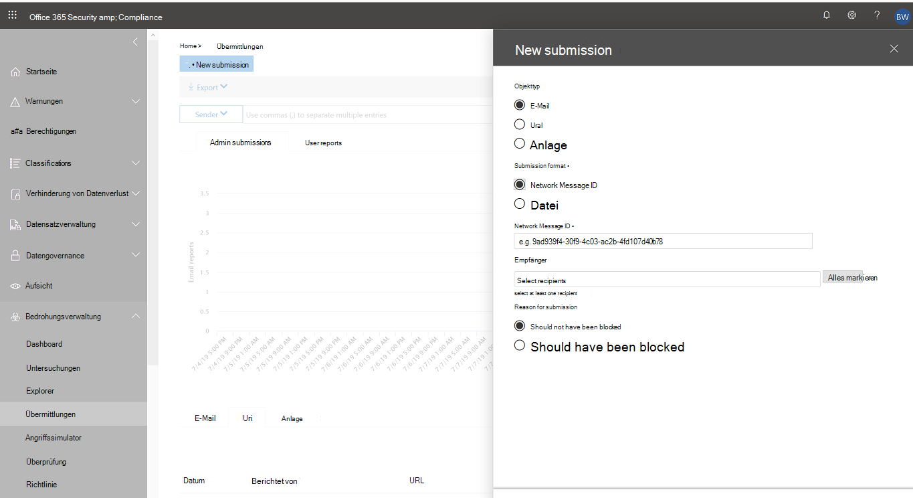
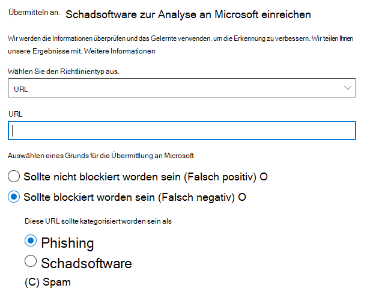

# Verwenden von Administrator-Übermittlung, um verdächtige Spam- oder Phishing-Nachrichten, URLs und Dateien an Microsoft zu übermittelnUse Admin Submission to submit suspected spam, phish, URLs, and files to Microsoft

[!INCLUDE [Microsoft 365 Defender rebranding](../includes/microsoft-defender-for-office.md)]

**Gilt für****Applies to**
- [Exchange Online ProtectionExchange Online Protection](exchange-online-protection-overview.md)
- [Microsoft Defender für Office 365 Plan 1 und Plan 2Microsoft Defender for Office 365 plan 1 and plan 2](defender-for-office-365.md)

In Microsoft 365-Organisationen mit Postfächern in Exchange Online können Administratoren das Übermittlungsportal im Security & Compliance Center verwenden, um E-Mail-Nachrichten, URLs und Anlagen zur Überprüfung an Microsoft zu übermitteln.In Microsoft 365 organizations with mailboxes in Exchange Online, admins can use the Submissions portal in the Security & Compliance Center to submit email messages, URLs, and attachments to Microsoft for scanning.

Wenn Sie eine E-Mail-Nachricht übermitteln, erhalten Sie:When you submit an email message, you will get:

1. **E-Mail-Authentifizierungsprüfung:** Details dazu, ob die E-Mail-Authentifizierung bei der Zugestellten bestanden oder fehlgeschlagen ist.**Email authentication check**: Details on whether email authentication passed or failed when it was delivered.
2. **Richtlinientreffer**: Informationen zu allen Richtlinien, die die eingehenden E-Mails möglicherweise in Ihrem Mandanten zugelassen oder blockiert haben, und überschreiben unsere Dienstfilter-Urteile.**Policy hits**: Information about any policies that may have allowed or blocked the incoming email into your tenant, overriding our service filter verdicts.
3. **Nutzlast reputation/detonation**: Prüfung aller URLs und Anlagen in der Nachricht.**Payload reputation/detonation**: Examination of any URLs and attachments in the message.
4. **Analyse der** Benotung: Überprüfen Sie, ob Nachrichten bösartig sind oder nicht.**Grader analysis**: Review done by human graders in order to confirm whether or not messages are malicious.

> [!IMPORTANT]
> Die Nutzlastre reputation/detonation und grader analysis werden nicht in allen Mandanten durchgeführt.Payload reputation/detonation and grader analysis are not done in all tenants. Es wird verhindert, dass Informationen außerhalb der Organisation bleiben, wenn Daten die Mandantengrenze nicht aus Compliancegründen verlassen sollen.Information is blocked from going outside the organization when data is not supposed to leave the tenant boundary for compliance purposes.

Weitere Möglichkeiten zum Übermitteln von E-Mail-Nachrichten, URLs und Anlagen an Microsoft finden Sie unter Melden von Nachrichten [und Dateien an Microsoft](report-junk-email-messages-to-microsoft.md).For other ways to submit email messages, URLs, and attachments to Microsoft, see [Report messages and files to Microsoft](report-junk-email-messages-to-microsoft.md).

## Was sollten Sie wissen, bevor Sie beginnen?What do you need to know before you begin?

- Sie öffnen das Security & Compliance Center unter <https://protection.office.com/>.You open the Security & Compliance Center at <https://protection.office.com/>. Um direkt zur Übermittlungsseite **zu** wechseln, verwenden Sie <https://protection.office.com/reportsubmission> .To go directly to the **Submission** page, use <https://protection.office.com/reportsubmission>.

- Zum Übermitteln von Nachrichten und Dateien an Microsoft müssen Sie Mitglied einer der folgenden Rollengruppen sein:To submit messages and files to Microsoft, you need to be a member of one of the following role groups:

  - **Organisationsverwaltung** oder **Sicherheitsadministrator** im [Security & Compliance Center](permissions-in-the-security-and-compliance-center.md).**Organization Management** or **Security Administrator** in the [Security & Compliance Center](permissions-in-the-security-and-compliance-center.md).

  - **Organisationsverwaltung** in [Exchange Online](/Exchange/permissions-exo/permissions-exo#role-groups).**Organization Management** in [Exchange Online](/Exchange/permissions-exo/permissions-exo#role-groups).

    Beachten Sie, dass die Mitgliedschaft in dieser Rollengruppe erforderlich ist, um Benutzerübermittlungen an [das](#view-user-submissions-to-the-custom-mailbox) benutzerdefinierte Postfach wie weiter unten in diesem Artikel beschrieben anzeigen.Note that membership in this role group is required to [View user submissions to the custom mailbox](#view-user-submissions-to-the-custom-mailbox) as described later in this article.

- Weitere Informationen dazu, wie Benutzer Nachrichten und Dateien an Microsoft übermitteln können, finden Sie unter Melden von Nachrichten und Dateien [an Microsoft](report-junk-email-messages-to-microsoft.md).For more information about how users can submit messages and files to Microsoft, see [Report messages and files to Microsoft](report-junk-email-messages-to-microsoft.md).

## Melden verdächtiger Inhalte an MicrosoftReport suspicious content to Microsoft

1. Wechseln Sie & Security & Compliance  Center zu Übermittlungen der \> **Bedrohungsverwaltung,** überprüfen Sie, ob Sie sich auf der Registerkarte **Administratorübermittlungen** befindet, und klicken Sie dann auf **Neue Übermittlung**.In the Security & Compliance Center, go to **Threat management** \> **Submissions**, verify that you're on the **Admin submissions** tab, and then click **New submission**.

2. Verwenden **Sie Neues Übermittlungsf** flyout, das die Nachricht, URL oder Anlage wie in den folgenden Abschnitten beschrieben zu übermitteln scheint.Use **New submission** flyout that appears to submit the message, URL, or attachment as described in the following sections.

### Senden einer fragwürdigen E-Mail an MicrosoftSubmit a questionable email to Microsoft

1. Wählen Sie **im Abschnitt Objekttyp** die Option **E-Mail aus.**In the **Object type** section, select **Email**. Verwenden Sie **im** Abschnitt Übermittlungsformat eine der folgenden Optionen:In the **Submission format** section, use one of the following options:

   - **Netzwerknachrichten-ID:** Dies ist ein GUID-Wert, der im **X-MS-Exchange-Organization-Network-Message-Id-Header** in der Nachricht oder im **X-MS-Office365-Filtering-Correlation-Id-Header** in isolierten Nachrichten verfügbar ist.**Network Message ID**: This is a GUID value that's available in the **X-MS-Exchange-Organization-Network-Message-Id** header in the message, or in the **X-MS-Office365-Filtering-Correlation-Id** header in quarantined messages.

   - **Datei**: Klicken Sie **auf Datei auswählen**.**File**: Click **Choose file**. Suchen Und wählen Sie im geöffneten Dialogfeld die Datei EML oder MSG aus, und klicken Sie dann auf **Öffnen**.In the dialog that opens, find and select the .eml or .msg file, and then click **Open**.

   > [!NOTE]
   > Administratoren mit Defender für Office 365 Plan 1 oder Plan 2 können Nachrichten so alt wie 30 Tage übermitteln.Admins with Defender for Office 365 Plan 1 or Plan 2 are able to submit messages as old as 30 days. Andere Administratoren können nur 7 Tage zurück.Other admins will only be able to go back 7 days.

2. Geben Sie **im Abschnitt Empfänger** einen oder mehrere Empfänger an, für die Sie eine Richtlinienüberprüfung ausführen möchten.In the **Recipients** section, specify one or more recipients that you would like to run a policy check against. Die Richtlinienüberprüfung bestimmt, ob die E-Mail-Überprüfung aufgrund von Benutzer- oder Organisationsrichtlinien umgangen wurde.The policy check will determine if the email bypassed scanning due to user or organization policies.

3. Wählen Sie **im Abschnitt** Gründe für die Übermittlung eine der folgenden Optionen aus:In the **Reason for submission** section, select one of the following options:

   - **Sollte nicht blockiert worden sein****Should not have been blocked**

   - **Sollte blockiert sein:** Wählen **Sie Spam,** **Phishing** oder **Malware aus.****Should have been blocked**: Select **Spam**, **Phishing**, or **Malware**. Wenn Sie nicht sicher sind, verwenden Sie Ihr bestes Urteil.If you're not sure, use your best judgment.

4. Wenn Sie fertig sind, klicken Sie auf **die** Schaltfläche Absenden.When you're finished, click the **Submit** button.

   

### Senden einer verdächtigen URL an MicrosoftSend a suspect URL to Microsoft

1. Wählen Sie **im Abschnitt Objekttyp** die **Option URL aus.**In the **Object type** section, select **URL**. Geben Sie in das angezeigte Feld die vollständige URL ein (z. B. `https://www.fabrikam.com/marketing.html` ).In the box that appears, enter the full URL (for example, `https://www.fabrikam.com/marketing.html`).

2. Wählen Sie **im Abschnitt** Gründe für die Übermittlung eine der folgenden Optionen aus:In the **Reason for submission** section, select one of the following options:

   - **Sollte nicht blockiert worden sein****Should not have been blocked**

   - **Sollte blockiert sein:** Wählen Sie **Phishing oder** **Schadsoftware aus.****Should have been blocked**: Select **Phishing** or **Malware**.

3. Wenn Sie fertig sind, klicken Sie auf **die** Schaltfläche Absenden.When you're finished, click the **Submit** button.

   

### Übermitteln einer verdächtigen Datei an MicrosoftSubmit a suspected file to Microsoft

1. Wählen Sie **im Abschnitt Objekttyp** die Option **Anlage aus.**In the **Object type** section, select **Attachment**.

2. Klicken **Sie auf Datei auswählen.**Click **Choose File**. Suchen Und wählen Sie im geöffneten Dialogfeld die Datei aus, und klicken Sie dann auf **Öffnen**.In the dialog that opens, find and select the file, and then click **Open**.

3. Wählen Sie **im Abschnitt** Gründe für die Übermittlung eine der folgenden Optionen aus:In the **Reason for submission** section, select one of the following options:

   - **Sollte nicht blockiert worden sein****Should not have been blocked**

   - **Sollte blockiert worden sein:** **Schadsoftware** ist die einzige Wahl und wird automatisch ausgewählt.**Should have been blocked**: **Malware** is the only choice, and is automatically selected..

4. Wenn Sie fertig sind, klicken Sie auf **die** Schaltfläche Absenden.When you're finished, click the **Submit** button.

   

## Anzeigen von AdministratorübermittlungenView admin submissions

Wechseln Sie & Security & Compliance  Center zu Übermittlungen der \> **Bedrohungsverwaltung,** überprüfen Sie, ob Sie sich auf der Registerkarte **Administratorübermittlungen** befindet, und klicken Sie dann auf **Neue Übermittlung**.In the Security & Compliance Center, go to **Threat management** \> **Submissions**, verify that you're on the **Admin submissions** tab, and then click **New submission**.

Am oberen Rand der Seite können Sie ein Startdatum, ein Enddatum und  (standardmäßig) nach Übermittlungs-ID filtern (ein GUID-Wert, der jeder Übermittlung zugewiesen ist), indem Sie einen Wert in das Feld eingeben und auf Aktualisieren  klicken.Near the top of the page, you can enter a start date, an end date, and (by default) you can filter by **Submission ID** (a GUID value that's assigned to every submission) by entering a value in the box and clicking . Mehrere Werte können durch Kommata getrennt eingegeben werden.You can enter multiple values separated by commas.

Klicken Sie zum Ändern der Filterkriterien auf die Schaltfläche **Übermittlungs-ID,** und wählen Sie einen der folgenden Werte aus:To change the filter criteria, click the **Submission ID** button and choose one of the following values:

- **Sender****Sender**
- **Betreff/URL/Dateiname****Subject/URL/File name**
- **Übermittelt von****Submitted by**
- **Übermittlungstyp****Submission type**
- **Status****Status**

Klicken Sie zum Exportieren der Ergebnisse **am** oberen Rand der Seite auf Exportieren, und wählen Sie **Diagrammdaten** oder **Tabelle aus.**To export the results, click **Export** near the top of the page and select **Chart data** or **Table**. Speichern Sie im angezeigten Dialogfeld die CSV-Datei.In the dialog that appears, save the .csv file.

Unterhalb des Diagramms befinden sich drei Registerkarten: **E-Mail** (Standard), **URL** und **Anlage**.Below the graph, there are three tabs: **Email** (default), **URL**, and **Attachment**.

### Anzeigen von Administrator-E-Mail-ÜbermittlungenView admin email submissions

Klicken Sie auf **die Registerkarte E-Mail.**Click the **Email** tab.

Sie können auf die Schaltfläche **Spaltenoptionen** am unteren Rand der Seite klicken, um Spalten aus der Ansicht hinzuzufügen oder zu entfernen:You can click the **Column options** button near the bottom of the page to add or remove columns from the view:

- **Date****Date**
- **Übermittlungs-ID:** Ein GUID-Wert, der jeder Übermittlung zugewiesen ist.**Submission ID**: A GUID value that's assigned to every submission.
- **Übermittelt von**\***Submitted by**\*
- **Betreff**\***Subject**\*
- **Sender****Sender**
- **Sender-IP**\***Sender IP**\*
- **Übermittlungstyp****Submission type**
- **Zustellungsgrund****Delivery reason**
- **Status**\***Status**\*

  \* Wenn Sie auf diesen Wert klicken, werden detaillierte Informationen in einem Flyout angezeigt.\* If you click this value, detailed information is displayed in a flyout.

#### Details zum erneuten Scannen der AdministratorübermittlungAdmin submission rescan details

Nachrichten, die in Administratorübermittlungen übermittelt werden, werden erneut überprüft, und die Ergebnisse werden im Detailf flyout angezeigt:Messages that are submitted in admin submissions are rescanned and results shown in the details flyout:

- Mögliche Fehler in der E-Mail-Authentifizierung des Absenders zum Zeitpunkt der Auslieferung.If there was a failure in the sender's email authentication at the time of delivery.
- Informationen zu Richtlinientreffern, welche die Bewertung über einer Nachricht beeinflusst oder überschrieben haben könnten.Information about any policy hits that could have affected or overridden the verdict of a message.
- Aktuelle Detonationsergebnisse, um festzustellen, ob die in der Nachricht enthaltenen URLs oder Dateien böswillig waren oder nicht.Current detonation results to see if the URLs or files contained in the message were malicious or not.
- Feedback von Gradern.Feedback from graders.

Wenn eine Überschreibung gefunden wurde, sollte der erneute Scan in einigen Minuten abgeschlossen sein.If an override was found, the rescan should complete in several minutes. Wenn kein Problem bei der E-Mail-Authentifizierung oder -Zustellung durch eine Außerkraftsetzung verursacht wurde, kann das Feedback von Gradern bis zu einem Tag dauern.If there wasn't a problem in email authentication or delivery wasn't affected by an override, then the feedback from graders could take up to a day.

### Anzeigen von Administrator-URL-ÜbermittlungenView admin URL submissions

Klicken Sie auf **die Registerkarte URL.**Click the **URL** tab.

Sie können auf die Schaltfläche **Spaltenoptionen** am unteren Rand der Seite klicken, um Spalten aus der Ansicht hinzuzufügen oder zu entfernen:You can click the **Column options** button near the bottom of the page to add or remove columns from the view:

- **Date****Date**
- **Übermittlungs-ID****Submission ID**
- **Übermittelt von**\***Submitted by**\*
- **URL**\***URL**\*
- **Übermittlungstyp****Submission type**
- **Status**\***Status**\*

  \* Wenn Sie auf diesen Wert klicken, werden detaillierte Informationen in einem Flyout angezeigt.\* If you click this value, detailed information is displayed in a flyout.

### Anzeigen von AdministratoranhangsübermittlungenView admin attachment submissions

Klicken Sie auf **die Registerkarte Anlagen.**Click the **Attachments** tab.

Sie können auf die Schaltfläche **Spaltenoptionen** am unteren Rand der Seite klicken, um Spalten aus der Ansicht hinzuzufügen oder zu entfernen:You can click the **Column options** button near the bottom of the page to add or remove columns from the view:

- **Date****Date**
- **Übermittlungs-ID****Submission ID**
- **Übermittelt von**\***Submitted by**\*
- **Dateiname**\***File name**\*
- **Übermittlungstyp****Submission type**
- **Status**\***Status**\*

  \* Wenn Sie auf diesen Wert klicken, werden detaillierte Informationen in einem Flyout angezeigt.\* If you click this value, detailed information is displayed in a flyout.

## Anzeigen von Benutzerübermittlungen an MicrosoftView user submissions to Microsoft

Wenn Sie das Berichtsnachrichten-Add-In , das  [Phishing-Add-In](enable-the-report-phish-add-in.md)Melden oder Personen, die die integrierte Berichterstellung [in Outlook](report-junk-email-and-phishing-scams-in-outlook-on-the-web-eop.md)im Web verwenden, bereitgestellt haben, können Sie auf der Registerkarte Benutzerübermittlungen anzeigen, welche Benutzer melden. If you've deployed the [Report Message add-in](enable-the-report-message-add-in.md), the [Report Phishing add-in](enable-the-report-phish-add-in.md), or people use the [built-in reporting in Outlook on the web](report-junk-email-and-phishing-scams-in-outlook-on-the-web-eop.md), you can see what users are reporting on the **User submissions** tab.

1. Wechseln Sie im Security & Compliance Center zu Übermittlungen **der** \> **Bedrohungsverwaltung.**In the Security & Compliance Center, go to **Threat management** \> **Submissions**.

2. Wählen Sie **die Registerkarte Benutzerübermittlungen** aus, und klicken Sie dann auf **Neue Übermittlung**.Select the **User submissions** tab, and then click **New submission**.

Sie können auf die Schaltfläche **Spaltenoptionen** am unteren Rand der Seite klicken, um Spalten aus der Ansicht hinzuzufügen oder zu entfernen:You can click the **Column options** button near the bottom of the page to add or remove columns from the view:

- **Gesendet am****Submitted on**
- **Übermittelt von**\***Submitted by**\*
- **Betreff**\***Subject**\*
- **Sender****Sender**
- **Sender-IP**\***Sender IP**\*
- **Übermittlungstyp****Submission type**

\* Wenn Sie auf diesen Wert klicken, werden detaillierte Informationen in einem Flyout angezeigt.\* If you click this value, detailed information is displayed in a flyout.

Am oberen Rand der Seite können Sie ein Startdatum, ein Enddatum und (standardmäßig) nach **Sender** filtern, indem Sie einen Wert in das Feld eingeben und auf Aktualisieren  klicken.Near the top of the page, you can enter a start date, an end date, and (by default) you can filter by **Sender** by entering a value in the box and clicking . Mehrere Werte können durch Kommata getrennt eingegeben werden.You can enter multiple values separated by commas.

Klicken Sie zum Ändern der Filterkriterien auf die Schaltfläche **Absender,** und wählen Sie einen der folgenden Werte aus:To change the filter criteria, click the **Sender** button and choose one of the following values:

- **Absenderdomäne****Sender domain**
- **Betreff****Subject**
- **Übermittelt von****Submitted by**
- **Übermittlungstyp****Submission type**
- **Sender-IP****Sender IP**

Klicken Sie zum Exportieren der Ergebnisse **am** oberen Rand der Seite auf Exportieren, und wählen Sie **Diagrammdaten** oder **Tabelle aus.**To export the results, click **Export** near the top of the page and select **Chart data** or **Table**. Speichern Sie im angezeigten Dialogfeld die CSV-Datei.In the dialog that appears, save the .csv file.

## Anzeigen von Benutzerübermittlungen an das benutzerdefinierte PostfachView user submissions to the custom mailbox

**Wenn** Sie ein [benutzerdefiniertes](user-submission.md) Postfach für den Empfang von vom Benutzer gemeldeten Nachrichten konfiguriert haben, können Sie Nachrichten anzeigen und auch übermitteln, die an das Berichtspostfach übermittelt wurden.**If** you've [configured a custom mailbox](user-submission.md) to receive user reported messages, you can view and also submit messages that were delivered to the reporting mailbox.

1. Wechseln Sie im Security & Compliance Center zu Übermittlungen **der** \> **Bedrohungsverwaltung.**In the Security & Compliance Center, go to **Threat management** \> **Submissions**.

2. Wählen Sie die **Registerkarte Benutzerdefiniertes Postfach** aus.Select the **Custom mailbox** tab.

Sie können auf die Schaltfläche **Spaltenoptionen** am unteren Rand der Seite klicken, um Spalten aus der Ansicht hinzuzufügen oder zu entfernen:You can click the **Column options** button near the bottom of the page to add or remove columns from the view:

- **Gesendet am****Submitted on**
- **Übermittelt von**\***Submitted by**\*
- **Betreff**\***Subject**\*
- **Sender****Sender**
- **Sender-IP**\***Sender IP**\*
- **Übermittlungstyp****Submission type**

Am oberen Rand der Seite können Sie ein Startdatum, ein Enddatum eingeben und nach **Übermittelt** filtern, indem Sie in das Feld einen Wert eingeben und auf Aktualisieren  klicken.Near the top of the page, you can enter a start date, an end date, and you can filter by **Submitted by** by entering a value in the box and clicking . Mehrere Werte können durch Kommata getrennt eingegeben werden.You can enter multiple values separated by commas.

Klicken Sie zum Exportieren der Ergebnisse **am** oberen Rand der Seite auf Exportieren, und wählen Sie **Diagrammdaten** oder **Tabelle aus.**To export the results, click **Export** near the top of the page and select **Chart data** or **Table**. Speichern Sie im angezeigten Dialogfeld die CSV-Datei.In the dialog that appears, save the .csv file.

## Rückgängig machen von BenutzerübermittlungenUndo user submissions

Sobald ein Benutzer eine verdächtige E-Mail an das benutzerdefinierte Postfach übermittelt hat, haben der Benutzer und der Administrator keine Möglichkeit, die Übermittlung rückgängig zu machen.Once a user submits a suspicious email to the custom mailbox, the user and admin don't have an option to undo the submission. Wenn der Benutzer die E-Mail wiederherstellen möchte, steht sie für die Wiederherstellung in den Ordnern Gelöschte Elemente oder Junk-E-Mail zur Verfügung.If the user would like to recover the email, it will be available for recovery in the Deleted Items or Junk Email folders.

### Senden von Nachrichten an Microsoft aus dem benutzerdefinierten PostfachSubmit messages to Microsoft from the custom mailbox

Wenn Sie das benutzerdefinierte Postfach so konfiguriert haben, dass von Benutzern gemeldete Nachrichten abgefangen werden, ohne die Nachrichten an Microsoft zu senden, können Sie bestimmte Nachrichten zur Analyse finden und an Microsoft senden.If you've configured the custom mailbox to intercept user-reported messages without sending the messages to Microsoft, you can find and send specific messages to Microsoft for analysis. Dadurch wird eine Benutzerübermittlung effektiv in eine Administratorübermittlung verlagert.This effectively moves a user submission to an admin submission.

Wählen Sie **auf der** Registerkarte Benutzerdefiniertes Postfach  eine Nachricht in der Liste aus, klicken Sie auf die Schaltfläche Aktion, und treffen Sie eine der folgenden Auswahlen:On the **Custom mailbox** tab, select a message in the list, click the **Action** button, and make one of the following selections:

- **Bericht bereinigen****Report clean**
- **Melden von Phishing****Report phishing**
- **Melden von Schadsoftware****Report malware**
- **Melden von Spam****Report spam**

