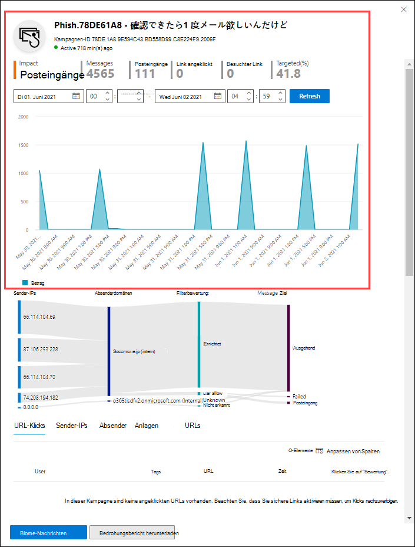

# Kampagnenansichten in Microsoft Defender für Office 365

[!INCLUDE [Microsoft 365 Defender rebranding](../includes/microsoft-defender-for-office.md)]

**Gilt für**
- [Microsoft Defender für Office 365 – Plan 2](defender-for-office-365.md)

Kampagnenansichten sind ein Feature in Microsoft Defender für Office 365 Plan 2 (z. B. Microsoft 365 E5 oder Organisationen mit einem Defender for Office 365 Plan 2-Add-On). Kampagnenansichten im Security & Compliance Center identifiziert und kategorisiert Phishingangriffe im Dienst. Kampagnenansichten können Ihnen bei Folgendem helfen:

- Phishing-Angriffe effektiv untersuchen und darauf reagieren.
- Besseres Verständnis des Umfangs des Angriffs.
- Entscheidungsträgern den Nutzen anzeigen.

Mit Kampagnenansichten können Sie das Gesamtbild eines Angriffs schneller und vollständiger erfassen als jeder Mensch.

## Was ist eine Kampagne?

Eine Kampagne ist ein koordinierter E-Mail-Angriff gegen eine oder mehrere Organisationen. E-Mail-Angriffe, die Anmeldeinformationen und Unternehmensdaten stehlen, sind eine große und lukrativere Branche. Wenn die Technologien den Aufwand erhöhen, Angriffe zu beenden, ändern Angreifer ihre Methoden, um einen weiteren Erfolg sicherzustellen.

Microsoft nutzt die enorme Menge an Antiphishing-, Antispam- und Anti-Malware-Daten über den gesamten Dienst, um Kampagnen zu identifizieren. Wir analysieren und klassifizieren die Angriffsinformationen nach mehreren Faktoren. Zum Beispiel:

- **Angriffsquelle:** Die Quell-IP-Adressen und E-Mail-Domänen des Absenders.
- **Nachrichteneigenschaften:** Der Inhalt, die Formatvorlage und der Ton der Nachrichten.
- **Nachrichtenempfänger:** Wie Empfänger miteinander verbunden sind. Beispielsweise Empfängerdomänen, Empfängerauftragsfunktionen (Administratoren, Führungskräfte usw.), Unternehmenstypen (groß, klein, öffentlich, privat usw.) und Branchen.
- **Angriffsnutzlast:** Schädliche Links, Anlagen oder andere Nutzlasten in den Nachrichten.

Eine Kampagne kann kurzlebig sein oder mehrere Tage, Wochen oder Monate mit aktiven und inaktiven Zeiträumen umfassen. Möglicherweise wird eine Kampagne für Ihre bestimmte Organisation gestartet, oder Ihre Organisation ist Teil einer größeren Kampagne in mehreren Unternehmen.

## Kampagnenansichten im Security & Compliance Center

Kampagnenansichten sind im [Security & Compliance Center](https://protection.office.com) unter Threat **Management** \> **Campaigns** oder direkt unter <https://protection.office.com/campaigns> verfügbar.

Sie können auch zu Kampagnenansichten über:

- **Bedrohungsverwaltung** \> **Explorer** \> **Ansicht** \> **Kampagnen**
- **Bedrohungsverwaltung** \> **Explorer** \> **Ansicht** \> **Alle E-Mails** \> **Registerkarte "Kampagne"**
- **Bedrohungsverwaltung** \> **Explorer** \> **Ansicht** \> **Phish** \> **Registerkarte "Kampagne"**
- **Bedrohungsverwaltung** \> **Explorer** \> **Ansicht** \> **Schadsoftware** \> **Registerkarte "Kampagne"**

Für den Zugriff auf Kampagnenansichten müssen Sie Mitglied der  Rollengruppen Organisationsverwaltung, Sicherheitsadministrator oder Sicherheitsleseprogramm im Security & Compliance Center sein. Weitere Informationen finden Sie unter [Berechtigungen im Security & Compliance Center](permissions-in-the-security-and-compliance-center.md).

## Übersicht über Kampagnen

Die Übersichtsseite zeigt Informationen zu allen Kampagnen.

Auf der **Standardregisterkarte Kampagnen** zeigt **der** Bereich Kampagnentyp ein Balkendiagramm an, das die Anzahl der Empfänger pro Tag zeigt. Standardmäßig zeigt das Diagramm sowohl **Phish-** als auch **Malwaredaten.**

> [!TIP]
> Wenn keine Kampagnendaten angezeigt werden, versuchen Sie, den Datumsbereich oder filtert [zu ändern.](#filters-and-settings)

Der Rest der Übersichtsseite zeigt die folgenden Informationen auf der Registerkarte **Kampagnen** an:

- **Name**

- **Beispiel-Betreff**: Betreffzeile einer der Nachrichten in der Kampagne. Beachten Sie, dass alle Nachrichten in der Kampagne nicht unbedingt denselben Betreff haben.

- **Ziel**: Der Prozentsatz, der durch berechnet wird: (Anzahl der Kampagnenempfänger in Ihrer Organisation) / (die Gesamtzahl der Empfänger in der Kampagne in allen Organisationen im Dienst). Dieser Wert gibt den Grad an, in dem die Kampagne nur auf Ihre Organisation (einen höheren Wert) gerichtet ist, im Vergleich zu anderen Organisationen im Dienst (ein niedrigerer Wert).

- **Typ**: Dieser Wert ist entweder **Phish** oder **Malware**.

- **Untertyp**: Dieser Wert enthält weitere Details zur Kampagne. Zum Beispiel:
  - **Phish**: Wo verfügbar, die Marke, die von dieser Kampagne phished wird. Beispiel: `Microsoft` , `365` , , , `Unknown` oder `Outlook` `DocuSign` .
  - **Schadsoftware**: z. B. `HTML/PHISH` oder `HTML/<MalwareFamilyName>` .

  Sofern verfügbar, die Marke, die von dieser Kampagne phished wird. Wenn die Erkennung durch die Defender for Office 365-Technologie gesteuert wird, wird das Präfix **ATP-** dem Untertypwert hinzugefügt.

- **Empfänger**: Die Anzahl der Benutzer, auf die diese Kampagne abzielt.

- **Posteingang:** Die Anzahl der Benutzer, die Nachrichten von dieser Kampagne in ihrem Posteingang empfangen haben (nicht an ihren Junk-E-Mail-Ordner übermittelt).

- **Geklickt**: Die Anzahl der Benutzer, die auf die URL geklickt oder die Anlage in der Phishingnachricht geöffnet haben.

- **Klickrate**: Der Prozentsatz, der durch "**Klicken auf** Posteingang "  /  **berechnet** wird. Dieser Wert ist ein Indikator für die Effektivität der Kampagne. Anders ausgedrückt, wenn die Empfänger die Nachricht als Phishing identifizieren konnten und nicht auf die Nutzlast-URL geklickt haben.

  Beachten **Sie, dass die** Klickrate in Schadsoftwarekampagnen nicht verwendet wird.

- **Besucht**: Wie viele Benutzer haben es tatsächlich bis zur Nutzlastwebsite durch gemacht. Wenn **Clicked-Werte,** aber sichere Links den Zugriff auf die Website blockiert haben, ist dieser Wert null.

Auf **der Registerkarte Kampagnenherkunft** werden die Nachrichtenquellen auf einer Karte der Welt angezeigt.

### Filter und Einstellungen

Oben auf der Seite Kampagnenansichten finden Sie mehrere Filter- und Abfrageeinstellungen, mit deren Hilfe Sie bestimmte Kampagnen finden und isolieren können.

Die grundlegendste Filterung, die Sie tun können, ist das Startdatum/die Startzeit und das Enddatum/die Endzeit.

Um die Ansicht weiter zu filtern, können Sie eine  einzelne Eigenschaft mit mehreren Werten filtern, indem Sie auf die Schaltfläche Kampagnentyp klicken, ihre Auswahl treffen und dann auf **Aktualisieren klicken.**

Die filterbaren Kampagneneigenschaften, die in der Schaltfläche Kampagnentyp verfügbar **sind,** werden in der folgenden Liste beschrieben:

- **Basic**:
  - **Kampagnentyp**: Wählen Sie **Schadsoftware** oder **Phish aus.** Das Löschen der Auswahl hat dasselbe Ergebnis wie das Auswählen beider Optionen.
  - **Kampagnenname**
  - **Kampagnenuntertyp**
  - **Sender**
  - **Recipients**
  - **Absenderdomäne**
  - **Betreff**
  - **Dateiname der Anlage**
  - **Schadsoftwarefamilie**
  - **Tags**: Benutzer oder Gruppen, auf die das angegebene Benutzertag angewendet wurde (einschließlich Prioritätskonten). Weitere Informationen zu Benutzertags finden Sie unter [User tags](user-tags.md).
  - **Systemüberschreibungen**
  - **Zustellungsaktion**
  - **Zusätzliche Aktion**
  - **Directionality**
  - **Erkennungstechnologie**
  - **Ursprünglicher Zustellungsspeicherort**
  - **Aktueller Zustellungsspeicherort**
  - **Systemüberschreibungen**

- **Erweitert**:
  - **Internetnachrichten-ID**: Im Kopfzeilenfeld **Message-ID** im Nachrichtenkopf verfügbar. Ein Beispielwert ist `<08f1e0f6806a47b4ac103961109ae6ef@server.domain>` (beachten Sie die eckigen Klammern).
  - **Netzwerknachrichten-ID:** Ein GUID-Wert, der im **X-MS-Exchange-Organization-Network-Message-Id-Headerfeld** im Nachrichtenkopf verfügbar ist.
  - **Sender-IP**
  - **Anlage SHA256**: Führen Sie den folgenden Befehl in einer Eingabeaufforderung aus, um den SHA256-Hashwert einer Datei in Windows zu finden: `certutil.exe -hashfile "<Path>\<Filename>" SHA256` .
  - **Cluster-ID**
  - **Warnungsrichtlinien-ID**
  - **ZAP-URL-Signal**

- **URLs**:
  - **URL-Domäne**
  - **URL-Domäne und -Pfad**
  - **URL**
  - **URL-Pfad**
  - **Klicken Sie auf "Urteil"**

Für eine erweiterte Filterung, einschließlich der Filterung nach mehreren Eigenschaften, können Sie auf die Schaltfläche **Erweitert klicken,** um eine Abfrage zu erstellen. Dieselben Kampagneneigenschaften sind verfügbar, jedoch mit den folgenden Verbesserungen:

- Sie können auf **Bedingung hinzufügen klicken,** um mehrere Bedingungen auszuwählen.
- Sie können den **Operator And** oder **Or** zwischen Bedingungen auswählen.
- Sie können das **Gruppenelement Bedingung** am unteren Rand der Bedingungsliste auswählen, um komplexe zusammengesetzte Bedingungen zu bilden.

Wenn Sie fertig sind, klicken Sie auf die **Schaltfläche** Abfrage.

Nachdem Sie einen einfachen oder erweiterten Filter erstellt haben, können Sie ihn mithilfe der **Save-Abfrage** oder **der Save-Abfrage unter speichern.** Wenn Sie später zu Kampagnenansichten zurückkehren, können Sie einen gespeicherten Filter laden, indem Sie auf **Gespeicherte Abfrageeinstellungen klicken.**

Klicken Sie zum Exportieren des Diagramms oder der Liste der Kampagnen auf **Exportieren,** und wählen Sie **Diagrammdaten** exportieren oder **Kampagnenliste exportieren aus.**

Wenn Sie über ein Microsoft Defender for Endpoint-Abonnement verfügen, können Sie auf **MDE-Einstellungen klicken,** um die Kampagneninformationen mit Microsoft Defender for Endpoint zu verbinden oder zu trennen. Weitere Informationen finden Sie unter [Integrieren von Microsoft Defender for Office 365 in Microsoft Defender for Endpoint](integrate-office-365-ti-with-mde.md).

## Kampagnendetails

Wenn Sie auf den Namen einer Kampagne klicken, werden die Kampagnendetails in einem Flyout angezeigt.

### Kampagneninformationen

Oben in der Kampagnendetailseansicht sind die folgenden Kampagneninformationen verfügbar:

- **ID**: Der eindeutige Kampagnenbezeichner.

- **Gestartet** und **beendet**: Das Start- und Enddatum der Kampagne. Beachten Sie, dass diese Datumsangaben möglicherweise über die Filterdaten, die Sie auf der Übersichtsseite ausgewählt haben, hinaus gehen.

- **Auswirkung**: Dieser Abschnitt enthält die folgenden Daten für den ausgewählten Datumsbereichsfilter (oder den Sie auf der Zeitachse auswählen):
  - Die Gesamtanzahl der Empfänger.
  - Die Anzahl der Nachrichten, die "Posteingang" waren (d. h. an den Posteingang übermittelt, nicht an den Junk-E-Mail-Ordner).
  - Wie viele Benutzer in der Phishingnachricht auf die URL-Nutzlast geklickt haben.
  - Howe many users visited the URL.

- **Ziel**: Der Prozentsatz, der durch berechnet wird: (Anzahl der Kampagnenempfänger in Ihrer Organisation) / (die Gesamtzahl der Empfänger in der Kampagne in allen Organisationen im Dienst). Beachten Sie, dass dieser Wert über die gesamte Lebensdauer der Kampagne berechnet wird und sich nicht basierend auf Datumsfiltern ändert.

- Eine interaktive Zeitachse der Kampagnenaktivität: Die Zeitachse zeigt Aktivitäten über die gesamte Lebensdauer der Kampagne an. Standardmäßig enthält der schattierte Bereich den Datumsbereichsfilter, den Sie in der Übersicht ausgewählt haben. Sie können klicken und ziehen, um einen bestimmten Start- und Endpunkt auszuwählen, wodurch die im Bereich Auswirkung angezeigten Daten und auf der restlichen Seite wie in den nächsten Abschnitten beschrieben geändert <u>werden.  </u>

In der Titelleiste können Sie auf die Schaltfläche Kampagnenbeschreiben herunterladen Klicken Sie auf das Symbol Kampagnenbeschreiben herunterladen, um die Kampagnendetails in ein **Word-Dokument**  (standardmäßig CampaignReport.docx). Beachten Sie, dass der Download Details über die gesamte Lebensdauer der Kampagne enthält (nicht nur die ausgewählten Filterdaten).

### Kampagnenfluss

In der Mitte der Kampagnendetailseansicht werden wichtige Details zur Kampagne im Abschnitt **Fluss** in einem horizontalen Flussdiagramm (auch als _Sankey-Diagramm bekannt)_ angezeigt. Diese Details helfen Ihnen, die Elemente der Kampagne und die potenziellen Auswirkungen in Ihrer Organisation zu verstehen.

> [!TIP]
> Die im Flussdiagramm angezeigten  Informationen werden durch den schattierten Datumsbereich in der Zeitachse gesteuert, wie im vorherigen Abschnitt beschrieben.

Wenn Sie im Diagramm auf ein horizontales Band zeigen, sehen Sie die Anzahl der verwandten Nachrichten (z. B. Nachrichten aus einer bestimmten Quell-IP, Nachrichten aus der Quell-IP-Adresse, die die angegebene Absenderdomäne verwenden, usw.).

Das Diagramm enthält die folgenden Informationen:

- **Sender-IPs**
- **Absenderdomänen**
- **Filterverkündungen:** Die Verdingungswerte stehen im Zusammenhang mit den verfügbaren Phishing- und Spamfilterungswerten, wie unter [Antispamnachrichtenkopfzeilen beschrieben.](anti-spam-message-headers.md) Die verfügbaren Werte werden in der folgenden Tabelle beschrieben:

  ****

  |Wert|Spamfilter-Urteil|Beschreibung|
  |---|---|---|
  |**Zulässig**|`SFV:SKN` 
 `SFV:SKI`|Die Nachricht wurde als spam- und/oder übersprungene Filterung gekennzeichnet, bevor sie von der Spamfilterung ausgewertet wurde. Beispielsweise wurde die Nachricht von einer Nachrichtenflussregel (auch als Transportregel bezeichnet) als kein Spam gekennzeichnet. 
 Die Nachricht hat die Spamfilterung aus anderen Gründen übersprungen. Beispielsweise scheinen der Absender und der Empfänger in derselben Organisation zu sein.|
  |**Gesperrt**|`SFV:SKS`|Die Nachricht wurde als Spam markiert, bevor sie von der Spamfilterung ausgewertet wurde. Beispielsweise durch eine Nachrichtenflussregel.|
  |**Erkannt**|`SFV:SPM`|Die Nachricht wurde vom Spamfilter als Spam markiert.|
  |**Nicht erkannt**|`SFV:NSPM`|Die Nachricht wurde von der Spamfilterung als kein Spam markiert.|
  |**Veröffentlicht**|`SFV:SKQ`|Die Nachricht hat die Spamfilterung übersprungen, da sie aus der Quarantäne freigegeben wurde.|
  |**Mandanten zulassen**\*|`SFV:SKA`|Die Nachricht hat die Spamfilterung aufgrund der Einstellungen in einer Antispamrichtlinie übersprungen. Beispielsweise war der Absender in der Liste der zulässigen Absender oder der Liste der zulässigen Domänen enthalten.|
  |**Mandantenblock**\*\*|`SFV:SKA`|Die Nachricht wurde aufgrund der Einstellungen in einer Antispamrichtlinie durch die Spamfilterung blockiert. Beispielsweise war der Absender in der Liste der zulässigen Absender oder der Liste der zulässigen Domänen enthalten.|
  |**Benutzer zulassen**\*|`SFV:SFE`|Die Nachricht hat die Spamfilterung übersprungen, da der Absender in der Liste sicherer Absender eines Benutzers enthalten war.|
  |**Benutzerblockierung**\*\*|`SFV:BLK`|Die Nachricht wurde durch die Spamfilterung blockiert, da der Absender in der Liste blockierter Absender eines Benutzers enthalten war.|
  |**ZAP**|n/v|[Zap (Zero-Hour Auto Purge)](zero-hour-auto-purge.md) hat die zugestellte Nachricht in den Junk-E-Mail-Ordner oder die Quarantäne verschoben. Sie konfigurieren die Aktion in Ihrer Antispamrichtlinie.|
  |

  \* Überprüfen Sie Ihre Antispamrichtlinien, da die zulässige Nachricht wahrscheinlich vom Dienst blockiert worden wäre.

  \*\* Überprüfen Sie Ihre Antispamrichtlinien, da diese Nachrichten isoliert und nicht zugestellt werden sollten.

- **Zustellungsorte:** Sie sollten Nachrichten untersuchen, die an Empfänger übermittelt wurden (entweder an den Posteingang oder den Junk-E-Mail-Ordner), auch wenn Benutzer nicht auf die Nutzlast-URL in der Nachricht geklickt haben. Sie können die isolierten Nachrichten auch aus der Quarantäne entfernen. Weitere Informationen finden Sie unter [Quarantined email messages in EOP](quarantine-email-messages.md).
  - **Ordner gelöscht**
  - **Dropped**
  - **Extern:** Der Empfänger befindet sich in Ihrer lokalen E-Mail-Organisation in Hybridumgebungen.
  - **Fehlgeschlagen**
  - **Weitergeleitet**
  - **Posteingang**
  - **Junk-E-Mail-Ordner**
  - **Quarantäne**
  - **Unknown**

- **URL-Klicks**: Diese Werte werden im nächsten Abschnitt beschrieben.

> [!NOTE]
> In allen Ebenen, die mehr als 10 Elemente enthalten, werden die obersten 10 Elemente angezeigt, während die restlichen Elemente in Anderen gebündelt **werden.**

#### URL-Klicks

Wenn eine Phishingnachricht an den Posteingang oder junk-E-Mail-Ordner eines Empfängers zugestellt wird, besteht immer die Möglichkeit, dass der Benutzer auf die Nutzlast-URL klickt. Das Nichtklicken auf die URL ist ein kleiner Erfolg, Aber Sie müssen ermitteln, warum die Phishingnachricht sogar an das Postfach zugestellt wurde.

Wenn ein Benutzer in der Phishingnachricht auf die Nutzlast-URL geklickt hat, werden die Aktionen im **Bereich URL-Klicks** des Diagramms in der Kampagnendetailseansicht angezeigt.

- **Zulässig**
- **BlockPage**: Der Empfänger hat auf die Nutzlast-URL geklickt, aber der Zugriff auf die schädliche Website wurde durch eine [Richtlinie](safe-links.md) für sichere Links in Ihrer Organisation blockiert.
- **BlockPageOverride**: Der Empfänger hat auf die Nutzlast-URL in der Nachricht geklickt. Sichere Links haben versucht, sie zu beenden, aber sie konnten den Block außer Kraft setzen. Überprüfen Sie Ihre [Richtlinien für](set-up-safe-links-policies.md) sichere Links, um zu sehen, warum Benutzer das Safe Links-Urteil außer Kraft setzen und mit der schädlichen Website fortfahren dürfen.
- **PendingDetonationPage**: Sichere Anlagen in Microsoft Defender für Office 365 werden derzeit geöffnet und untersucht die Nutzlast-URL in einer Umgebung mit virtuellen Computern.
- **PendingDetonationPageOverride**: Der Empfänger konnte den Nutzlastdetonationsprozess überschreiben und die URL öffnen, ohne auf die Ergebnisse zu warten.

### Registerkarten

Mit den Registerkarten in der Kampagnendetailseansicht können Sie die Kampagne weiter untersuchen.

> [!TIP]
> Die informationen, die auf den Registerkarten angezeigt werden, werden durch den schattierten Datumsbereich auf der Zeitachse gesteuert, wie im Abschnitt [Kampagneninformationen beschrieben.](#campaign-information)

- **URL-Klicks**: Wenn Benutzer nicht auf die Nutzlast-URL in der Nachricht geklickt haben, ist dieser Abschnitt leer. Wenn ein Benutzer auf die URL klicken konnte, werden die folgenden Werte aufgefüllt:
  - **Benutzer**\*
  - **URL**\*
  - **Klickzeit**
  - **Klicken Sie auf "Urteil"**

- **Sender-IPs**
  - **Sender-IP**\*
  - **Gesamtanzahl**
  - **Posteingang**
  - **Nicht inboxed**
  - **SPF übergeben:** Der Absender wurde vom [Sender Policy Framework (SPF) authentifiziert.](how-office-365-uses-spf-to-prevent-spoofing.md) Ein Absender, der die SPF-Überprüfung nicht besteht, gibt einen nicht authentifizierten Absender an, oder die Nachricht fälscht einen legitimen Absender.

- **Absender**
  - **Absender**: Dies ist die tatsächliche Absenderadresse im SMTP MAIL FROM-Befehl, die nicht unbedingt die From: E-Mail-Adresse ist, die Benutzern in ihren E-Mail-Clients angezeigt wird.
  - **Gesamtanzahl**
  - **Posteingang**
  - **Nicht inboxed**
  - **DKIM übergeben:** Der Absender wurde von ["Domänenschlüssel Identifizierte E-Mail" (DKIM) authentifiziert.](support-for-validation-of-dkim-signed-messages.md) Ein Absender, der die DKIM-Überprüfung nicht besteht, weist auf einen nicht authentifizierten Absender hin, oder die Nachricht fälscht einen legitimen Absender.
  - **DMARC übergeben:** Der Absender wurde durch domänenbasierte Nachrichtenauthentifizierung, [-berichterstellung und -konformität (DMARC) authentifiziert.](use-dmarc-to-validate-email.md) Ein Absender, der die DMARC-Überprüfung nicht besteht, weist auf einen nicht authentifizierten Absender hin, oder die Nachricht fälscht einen legitimen Absender.

- **Anlagen**
  - **Filename**
  - **SHA256**
  - **Schadsoftwarefamilie**
  - **Gesamtanzahl**

- **URL**
  - **URL**\*
  - **Gesamtanzahl**

\* Wenn Sie auf diesen Wert klicken, wird ein neues Flyout geöffnet, das weitere Details zu dem angegebenen Element (Benutzer, URL usw.) oben in der Ansicht "Kampagnendetails" enthält. Wenn Sie zur Ansicht "Kampagnendetails" zurückkehren möchten, klicken Sie im neuen Flyout auf **Fertig**.

### Schaltflächen

Mit den Schaltflächen in der Ansicht "Kampagnendetails" können Sie die Funktionen von Threat Explorer verwenden, um die Kampagne weiter zu untersuchen.

- **Kampagne durchsuchen**: Öffnet eine neue Threat Explorer-Suchregisterkarte mit dem Wert **Kampagnen-ID** als Suchfilter.
- **Durchsuchen von Posteingangsnachrichten:** Öffnet eine neue Suchregisterkarte für den Bedrohungs-Explorer mit der **Kampagnen-ID** und dem Speicherort der **Zustellung: Posteingang** als Suchfilter.
