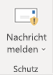
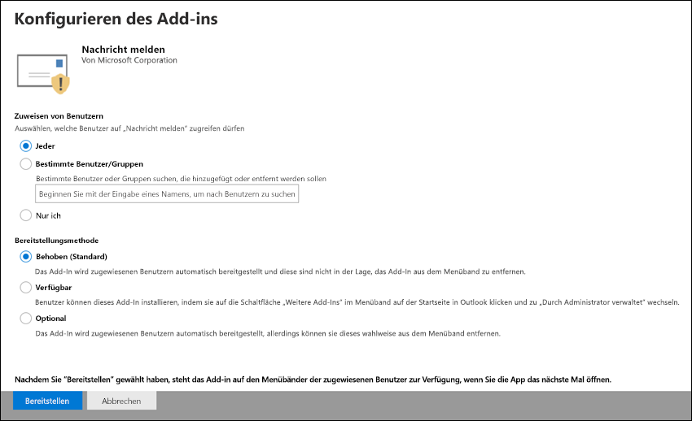

# Aktivieren des Add-Ins „Nachrichten melden“

[!INCLUDE [Microsoft 365 Defender rebranding](../includes/microsoft-defender-for-office.md)]

**Gilt für**
- [Exchange Online Protection](exchange-online-protection-overview.md)
- [Microsoft Defender für Office 365 Plan 1 und Plan 2](defender-for-office-365.md)
- [Microsoft 365 Defender](../defender/microsoft-365-defender.md)

> [!NOTE]
> Wenn Sie ein Administrator in einer Microsoft 365-Organisation mit Exchange Online-Postfächern sind, wird empfohlen, das Übermittlungsportal im Security & Compliance Center zu verwenden. Weitere Informationen finden Sie unter [Use Admin Submission to submit suspected spam, phish, URLs, and files to Microsoft](admin-submission.md).

Mit den Phishing-Add-Ins für Outlook und Outlook im Web (früher als Outlook Web App bezeichnet) können Benutzer falsch positive Ergebnisse (gute E-Mails, die als schlecht gekennzeichnet sind) oder falsch negative (ungültige E-Mails sind zulässig) für die Analyse an Microsoft und seine Partner melden.

Microsoft verwendet diese Übermittlungen, um die Effektivität von E-Mail-Schutztechnologien zu verbessern. Wenn z. B. viele Nachrichten gemeldet werden, die mithilfe des Berichtsnachrichten-Add-Ins als Junk-E-Mail gekennzeichnet wurden, muss das Sicherheitsteam Ihrer Organisation möglicherweise [Antispamrichtlinien anpassen.](configure-your-spam-filter-policies.md)

Sie können entweder das Add-In "Nachricht melden" oder "Phishing melden" installieren. Wenn Ihre Benutzer nur Phishingnachrichten melden sollen, stellen Sie das Phishing-Add-In Melden in Ihrer Organisation zur Verfügung. Weitere Informationen finden Sie unter [Enable the Report Phishing add-in](enable-the-report-phish-add-in.md).

Das Add-In Report Message bietet die Möglichkeit, Sowohl Spam- als auch Phishingnachrichten zu melden. Administratoren können das Report Message-Add-In für die Organisation aktivieren, und einzelne Benutzer können es für sich selbst installieren.

Wenn Sie ein einzelner Benutzer sind, können Sie das [Add-In](#get-the-report-message-add-in-for-yourself)Nachricht melden für sich selbst aktivieren.

Wenn Sie ein globaler Administrator oder Exchange Online-Administrator sind und Exchange für die Verwendung der OAuth-Authentifizierung konfiguriert ist, können Sie das [Add-In](#get-and-enable-the-report-message-add-in-for-your-organization)Nachricht melden für Ihre Organisation aktivieren. Die Berichtsnachricht Add-In ist jetzt über die zentrale [Bereitstellung verfügbar.](../../admin/manage/centralized-deployment-of-add-ins.md)

## Was sollten Sie wissen, bevor Sie beginnen?

- Das Berichtsnachrichten-Add-In funktioniert mit den meisten Microsoft 365-Abonnements und den folgenden Produkten:

  - Outlook im Web
  - Outlook 2013 SP1 oder höher
  - Outlook 2016 für Mac
  - Outlook in Microsoft 365-Apps für Unternehmen enthalten
  - Outlook-App für iOS und Android

- Das Berichtsnachrichten-Add-In ist für freigegebene Postfächer oder Postfächer in lokalen Exchange-Organisationen nicht verfügbar.

- Sie können gemeldete Nachrichten so konfigurieren, dass sie in ein von Ihnen festgelegtes Postfach kopiert oder umgeleitet werden. Weitere Informationen finden Sie unter [Benutzerübermittlungsrichtlinien](user-submission.md).

- Ihr vorhandener Webbrowser sollte mit dem Report Message-Add-In funktionieren. Wenn Sie jedoch feststellen, dass das Add-In nicht verfügbar ist oder nicht wie erwartet funktioniert, versuchen Sie es mit einem anderen Browser.

- Für Organisationsinstallationen muss die Organisation für die Verwendung der OAuth-Authentifizierung konfiguriert werden. Weitere Informationen finden Sie unter [Determine if Centralized Deployment of add-ins works for your organization](../../admin/manage/centralized-deployment-of-add-ins.md).

- Administratoren müssen Mitglied der Rollengruppe Globale Administratoren sein. Weitere Informationen finden Sie unter [Berechtigungen im Security & Compliance Center](permissions-in-the-security-and-compliance-center.md).

## Erstellen des Berichtsnachrichten-Add-Ins für sich selbst

1. Wechseln Sie zur Microsoft AppSource <https://appsource.microsoft.com/marketplace/apps> unter, und suchen Sie nach dem Add-In Nachricht melden. Um direkt zum Add-In "Nachricht melden" zu wechseln, wechseln Sie zu <https://appsource.microsoft.com/product/office/wa104381180> .

2. Klicken Sie **auf JETZT GET IT**.

   

3. Überprüfen Sie im angezeigten Dialogfeld die Nutzungsbedingungen und die Datenschutzrichtlinie, und klicken Sie dann auf **Weiter**.

4. Melden Sie sich mit Ihrem Geschäfts- oder Schulkonto (für geschäftliche Nutzung) oder Ihrem Microsoft-Konto (für den persönlichen Gebrauch) an.

Nachdem das Add-In installiert und aktiviert wurde, werden die folgenden Symbole angezeigt:

- In Outlook sieht das Symbol wie dies aus:

  

- In Outlook im Web sieht das Symbol wie dies aus:

  

Informationen zur Verwendung des Add-Ins finden Sie unter [Use the Report Message add-in](https://support.microsoft.com/office/b5caa9f1-cdf3-4443-af8c-ff724ea719d2).

## Get and enable the Report Message add-in for your organization

> [!NOTE]
> Es kann bis zu 12 Stunden dauern, bis das Add-In in Ihrer Organisation angezeigt wird.

1. Wechseln Sie im Microsoft 365 Admin Center  zur Seite Einstellungen-Add-Ins unter , Wenn die \>  <https://admin.microsoft.com/AdminPortal/Home#/Settings/AddIns> **Add-In-Seite**  nicht angezeigt wird, wechseln Sie zum Link Integrierte \>  \> **Apps-Add-Ins**  einstellungen oben auf der Seite Integrierte Apps.

2. Wählen **Sie add-in** bereitstellen oben auf der Seite aus, und wählen Sie dann **Weiter aus.**

   

3. Überprüfen Sie im angezeigten Flyout Bereitstellen eines neuen **Add-Ins** die Informationen, und klicken Sie dann auf **Weiter**.

4. Klicken Sie auf der nächsten Seite im **Store auf Auswählen.**

   

5. Klicken Sie auf der angezeigten Seite  **Add-In** auswählen in das Feld Suchen, geben Sie **Meldung** melden ein, und klicken Sie dann auf **Suchsymbol**  . Suchen Sie in der Liste der Ergebnisse nach **Berichtnachricht,** und klicken Sie dann auf **Hinzufügen**.

   

6. Überprüfen Sie im angezeigten Dialogfeld die Lizenzierungs- und Datenschutzinformationen, und klicken Sie dann auf **Weiter**.

7. Konfigurieren Sie auf der angezeigten Seite **Add-In** konfigurieren die folgenden Einstellungen:

   - **Zugewiesene** Benutzer : Wählen Sie einen der folgenden Werte aus:

     - **Jeder** (Standard)
     - **Bestimmte Benutzer/Gruppen**
     - **Nur ich**

   - **Bereitstellungsmethode**: Wählen Sie einen der folgenden Werte aus:

     - **Fixed (Standard):** Das Add-In wird automatisch für die angegebenen Benutzer bereitgestellt und kann nicht entfernt werden.
     - **Verfügbar:** Benutzer können das Add-In unter **Home** \> **Get add-ins** \> **Admin-managed installieren.**
     - **Optional:** Das Add-In wird automatisch für die angegebenen Benutzer bereitgestellt, kann es jedoch entfernen.

   

   Klicken Sie nach Abschluss des Abschlusses auf **Bereitstellen**.

8. Auf der **angezeigten** Seite Berichtsnachricht bereitstellen wird ein Fortschrittsbericht angezeigt, gefolgt von der Bestätigung, dass das Add-In bereitgestellt wurde. Klicken Sie nach dem Lesen der Informationen auf **Weiter**.

   

9. Überprüfen Sie auf der angezeigten Seite **Add-In** ankündigen die Informationen, und klicken Sie dann auf **Schließen**.

   

## Informationen zur Verwendung des Berichtsnachrichten-Add-Ins

Personen, denen das Add-In zugewiesen ist, werden die folgenden Symbole angezeigt:

- In Outlook sieht das Symbol wie dies aus:

  

- In Outlook im Web sieht das Symbol wie dies aus:

  

Wenn Sie Benutzer über das Add-In "Nachricht melden" benachrichtigen, fügen Sie einen Link zum Verwenden des [Berichtsnachricht-Add-Ins hinzu.](https://support.microsoft.com/office/b5caa9f1-cdf3-4443-af8c-ff724ea719d2)

## Überprüfen oder Bearbeiten von Einstellungen für das Report Message-Add-In

1. Wechseln Sie im Microsoft 365 Admin Center  zur Seite Einstellungen-Add-Ins unter , Wenn die \>  <https://admin.microsoft.com/AdminPortal/Home#/Settings/AddIns> **Add-In-Seite**  nicht angezeigt wird, wechseln Sie zum Link Integrierte \>  \> **Apps-Add-Ins**  einstellungen oben auf der Seite Integrierte Apps.

   

2. Suchen Sie das **Add-In Nachricht** melden, und wählen Sie es aus.

3. Überprüfen **und** bearbeiten Sie im angezeigten Flyout Berichtsnachricht bearbeiten die Einstellungen, die für Ihre Organisation geeignet sind. Klicken Sie nach Abschluss des Vorgangs auf **Speichern**.

   

## Anzeigen und Überprüfen von gemeldeten Nachrichten

Zum Überprüfen von Nachrichten, die Benutzer an Microsoft melden, haben Sie die folgenden Optionen:

- Verwenden Sie das Administrator-Übermittlungsportal. Weitere Informationen finden Sie unter [Anzeigen von Benutzerübermittlungen an Microsoft](admin-submission.md#view-user-submissions-to-microsoft).

- Erstellen Sie eine Nachrichtenflussregel (auch als Transportregel bezeichnet), um Kopien von gemeldeten Nachrichten zu senden. Anweisungen finden Sie unter [Verwenden von Nachrichtenflussregeln, um zu sehen, was Ihre Benutzer an Microsoft melden.](use-mail-flow-rules-to-see-what-your-users-are-reporting-to-microsoft.md)
