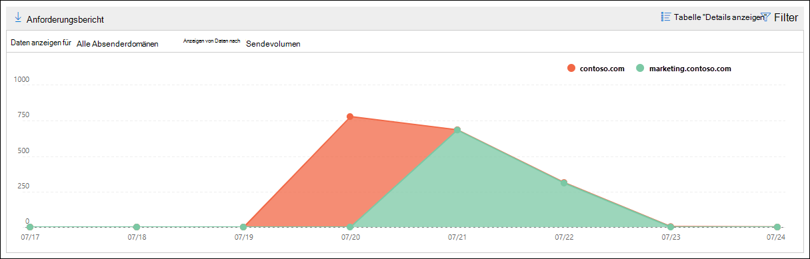
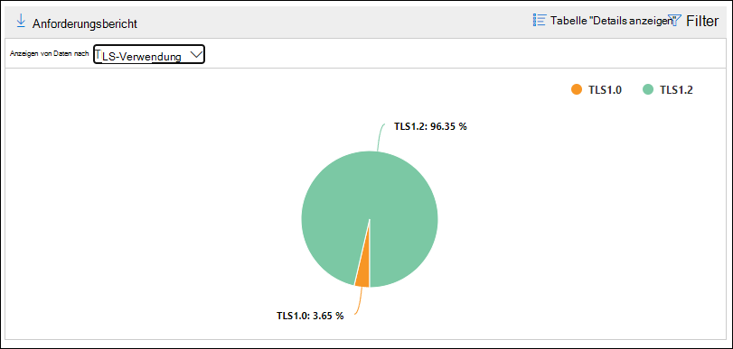

# Smtp-Authentifizierungsclients: Einblick und Bericht im Security & Compliance Center

[!INCLUDE [Microsoft 365 Defender rebranding](../includes/microsoft-defender-for-office.md)]

**Gilt für**
- [Exchange Online Protection](exchange-online-protection-overview.md)
- [Microsoft Defender für Office 365 Plan 1 und Plan 2](defender-for-office-365.md)
- [Microsoft 365 Defender](../defender/microsoft-365-defender.md)

Die Einblicke der **SMTP-Authentifizierungsclients** im Nachrichtenflussdashboard und dem zugehörigen [SMTP-Authentifizierungsclientbericht](#smtp-auth-clients-report) im Security & Compliance Center unterstreichen die Verwendung des SMTP AUTH-Clientübermittlungsprotokolls durch Benutzer oder Systemkonten in Ihrer Organisation.   Dieses Legacyprotokoll (das die Endpunkt-smtp.office365.com verwendet) bietet nur die Standardauthentifizierung und ist anfällig für die Verwendung durch gefährdete Konten zum Senden von E-Mails. Mit dem Einblick und dem Bericht können Sie nach ungewöhnlichen Aktivitäten für SMTP-AUTH-E-Mail-Übermittlungen suchen. Außerdem werden die TLS-Verwendungsdaten für Clients oder Geräte mit SMTP AUTH angezeigt.

Das Widget gibt die Anzahl der Benutzer oder Dienstkonten an, die das SMTP-Authentifizierungsprotokoll in den letzten 7 Tagen verwendet haben.

Wenn Sie auf die Anzahl der Nachrichten im Widget klicken, wird ein Flyout für **SMTP-Authentifizierungsclients** angezeigt. Das Flyout bietet eine aggregierte Ansicht der TLS-Nutzung und der Volumes für die letzte Woche.

Sie können auf den **Link SMTP-Authentifizierungsclients klicken,** um zum SMTP-Authentifizierungsclientbericht zu wechseln, wie im nächsten Abschnitt beschrieben.

## SMTP-Auth-Clientbericht

### Berichtsansicht für den SMTP-Authentifizierungsclientbericht

Standardmäßig werden im Bericht Daten für die letzten 7 Tage angezeigt, daten sind jedoch für die letzten 90 Tage verfügbar.

Der Abschnitt Übersicht enthält die folgenden Diagramme:

- **Daten anzeigen nach:** Sendevolume : Standardmäßig zeigt das Diagramm die Anzahl der SMTP Auth-Clientnachrichten an, die von allen Domänen gesendet wurden ( Daten anzeigen **für: Alle** Absenderdomänen sind standardmäßig ausgewählt). Sie können die Ergebnisse in eine bestimmte  Absenderdomäne filtern, indem Sie in der Dropdownliste auf Daten für anzeigen klicken und die Absenderdomäne auswählen. Wenn Sie auf einen bestimmten Datenpunkt (Tag) zeigen, wird die Anzahl der Nachrichten angezeigt.

  

- **Daten anzeigen nach: TLS-Verwendung**: Das Diagramm zeigt den Prozentsatz der TLS-Nutzung für alle SMTP-Authentifizierungsclientnachrichten während des ausgewählten Zeitraums an. In diesem Diagramm können Sie Benutzer und Systemkonten identifizieren und aktionen, die noch ältere Versionen von TLS verwenden.

  

Wenn Sie **in** einer Berichtsansicht auf Filter klicken, können Sie einen Datumsbereich mit **Startdatum** und **Enddatum angeben.**

Klicken **Sie auf Bericht anfordern,** um eine ausführlichere Version des Berichts in einer E-Mail-Nachricht zu erhalten. Sie können den Datumsbereich und die Empfänger angeben, die den Bericht empfangen sollen.

### Detailtabelle für den SMTP-Authentifizierungsclientbericht

Wenn Sie auf **Detailtabelle anzeigen klicken,** hängen die angezeigten Informationen von dem Diagramm ab, das Sie sich angeschaut haben:

- **Daten anzeigen nach: Sendevolume**: Die folgenden Informationen werden in einer Tabelle angezeigt:

  - **Absenderadresse**
  - **Anzahl der Nachrichten**

  Wenn Sie eine Zeile auswählen, werden dieselben Details in einem Flyout angezeigt.

- **Daten anzeigen nach: TLS-Verwendung**: Die folgenden Informationen werden in einer Tabelle angezeigt:

  - **Absenderadresse**
  - **TLS1.0%**\*
  - **TLS1.1%**\*
  - **TLS1,2%**\*
  - **Anzahl der Nachrichten**

  \* Diese Spalte zeigt sowohl den Prozentsatz als auch die Anzahl der Nachrichten vom Absender an.

Wenn Sie in einer **Detailtabelle** auf Filter klicken, können Sie einen Datumsbereich mit **Startdatum** und **Enddatum angeben.**

Wenn Sie eine Zeile auswählen, werden ähnliche Details in einem Flyout angezeigt:

Klicken **Sie auf Bericht anfordern,** um eine ausführlichere Version des Berichts in einer E-Mail-Nachricht zu erhalten. Sie können den Datumsbereich und die Empfänger angeben, die den Bericht empfangen sollen.

Klicken Sie auf Bericht anzeigen, um zur Berichtsansicht **zurück zu wechseln.**

## Verwandte Themen

Weitere Informationen zu anderen Erkenntnissen im Nachrichtenflussdashboard finden Sie unter Einblicke in den Nachrichtenfluss [im Security & Compliance Center](mail-flow-insights-v2.md).
