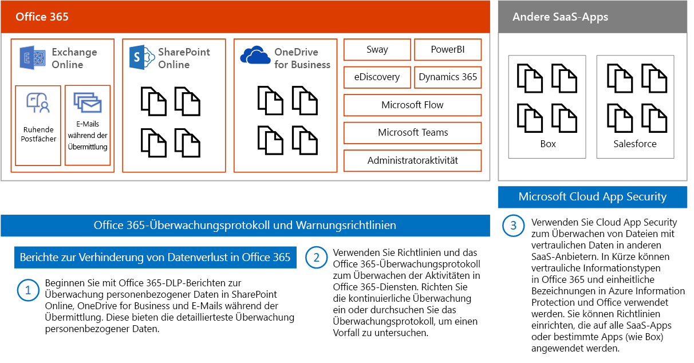
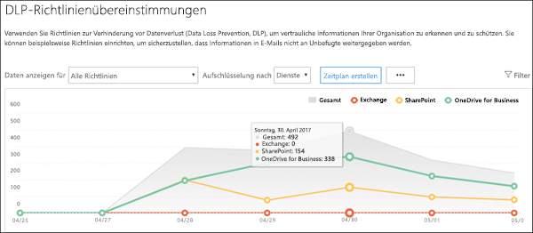
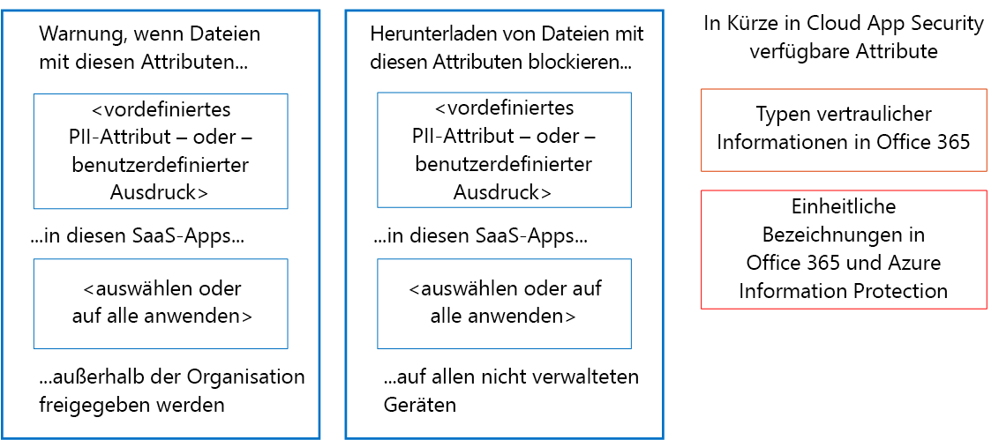
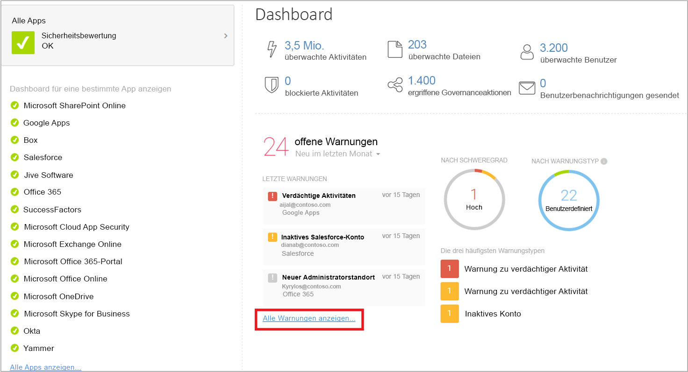

# Überwachen auf Lecks für personenbezogene Daten

[!INCLUDE [Microsoft 365 Defender rebranding](../includes/microsoft-defender-for-office.md)]

Es gibt viele Tools, die zum Überwachen der Verwendung und Übertragung personenbezogener Daten verwendet werden können. In diesem Thema werden drei Tools beschrieben, die gut funktionieren.

In der Abbildung sehen Sie Folgendes:

- Beginnen Sie mit Microsoft 365-Berichten zur Verhinderung von Datenverlust, um personenbezogene Daten in SharePoint Online, OneDrive for Business und E-Mails bei der Übertragung zu überwachen. Diese Berichte bieten die größtmögliche Detailebene für die Überwachung von personenbezogenen Daten. Diese Berichte enthalten jedoch nicht alle Dienste in Office 365.

- Verwenden Sie anschließend die Warnungsrichtlinien und das Überwachungsprotokoll, um die Aktivitäten in Diensten zu überwachen. Richten Sie kontinuierliche Überwachung ein, oder untersuchen Sie einen Vorfall anhand des Überwachungsprotokolls. Das Überwachungsprotokoll kann auf Dienste, Sway, PowerBI, eDiscovery, Dynamics 365, Microsoft Flow, Microsoft Teams, Administratoraktivität, OneDrive for Business, SharePoint Online, E-Mail in der Übertragung und ruhende Postfächer angewendet werden. Skype-Unterhaltungen sind in ruhenden Postfächern enthalten.

- Zum Schluss verwenden Sie Microsoft Cloud App Security, um Dateien mit vertraulichen Daten in anderen SaaS-Anbietern zu überwachen. In Kürze können Typen vertraulicher Informationen und einheitliche Beschriftungen für Azure Information Protection und Office mit Cloud App Security verwendet werden. Sie können Richtlinien einrichten, die für alle Ihre SaaS-Apps oder für bestimmte Apps (beispielsweise Box) gelten. Mit Cloud App Security können keine Dateien in Exchange Online ermittelt werden, auch keine an E-Mails angefügten Dateien.

## Berichte zur Verhinderung von Datenverlust

Nachdem Sie DLP-Richtlinien (Data Loss Prevention, Verhinderung von Datenverlust) erstellt haben, müssen Sie sicherstellen, dass diese wie gewünscht funktionieren und Sie bei der Richtlinieneinhaltung unterstützen. Mithilfe der DLP-Berichte in Office 365 können Sie schnell die Anzahl der DLP-Richtlinienentsprechungen, -Außerkraftsetzungen oder falsch positiven Resultate anzeigen, ermitteln, ob sie im Laufe der Zeit einen Aufwärts- oder Abwärtstrend aufweisen, den Bericht auf verschiedene Weisen filtern und weitere Details anzeigen, indem Sie einen Punkt in einer Zeile oder im Diagramm auswählen.

Sie können die DLP-Berichte für Folgendes verwenden:

- Sie können sich auf bestimmte Zeiträume konzentrieren und so mehr über die Gründe für Spitzen und Trends erfahren.

- Sie können die Geschäftsprozesse ermitteln, die gegen die DLP-Richtlinien Ihrer Organisation verstoßen.

- Sie können die geschäftlichen Auswirkungen der DLP-Richtlinien besser nachvollziehen.

- Zeigen Sie die Begründungen an, die von Benutzern gesendet werden, wenn diese einen Richtlinientipp durch Außerkraftsetzen der Richtlinie oder durch Melden eines falsch positiven Resultats lösen.

- Sie können die Einhaltung einer bestimmten DLP-Richtlinie durch Anzeigen von Übereinstimmungen für diese Richtlinie überprüfen.

- Sie können Detailbereich eine Liste von Dateien mit vertraulichen Daten anzeigen, die mit den DLP-Richtlinien übereinstimmen.

Darüber hinaus können Sie anhand der DLP-Berichte Ihre DLP-Richtlinien bei der Ausführung im Testmodus genauer anpassen.

DLP-Berichte finden sich im Security Center und Compliance Center. Navigieren Sie zu Berichte \> Berichte anzeigen. Wechseln Sie unter „Verhinderung von Datenverlust (Data Loss Prevention, DLP)“ entweder zu „DLP-Richtlinien- und -Regelübereinstimmungen“ oder zu „Falsch positive Meldungen der DLP-Richtlinie und Außerkraftsetzungen“.

Weitere Informationen finden Sie unter [Anzeigen der Berichte zur Verhinderung von Datenverlust](../../compliance/view-the-dlp-reports.md).

## Überwachungsprotokoll und Warnungsrichtlinien

Das Überwachungsprotokoll enthält Ereignisse von Exchange Online, SharePoint Online, OneDrive for Business, Azure Active Directory, Microsoft Teams, Power BI, Sway und anderen Diensten.

Security Center und Compliance Center bieten zwei Möglichkeiten zum Überwachen und Berichten anhand des Überwachungsprotokolls:

- Einrichten von Warnungsrichtlinien, Anzeigen von Warnungen und überwachen von Trends – Verwenden Sie die Warnungsrichtlinien- und Warnungsdashboardtools im Security oder Compliance Center.

- Direktes Durchsuchen des Überwachungsprotokolls – Suchen Sie nach allen Ereignissen in einem bestimmten Datumsbereich. Oder filtern Sie die Ergebnisse nach bestimmten Kriterien, z. B. nach dem Benutzer, der die Aktion ausgeführt hat, der Aktion oder dem Zielobjekt.

Informationenssicherheits- und Compliance-Teams können diese Tools verwenden, um von Endbenutzern und Administratoren in Diensten ausgeführte Aktivitäten proaktiv zu überprüfen. Automatische Warnungen können konfiguriert werden, sodass E-Mail-Benachrichtigungen gesendet werden, wenn bestimmte Aktivitäten für bestimmte Websitesammlungen auftreten – z. B., wenn Inhalte von Websites freigegeben werden, die bekanntermaßen DSGVO-relevante Informationen enthalten. Dadurch können sich die Teams gezielt an die Benutzer wenden, um sicherzustellen, dass die Sicherheitsrichtlinien des Unternehmens eingehalten werden. Oder sie können zusätzliche Schulung bereitstellen.

Informationssicherheitsteams können auch das Überwachungsprotokoll durchsuchen, um einen vermeintlichen Datenmissbrauch zu untersuchen sowie Ursache und Ausmaß der Verletzung zu bestimmen. Diese integrierte Funktionalität erleichtert die Einhaltung der Artikel 33 und 34 der DSGVO. Diese verlangen bei einer Datenpanne die Benachrichtigung der Aufsichtsbehörde der DSGVO und der betroffenen Person selbst innerhalb eines bestimmten Zeitraums. Einträge im Überwachungsprotokoll werden nur 90 Tage lang im Dienst aufbewahrt. Häufig empfiehlt es sich, und viele Organisationen erfordern dies, dass die Protokolle länger aufbewahrt werden.

Es sind Lösungen verfügbar, die über die Microsoft Verwaltungsaktivitäts-API die einheitlichen Überwachungsprotokolle (Unified Audit Logs) abonnieren und beide Protokolleinträge nach Bedarf speichern können. Diese bieten erweiterte Dashboards und Warnungen. Ein Beispiel hierfür ist [Microsoft Operations Management Suite (OMS)](/azure/operations-management-suite/oms-solution-office-365).

Weitere Informationen zu Warnungsrichtlinien und zum Durchsuchen des Überwachungsprotokolls finden Sie unter:

- [Warnungsrichtlinien im Microsoft 365 Security oder Compliance Center](../../compliance/alert-policies.md)

- [Durchsuchen des Überwachungsprotokolls nach Benutzer- und Administratoraktivitäten in Office 365](../../compliance/search-the-audit-log-in-security-and-compliance.md) (Einführung)

- [Aktivieren oder Deaktivieren der Überwachungsprotokollsuche](../../compliance/turn-audit-log-search-on-or-off.md)

- [Durchsuchen des Überwachungsprotokolls](../../compliance/search-the-audit-log-in-security-and-compliance.md)

- [Search-UnifiedAuditLog](/powershell/module/exchange/search-unifiedauditlog) (Cmdlet)

- [Detaillierte Eigenschaften im Überwachungsprotokoll](../../compliance/detailed-properties-in-the-office-365-audit-log.md)

## Microsoft Cloud App Security

Microsoft Cloud App Security hilft Ihnen bei der Ermittlung weiterer SaaS-Apps, die im Netzwerk verwendet werden, und vertraulicher Daten werden an diese und von diesen Apps gesendet.

Microsoft Cloud App Security ist ein umfassender Dienst, der tiefe Einsichten, differenzierte Kontrolle und erweiterten Bedrohungsschutz für Ihre Cloud-Apps bietet. Mehr als 15.000 Cloudanwendungen in Ihrem Netzwerk – von allen Geräten – werden identifiziert und durch kontinuierliche Risikobewertung und Analyse bewertet. Es sind keine Agenten erforderlich: Die Informationen werden von den Firewalls und Proxys erhoben, um Ihnen einen vollständigen Einblick und Kontext für die Cloudverwendung und Schatten-IT zu liefern.

Zum besseren Verständnis Ihrer Cloudumgebung bietet das Untersuchungsfeature von Cloud App Security umfassende Einblicke in alle Aktivitäten, Dateien und Konten für sanktionierte und verwaltete Apps. Sie können ausführliche Informationen auf Dateiebene erhalten und ermitteln, wo Daten zwischen den Cloud-Apps übertragen werden.

Die folgende Abbildung veranschaulicht zwei Cloud App Security-Richtlinien, die für die DSGVO hilfreich sind.

Die erste Richtlinie gibt eine Warnung aus, wenn Dateien mit einem vordefinierten PII-Attribut oder einem ausgewählten benutzerdefinierten Ausdruck außerhalb der Organisation von den ausgewählten SaaS-Apps freigegeben werden.

Die zweite Richtlinie blockiert Downloads von Dateien auf alle nicht verwalteten Geräte. Sie wählen die Attribute in den Dateien aus, nach denen gesucht wird, und die SaaS-Apps, für die die Richtlinie gelten soll.

Die folgenden Attributtypen werden in Kürze in Cloud App Security verfügbar sein:

- Typen vertraulicher Informationen
- Einheitliche Beschriftungen in Microsoft 365 und Azure Information Protection

### Cloud App Security-Dashboard

Wenn Sie Cloud App Security noch nicht verwenden, starten Sie es zunächst. So greifen Sie auf Cloud App Security zu: <https://portal.cloudappsecurity.com>

Hinweis: Aktivieren Sie unbedingt „Automatisch Dateien auf Azure Information Protection-Klassifizierungsbezeichnungen überprüfen“ (in den allgemeinen Einstellungen), entweder bei den ersten Schritten mit Cloud App Security oder bevor Sie Bezeichnungen zuweisen. Nach der Installation überprüft Cloud App Security vorhandene Dateien erst wieder, wenn sie geändert werden.

Weitere Informationen:

- [Bereitstellen von Cloud App Security](/cloud-app-security/getting-started-with-cloud-app-security)

- [Weitere Informationen zu Microsoft Cloud App Security](https://www.microsoft.com/cloud-platform/cloud-app-security)

- [Blockieren von Downloads vertraulicher Daten mithilfe des Microsoft Cloud App Security-Proxys](/cloud-app-security/use-case-proxy-block-session-aad)

## Beispieldatei und Aktivitätsrichtlinien zum Erkennen der Freigabe von personenbezogenen Daten

### Freigabe von Dateien mit PII erkennen – Kreditkartennummer

Benachrichtigen, wenn eine Datei mit einer Kreditkartennummer von einer genehmigten Cloud-App freigegeben wird.

****

|Steuerelement|Einstellungen|
|---|---|
|Richtlinientyp|Dateirichtlinie|
|Richtlinienvorlage|Keine Vorlage|
|Schweregrad der Richtlinie|Hoch|
|Kategorie|DLP|
|Filtereinstellungen|Zugriffsebene = Öffentlich (Internet), Öffentlich, Extern 
 App = \<select apps\> (verwenden Sie diese Einstellung, wenn Sie bestimmte SaaS-Apps überwachen möchten)|
|Übernehmen für|Alle Dateien, alle Besitzer|
|Inhaltsuntersuchung|Schließt Dateien ein, die einem vorhanden Ausdruck entsprechen: Alle Länder: Finanzen: Kreditkartennummer 
 Kein relevanter Kontext erforderlich: deaktiviert (diese Einstellung entspricht sowohl Schlüsselwörtern als auch RegEx) 
 Schließt Dateien mit mindestens 1 Übereinstimmung ein 
 Maskierung der letzten 4 Zeichen eines Verstoßes aufheben: aktiviert|
|Warnungen|Warnung für jede übereinstimmende Datei erstellen: aktiviert 
 Limit für tägliche Warnungen: 1000 
 Warnung als E-Mail auswählen: aktiviert 
 An: infosec@contoso.com|
|Governance|Microsoft OneDrive for Business 
 Als privat festlegen: Aktivieren Sie „Externe Benutzer entfernen“ 
 Alle anderen Einstellungen: deaktiviert 
 Microsoft SharePoint Online 
 Als privat festlegen: Aktivieren Sie „Externe Benutzer entfernen“ 
 Alle anderen Einstellungen: deaktiviert|
|

Ähnliche Richtlinien:

- Ermitteln der Freigabe von Dateien mit PII – E-Mail-Adresse
- Ermitteln der Freigabe von Dateien mit PII – Reisepassnummer

### Ermitteln von Kunden- oder Personaldaten in Box oder OneDrive for Business

Benachrichtigen, wenn eine Datei mit der Bezeichnung „Kundendaten“ oder „Personaldaten“ in OneDrive for Business oder Box hochgeladen wird.

Hinweise:

- Zum Überwachen von Box muss mithilfe des API-Connector-SDK ein Connector konfiguriert werden.
- Diese Richtlinie erfordert Funktionen, die sich derzeit im privaten Vorschaumodus befinden.

****

|Steuerelement|Einstellungen|
|---|---|
|Richtlinientyp|Aktivitätsrichtlinie|
|Richtlinienvorlage|Keine Vorlage|
|Schweregrad der Richtlinie|Hoch|
|Kategorie|Freigabesteuerelement|
|Aktion ausführen bei|Einzelne Aktivität|
|Filtereinstellungen|Aktivitätstyp = Dateiupload 
 App = Microsoft OneDrive for Business und Box 
 Klassifizierungsbezeichnung (derzeit im privaten Vorschaumodus): Azure Information Protection = Kundendaten, Personalwesen – Gehaltsinformationen, Personalwesen – Mitarbeiterdaten|
|Warnungen|Warnung erstellen: aktiviert 
 Limit für tägliche Warnungen: 1000 
 Warnung als E-Mail auswählen: aktiviert 
 An: infosec@contoso.com|
|Governance|Alle Apps 
 Unter Benutzerquarantäne stellen: aktiviert 
 Alle anderen Einstellungen: deaktiviert 
 Office 365 
 Unter Benutzerquarantäne stellen: aktiviert 
 Alle anderen Einstellungen: deaktiviert|
|

Ähnliche Richtlinien:

- Erkennung umfangreicher Downloads von Kundendaten oder Personaldaten – Warnung, wenn eine große Anzahl von Dateien mit Kundendaten oder Personaldaten erkannt wurden, die von einem einzelnen Benutzer innerhalb eines kurzen Zeitraums heruntergeladen werden.
- Erkennung der Freigabe von Kunden- und Personaldaten – Warnung, wenn Dateien mit Kunden- oder Personaldaten freigegeben werden.