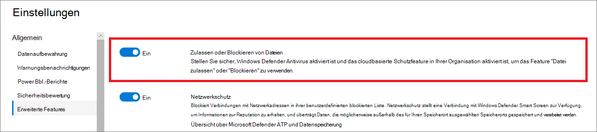

# Konfigurieren erweiterter Features in Defender for Endpoint

**Gilt für:**
- [Microsoft Defender für Endpunkt](https://go.microsoft.com/fwlink/p/?linkid=2154037)
- [Microsoft 365 Defender](https://go.microsoft.com/fwlink/?linkid=2118804)

[!INCLUDE [Microsoft 365 Defender rebranding](../../includes/microsoft-defender.md)]

> Möchten Sie Defender for Endpoint erleben? [Registrieren Sie sich für eine kostenlose Testversion.](https://www.microsoft.com/microsoft-365/windows/microsoft-defender-atp?ocid=docs-wdatp-advancedfeats-abovefoldlink)

Je nach den von Ihnen verwendeten Microsoft-Sicherheitsprodukten stehen Ihnen möglicherweise einige erweiterte Features zur Verfügung, in die Sie Defender for Endpoint integrieren können.

## Aktivieren erweiterter Features

1. Wählen Sie im Navigationsbereich Einstellungen **einrichten Erweiterte**  >  **Features aus.**
2. Wählen Sie das erweiterte Feature aus, das Sie konfigurieren möchten, und schalten Sie die Einstellung zwischen **Ein** und **Aus um.**
3. Klicken **Sie auf Einstellungen speichern**.

Verwenden Sie die folgenden erweiterten Features, um besser vor potenziell schädlichen Dateien zu schützen und während der Sicherheitsuntersuchungen bessere Einblicke zu erhalten.

## Automatisierte Untersuchung

Aktivieren Sie dieses Feature, um die Automatisierten Untersuchungs- und Korrekturfeatures des Diensts zu nutzen. Weitere Informationen finden Sie unter [Automatisierte Untersuchung](automated-investigations.md).

## Liveantwort

Aktivieren Sie dieses Feature, damit Benutzer mit den entsprechenden Berechtigungen eine Liveantwortsitzung auf Geräten starten können.

Weitere Informationen zu Rollenzuweisungen finden Sie unter [Erstellen und Verwalten von Rollen.](user-roles.md)

## Liveantwort für Server
Aktivieren Sie dieses Feature, damit Benutzer mit den entsprechenden Berechtigungen eine Liveantwortsitzung auf Servern starten können.

Weitere Informationen zu Rollenzuweisungen finden Sie unter [Erstellen und Verwalten von Rollen.](user-roles.md)

## Ausführung eines nicht signierten Skripts für Liveantworten

Wenn Sie dieses Feature aktivieren, können Sie nicht signierte Skripts in einer Liveantwortsitzung ausführen.

## PuA immer 2013
Potenziell unerwünschte Anwendungen (PUA) sind eine Kategorie von Software, die dazu führen kann, dass Ihr Computer langsam ausgeführt wird, unerwartete Anzeigen anzeigen oder im schlechtesten Fall andere Software installieren kann, die unerwartet oder unerwünscht sein kann. 

Aktivieren Sie dieses Feature, damit potenziell unerwünschte Anwendungen (PUA) auf allen Geräten in Ihrem Mandanten behoben werden, auch wenn der PUA-Schutz auf den Geräten nicht konfiguriert ist. Dies schützt Benutzer vor versehentlicher Installation unerwünschter Anwendungen auf ihrem Gerät. Wenn diese Einstellung deaktiviert ist, hängt die Behebung von der Gerätekonfiguration ab. 

## Einschränken der Korrelation auf bereichsierte Gerätegruppen
Diese Konfiguration kann für Szenarien verwendet werden, in denen lokale SOC-Vorgänge Warnungskorrelation nur auf Gerätegruppen beschränken möchten, auf die sie zugreifen können. Wenn Sie diese Einstellung aktivieren, wird ein Vorfall, der aus Warnungen besteht, dass geräteübergreifende Gruppen nicht mehr als einzelner Vorfall betrachtet werden. Der lokale SOC kann dann Maßnahmen gegen den Vorfall ergreifen, da er Zugriff auf eine der beteiligten Gerätegruppen hat. In der globalen Sicherheitsgruppe werden jedoch mehrere unterschiedliche Vorfälle nach Gerätegruppe anstelle eines Vorfalls angezeigt. Es wird nicht empfohlen, diese Einstellung zu aktivieren, es sei denn, dies überwiegt die Vorteile der Vorfallkorrelation in der gesamten Organisation.
>[!NOTE]
>Das Ändern dieser Einstellung wirkt sich nur auf zukünftige Warnungskorrelation aus.

## Aktivieren von EDR im Blockmodus
Endpunkterkennung und -reaktion (Endpoint Detection and Response, EDR) im Blockmodus bietet Schutz vor schädlichen Artefakten, auch wenn Microsoft Defender Antivirus im passiven Modus ausgeführt wird. Bei aktivierter EDR im Blockmodus werden schädliche Artefakte oder Verhaltensweisen blockiert, die auf einem Gerät erkannt werden. EDR im Blockmodus arbeitet hinter den Kulissen, um bösartige Artefakte zu bewerkden, die nach der Verletzung erkannt werden.

## Behebung von Warnungen durch Autoresolve

Für Mandanten, die unter oder nach Windows 10, Version 1809, erstellt wurden, ist die automatische Untersuchungs- und Behebungsfunktion standardmäßig so konfiguriert, dass Warnungen aufgelöst werden, bei denen der Ergebnisstatus der automatisierten Analyse "Keine Bedrohungen gefunden" oder "Behoben" ist.  Wenn Warnungen nicht automatisch aufgelöst werden sollen, müssen Sie das Feature manuell deaktivieren.

> [!TIP]
> Für Mandanten, die vor dieser Version erstellt wurden, müssen Sie dieses Feature manuell auf der Seite Erweiterte [Features aktivieren.](https://securitycenter.windows.com/preferences2/integration)

> [!NOTE]
>
> - Das Ergebnis der automatischen Lösungsaktion kann sich auf die Berechnung des Geräterisikoniveaus, die auf den aktiven Warnungen basiert, die auf einem Gerät gefunden wurden, beeinflussen.
> - Wenn ein Sicherheitsbetriebsanalyst den Status einer Warnung manuell auf "In Bearbeitung" oder "Aufgelöst" legt, überschreibt die Funktion für die automatische Lösung sie nicht.

## Zulassen oder Blockieren von Dateien

Das Blockieren ist nur verfügbar, wenn Ihre Organisation die folgenden Anforderungen erfüllt:

- Verwendet Microsoft Defender Antivirus als aktive Antischasoftwarelösung und,
- Das cloudbasierte Schutzfeature ist aktiviert

Mit diesem Feature können Sie potenziell schädliche Dateien in Ihrem Netzwerk blockieren. Durch das Blockieren einer Datei wird verhindert, dass sie auf Geräten in Ihrer Organisation gelesen, geschrieben oder ausgeführt wird.

So aktivieren **Sie Dateien zulassen oder** blockieren:

1. Wählen Sie im Navigationsbereich **Einstellungen**  >  **Erweiterte Features**  >  **Zulassen oder Blockieren von Datei aus.**

1. Umschalten der Einstellung zwischen **Ein** und **Aus**.

    

1. Wählen **Sie einstellungen speichern** unten auf der Seite aus.

Nachdem Sie dieses Feature aktivieren, können [Sie](respond-file-alerts.md#allow-or-block-file) Dateien über die Registerkarte Indikator **hinzufügen** auf der Profilseite einer Datei blockieren.

## Benutzerdefinierte Netzwerkindikatoren

Wenn Sie dieses Feature aktivieren, können Sie Indikatoren für IP-Adressen, Domänen oder URLs erstellen, die basierend auf Ihrer benutzerdefinierten Indikatorliste bestimmen, ob sie zugelassen oder blockiert werden.

Um dieses Feature verwenden zu können, müssen auf Geräten Windows 10, Version 1709 oder höher, ausgeführt werden. Sie sollten auch über Netzwerkschutz im Blockmodus und Version 4.18.1906.3 oder höher der Antischalwareplattform verfügen, siehe [KB 4052623](https://go.microsoft.com/fwlink/?linkid=2099834).

Weitere Informationen finden Sie unter [Manage indicators](manage-indicators.md).

> [!NOTE]
> Der Netzwerkschutz nutzt Reputationsdienste, die Anforderungen an Orten verarbeiten, die sich möglicherweise außerhalb des für Ihre Defender for Endpoint-Daten ausgewählten Speicherorts befinden.

## Schutz vor Manipulationen
Bei einigen Arten von Cyberangriffen versuchen schlechte Akteure, Sicherheitsfeatures, z. B. Virenschutz, auf Ihren Computern zu deaktivieren. Schlechte Akteure möchten Ihre Sicherheitsfeatures deaktivieren, um leichteren Zugriff auf Ihre Daten zu erhalten, Schadsoftware zu installieren oder Ihre Daten, Identität und Geräte anderweitig auszunutzen.

Manipulationsschutz sperrt Im Wesentlichen Microsoft Defender Antivirus und verhindert, dass Ihre Sicherheitseinstellungen über Apps und Methoden geändert werden.

Halten Sie den Manipulationsschutz aktiviert, um unerwünschte Änderungen an Ihrer Sicherheitslösung und ihren wesentlichen Features zu verhindern.

## Anzeigen von Benutzerdetails

Aktivieren Sie dieses Feature, damit Benutzerdetails in Azure Active Directory gespeichert sind. Details umfassen das Bild, den Namen, den Titel und die Abteilungsinformationen eines Benutzers bei der Untersuchung von Benutzerkontenentitäten. Informationen zum Benutzerkonto finden Sie in den folgenden Ansichten:

- Dashboard für Sicherheitsvorgänge
- Warnungswarteschlange
- Seite "Gerätedetails"

Weitere Informationen finden Sie unter [Untersuchen eines Benutzerkontos](investigate-user.md).

## Skype for Business-Integration

Wenn Sie die Skype for Business-Integration aktivieren, können Sie mit Benutzern über Skype for Business, E-Mail oder Telefon kommunizieren. Dies kann nützlich sein, wenn Sie mit dem Benutzer kommunizieren und Risiken mindern müssen.

> [!NOTE]
> Wenn ein Gerät vom Netzwerk isoliert wird, gibt es ein Popup, in dem Sie die Outlook- und Skype-Kommunikation aktivieren können, wodurch die Kommunikation mit dem Benutzer ermöglicht wird, während er vom Netzwerk getrennt ist. Diese Einstellung gilt für die Skype- und Outlook-Kommunikation, wenn sich Geräte im Isolationsmodus befinden.

## Microsoft Defender for Identity-Integration

Die Integration in Azure Advanced Threat Protection ermöglicht es Ihnen, direkt in ein anderes Microsoft Identity-Sicherheitsprodukt zu pivotieren. Azure Advanced Threat Protection erweitert eine Untersuchung um zusätzliche Einblicke zu einem mutmaßlich gefährdeten Konto und zugehörigen Ressourcen. Durch aktivieren dieses Feature bereichern Sie die gerätebasierte Untersuchungsfunktion, indem Sie aus identifikationsbezogener Sicht über das Netzwerk pivotieren.

> [!NOTE]
> Sie benötigen die entsprechende Lizenz, um dieses Feature zu aktivieren.

## Office 365 Threat Intelligence-Verbindung

Dieses Feature ist nur verfügbar, wenn Sie über ein aktives Office 365 E5 oder das Threat Intelligence-Add-On verfügen. Weitere Informationen finden Sie auf der Office 365 Enterprise E5-Produktseite.

Wenn Sie dieses Feature aktivieren, können Sie Daten aus Office 365 Advanced Threat Protection in Das Microsoft Defender Security Center integrieren, um eine umfassende Sicherheitsuntersuchung für Office 365-Postfächer und Windows-Geräte durchführen zu können.

> [!NOTE]
> Sie benötigen die entsprechende Lizenz, um dieses Feature zu aktivieren.

Um kontextbezogene Geräteintegration in Office 365 Threat Intelligence zu erhalten, müssen Sie die Defender for Endpoint-Einstellungen im Security & Compliance-Dashboard aktivieren. Weitere Informationen finden Sie unter [Threat investigation and response](https://docs.microsoft.com/microsoft-365/security/office-365-security/office-365-ti).

## Microsoft Threat Experts – Benachrichtigungen über gezielte Angriffe

Von den beiden Microsoft Threat Expert-Komponenten ist eine gezielte Angriffsbenachrichtigung allgemein verfügbar. Die Experten-bei-Bedarf-Funktion befindet sich noch in der Vorschau. Sie können die Experten-bei-Bedarf-Funktion nur verwenden, wenn Sie eine Vorschau beantragt haben und Ihre Anwendung genehmigt wurde. Sie können gezielte Angriffsbenachrichtigungen von Microsoft Threat Experts über das Benachrichtigungsdashboard ihres Defender for Endpoint-Portals und per E-Mail empfangen, wenn Sie es konfigurieren.

> [!NOTE]
> Die Microsoft Threat Experts-Funktion in Defender for Endpoint ist mit einer E5-Lizenz für [Enterprise Mobility + Security verfügbar.](https://www.microsoft.com/cloud-platform/enterprise-mobility-security)
## Microsoft Cloud App Security

Wenn Sie diese Einstellung aktivieren, werden Defender for Endpoint-Signale an Microsoft Cloud App Security weitergeleitet, um einen tieferen Einblick in die Verwendung von Cloudanwendung zu erhalten. Weitergeleitete Daten werden am gleichen Speicherort wie Ihre Cloud App Security-Daten gespeichert und verarbeitet.

> [!NOTE]
> Dieses Feature ist mit einer E5-Lizenz für [Enterprise Mobility + Security](https://www.microsoft.com/cloud-platform/enterprise-mobility-security) auf Geräten mit Windows 10, Version 1709 (Os Build 16299.1085 mit [KB4493441),](https://support.microsoft.com/help/4493441)Windows 10, verfügbar. Version 1803 (Betriebssystem build 17134.704 with [KB4493464](https://support.microsoft.com/help/4493464)), Windows 10, Version 1809 (OS Build 17763.379 with [KB4489899](https://support.microsoft.com/help/4489899)) oder höher Windows 10-Versionen.

## Microsoft-Sicherheitsbewertung

Weiterleitung von Microsoft Defender for Endpoint-Signalen an Microsoft Secure Score im Microsoft 365 Security Center. Wenn Sie dieses Feature aktivieren, erhält Microsoft Secure Score Einblick in die Sicherheitslage des Geräts. Weitergeleitete Daten werden am gleichen Speicherort wie Ihre Microsoft Secure Score-Daten gespeichert und verarbeitet.

### Aktivieren der Microsoft Defender for Endpoint-Integration über das Microsoft Defender for Identity-Portal

Um kontextbezogene Geräteintegration in Microsoft Defender for Identity zu erhalten, müssen Sie das Feature auch im Microsoft Defender for Identity-Portal aktivieren.

1. Melden Sie sich beim [Microsoft Defender for Identity-Portal mit](https://portal.atp.azure.com/) einer globalen Administrator- oder Sicherheitsadministratorrolle an.

2. Klicken **Sie auf Instanz erstellen**.

3. Umschalten Sie die Integrationseinstellung auf **Ein,** und klicken Sie auf **Speichern.**

Nachdem Sie die Integrationsschritte in beiden Portalen abgeschlossen haben, können Sie relevante Warnungen auf der Seite Gerätedetails oder Benutzerdetails anzeigen.

## Internet-Inhaltsfilterung
Blockieren Sie den Zugriff auf Websites, die unerwünschte Inhalte enthalten, und verfolgen Sie Webaktivitäten in allen Domänen. Erstellen Sie eine Webinhaltsfilterrichtlinie, um die Webinhaltskategorien anzugeben, die Sie [blockieren möchten.](https://security.microsoft.com/preferences2/web_content_filtering_policy) Stellen Sie sicher, dass Sie beim Bereitstellen der Microsoft Defender for Endpoint-Sicherheitsgrundlinie über [Netzwerkschutz im Sperrmodus verfügen.](https://devicemanagement.microsoft.com/#blade/Microsoft_Intune_Workflows/SecurityBaselineSummaryMenu/overview/templateType/2)

## Freigeben von Endpunktwarnungen mit Microsoft Compliance Center
Weitergeleitet Endpunktsicherheitswarnungen und deren Triagestatus an das Microsoft Compliance Center, sodass Sie Insider-Risikomanagementrichtlinien mit Warnungen verbessern und interne Risiken vor schaden verursachen können. Weitergeleitete Daten werden am gleichen Speicherort wie Ihre Office 365-Daten verarbeitet und gespeichert.

Nach dem Konfigurieren der [Sicherheitsrichtlinienverletzungsindikatoren](/microsoft-365/compliance/insider-risk-management-settings#indicators) in den Einstellungen für das Insiderrisikomanagement werden Defender for Endpoint-Warnungen für das Insiderrisikomanagement für anwendbare Benutzer freigegeben.

## Microsoft Intune-Verbindung

Defender for Endpoint kann in [Microsoft Intune](https://docs.microsoft.com/intune/what-is-intune) integriert werden, um den [risikobasierten bedingten](https://docs.microsoft.com/intune/advanced-threat-protection#enable-windows-defender-atp-in-intune)Zugriff auf Geräte zu ermöglichen. Wenn Sie [dieses Feature aktivieren,](configure-conditional-access.md)können Sie Defender for Endpoint-Geräteinformationen für Intune freigeben und so die Richtliniendurchsetzung verbessern.

> [!IMPORTANT]
> Sie müssen die Integration in Intune und Defender for Endpoint aktivieren, um dieses Feature verwenden zu können. Weitere Informationen zu bestimmten Schritten finden Sie unter [Configure Conditional Access in Defender for Endpoint](configure-conditional-access.md).

Dieses Feature ist nur verfügbar, wenn Sie über Folgendes verfügen:

- Ein lizenzierter Mandant für Enterprise Mobility + Security E3 und Windows E5 (oder Microsoft 365 Enterprise E5)
- Eine aktive Microsoft Intune-Umgebung, bei der Intune-verwaltete Windows [10-Geräte Azure AD beigetreten sind.](https://docs.microsoft.com/azure/active-directory/devices/concept-azure-ad-join/)

### Richtlinie für bedingten Zugriff

Wenn Sie die Intune-Integration aktivieren, erstellt Intune automatisch eine klassische Richtlinie für bedingten Zugriff (Conditional Access, CA). Diese klassische Zertifizierungsstellenrichtlinie ist eine Voraussetzung für das Einrichten von Statusberichten in Intune. Es sollte nicht gelöscht werden.

> [!NOTE]
> Die von Intune erstellte klassische Zertifizierungsstellenrichtlinie unterscheidet sich von modernen [Richtlinien](https://docs.microsoft.com/azure/active-directory/conditional-access/overview/)für bedingten Zugriff, die zum Konfigurieren von Endpunkten verwendet werden.

## Geräteermittlung
Hilft Ihnen, nicht verwaltete Geräte zu finden, die mit Ihrem Unternehmensnetzwerk verbunden sind, ohne dass zusätzliche Appliances oder aufwändige Prozessänderungen nötig sind. Mithilfe von integrierten Geräten können Sie nicht verwaltete Geräte in Ihrem Netzwerk finden und Sicherheitsrisiken und Risiken bewerten. Weitere Informationen finden Sie unter [Device discovery](device-discovery.md).

## Vorschaufeatures

Erfahren Sie mehr über neue Features in der Defender for Endpoint-Vorschauversion, und testen Sie als erstes die kommenden Features, indem Sie die Vorschaufunktion aktivieren.

Sie haben Zugriff auf anstehende Features, zu denen Sie Feedback geben können, um die Allgemeine Erfahrung zu verbessern, bevor Features allgemein verfügbar sind.

## Verwandte Themen

- [Aktualisieren von Einstellungen für die Datenaufbewahrung](data-retention-settings.md)
- [Warnungsbenachrichtigungen konfigurieren](configure-email-notifications.md)
