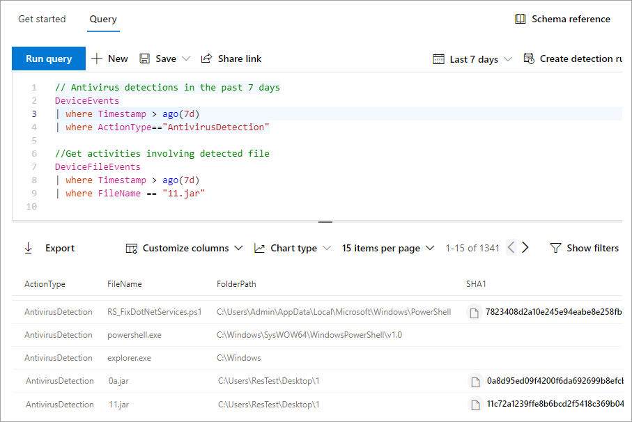

# <a name="learn-the-advanced-hunting-query-language"></a><span data-ttu-id="abc42-104">Erlernen der Abfragesprache für die erweiterte Suche</span><span class="sxs-lookup"><span data-stu-id="abc42-104">Learn the advanced hunting query language</span></span>

[!INCLUDE [Microsoft 365 Defender rebranding](../../includes/microsoft-defender.md)]

<span data-ttu-id="abc42-105">**Gilt für:**</span><span class="sxs-lookup"><span data-stu-id="abc42-105">**Applies to:**</span></span>
- [<span data-ttu-id="abc42-106">Defender für Endpunkt</span><span class="sxs-lookup"><span data-stu-id="abc42-106">Defender for Endpoint</span></span>](https://go.microsoft.com/fwlink/?linkid=2154037)

> <span data-ttu-id="abc42-107">Möchten Sie Defender for Endpoint erleben?</span><span class="sxs-lookup"><span data-stu-id="abc42-107">Want to experience Defender for Endpoint?</span></span> [<span data-ttu-id="abc42-108">Registrieren Sie sich für eine kostenlose Testversion.</span><span class="sxs-lookup"><span data-stu-id="abc42-108">Sign up for a free trial.</span></span>](https://www.microsoft.com/microsoft-365/windows/microsoft-defender-atp?ocid=docs-wdatp-advancedhunting-abovefoldlink)

<span data-ttu-id="abc42-109">Die erweiterte Suche basiert auf der [Kusto-Abfragesprache](https://docs.microsoft.com/azure/kusto/query/).</span><span class="sxs-lookup"><span data-stu-id="abc42-109">Advanced hunting is based on the [Kusto query language](https://docs.microsoft.com/azure/kusto/query/).</span></span> <span data-ttu-id="abc42-110">Sie können Kusto-Operatoren und -Anweisungen verwenden, um Abfragen zu erstellen, die Informationen in einem spezialisierten Schema [suchen.](advanced-hunting-schema-reference.md)</span><span class="sxs-lookup"><span data-stu-id="abc42-110">You can use Kusto operators and statements to construct queries that locate information in a specialized [schema](advanced-hunting-schema-reference.md).</span></span> <span data-ttu-id="abc42-111">Wenn Sie diese Konzepte besser verstehen möchten, führen Sie Ihre erste Abfrage aus.</span><span class="sxs-lookup"><span data-stu-id="abc42-111">To understand these concepts better, run your first query.</span></span>

## <a name="try-your-first-query"></a><span data-ttu-id="abc42-112">Testen Ihrer ersten Abfrage</span><span class="sxs-lookup"><span data-stu-id="abc42-112">Try your first query</span></span>

<span data-ttu-id="abc42-113">Wechseln Sie im Microsoft Defender Security Center zu **Erweiterte Suche,** um Ihre erste Abfrage ausführen.</span><span class="sxs-lookup"><span data-stu-id="abc42-113">In Microsoft Defender Security Center, go to **Advanced hunting** to run your first query.</span></span> <span data-ttu-id="abc42-114">Verwenden Sie das folgende Beispiel:</span><span class="sxs-lookup"><span data-stu-id="abc42-114">Use the following example:</span></span>

```kusto
// Finds PowerShell execution events that could involve a download
union DeviceProcessEvents, DeviceNetworkEvents
| where Timestamp > ago(7d)
// Pivoting on PowerShell processes
| where FileName in~ ("powershell.exe", "powershell_ise.exe")
// Suspicious commands
| where ProcessCommandLine has_any("WebClient",
    "DownloadFile",
    "DownloadData",
    "DownloadString",
    "WebRequest",
    "Shellcode",
    "http",
    "https")
| project Timestamp, DeviceName, InitiatingProcessFileName, InitiatingProcessCommandLine, 
FileName, ProcessCommandLine, RemoteIP, RemoteUrl, RemotePort, RemoteIPType
| top 100 by Timestamp
```
<span data-ttu-id="abc42-115">**[Ausführen dieser Abfrage bei der erweiterten Suche](https://securitycenter.windows.com/hunting?query=H4sIAAAAAAAEAI2TT0vDQBDF5yz4HUJPFcTqyZsXqyCIBFvxKNGWtpo_NVlbC8XP7m8mado0K5Zls8nkzdu3b2Z70pNAbmUmqYyk4D2UTJYyllwGMmWNGQHrN_NNvsSBzUBrbMFMiWieAx3xDEBl4GL4AuNd8B0bNgARENcdUmIZ3yM5liPwac3bN-YZPGPU5ET1rWDc7Ox4uod8YDp4MzI-GkjlX4Ne2nly0zEkKzFWh4ZE5sSuTN8Ehq5couvEMnvmUAhez-HsRBMipVa_W_OG6vEfGtT12JRHpqV064e1Kx04NsxFzXxW1aFjp_djXmDRPbfY3XMMcLogTz2bWZ2KqmIJI6q6wKe2WYnrRsa9KVeU9kCBBo2v7BzPxF_Bx2DKiqh63SGoRoc6Njti48z_yL71XHQAcgAur6rXRpcqH3l-4knZF23Utsbq2MircEqmw-G__xR1TdZ1r7zb7XLezmx3etkvGr-ze6NdGdW92azUfpcdluWvr-aqbh_nofnqcWI3aYyOsBV7giduRUO7187LMKTT5rxvHHX80_t8IeeMgLquvL7-Ak3q-kz8BAAA&runQuery=true&timeRangeId=week)**</span><span class="sxs-lookup"><span data-stu-id="abc42-115">**[Run this query in advanced hunting](https://securitycenter.windows.com/hunting?query=H4sIAAAAAAAEAI2TT0vDQBDF5yz4HUJPFcTqyZsXqyCIBFvxKNGWtpo_NVlbC8XP7m8mado0K5Zls8nkzdu3b2Z70pNAbmUmqYyk4D2UTJYyllwGMmWNGQHrN_NNvsSBzUBrbMFMiWieAx3xDEBl4GL4AuNd8B0bNgARENcdUmIZ3yM5liPwac3bN-YZPGPU5ET1rWDc7Ox4uod8YDp4MzI-GkjlX4Ne2nly0zEkKzFWh4ZE5sSuTN8Ehq5couvEMnvmUAhez-HsRBMipVa_W_OG6vEfGtT12JRHpqV064e1Kx04NsxFzXxW1aFjp_djXmDRPbfY3XMMcLogTz2bWZ2KqmIJI6q6wKe2WYnrRsa9KVeU9kCBBo2v7BzPxF_Bx2DKiqh63SGoRoc6Njti48z_yL71XHQAcgAur6rXRpcqH3l-4knZF23Utsbq2MircEqmw-G__xR1TdZ1r7zb7XLezmx3etkvGr-ze6NdGdW92azUfpcdluWvr-aqbh_nofnqcWI3aYyOsBV7giduRUO7187LMKTT5rxvHHX80_t8IeeMgLquvL7-Ak3q-kz8BAAA&runQuery=true&timeRangeId=week)**</span></span>

### <a name="describe-the-query-and-specify-the-tables-to-search"></a><span data-ttu-id="abc42-116">Beschreiben der Abfrage und Angeben der zu durchsuchende Tabellen</span><span class="sxs-lookup"><span data-stu-id="abc42-116">Describe the query and specify the tables to search</span></span>
<span data-ttu-id="abc42-117">Am Anfang der Abfrage wurde ein kurzer Kommentar hinzugefügt, um zu beschreiben, wofür er steht.</span><span class="sxs-lookup"><span data-stu-id="abc42-117">A short comment has been added to the beginning of the query to describe what it is for.</span></span> <span data-ttu-id="abc42-118">Dieser Kommentar hilft Ihnen, wenn Sie später entscheiden, die Abfrage zu speichern und sie für andere Personen in Ihrer Organisation zu teilen.</span><span class="sxs-lookup"><span data-stu-id="abc42-118">This comment helps if you later decide to save the query and share it with others in your organization.</span></span>

```kusto
// Finds PowerShell execution events that could involve a download
```
<span data-ttu-id="abc42-119">Die Abfrage selbst beginnt in der Regel mit einem Tabellennamen gefolgt von mehreren Elementen, die mit einer Pipe beginnen ( `|` ).</span><span class="sxs-lookup"><span data-stu-id="abc42-119">The query itself will typically start with a table name followed by several elements that start with a pipe (`|`).</span></span> <span data-ttu-id="abc42-120">In diesem Beispiel erstellen wir zunächst eine Vereinigung von zwei Tabellen und und fügen bei Bedarf  `DeviceProcessEvents` `DeviceNetworkEvents` piped-Elemente hinzu.</span><span class="sxs-lookup"><span data-stu-id="abc42-120">In this example, we start by creating a union of two tables,  `DeviceProcessEvents` and `DeviceNetworkEvents`, and add piped elements as needed.</span></span>

```kusto
union DeviceProcessEvents, DeviceNetworkEvents
```
### <a name="set-the-time-range"></a><span data-ttu-id="abc42-121">Festlegen des Zeitbereichs</span><span class="sxs-lookup"><span data-stu-id="abc42-121">Set the time range</span></span>
<span data-ttu-id="abc42-122">Das erste piped-Element ist ein Zeitfilter, der auf die vorherigen sieben Tage begrenzt ist.</span><span class="sxs-lookup"><span data-stu-id="abc42-122">The first piped element is a time filter scoped to the previous seven days.</span></span> <span data-ttu-id="abc42-123">Durch die Begrenzung des Zeitbereichs können Sie sicherstellen, dass Abfragen gut ausgeführt werden, verwaltbare Ergebnisse zurückgeben und keine Zeit zu einem Zeitverlauf führen.</span><span class="sxs-lookup"><span data-stu-id="abc42-123">Limiting the time range helps ensure that queries perform well, return manageable results, and don't time out.</span></span>

```kusto
| where Timestamp > ago(7d)
```

### <a name="check-specific-processes"></a><span data-ttu-id="abc42-124">Überprüfen bestimmter Prozesse</span><span class="sxs-lookup"><span data-stu-id="abc42-124">Check specific processes</span></span>
<span data-ttu-id="abc42-125">Auf den Zeitraum folgt sofort eine Suche nach Prozessdateinamen, die die PowerShell-Anwendung darstellen.</span><span class="sxs-lookup"><span data-stu-id="abc42-125">The time range is immediately followed by a search for process file names representing the PowerShell application.</span></span>

```kusto
// Pivoting on PowerShell processes
| where FileName in~ ("powershell.exe", "powershell_ise.exe")
```

### <a name="search-for-specific-command-strings"></a><span data-ttu-id="abc42-126">Suchen nach bestimmten Befehlszeichenfolgen</span><span class="sxs-lookup"><span data-stu-id="abc42-126">Search for specific command strings</span></span>
<span data-ttu-id="abc42-127">Anschließend sucht die Abfrage nach Zeichenfolgen in Befehlszeilen, die normalerweise zum Herunterladen von Dateien mithilfe von PowerShell verwendet werden.</span><span class="sxs-lookup"><span data-stu-id="abc42-127">Afterwards, the query looks for strings in command lines that are typically used to download files using PowerShell.</span></span>

```kusto
// Suspicious commands
| where ProcessCommandLine has_any("WebClient",
    "DownloadFile",
    "DownloadData",
    "DownloadString",
    "WebRequest",
    "Shellcode",
    "http",
    "https")
```

### <a name="customize-result-columns-and-length"></a><span data-ttu-id="abc42-128">Anpassen von Ergebnisspalten und -längen</span><span class="sxs-lookup"><span data-stu-id="abc42-128">Customize result columns and length</span></span> 
<span data-ttu-id="abc42-129">Nachdem Ihre Abfrage nun die zu suchende Daten eindeutig identifiziert, können Sie definieren, wie die Ergebnisse aussehen.</span><span class="sxs-lookup"><span data-stu-id="abc42-129">Now that your query clearly identifies the data you want to locate, you can define what the results look like.</span></span> <span data-ttu-id="abc42-130">`project` gibt bestimmte Spalten zurück und `top` beschränkt die Anzahl der Ergebnisse.</span><span class="sxs-lookup"><span data-stu-id="abc42-130">`project` returns specific columns, and `top` limits the number of results.</span></span> <span data-ttu-id="abc42-131">Diese Operatoren tragen dazu bei, sicherzustellen, dass die Ergebnisse gut formatiert und relativ groß und einfach zu verarbeiten sind.</span><span class="sxs-lookup"><span data-stu-id="abc42-131">These operators help ensure the results are well-formatted and reasonably large and easy to process.</span></span>

```kusto
| project Timestamp, DeviceName, InitiatingProcessFileName, InitiatingProcessCommandLine, 
FileName, ProcessCommandLine, RemoteIP, RemoteUrl, RemotePort, RemoteIPType
| top 100 by Timestamp
```

<span data-ttu-id="abc42-132">Wählen **Sie Abfrage ausführen aus,** um die Ergebnisse zu sehen.</span><span class="sxs-lookup"><span data-stu-id="abc42-132">Select **Run query** to see the results.</span></span> <span data-ttu-id="abc42-133">Verwenden Sie das Erweiterungssymbol oben rechts im Abfrage-Editor, um sich auf Ihre Suchabfrage und die Ergebnisse zu konzentrieren.</span><span class="sxs-lookup"><span data-stu-id="abc42-133">Use the expand icon at the top right of the query editor to focus on your hunting query and the results.</span></span> 


>[!TIP]
><span data-ttu-id="abc42-135">Sie können Abfrageergebnisse als Diagramme anzeigen und Filter schnell anpassen.</span><span class="sxs-lookup"><span data-stu-id="abc42-135">You can view query results as charts and quickly adjust filters.</span></span> <span data-ttu-id="abc42-136">Informationen zum Arbeiten [mit Abfrageergebnissen](advanced-hunting-query-results.md)</span><span class="sxs-lookup"><span data-stu-id="abc42-136">For guidance, [read about working with query results](advanced-hunting-query-results.md)</span></span>

## <a name="learn-common-query-operators-for-advanced-hunting"></a><span data-ttu-id="abc42-137">Erlernen häufig verwendeter Operatoren für die erweiterte Suche</span><span class="sxs-lookup"><span data-stu-id="abc42-137">Learn common query operators for advanced hunting</span></span>

<span data-ttu-id="abc42-138">Sie haben gerade Ihre erste Abfrage ausgeführt und haben eine allgemeine Vorstellung von deren Komponenten.</span><span class="sxs-lookup"><span data-stu-id="abc42-138">You've just run your first query and have a general idea of its components.</span></span> <span data-ttu-id="abc42-139">Es ist an der Zeit, ein wenig zurück zu fahren und einige Grundlagen zu erlernen.</span><span class="sxs-lookup"><span data-stu-id="abc42-139">It's time to backtrack slightly and learn some basics.</span></span> <span data-ttu-id="abc42-140">Die von der erweiterten Suche verwendete Kusto-Abfragesprache unterstützt eine Reihe von Operatoren, darunter die folgenden allgemeinen Operatoren.</span><span class="sxs-lookup"><span data-stu-id="abc42-140">The Kusto query language used by advanced hunting supports a range of operators, including the following common ones.</span></span>

| <span data-ttu-id="abc42-141">Operator</span><span class="sxs-lookup"><span data-stu-id="abc42-141">Operator</span></span> | <span data-ttu-id="abc42-142">Beschreibung und Verwendung</span><span class="sxs-lookup"><span data-stu-id="abc42-142">Description and usage</span></span> |
|--|--|
| `where` | <span data-ttu-id="abc42-143">Filtern einer Tabelle auf die Teilmenge von Zeilen, die einem Prädikat entsprechen.</span><span class="sxs-lookup"><span data-stu-id="abc42-143">Filter a table to the subset of rows that satisfy a predicate.</span></span> |
| `summarize` | <span data-ttu-id="abc42-144">Erstellen einer Tabelle, in der die Inhalte der Eingabetabelle gesammelt werden.</span><span class="sxs-lookup"><span data-stu-id="abc42-144">Produce a table that aggregates the content of the input table.</span></span> |
| `join` | <span data-ttu-id="abc42-145">Zusammenführen der Zeilen von zwei Tabellen, um eine neue Tabelle zu erstellen, indem Werte der angegebenen Spalten aus jeder Tabelle zugeordnet werden.</span><span class="sxs-lookup"><span data-stu-id="abc42-145">Merge the rows of two tables to form a new table by matching values of the specified column(s) from each table.</span></span> |
| `count` | <span data-ttu-id="abc42-146">Zurückgeben der Anzahl von Datensätzen im Eingabedatensatz.</span><span class="sxs-lookup"><span data-stu-id="abc42-146">Return the number of records in the input record set.</span></span> |
| `top` | <span data-ttu-id="abc42-147">Zurückgeben der ersten n Einträge, sortiert anhand der angegebenen Spalten.</span><span class="sxs-lookup"><span data-stu-id="abc42-147">Return the first N records sorted by the specified columns.</span></span> |
| `limit` | <span data-ttu-id="abc42-148">Zurückkehren nach oben zur angegebenen Zeilenanzahl.</span><span class="sxs-lookup"><span data-stu-id="abc42-148">Return up to the specified number of rows.</span></span> |
| `project` | <span data-ttu-id="abc42-149">Auswählen der Spalten, um neue berechnete Spalten aufzunehmen, umzubenennen, zu löschen oder einzufügen.</span><span class="sxs-lookup"><span data-stu-id="abc42-149">Select the columns to include, rename or drop, and insert new computed columns.</span></span> |
| `extend` | <span data-ttu-id="abc42-150">Erstellen von berechneten Spalten und Anfügen an das Resultset.</span><span class="sxs-lookup"><span data-stu-id="abc42-150">Create calculated columns and append them to the result set.</span></span> |
| `makeset` |  <span data-ttu-id="abc42-151">Zurückgeben eines dynamischen (JSON)-Arrays der Gruppe eindeutiger Werte, die der Ausdruck in der Gruppe verwendet.</span><span class="sxs-lookup"><span data-stu-id="abc42-151">Return a dynamic (JSON) array of the set of distinct values that Expr takes in the group.</span></span> |
| `find` | <span data-ttu-id="abc42-152">Suchen von Zeilen, die mit einem Prädikat über eine Reihe von Tabellen hinweg übereinstimmen.</span><span class="sxs-lookup"><span data-stu-id="abc42-152">Find rows that match a predicate across a set of tables.</span></span> |

<span data-ttu-id="abc42-153">Um ein Livebeispiel dieser Operatoren zu sehen, führen Sie sie im Abschnitt **Erste** Schritte auf der Seite erweiterte Suche aus.</span><span class="sxs-lookup"><span data-stu-id="abc42-153">To see a live example of these operators, run them from the **Get started** section of the advanced hunting page.</span></span>

## <a name="understand-data-types"></a><span data-ttu-id="abc42-154">Verstehen von Datentypen</span><span class="sxs-lookup"><span data-stu-id="abc42-154">Understand data types</span></span>

<span data-ttu-id="abc42-155">Die erweiterte Suche unterstützt Kusto-Datentypen, einschließlich der folgenden allgemeinen Typen:</span><span class="sxs-lookup"><span data-stu-id="abc42-155">Advanced hunting supports Kusto data types, including the following common types:</span></span>

| <span data-ttu-id="abc42-156">Datentyp</span><span class="sxs-lookup"><span data-stu-id="abc42-156">Data type</span></span> | <span data-ttu-id="abc42-157">Beschreibung und Auswirkungen der Abfrage</span><span class="sxs-lookup"><span data-stu-id="abc42-157">Description and query implications</span></span> |
|--|--|
| `datetime` | <span data-ttu-id="abc42-158">Daten- und Zeitinformationen, die in der Regel Ereigniszeitstempel darstellen.</span><span class="sxs-lookup"><span data-stu-id="abc42-158">Data and time information typically representing event timestamps.</span></span> [<span data-ttu-id="abc42-159">Siehe unterstützte Datums-/Uhrzeitformate</span><span class="sxs-lookup"><span data-stu-id="abc42-159">See supported datetime formats</span></span>](https://docs.microsoft.com/azure/data-explorer/kusto/query/scalar-data-types/datetime) |
| `string` | <span data-ttu-id="abc42-160">Zeichenzeichenfolge in UTF-8, eingeschlossen in einfache Anführungszeichen ( `'` ) oder doppelte Anführungszeichen ( `"` ).</span><span class="sxs-lookup"><span data-stu-id="abc42-160">Character string in UTF-8 enclosed in single quotes (`'`) or double quotes (`"`).</span></span> [<span data-ttu-id="abc42-161">Weitere Informationen zu Zeichenfolgen</span><span class="sxs-lookup"><span data-stu-id="abc42-161">Read more about strings</span></span>](https://docs.microsoft.com/azure/data-explorer/kusto/query/scalar-data-types/string) |
| `bool` | <span data-ttu-id="abc42-162">Dieser Datentyp unterstützt `true` oder `false` zustände.</span><span class="sxs-lookup"><span data-stu-id="abc42-162">This data type supports `true` or `false` states.</span></span> [<span data-ttu-id="abc42-163">Siehe unterstützte Literale und Operatoren</span><span class="sxs-lookup"><span data-stu-id="abc42-163">See supported literals and operators</span></span>](https://docs.microsoft.com/azure/data-explorer/kusto/query/scalar-data-types/bool) |
| `int` | <span data-ttu-id="abc42-164">32-Bit-Ganzzahl</span><span class="sxs-lookup"><span data-stu-id="abc42-164">32-bit integer</span></span>  |
| `long` | <span data-ttu-id="abc42-165">64-Bit-Ganzzahl</span><span class="sxs-lookup"><span data-stu-id="abc42-165">64-bit integer</span></span> |

<span data-ttu-id="abc42-166">Weitere Informationen zu diesen Datentypen finden Sie [unter Kusto scalar data types](https://docs.microsoft.com/azure/data-explorer/kusto/query/scalar-data-types/).</span><span class="sxs-lookup"><span data-stu-id="abc42-166">To learn more about these data types, [read about Kusto scalar data types](https://docs.microsoft.com/azure/data-explorer/kusto/query/scalar-data-types/).</span></span>

## <a name="get-help-as-you-write-queries"></a><span data-ttu-id="abc42-167">Hilfe beim Schreiben von Abfragen</span><span class="sxs-lookup"><span data-stu-id="abc42-167">Get help as you write queries</span></span>
<span data-ttu-id="abc42-168">Nutzen Sie die folgenden Funktionen, um Abfragen schneller zu schreiben:</span><span class="sxs-lookup"><span data-stu-id="abc42-168">Take advantage of the following functionality to write queries faster:</span></span>

- <span data-ttu-id="abc42-169">**Autouggest**– Beim Schreiben von Abfragen bietet die erweiterte Suche Vorschläge von IntelliSense.</span><span class="sxs-lookup"><span data-stu-id="abc42-169">**Autosuggest**—as you write queries, advanced hunting provides suggestions from IntelliSense.</span></span>
- <span data-ttu-id="abc42-170">**Schemastruktur**– Eine Schemadarstellung, die die Liste der Tabellen und deren Spalten enthält, wird neben Ihrem Arbeitsbereich bereitgestellt.</span><span class="sxs-lookup"><span data-stu-id="abc42-170">**Schema tree**—a schema representation that includes the list of tables and their columns is provided next to your working area.</span></span> <span data-ttu-id="abc42-171">Wenn Sie weitere Informationen erhalten möchten, zeigen Sie mit dem Mauszeiger auf ein Element.</span><span class="sxs-lookup"><span data-stu-id="abc42-171">For more information, hover over an item.</span></span> <span data-ttu-id="abc42-172">Doppelklicken Sie auf ein Element, um es im Abfrage-Editor einzufügen.</span><span class="sxs-lookup"><span data-stu-id="abc42-172">Double-click an item to insert it to the query editor.</span></span>
- <span data-ttu-id="abc42-173">**[Schemareferenz](advanced-hunting-schema-reference.md#get-schema-information-in-the-security-center)**– In-Portal-Referenz mit Tabellen- und Spaltenbeschreibungen sowie unterstützten Ereignistypen ( `ActionType` Werte) und Beispielabfragen</span><span class="sxs-lookup"><span data-stu-id="abc42-173">**[Schema reference](advanced-hunting-schema-reference.md#get-schema-information-in-the-security-center)**—in-portal reference with table and column descriptions as well as supported event types (`ActionType` values) and sample queries</span></span>

## <a name="work-with-multiple-queries-in-the-editor"></a><span data-ttu-id="abc42-174">Arbeiten mit mehreren Abfragen im Editor</span><span class="sxs-lookup"><span data-stu-id="abc42-174">Work with multiple queries in the editor</span></span>
<span data-ttu-id="abc42-175">Sie können den Abfrage-Editor verwenden, um mit mehreren Abfragen zu experimentieren.</span><span class="sxs-lookup"><span data-stu-id="abc42-175">You can use the query editor to experiment with multiple queries.</span></span> <span data-ttu-id="abc42-176">So verwenden Sie mehrere Abfragen:</span><span class="sxs-lookup"><span data-stu-id="abc42-176">To use multiple queries:</span></span>

- <span data-ttu-id="abc42-177">Trennen Sie jede Abfrage durch eine leere Zeile.</span><span class="sxs-lookup"><span data-stu-id="abc42-177">Separate each query with an empty line.</span></span>
- <span data-ttu-id="abc42-178">Platzieren Sie den Cursor auf einem beliebigen Teil einer Abfrage, um diese Abfrage auszuwählen, bevor Sie sie ausführen.</span><span class="sxs-lookup"><span data-stu-id="abc42-178">Place the cursor on any part of a query to select that query before running it.</span></span> <span data-ttu-id="abc42-179">Dadurch wird nur die ausgewählte Abfrage ausgeführt.</span><span class="sxs-lookup"><span data-stu-id="abc42-179">This will run only the selected query.</span></span> <span data-ttu-id="abc42-180">Wenn Sie eine andere Abfrage ausführen möchten, verschieben Sie den Cursor entsprechend, und wählen Sie **Abfrage ausführen aus.**</span><span class="sxs-lookup"><span data-stu-id="abc42-180">To run another query, move the cursor accordingly and select **Run query**.</span></span>

<span data-ttu-id="abc42-181">
 _Abfrage-Editor mit mehreren Abfragen_</span><span class="sxs-lookup"><span data-stu-id="abc42-181">
_Query editor with multiple queries_</span></span>

## <a name="use-sample-queries"></a><span data-ttu-id="abc42-182">Verwenden von Beispielabfragen</span><span class="sxs-lookup"><span data-stu-id="abc42-182">Use sample queries</span></span>

<span data-ttu-id="abc42-183">Der Abschnitt **Erste Schritte** bietet einige einfache Abfragen mit häufig verwendeten Operatoren.</span><span class="sxs-lookup"><span data-stu-id="abc42-183">The **Get started** section provides a few simple queries using commonly used operators.</span></span> <span data-ttu-id="abc42-184">Versuchen Sie, diese Abfragen auszuführen und kleine Änderungen daran vorzunehmen.</span><span class="sxs-lookup"><span data-stu-id="abc42-184">Try running these queries and making small modifications to them.</span></span>


> [!NOTE]
> <span data-ttu-id="abc42-186">Abgesehen von den einfachen Abfragebeispielen können Sie auch auf [freigegebene Abfragen](advanced-hunting-shared-queries.md) für bestimmte Szenarien zur Bedrohungssuche zugreifen.</span><span class="sxs-lookup"><span data-stu-id="abc42-186">Apart from the basic query samples, you can also access [shared queries](advanced-hunting-shared-queries.md) for specific threat hunting scenarios.</span></span> <span data-ttu-id="abc42-187">Erkunden Sie die freigegebenen Abfragen auf der linken Seite der Seite oder im [GitHub-Abfragerepository](https://aka.ms/hunting-queries).</span><span class="sxs-lookup"><span data-stu-id="abc42-187">Explore the shared queries on the left side of the page or the [GitHub query repository](https://aka.ms/hunting-queries).</span></span>

## <a name="access-comprehensive-query-language-reference"></a><span data-ttu-id="abc42-188">Zugriff auf umfassende Abfragesprachenreferenz</span><span class="sxs-lookup"><span data-stu-id="abc42-188">Access comprehensive query language reference</span></span>

<span data-ttu-id="abc42-189">Ausführliche Informationen zur Abfragesprache finden Sie unter [Kusto query language documentation](https://docs.microsoft.com/azure/kusto/query/).</span><span class="sxs-lookup"><span data-stu-id="abc42-189">For detailed information about the query language, see [Kusto query language documentation](https://docs.microsoft.com/azure/kusto/query/).</span></span>

## <a name="related-topics"></a><span data-ttu-id="abc42-190">Verwandte Themen</span><span class="sxs-lookup"><span data-stu-id="abc42-190">Related topics</span></span>
- [<span data-ttu-id="abc42-191">Übersicht über die erweiterte Suche</span><span class="sxs-lookup"><span data-stu-id="abc42-191">Advanced hunting overview</span></span>](advanced-hunting-overview.md)
- [<span data-ttu-id="abc42-192">Arbeiten mit Abfrageergebnissen</span><span class="sxs-lookup"><span data-stu-id="abc42-192">Work with query results</span></span>](advanced-hunting-query-results.md)
- [<span data-ttu-id="abc42-193">Verwenden freigegebener Abfragen</span><span class="sxs-lookup"><span data-stu-id="abc42-193">Use shared queries</span></span>](advanced-hunting-shared-queries.md)
- [<span data-ttu-id="abc42-194">Grundlegendes zum Schema</span><span class="sxs-lookup"><span data-stu-id="abc42-194">Understand the schema</span></span>](advanced-hunting-schema-reference.md)
- [<span data-ttu-id="abc42-195">Anwenden bewährter Methoden für Abfragen</span><span class="sxs-lookup"><span data-stu-id="abc42-195">Apply query best practices</span></span>](advanced-hunting-best-practices.md)
