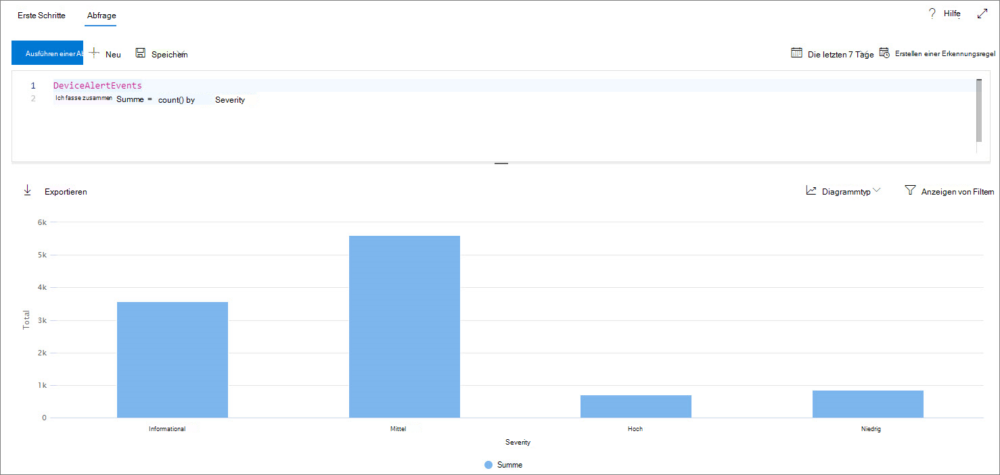
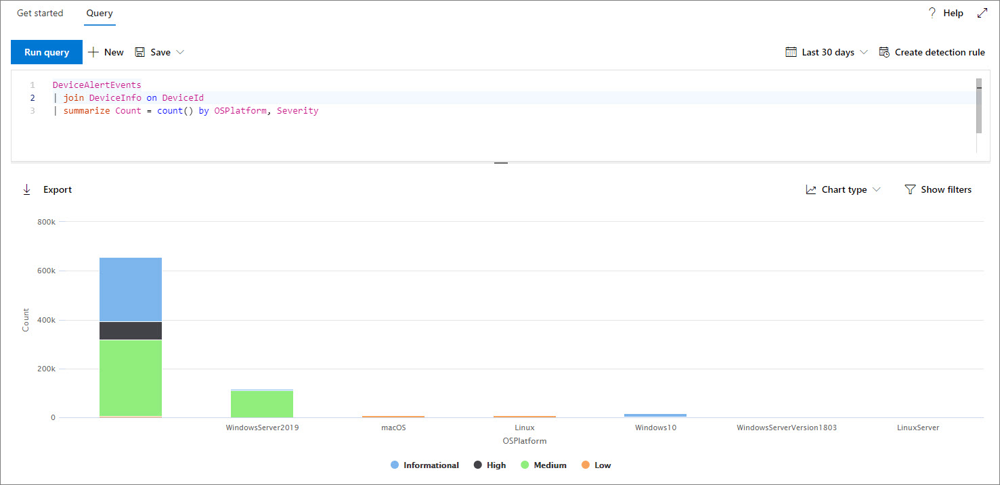
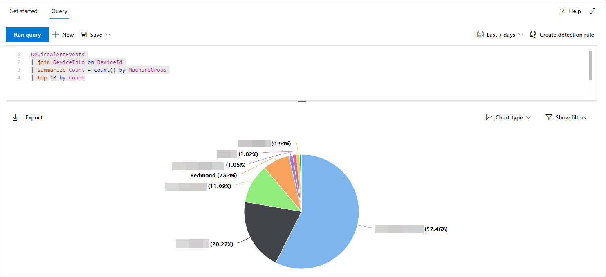

# <a name="work-with-advanced-hunting-query-results"></a><span data-ttu-id="d665c-104">Arbeiten mit erweiterten Suchabfrageergebnissen</span><span class="sxs-lookup"><span data-stu-id="d665c-104">Work with advanced hunting query results</span></span>

[!INCLUDE [Microsoft 365 Defender rebranding](../../includes/microsoft-defender.md)]

<span data-ttu-id="d665c-105">**Gilt für:**</span><span class="sxs-lookup"><span data-stu-id="d665c-105">**Applies to:**</span></span>
- [<span data-ttu-id="d665c-106">Microsoft Defender für Endpunkt</span><span class="sxs-lookup"><span data-stu-id="d665c-106">Microsoft Defender for Endpoint</span></span>](https://go.microsoft.com/fwlink/?linkid=2154037)

><span data-ttu-id="d665c-107">Möchten Sie Defender for Endpoint erleben?</span><span class="sxs-lookup"><span data-stu-id="d665c-107">Want to experience Defender for Endpoint?</span></span> [<span data-ttu-id="d665c-108">Registrieren Sie sich für eine kostenlose Testversion.</span><span class="sxs-lookup"><span data-stu-id="d665c-108">Sign up for a free trial.</span></span>](https://www.microsoft.com/microsoft-365/windows/microsoft-defender-atp?ocid=docs-wdatp-advancedhunting-abovefoldlink)

<span data-ttu-id="d665c-109">Während Sie Ihre [](advanced-hunting-overview.md) erweiterten Suchabfragen erstellen können, um sehr genaue Informationen zurück zu geben, können Sie auch mit den Abfrageergebnissen arbeiten, um weitere Einblicke zu erhalten und bestimmte Aktivitäten und Indikatoren zu untersuchen.</span><span class="sxs-lookup"><span data-stu-id="d665c-109">While you can construct your [advanced hunting](advanced-hunting-overview.md) queries to return very precise information, you can also work with the query results to gain further insight and investigate specific activities and indicators.</span></span> <span data-ttu-id="d665c-110">Sie können die folgenden Aktionen für Die Abfrageergebnisse ausführen:</span><span class="sxs-lookup"><span data-stu-id="d665c-110">You can take the following actions on your query results:</span></span>

- <span data-ttu-id="d665c-111">Anzeigen von Ergebnissen als Tabelle oder Diagramm</span><span class="sxs-lookup"><span data-stu-id="d665c-111">View results as a table or chart</span></span>
- <span data-ttu-id="d665c-112">Exportieren von Tabellen und Diagrammen</span><span class="sxs-lookup"><span data-stu-id="d665c-112">Export tables and charts</span></span>
- <span data-ttu-id="d665c-113">Drilldown zu detaillierten Entitätsinformationen</span><span class="sxs-lookup"><span data-stu-id="d665c-113">Drill down to detailed entity information</span></span>
- <span data-ttu-id="d665c-114">Optimieren Sie Ihre Abfragen direkt aus den Ergebnissen, oder wenden Sie Filter an.</span><span class="sxs-lookup"><span data-stu-id="d665c-114">Tweak your queries directly from the results or apply filters</span></span>

## <a name="view-query-results-as-a-table-or-chart"></a><span data-ttu-id="d665c-115">Anzeigen von Abfrageergebnissen als Tabelle oder Diagramm</span><span class="sxs-lookup"><span data-stu-id="d665c-115">View query results as a table or chart</span></span>
<span data-ttu-id="d665c-116">Standardmäßig zeigt die erweiterte Suche Abfrageergebnisse als tabellarische Daten an.</span><span class="sxs-lookup"><span data-stu-id="d665c-116">By default, advanced hunting displays query results as tabular data.</span></span> <span data-ttu-id="d665c-117">Sie können auch die gleichen Daten wie ein Diagramm anzeigen.</span><span class="sxs-lookup"><span data-stu-id="d665c-117">You can also display the same data as a chart.</span></span> <span data-ttu-id="d665c-118">Die erweiterte Suche unterstützt die folgenden Ansichten:</span><span class="sxs-lookup"><span data-stu-id="d665c-118">Advanced hunting supports the following views:</span></span>

| <span data-ttu-id="d665c-119">Ansichtstyp</span><span class="sxs-lookup"><span data-stu-id="d665c-119">View type</span></span> | <span data-ttu-id="d665c-120">Beschreibung</span><span class="sxs-lookup"><span data-stu-id="d665c-120">Description</span></span> |
| -- | -- |
| <span data-ttu-id="d665c-121">**Table**</span><span class="sxs-lookup"><span data-stu-id="d665c-121">**Table**</span></span> | <span data-ttu-id="d665c-122">Zeigt die Abfrageergebnisse im tabellarischen Format an</span><span class="sxs-lookup"><span data-stu-id="d665c-122">Displays the query results in tabular format</span></span> |
| <span data-ttu-id="d665c-123">**Säulendiagramm**</span><span class="sxs-lookup"><span data-stu-id="d665c-123">**Column chart**</span></span> | <span data-ttu-id="d665c-124">Rendert eine Reihe eindeutiger Elemente auf der X-Achse als vertikale Balken, deren Höhen numerische Werte aus einem anderen Feld darstellen</span><span class="sxs-lookup"><span data-stu-id="d665c-124">Renders a series of unique items on the x-axis as vertical bars whose heights represent numeric values from another field</span></span> |
| <span data-ttu-id="d665c-125">**Gestapelte Säulendiagramm**</span><span class="sxs-lookup"><span data-stu-id="d665c-125">**Stacked column chart**</span></span> | <span data-ttu-id="d665c-126">Rendert eine Reihe eindeutiger Elemente auf der X-Achse als gestapelte vertikale Balken, deren Höhen numerische Werte aus einem oder mehreren anderen Feldern darstellen</span><span class="sxs-lookup"><span data-stu-id="d665c-126">Renders a series of unique items on the x-axis as stacked vertical bars whose heights represent numeric values from one or more other fields</span></span> |
| <span data-ttu-id="d665c-127">**Kreisdiagramm**</span><span class="sxs-lookup"><span data-stu-id="d665c-127">**Pie chart**</span></span> | <span data-ttu-id="d665c-128">Rendert Abschnitts-Kreise, die eindeutige Elemente darstellen.</span><span class="sxs-lookup"><span data-stu-id="d665c-128">Renders sectional pies representing unique items.</span></span> <span data-ttu-id="d665c-129">Die Größe der einzelnen Kreise stellt numerische Werte aus einem anderen Feld dar.</span><span class="sxs-lookup"><span data-stu-id="d665c-129">The size of each pie represents numeric values from another field.</span></span> |
| <span data-ttu-id="d665c-130">**Donut-Diagramm**</span><span class="sxs-lookup"><span data-stu-id="d665c-130">**Donut chart**</span></span> | <span data-ttu-id="d665c-131">Rendert Abschnittsbögen, die eindeutige Elemente darstellen.</span><span class="sxs-lookup"><span data-stu-id="d665c-131">Renders sectional arcs representing unique items.</span></span> <span data-ttu-id="d665c-132">Die Länge jedes Bogens stellt numerische Werte aus einem anderen Feld dar.</span><span class="sxs-lookup"><span data-stu-id="d665c-132">The length of each arc represents numeric values from another field.</span></span> |
| <span data-ttu-id="d665c-133">**Liniendiagramm**</span><span class="sxs-lookup"><span data-stu-id="d665c-133">**Line chart**</span></span> | <span data-ttu-id="d665c-134">Zeichnet numerische Werte für eine Reihe eindeutiger Elemente und verbindet die plotten Werte.</span><span class="sxs-lookup"><span data-stu-id="d665c-134">Plots numeric values for a series of unique items and connects the plotted values</span></span> |
| <span data-ttu-id="d665c-135">**Punktdiagramm**</span><span class="sxs-lookup"><span data-stu-id="d665c-135">**Scatter chart**</span></span> | <span data-ttu-id="d665c-136">Zeichnet numerische Werte für eine Reihe eindeutiger Elemente</span><span class="sxs-lookup"><span data-stu-id="d665c-136">Plots numeric values for a series of unique items</span></span> |
| <span data-ttu-id="d665c-137">**Flächendiagramm**</span><span class="sxs-lookup"><span data-stu-id="d665c-137">**Area chart**</span></span> | <span data-ttu-id="d665c-138">Zeichnet numerische Werte für eine Reihe eindeutiger Elemente und füllt die Abschnitte unterhalb der dargestellten Werte aus.</span><span class="sxs-lookup"><span data-stu-id="d665c-138">Plots numeric values for a series of unique items and fills the sections below the plotted values</span></span> |

### <a name="construct-queries-for-effective-charts"></a><span data-ttu-id="d665c-139">Erstellen von Abfragen für effektive Diagramme</span><span class="sxs-lookup"><span data-stu-id="d665c-139">Construct queries for effective charts</span></span>
<span data-ttu-id="d665c-140">Beim Rendern von Diagrammen identifiziert die erweiterte Suche automatisch die von Interesse interessierten Spalten und die numerischen Werte, die aggregiert werden sollen.</span><span class="sxs-lookup"><span data-stu-id="d665c-140">When rendering charts, advanced hunting automatically identifies columns of interest and the numeric values to aggregate.</span></span> <span data-ttu-id="d665c-141">Um aussagekräftige Diagramme zu erhalten, erstellen Sie Ihre Abfragen, um die spezifischen Werte zurück zu geben, die visualisiert angezeigt werden möchten.</span><span class="sxs-lookup"><span data-stu-id="d665c-141">To get meaningful charts, construct your queries to return the specific values you want to see visualized.</span></span> <span data-ttu-id="d665c-142">Hier sind einige Beispielabfragen und die resultierenden Diagramme.</span><span class="sxs-lookup"><span data-stu-id="d665c-142">Here are some sample queries and the resulting charts.</span></span>

#### <a name="alerts-by-severity"></a><span data-ttu-id="d665c-143">Warnungen nach Schweregrad</span><span class="sxs-lookup"><span data-stu-id="d665c-143">Alerts by severity</span></span>
<span data-ttu-id="d665c-144">Verwenden Sie den Operator, um eine numerische Anzahl der Werte zu `summarize` erhalten, die Sie diagrammen möchten.</span><span class="sxs-lookup"><span data-stu-id="d665c-144">Use the `summarize` operator to obtain a numeric count of the values you want to chart.</span></span> <span data-ttu-id="d665c-145">Die folgende Abfrage verwendet den Operator, um die Anzahl der Warnungen nach `summarize` Schweregrad zu erhalten.</span><span class="sxs-lookup"><span data-stu-id="d665c-145">The query below uses the `summarize` operator to get the number of alerts by severity.</span></span>

```kusto
DeviceAlertEvents
| summarize Total = count() by Severity
```
<span data-ttu-id="d665c-146">Beim Rendern der Ergebnisse zeigt ein Spaltendiagramm jeden Schweregrad als separate Spalte an:</span><span class="sxs-lookup"><span data-stu-id="d665c-146">When rendering the results, a column chart displays each severity value as a separate column:</span></span>

<span data-ttu-id="d665c-147">
 *als Spaltendiagramm angezeigt werden*</span><span class="sxs-lookup"><span data-stu-id="d665c-147">
*Query results for alerts by severity displayed as a column chart*</span></span>

#### <a name="alert-severity-by-operating-system"></a><span data-ttu-id="d665c-148">Warnungsschweregrad nach Betriebssystem</span><span class="sxs-lookup"><span data-stu-id="d665c-148">Alert severity by operating system</span></span>
<span data-ttu-id="d665c-149">Sie können den Operator auch `summarize` verwenden, um Ergebnisse für die Diagrammwerte aus mehreren Feldern vorzubereiten.</span><span class="sxs-lookup"><span data-stu-id="d665c-149">You could also use the `summarize` operator to prepare results for charting values from multiple fields.</span></span> <span data-ttu-id="d665c-150">Sie sollten beispielsweise wissen, wie Warnungsschweregrade auf betriebssystemübergreifend verteilt werden.</span><span class="sxs-lookup"><span data-stu-id="d665c-150">For example, you might want to understand how alert severities are distributed across operating systems (OS).</span></span> 

<span data-ttu-id="d665c-151">Die folgende Abfrage verwendet einen Operator, um Betriebssysteminformationen aus der Tabelle zu ziehen, und verwendet dann die Anzahl von Werten in den Spalten und `join` `DeviceInfo` in den `summarize` `OSPlatform` `Severity` Spalten:</span><span class="sxs-lookup"><span data-stu-id="d665c-151">The query below uses a `join` operator to pull in OS information from the `DeviceInfo` table, and then uses `summarize` to count values in both the `OSPlatform` and `Severity` columns:</span></span>

```kusto
DeviceAlertEvents
| join DeviceInfo on DeviceId
| summarize Count = count() by OSPlatform, Severity
```
<span data-ttu-id="d665c-152">Diese Ergebnisse werden am besten mithilfe eines gestapelten Säulendiagramms visualisiert:</span><span class="sxs-lookup"><span data-stu-id="d665c-152">These results are best visualized using a stacked column chart:</span></span>

<span data-ttu-id="d665c-153">
 *gestapeltes Diagramm angezeigt werden*</span><span class="sxs-lookup"><span data-stu-id="d665c-153">
*Query results for alerts by OS and severity displayed as a stacked chart*</span></span>

#### <a name="top-ten-device-groups-with-alerts"></a><span data-ttu-id="d665c-154">Die zehn besten Gerätegruppen mit Warnungen</span><span class="sxs-lookup"><span data-stu-id="d665c-154">Top ten device groups with alerts</span></span>
<span data-ttu-id="d665c-155">Wenn Sie es mit einer Liste von Werten zu tun haben, die nicht endlich ist, können Sie den Operator verwenden, um nur die Werte mit den meisten `Top` Instanzen zu diagrammieren.</span><span class="sxs-lookup"><span data-stu-id="d665c-155">If you're dealing with a list of values that isn’t finite, you can use the `Top` operator to chart only the values with the most instances.</span></span> <span data-ttu-id="d665c-156">Um beispielsweise die zehn wichtigsten Gerätegruppen mit den meisten Warnungen zu erhalten, verwenden Sie die folgende Abfrage:</span><span class="sxs-lookup"><span data-stu-id="d665c-156">For example, to get the top ten device groups with the most alerts, use the query below:</span></span>

```kusto
DeviceAlertEvents
| join DeviceInfo on DeviceId
| summarize Count = count() by MachineGroup
| top 10 by Count
```
<span data-ttu-id="d665c-157">Verwenden Sie die Kreisdiagrammansicht, um die Verteilung auf die obersten Gruppen effektiv zu zeigen:</span><span class="sxs-lookup"><span data-stu-id="d665c-157">Use the pie chart view to effectively show distribution across the top groups:</span></span>

<span data-ttu-id="d665c-158">
 *Warnungen über Gerätegruppen hinweg zeigt*</span><span class="sxs-lookup"><span data-stu-id="d665c-158">
*Pie chart showing distribution of alerts across device groups*</span></span>

#### <a name="malware-detections-over-time"></a><span data-ttu-id="d665c-159">Schadsoftwareerkennungen im Laufe der Zeit</span><span class="sxs-lookup"><span data-stu-id="d665c-159">Malware detections over time</span></span>
<span data-ttu-id="d665c-160">Mithilfe des Operators mit der Funktion können Sie im Laufe der Zeit nach Ereignissen mit `summarize` `bin()` einem bestimmten Indikator suchen.</span><span class="sxs-lookup"><span data-stu-id="d665c-160">Using the `summarize` operator with the `bin()` function, you can check for events involving a particular indicator over time.</span></span> <span data-ttu-id="d665c-161">Die folgende Abfrage zählt Erkennungen einer EICAR-Testdatei in 30-Minuten-Intervallen, um Spitzen bei der Erkennung dieser Datei zu erkennen:</span><span class="sxs-lookup"><span data-stu-id="d665c-161">The query below counts detections of an EICAR test file at 30 minute intervals to show spikes in detections of that file:</span></span>

```kusto
DeviceEvents
| where ActionType == "AntivirusDetection"
| where SHA1 == "3395856ce81f2b7382dee72602f798b642f14140"
| summarize Detections = count() by bin(Timestamp, 30m)
```
<span data-ttu-id="d665c-162">Im folgenden Liniendiagramm werden Zeiträume mit weiteren Erkennungen der Testsoftware deutlich hervorgehoben:</span><span class="sxs-lookup"><span data-stu-id="d665c-162">The line chart below clearly highlights time periods with more detections of the test malware:</span></span> 

<span data-ttu-id="d665c-163">
 *Zeit zeigt*</span><span class="sxs-lookup"><span data-stu-id="d665c-163">
*Line chart showing the number of detections of a test malware over time*</span></span>


## <a name="export-tables-and-charts"></a><span data-ttu-id="d665c-164">Exportieren von Tabellen und Diagrammen</span><span class="sxs-lookup"><span data-stu-id="d665c-164">Export tables and charts</span></span>
<span data-ttu-id="d665c-165">Wählen Sie nach dem Ausführen einer Abfrage **Exportieren** aus, um die Ergebnisse in der lokalen Datei zu speichern.</span><span class="sxs-lookup"><span data-stu-id="d665c-165">After running a query, select **Export** to save the results to local file.</span></span> <span data-ttu-id="d665c-166">Die ausgewählte Ansicht bestimmt, wie die Ergebnisse exportiert werden:</span><span class="sxs-lookup"><span data-stu-id="d665c-166">Your chosen view determines how the results are exported:</span></span>

- <span data-ttu-id="d665c-167">**Tabellenansicht** – Die Abfrageergebnisse werden in tabellarischer Form als Microsoft Excel-Arbeitsmappe exportiert.</span><span class="sxs-lookup"><span data-stu-id="d665c-167">**Table view** — the query results are exported in tabular form as a Microsoft Excel workbook</span></span>
- <span data-ttu-id="d665c-168">**Jedes Diagramm** – die Abfrageergebnisse werden als JPEG-Bild des gerenderten Diagramms exportiert.</span><span class="sxs-lookup"><span data-stu-id="d665c-168">**Any chart** — the query results are exported as a JPEG image of the rendered chart</span></span>

## <a name="drill-down-from-query-results"></a><span data-ttu-id="d665c-169">Drilldown aus Abfrageergebnissen</span><span class="sxs-lookup"><span data-stu-id="d665c-169">Drill down from query results</span></span>
<span data-ttu-id="d665c-170">Um weitere Informationen zu Entitäten wie Geräten, Dateien, Benutzern, IP-Adressen und URLs in den Abfrageergebnissen anzeigen zu können, klicken Sie einfach auf die Entitäts-ID.</span><span class="sxs-lookup"><span data-stu-id="d665c-170">To view more information about entities, such as devices, files, users, IP addresses, and URLs, in your query results, simply click the entity identifier.</span></span> <span data-ttu-id="d665c-171">Dadurch wird eine detaillierte Profilseite für die ausgewählte Entität geöffnet.</span><span class="sxs-lookup"><span data-stu-id="d665c-171">This opens a detailed profile page for the selected entity.</span></span>

<span data-ttu-id="d665c-172">Um einen Datensatz in den Abfrageergebnissen schnell zu überprüfen, wählen Sie die entsprechende Zeile aus, um den Datensatzbereich überprüfen zu öffnen.</span><span class="sxs-lookup"><span data-stu-id="d665c-172">To quickly inspect a record in your query results, select the corresponding row to open the Inspect record panel.</span></span> <span data-ttu-id="d665c-173">Der Bereich stellt die folgenden Informationen basierend auf dem ausgewählten Datensatz zur Verfügung:</span><span class="sxs-lookup"><span data-stu-id="d665c-173">The panel provides the following information based on the selected record:</span></span>

- <span data-ttu-id="d665c-174">**Assets** – Eine zusammengefasste Ansicht der hauptaktiven Objekte (Postfächer, Geräte und Benutzer), die in dem Datensatz enthalten sind, bereichert mit verfügbaren Informationen, z. B. Risiko- und Risikostufen</span><span class="sxs-lookup"><span data-stu-id="d665c-174">**Assets** — A summarized view of the main assets (mailboxes, devices, and users) found in the record, enriched with available information, such as risk and exposure levels</span></span>
- <span data-ttu-id="d665c-175">**Prozessstruktur** – Ein Diagramm, das für Datensätze mit Prozessinformationen generiert und mithilfe verfügbarer Kontextinformationen bereichert wird; Im Allgemeinen können Abfragen, die mehr Spalten zurückgeben, zu reichhaltigeren Prozessstrukturen führen.</span><span class="sxs-lookup"><span data-stu-id="d665c-175">**Process tree** — A chart generated for records with process information and enriched using available contextual information; in general, queries that return more columns can result in richer process trees.</span></span>
- <span data-ttu-id="d665c-176">**Alle Details** – Listet alle Werte aus den Spalten im Datensatz auf.</span><span class="sxs-lookup"><span data-stu-id="d665c-176">**All details** — Lists all the values from the columns in the record</span></span>

## <a name="tweak-your-queries-from-the-results"></a><span data-ttu-id="d665c-177">Optimieren von Abfragen aus den Ergebnissen</span><span class="sxs-lookup"><span data-stu-id="d665c-177">Tweak your queries from the results</span></span>
<span data-ttu-id="d665c-178">Klicken Sie mit der rechten Maustaste auf einen Wert im Resultset, um die Abfrage schnell zu erweitern.</span><span class="sxs-lookup"><span data-stu-id="d665c-178">Right-click a value in the result set to quickly enhance your query.</span></span> <span data-ttu-id="d665c-179">Sie können die folgenden Optionen für Folgendes verwenden:</span><span class="sxs-lookup"><span data-stu-id="d665c-179">You can use the options to:</span></span>

- <span data-ttu-id="d665c-180">Explizites Suchen nach dem ausgewählten Wert (`==`)</span><span class="sxs-lookup"><span data-stu-id="d665c-180">Explicitly look for the selected value (`==`)</span></span>
- <span data-ttu-id="d665c-181">Ausschließen des ausgewählten Werts aus der Abfrage (`!=`)</span><span class="sxs-lookup"><span data-stu-id="d665c-181">Exclude the selected value from the query (`!=`)</span></span>
- <span data-ttu-id="d665c-182">Abrufen weiterer erweiterter Operatoren zum Hinzufügen des Werts zu Ihrer Abfrage, z. B. `contains`, `starts with` und `ends with`</span><span class="sxs-lookup"><span data-stu-id="d665c-182">Get more advanced operators for adding the value to your query, such as `contains`, `starts with` and `ends with`</span></span> 


## <a name="filter-the-query-results"></a><span data-ttu-id="d665c-184">Filtern der Abfrageergebnisse</span><span class="sxs-lookup"><span data-stu-id="d665c-184">Filter the query results</span></span>
<span data-ttu-id="d665c-185">Die im rechten Bereich angezeigten Filter enthalten eine Zusammenfassung des Ergebnissets.</span><span class="sxs-lookup"><span data-stu-id="d665c-185">The filters displayed in the right pane provide a summary of the result set.</span></span> <span data-ttu-id="d665c-186">Jede Spalte verfügt über einen eigenen Abschnitt im Bereich, in dem jeweils die in dieser Spalte gefundenen Werte und die Anzahl der Instanzen aufgeführt sind.</span><span class="sxs-lookup"><span data-stu-id="d665c-186">Every column has its own section in the pane, each of which lists the values found in that column, and the number of instances.</span></span>

<span data-ttu-id="d665c-187">Verfeinern Sie Ihre Abfrage, indem Sie die Schaltflächen oder für die Werte `+` `-` auswählen, die Sie ein- oder ausschließen möchten.</span><span class="sxs-lookup"><span data-stu-id="d665c-187">Refine your query by selecting the `+` or `-` buttons on the values that you want to include or exclude.</span></span> <span data-ttu-id="d665c-188">Wählen Sie dann **Abfrage ausführen aus.**</span><span class="sxs-lookup"><span data-stu-id="d665c-188">Then select **Run query**.</span></span>


<span data-ttu-id="d665c-190">Sobald der Filter zum Ändern der Abfrage angewendet und die Abfrage ausgeführt wurde, werden die Ergebnisse entsprechend aktualisiert.</span><span class="sxs-lookup"><span data-stu-id="d665c-190">Once you apply the filter to modify the query and then run the query, the results are updated accordingly.</span></span>

## <a name="related-topics"></a><span data-ttu-id="d665c-191">Verwandte Themen</span><span class="sxs-lookup"><span data-stu-id="d665c-191">Related topics</span></span>
- [<span data-ttu-id="d665c-192">Übersicht über die erweiterte Suche</span><span class="sxs-lookup"><span data-stu-id="d665c-192">Advanced hunting overview</span></span>](advanced-hunting-overview.md)
- [<span data-ttu-id="d665c-193">Lernen der Abfragesprache</span><span class="sxs-lookup"><span data-stu-id="d665c-193">Learn the query language</span></span>](advanced-hunting-query-language.md)
- [<span data-ttu-id="d665c-194">Verwenden freigegebener Abfragen</span><span class="sxs-lookup"><span data-stu-id="d665c-194">Use shared queries</span></span>](advanced-hunting-shared-queries.md)
- [<span data-ttu-id="d665c-195">Grundlegendes zum Schema</span><span class="sxs-lookup"><span data-stu-id="d665c-195">Understand the schema</span></span>](advanced-hunting-schema-reference.md)
- [<span data-ttu-id="d665c-196">Anwenden bewährter Methoden für Abfragen</span><span class="sxs-lookup"><span data-stu-id="d665c-196">Apply query best practices</span></span>](advanced-hunting-best-practices.md)
- [<span data-ttu-id="d665c-197">Benutzerdefinierte Erkennungen – Übersicht</span><span class="sxs-lookup"><span data-stu-id="d665c-197">Custom detections overview</span></span>](overview-custom-detections.md)
