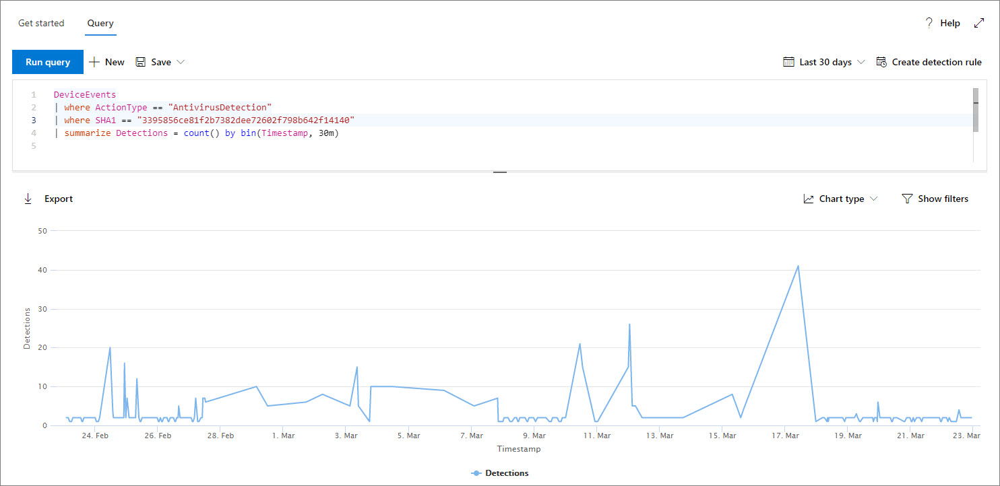
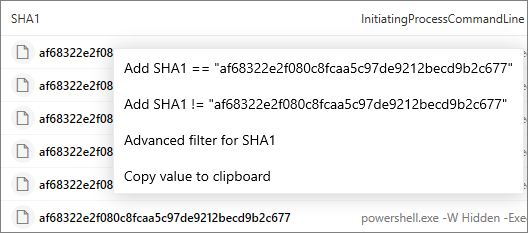

# <a name="work-with-advanced-hunting-query-results"></a>Arbeiten mit erweiterten Suchabfrageergebnissen

[!INCLUDE [Microsoft 365 Defender rebranding](../../includes/microsoft-defender.md)]

**Gilt für:**
- [Microsoft Defender für Endpunkt](https://go.microsoft.com/fwlink/?linkid=2154037)

>Möchten Sie Defender for Endpoint erleben? [Registrieren Sie sich für eine kostenlose Testversion.](https://www.microsoft.com/microsoft-365/windows/microsoft-defender-atp?ocid=docs-wdatp-advancedhunting-abovefoldlink)

Während Sie Ihre [](advanced-hunting-overview.md) erweiterten Suchabfragen erstellen können, um sehr genaue Informationen zurück zu geben, können Sie auch mit den Abfrageergebnissen arbeiten, um weitere Einblicke zu erhalten und bestimmte Aktivitäten und Indikatoren zu untersuchen. Sie können die folgenden Aktionen für Die Abfrageergebnisse ausführen:

- Anzeigen von Ergebnissen als Tabelle oder Diagramm
- Exportieren von Tabellen und Diagrammen
- Drilldown zu detaillierten Entitätsinformationen
- Optimieren Sie Ihre Abfragen direkt aus den Ergebnissen, oder wenden Sie Filter an.

## <a name="view-query-results-as-a-table-or-chart"></a>Anzeigen von Abfrageergebnissen als Tabelle oder Diagramm
Standardmäßig zeigt die erweiterte Suche Abfrageergebnisse als tabellarische Daten an. Sie können auch die gleichen Daten wie ein Diagramm anzeigen. Die erweiterte Suche unterstützt die folgenden Ansichten:

| Ansichtstyp | Beschreibung |
| -- | -- |
| **Table** | Zeigt die Abfrageergebnisse im tabellarischen Format an |
| **Säulendiagramm** | Rendert eine Reihe eindeutiger Elemente auf der X-Achse als vertikale Balken, deren Höhen numerische Werte aus einem anderen Feld darstellen |
| **Gestapelte Säulendiagramm** | Rendert eine Reihe eindeutiger Elemente auf der X-Achse als gestapelte vertikale Balken, deren Höhen numerische Werte aus einem oder mehreren anderen Feldern darstellen |
| **Kreisdiagramm** | Rendert Abschnitts-Kreise, die eindeutige Elemente darstellen. Die Größe der einzelnen Kreise stellt numerische Werte aus einem anderen Feld dar. |
| **Donut-Diagramm** | Rendert Abschnittsbögen, die eindeutige Elemente darstellen. Die Länge jedes Bogens stellt numerische Werte aus einem anderen Feld dar. |
| **Liniendiagramm** | Zeichnet numerische Werte für eine Reihe eindeutiger Elemente und verbindet die plotten Werte. |
| **Punktdiagramm** | Zeichnet numerische Werte für eine Reihe eindeutiger Elemente |
| **Flächendiagramm** | Zeichnet numerische Werte für eine Reihe eindeutiger Elemente und füllt die Abschnitte unterhalb der dargestellten Werte aus. |

### <a name="construct-queries-for-effective-charts"></a>Erstellen von Abfragen für effektive Diagramme
Beim Rendern von Diagrammen identifiziert die erweiterte Suche automatisch die von Interesse interessierten Spalten und die numerischen Werte, die aggregiert werden sollen. Um aussagekräftige Diagramme zu erhalten, erstellen Sie Ihre Abfragen, um die spezifischen Werte zurück zu geben, die visualisiert angezeigt werden möchten. Hier sind einige Beispielabfragen und die resultierenden Diagramme.

#### <a name="alerts-by-severity"></a>Warnungen nach Schweregrad
Verwenden Sie den Operator, um eine numerische Anzahl der Werte zu `summarize` erhalten, die Sie diagrammen möchten. Die folgende Abfrage verwendet den Operator, um die Anzahl der Warnungen nach `summarize` Schweregrad zu erhalten.

```kusto
DeviceAlertEvents
| summarize Total = count() by Severity
```
Beim Rendern der Ergebnisse zeigt ein Spaltendiagramm jeden Schweregrad als separate Spalte an:


 *als Spaltendiagramm angezeigt werden*

#### <a name="alert-severity-by-operating-system"></a>Warnungsschweregrad nach Betriebssystem
Sie können den Operator auch `summarize` verwenden, um Ergebnisse für die Diagrammwerte aus mehreren Feldern vorzubereiten. Sie sollten beispielsweise wissen, wie Warnungsschweregrade auf betriebssystemübergreifend verteilt werden. 

Die folgende Abfrage verwendet einen Operator, um Betriebssysteminformationen aus der Tabelle zu ziehen, und verwendet dann die Anzahl von Werten in den Spalten und `join` `DeviceInfo` in den `summarize` `OSPlatform` `Severity` Spalten:

```kusto
DeviceAlertEvents
| join DeviceInfo on DeviceId
| summarize Count = count() by OSPlatform, Severity
```
Diese Ergebnisse werden am besten mithilfe eines gestapelten Säulendiagramms visualisiert:


 *gestapeltes Diagramm angezeigt werden*

#### <a name="top-ten-device-groups-with-alerts"></a>Die zehn besten Gerätegruppen mit Warnungen
Wenn Sie es mit einer Liste von Werten zu tun haben, die nicht endlich ist, können Sie den Operator verwenden, um nur die Werte mit den meisten `Top` Instanzen zu diagrammieren. Um beispielsweise die zehn wichtigsten Gerätegruppen mit den meisten Warnungen zu erhalten, verwenden Sie die folgende Abfrage:

```kusto
DeviceAlertEvents
| join DeviceInfo on DeviceId
| summarize Count = count() by MachineGroup
| top 10 by Count
```
Verwenden Sie die Kreisdiagrammansicht, um die Verteilung auf die obersten Gruppen effektiv zu zeigen:


 *Warnungen über Gerätegruppen hinweg zeigt*

#### <a name="malware-detections-over-time"></a>Schadsoftwareerkennungen im Laufe der Zeit
Mithilfe des Operators mit der Funktion können Sie im Laufe der Zeit nach Ereignissen mit `summarize` `bin()` einem bestimmten Indikator suchen. Die folgende Abfrage zählt Erkennungen einer EICAR-Testdatei in 30-Minuten-Intervallen, um Spitzen bei der Erkennung dieser Datei zu erkennen:

```kusto
DeviceEvents
| where ActionType == "AntivirusDetection"
| where SHA1 == "3395856ce81f2b7382dee72602f798b642f14140"
| summarize Detections = count() by bin(Timestamp, 30m)
```
Im folgenden Liniendiagramm werden Zeiträume mit weiteren Erkennungen der Testsoftware deutlich hervorgehoben: 


 *Zeit zeigt*


## <a name="export-tables-and-charts"></a>Exportieren von Tabellen und Diagrammen
Wählen Sie nach dem Ausführen einer Abfrage **Exportieren** aus, um die Ergebnisse in der lokalen Datei zu speichern. Die ausgewählte Ansicht bestimmt, wie die Ergebnisse exportiert werden:

- **Tabellenansicht** – Die Abfrageergebnisse werden in tabellarischer Form als Microsoft Excel-Arbeitsmappe exportiert.
- **Jedes Diagramm** – die Abfrageergebnisse werden als JPEG-Bild des gerenderten Diagramms exportiert.

## <a name="drill-down-from-query-results"></a>Drilldown aus Abfrageergebnissen
Um weitere Informationen zu Entitäten wie Geräten, Dateien, Benutzern, IP-Adressen und URLs in den Abfrageergebnissen anzeigen zu können, klicken Sie einfach auf die Entitäts-ID. Dadurch wird eine detaillierte Profilseite für die ausgewählte Entität geöffnet.

Um einen Datensatz in den Abfrageergebnissen schnell zu überprüfen, wählen Sie die entsprechende Zeile aus, um den Datensatzbereich überprüfen zu öffnen. Der Bereich stellt die folgenden Informationen basierend auf dem ausgewählten Datensatz zur Verfügung:

- **Assets** – Eine zusammengefasste Ansicht der hauptaktiven Objekte (Postfächer, Geräte und Benutzer), die in dem Datensatz enthalten sind, bereichert mit verfügbaren Informationen, z. B. Risiko- und Risikostufen
- **Prozessstruktur** – Ein Diagramm, das für Datensätze mit Prozessinformationen generiert und mithilfe verfügbarer Kontextinformationen bereichert wird; Im Allgemeinen können Abfragen, die mehr Spalten zurückgeben, zu reichhaltigeren Prozessstrukturen führen.
- **Alle Details** – Listet alle Werte aus den Spalten im Datensatz auf.

## <a name="tweak-your-queries-from-the-results"></a>Optimieren von Abfragen aus den Ergebnissen
Klicken Sie mit der rechten Maustaste auf einen Wert im Resultset, um die Abfrage schnell zu erweitern. Sie können die folgenden Optionen für Folgendes verwenden:

- Explizites Suchen nach dem ausgewählten Wert (`==`)
- Ausschließen des ausgewählten Werts aus der Abfrage (`!=`)
- Abrufen weiterer erweiterter Operatoren zum Hinzufügen des Werts zu Ihrer Abfrage, z. B. `contains`, `starts with` und `ends with` 



## <a name="filter-the-query-results"></a>Filtern der Abfrageergebnisse
Die im rechten Bereich angezeigten Filter enthalten eine Zusammenfassung des Ergebnissets. Jede Spalte verfügt über einen eigenen Abschnitt im Bereich, in dem jeweils die in dieser Spalte gefundenen Werte und die Anzahl der Instanzen aufgeführt sind.

Verfeinern Sie Ihre Abfrage, indem Sie die Schaltflächen oder für die Werte `+` `-` auswählen, die Sie ein- oder ausschließen möchten. Wählen Sie dann **Abfrage ausführen aus.**


Sobald der Filter zum Ändern der Abfrage angewendet und die Abfrage ausgeführt wurde, werden die Ergebnisse entsprechend aktualisiert.

## <a name="related-topics"></a>Verwandte Themen
- [Übersicht über die erweiterte Suche](advanced-hunting-overview.md)
- [Lernen der Abfragesprache](advanced-hunting-query-language.md)
- [Verwenden freigegebener Abfragen](advanced-hunting-shared-queries.md)
- [Grundlegendes zum Schema](advanced-hunting-schema-reference.md)
- [Anwenden bewährter Methoden für Abfragen](advanced-hunting-best-practices.md)
- [Benutzerdefinierte Erkennungen – Übersicht](overview-custom-detections.md)
