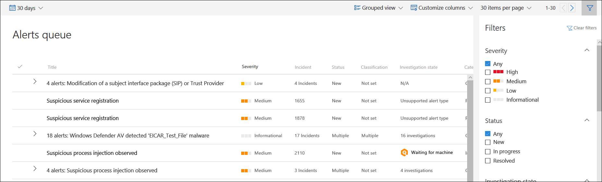

# Anzeigen und Organisieren der Microsoft Defender for Endpoint Alerts-Warteschlange

[!INCLUDE [Microsoft 365 Defender rebranding](../../includes/microsoft-defender.md)]

**Gilt für:**
- [Defender für Endpunkt](https://go.microsoft.com/fwlink/?linkid=2154037)

>Möchten Sie Defender for Endpoint erleben? [Registrieren Sie sich für eine kostenlose Testversion.](https://www.microsoft.com/microsoft-365/windows/microsoft-defender-atp?ocid=docs-wdatp-alertsq-abovefoldlink) 

Die  Warnungswarteschlange zeigt eine Liste der Warnungen an, die von Geräten in Ihrem Netzwerk gekennzeichnet wurden. Standardmäßig werden in der Warteschlange Warnungen angezeigt, die in den letzten 30 Tagen in einer gruppenierten Ansicht angezeigt wurden. Die neuesten Warnungen werden am Anfang der Liste angezeigt, damit Sie zuerst die neuesten Warnungen sehen können.

> [!NOTE]
> Die Warnungswarteschlange wird durch die automatisierte Untersuchung und Behebung erheblich reduziert, sodass Sich Experten für Sicherheitsvorgänge auf komplexere Bedrohungen und andere hochwertige Initiativen konzentrieren können. Wenn eine Warnung eine unterstützte Entität für die automatisierte Untersuchung (z. B. eine Datei) auf einem Gerät mit einem unterstützten Betriebssystem enthält, kann eine automatisierte Untersuchung und Korrektur gestartet werden. Weitere Informationen zu automatisierten Untersuchungen finden Sie [unter Overview of Automated investigations](automated-investigations.md).

Es stehen mehrere Optionen zur Verfügung, um die Benachrichtigungswarteschlangenansicht anzupassen. 

Im oberen Navigationsbereich können Sie:

- Gruppenansicht oder Listenansicht auswählen
- Anpassen von Spalten zum Hinzufügen oder Entfernen von Spalten 
- Auswählen der Elemente, die pro Seite angezeigt werden soll
- Navigieren zwischen Seiten
- Anwenden von Filtern

## Sortieren, Filtern und Gruppieren der Benachrichtigungswarteschlange

Sie können die folgenden Filter anwenden, um die Liste der Warnungen zu beschränken und eine fokussierte Ansicht der Warnungen zu erhalten.

### Severity

Warnungsschweregrad | Beschreibung
:---|:---
Hoch  (Rot) | Warnungen, die häufig im Zusammenhang mit erweiterten beständigen Bedrohungen (Advanced Persistent Threats, APT) angezeigt werden. Diese Warnungen weisen auf ein hohes Risiko aufgrund des Schweregrads des Schadens hin, den sie auf Geräten verursachen können. Einige Beispiele sind: Aktivitäten zum Diebstahl von Anmeldeinformationen, Ransomware-Aktivitäten, die keinem Gruppen zugeordnet sind, Manipulationen an Sicherheitssensoren oder schädliche Aktivitäten, die auf einen menschlichen Widersacher hinweisen.
Mittel  (Orange) | Warnungen aus Verhaltensmustern nach der Erkennung und Reaktion von Endpunkten, die Teil einer erweiterten beständigen Bedrohung (Advanced Persistent Threat, APT) sein können. Dies umfasst beobachtete Verhaltensweisen, die typisch für Angriffsphasen, anomale Registrierungsänderung, Ausführung verdächtiger Dateien usw. sind. Obwohl einige möglicherweise Teil interner Sicherheitstests sind, ist eine Untersuchung erforderlich, da sie auch Teil eines erweiterten Angriffs sein kann.
Niedrig  (Gelb) | Warnungen zu Bedrohungen, die mit verbreiteter Schadsoftware verbunden sind. Beispielsweise Hacktools, Nicht-Schadsoftware-Hacktools, z. B. das Ausführen von Explorationsbefehlen, Löschen von Protokollen usw., die häufig keine erweiterte Bedrohung für die Organisation angeben. Es kann auch aus einem isolierten Sicherheitstool stammen, das von einem Benutzer in Ihrer Organisation getestet wurde.
Zur Information  (Grau) | Warnungen, die möglicherweise nicht als schädlich für das Netzwerk betrachtet werden, aber das Sicherheitsbewusstsein der Organisation für potenzielle Sicherheitsprobleme erhöhen können.

#### Grundlegendes zum Schweregrad von Warnungen

Microsoft Defender Antivirus (Microsoft Defender AV) und Defender for Endpoint-Warnungsschweregrade unterscheiden sich, da sie unterschiedliche Bereiche darstellen.

Der Schweregrad der Microsoft Defender AV-Bedrohung stellt den absoluten Schweregrad der erkannten Bedrohung (Schadsoftware) dar und wird basierend auf dem potenziellen Risiko für das einzelne Gerät zugewiesen, falls es infiziert ist.

Der Schweregrad der Defender for Endpoint-Warnung stellt den Schweregrad des erkannten Verhaltens, das tatsächliche Risiko für das Gerät, aber vor allem das potenzielle Risiko für die Organisation dar.

Beispiel:

- Der Schweregrad einer Defender for Endpoint-Warnung über eine von Microsoft Defender AV erkannte Bedrohung, die vollständig verhindert wurde und das Gerät nicht infizieren konnte, wird als "Informational" kategorisiert, da kein tatsächlicher Schaden vortrat.
- Eine Warnung über eine kommerzielle Schadsoftware wurde während der Ausführung erkannt, aber von Microsoft Defender AV blockiert und behoben, wird als "Niedrig" kategorisiert, da sie möglicherweise zu einem Schaden am einzelnen Gerät führte, aber keine organisatorische Bedrohung darstellt.
- Eine Warnung über Schadsoftware, die während der Ausführung erkannt wurde und eine Bedrohung nicht nur für das einzelne Gerät, sondern auch für die Organisation darstellen kann, unabhängig davon, ob sie schließlich blockiert wurde, kann als "Mittel" oder "Hoch" bewertet werden.
- Verdächtige Verhaltenswarnungen, die nicht blockiert oder behoben wurden, werden nach den gleichen Überlegungen zu organisatorischen Bedrohungen als "Niedrig", "Mittel" oder "Hoch" bewertet.

#### Grundlegendes zu Warnungskategorien

Wir haben die Warnungskategorien neu definiert, um die [Angriffstaktiken](https://attack.mitre.org/tactics/enterprise/) des Unternehmens in der [MITRE ATT-&CK-Matrix auszurichten.](https://attack.mitre.org/) Neue Kategorienamen gelten für alle neuen Warnungen. Vorhandene Warnungen behalten die vorherigen Kategorienamen bei.

In der folgenden Tabelle sind die aktuellen Kategorien und die allgemeine Zuordnung zu vorherigen Kategorien aufgeführt. 

| Neue Kategorie       | Name der API-Kategorie   | Erkannte Bedrohungsaktivität oder Komponente                                                                                                 |
|----------------------|---------------------|-----------------------------------------------------------------------------------------------------------------------------------------|
| Auflistung           | Auflistung          | Suchen und Sammeln von Daten für die Exfiltration                                                                                         |
| Befehl und Steuerelement  | CommandAndControl   | Herstellen einer Verbindung mit einer vom Angreifer gesteuerten Netzwerkinfrastruktur zum Relay von Daten oder empfangen von Befehlen                                          |
| Zugriff auf Anmeldeinformationen    | CredentialAccess    | Abrufen gültiger Anmeldeinformationen zum Erweitern der Kontrolle über Geräte und andere Ressourcen im Netzwerk                                       |
| Abwehrhinterziehung      | DefenseEvasion      | Vermeiden von Sicherheitskontrollen, z. B. Deaktivieren von Sicherheits-Apps, Löschen von Implanten und Ausführen von Rootkits                        |
| Discovery            | Discovery           | Sammeln von Informationen zu wichtigen Geräten und Ressourcen, z. B. Administratorcomputern, Domänencontrollern und Dateiservern  |
| Ausführung            | Ausführung           | Starten von Angreifertools und bösartigem Code, einschließlich RATs und Backdoors                                                             |
| Exfiltration         | Exfiltration        | Extrahieren von Daten aus dem Netzwerk an einen externen, vom Angreifer gesteuerten Speicherort                                                         |
| Exploit              | Exploit             | Exploitcode und mögliche Nutzungsaktivitäten                                                                                       |
| Anfänglicher Zugriff       | InitialAccess       | Erhalten eines ersten Eintrags in das Zielnetzwerk, in der Regel mit Kennworterraten, Exploits oder Phishing-E-Mails                      |
| Querbewegung     | LateralMovement     | Verschieben zwischen Geräten im Zielnetzwerk, um wichtige Ressourcen zu erreichen oder Netzwerkpersistenz zu erhalten                                |
| Schadsoftware              | Schadsoftware             | Backdoors, Trojaner und andere Arten von bösartigem Code                                                                                 |
| Persistenz          | Persistenz         | Erstellen von Erweiterbarkeitspunkten (AutoStart Extensibility Points, ASEPs), um aktiv zu bleiben und Systemneustarts zu überstehen                                        |
| Berechtigungseskalation | PrivilegeEscalation | Abrufen höherer Berechtigungsstufen für Code durch Ausführen im Kontext eines privilegierten Prozesses oder Kontos                         |
| Ransomware           | Ransomware          | Schadsoftware, die Dateien verschlüsselt und Zahlungen zum Wiederherstellen des Zugriffs erpresst                                                                     |
| Verdächtige Aktivität  | SuspiciousActivity  | Atypische Aktivität, die Schadsoftwareaktivität oder Teil eines Angriffs sein kann                                                                 |
| Unerwünschte Software    | UnwantedSoftware    | Apps und Apps mit niedriger Reputation, die sich auf die Produktivität und die Benutzerfreundlichkeit auswirken; als potenziell unerwünschte Anwendungen (PUAs) erkannt |

### Status

Sie können die Liste der Warnungen basierend auf ihrem Status einschränken.

### Untersuchungsstatus

Entspricht dem automatischen Untersuchungsstatus.

### Kategorie

Sie können die Warteschlange so filtern, dass bestimmte Arten von schädlichen Aktivitäten angezeigt werden.

### Zugewiesen an

Sie können zwischen dem Anzeigen von Warnungen, die Ihnen zugewiesen sind, oder der Automatisierung wählen.

### Erkennungsquelle

Wählen Sie die Quelle aus, die die Warnungserkennung ausgelöst hat. Microsoft Threat Experts preview teilnehmer can now filter and see detections from the new threat experts-managed hunting service.

>[!NOTE]
>Der Antivirusfilter wird nur angezeigt, wenn Geräte Microsoft Defender Antivirus als standardmäßiges Antischalwareprodukt für den Echtzeitschutz verwenden.

| Erkennungsquelle                  | API-Wert                  |
|-----------------------------------|----------------------------|
| Drittanbietersensoren                 | ThirdPartySensors          |
| Antivirus                         | WindowsDefenderAv          |
| Automatisierte Untersuchung           | AutomatedInvestigation     |
| Benutzerdefinierte Erkennung                  | CustomDetection            |
| Benutzerdefiniertes TI                         | CustomerTI                 |
| EDR                               | WindowsDefenderAtp         |
| Microsoft 365 Defender            | MTP                        |
| Microsoft Defender für Office 365 | OfficeATP                  |
| Microsoft-Bedrohungsexperten          | ThreatExperts              |
| SmartScreen                       | WindowsDefenderSmartScreen |

### Betriebssystemplattform

Beschränken Sie die Warnungswarteschlangenansicht, indem Sie die Betriebssystemplattform auswählen, die Sie untersuchen möchten.

### Gerätegruppe

Wenn Sie bestimmte Gerätegruppen haben, die Sie überprüfen möchten, können Sie die Gruppen auswählen, um die Warnungswarteschlangenansicht zu beschränken. 

### Zugeordnete Bedrohung

Verwenden Sie diesen Filter, um sich auf Warnungen zu konzentrieren, die im Zusammenhang mit bedrohungen mit hohem Profil stehen. Die vollständige Liste der hochrangigen Bedrohungen finden Sie in [Threat Analytics](threat-analytics.md).

## Verwandte Themen

- [Verwalten von Microsoft Defender for Endpoint-Warnungen](manage-alerts.md)
- [Untersuchen von Microsoft Defender for Endpoint-Warnungen](investigate-alerts.md)
- [Untersuchen einer Datei, die einer Microsoft Defender for Endpoint-Warnung zugeordnet ist](investigate-files.md)
- [Untersuchen von Geräten in der Microsoft Defender for Endpoint Devices-Liste](investigate-machines.md)
- [Untersuchen einer einer Microsoft Defender for Endpoint-Warnung zugeordneten IP-Adresse](investigate-ip.md)
- [Untersuchen einer Domäne, die einer Microsoft Defender for Endpoint-Warnung zugeordnet ist](investigate-domain.md)
- [Untersuchen eines Benutzerkontos in Microsoft Defender for Endpoint](investigate-user.md)
