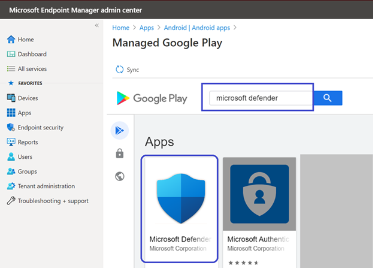

# Bereitstellen von Microsoft Defender for Endpoint unter Android mit Microsoft IntuneDeploy Microsoft Defender for Endpoint on Android with Microsoft Intune 

[!INCLUDE [Microsoft 365 Defender rebranding](../../includes/microsoft-defender.md)]

**Gilt für:****Applies to:**
- [Microsoft Defender für EndpunktMicrosoft Defender for Endpoint](https://go.microsoft.com/fwlink/p/?linkid=2154037)
- [Microsoft 365 DefenderMicrosoft 365 Defender](https://go.microsoft.com/fwlink/?linkid=2118804)

> Möchten Sie Microsoft Defender for Endpoint erleben?Want to experience Microsoft Defender for Endpoint? [Registrieren Sie sich für eine kostenlose Testversion.Sign up for a free trial.](https://www.microsoft.com/microsoft-365/windows/microsoft-defender-atp?ocid=docs-wdatp-exposedapis-abovefoldlink) 

Erfahren Sie, wie Sie Defender for Endpoint für Android auf registrierten Geräten des Intune-Unternehmensportals bereitstellen.Learn how to deploy Defender for Endpoint for Android on Intune Company Portal enrolled devices. Weitere Informationen zur Registrierung von Intune-Geräten finden Sie  [unter Registrieren Ihres Geräts](https://docs.microsoft.com/mem/intune/user-help/enroll-device-android-company-portal).For more information about Intune device enrollment, see  [Enroll your device](https://docs.microsoft.com/mem/intune/user-help/enroll-device-android-company-portal).

> [!NOTE]
> **Defender for Endpoint für Android ist jetzt auf [Google Play verfügbar.](https://play.google.com/store/apps/details?id=com.microsoft.scmx)****Defender for Endpoint for Android is now available on [Google Play](https://play.google.com/store/apps/details?id=com.microsoft.scmx)**  
> Sie können von Intune aus eine Verbindung mit Google Play herstellen, um die Defender for Endpoint-App über geräteadministrator- und Android Enterprise-Entrollungsmodi bereitzustellen.You can connect to Google Play from Intune to deploy Defender for Endpoint app across Device Administrator and Android Enterprise entrollment modes.
Updates für die App werden automatisch über Google Play angezeigt.Updates to the app are automatic via Google Play.

## Bereitstellen auf vom Geräteadministrator registrierten GerätenDeploy on Device Administrator enrolled devices

**Bereitstellen von Defender for Endpoint für Android im Intune-Unternehmensportal – Geräteadministrator registrierte Geräte****Deploy Defender for Endpoint for Android on Intune Company Portal - Device Administrator enrolled devices**

Erfahren Sie, wie Sie Defender for Endpoint für Android im Intune-Unternehmensportal – Geräteadministrator registrierte Geräte bereitstellen.Learn how to deploy Defender for Endpoint for Android on Intune Company Portal - Device Administrator enrolled devices. 

### Hinzufügen als Android Store-AppAdd as Android store app

1. Wechseln [Sie im Microsoft Endpoint Manager Admin Center](https://go.microsoft.com/fwlink/?linkid=2109431) zu **Apps** \> **Android Apps** Android store \> **\> app** hinzufügen, und wählen Sie **Auswählen aus.**In [Microsoft Endpoint Manager admin center](https://go.microsoft.com/fwlink/?linkid=2109431) , go to **Apps** \> **Android Apps** \> **Add \> Android store app** and choose **Select**.

   

2. Geben Sie **auf der Seite** App hinzufügen und im Abschnitt *App-Informationen* ein:On the **Add app** page and in the *App Information* section enter: 

   - **Name****Name** 
   - **Beschreibung****Description**
   - **Publisher** als Microsoft.**Publisher** as Microsoft.
   - **App Store-URL** als https://play.google.com/store/apps/details?id=com.microsoft.scmx (Defender for Endpoint-App Google Play Store-URL)**App store URL** as https://play.google.com/store/apps/details?id=com.microsoft.scmx (Defender for Endpoint app Google Play Store URL) 

   Andere Felder sind optional.Other fields are optional. Klicken Sie auf **Weiter**.Select **Next**.

   

3. Wechseln Sie *im Abschnitt Zuweisungen* zum Abschnitt **Erforderlich,** und wählen Sie **Gruppe hinzufügen aus.**In the *Assignments* section, go to the **Required** section and select **Add group.** Sie können dann die Benutzergruppen auswählen, für die Sie Defender for Endpoint für Android-App verwenden möchten.You can then choose the user group(s) that you would like to target Defender for Endpoint for Android app. Wählen **Sie Auswählen** und dann Weiter **aus.**Choose **Select** and then **Next**.

    >[!NOTE]
    >Die ausgewählte Benutzergruppe sollte aus in Intune registrierten Benutzern bestehen.The selected user group should consist of Intune enrolled users.

    > [!div class="mx-imgBorder"]

    > 

4. Überprüfen Sie **im Abschnitt Überprüfen+Erstellen,** ob alle eingegebenen Informationen korrekt sind, und wählen Sie dann **Erstellen aus.**In the **Review+Create** section, verify that all the information entered is correct and then select **Create**.

    In wenigen Momenten wurde die Defender for Endpoint-App erfolgreich erstellt, und eine Benachrichtigung wird oben rechts auf der Seite angezeigt.In a few moments, the Defender for Endpoint app would be created successfully, and a notification would show up at the top-right corner of the page.

    

5. Wählen Sie auf der angezeigten App-Informationsseite  im Abschnitt **Monitor** die Option Geräteinstallationsstatus aus, um sicherzustellen, dass die Geräteinstallation erfolgreich abgeschlossen wurde.In the app information page that is displayed, in the **Monitor** section, select **Device install status** to verify that the device installation has completed successfully.

    > [!div class="mx-imgBorder"]
    > 

### Vollständiger Onboarding- und ÜberprüfungsstatusComplete onboarding and check status

1. Sobald Defender for Endpoint für Android auf dem Gerät installiert wurde, wird das App-Symbol angezeigt.Once Defender for Endpoint for Android has been installed on the device, you'll see the app icon.

    

2. Tippen Sie auf das Microsoft Defender ATP-App-Symbol, und befolgen Sie die Anweisungen auf dem Bildschirm, um das Onboarding der App zu abschließen.Tap the Microsoft Defender ATP app icon and follow the on-screen instructions to complete onboarding the app. Die Details umfassen die Endbenutzerakzeptanz der von Defender for Endpoint für Android benötigten Android-Berechtigungen.The details include end-user acceptance of Android permissions required by Defender for Endpoint for Android.

3. Nach dem erfolgreichen Onboarding wird das Gerät in der Liste Geräte im Microsoft Defender Security Center angezeigt.Upon successful onboarding, the device will start showing up on the Devices list in Microsoft Defender Security Center.

    

## Bereitstellen auf registrierten Android Enterprise-GerätenDeploy on Android Enterprise enrolled devices

Defender for Endpoint für Android unterstützt registrierte Android Enterprise-Geräte.Defender for Endpoint for Android supports Android Enterprise enrolled devices.

Weitere Informationen zu den von Intune unterstützten Registrierungsoptionen finden Sie unter [Registrierungsoptionen](https://docs.microsoft.com/mem/intune/enrollment/android-enroll).For more information on the enrollment options supported by Intune, see [Enrollment Options](https://docs.microsoft.com/mem/intune/enrollment/android-enroll).

**Zurzeit werden geräteeigene Geräte mit Geschäftsprofil und vollständig verwalteten Geräteregistrierungen im Besitz des Unternehmens für die Bereitstellung unterstützt.****Currently, Personally owned devices with work profile and Corporate-owned fully managed user device enrollments are supported for deployment.**

## Hinzufügen von Microsoft Defender für Endpoint unter Android als verwaltete Google Play-AppAdd Microsoft Defender for Endpoint on Android as a Managed Google Play app

Führen Sie die folgenden Schritte aus, um Microsoft Defender for Endpoint-App zu Ihrer verwalteten Google Play hinzuzufügen.Follow the steps below to add Microsoft Defender for Endpoint app into your managed Google Play.

1. Wechseln [Sie im Microsoft Endpoint Manager Admin Center](https://go.microsoft.com/fwlink/?linkid=2109431) zu Apps **Android** \> **Apps** \> **Add,** und wählen Sie **Verwaltete Google Play-App aus.**In [Microsoft Endpoint Manager admin center](https://go.microsoft.com/fwlink/?linkid=2109431) , go to **Apps** \> **Android Apps** \> **Add** and select **Managed Google Play app**.

    > [!div class="mx-imgBorder"]
    > 

2. Wechseln Sie auf der verwalteten Google Play-Seite, die anschließend geladen wird, zum Suchfeld, und suchen Sie **Microsoft Defender.**On your managed Google Play page that loads subsequently, go to the search box and lookup **Microsoft Defender.** Ihre Suche sollte die Microsoft Defender for Endpoint-App in Ihrer verwalteten Google Play anzeigen.Your search should display the Microsoft Defender for Endpoint app in your Managed Google Play. Klicken Sie im Apps-Suchergebnis auf die Microsoft Defender for Endpoint-App.Click on the Microsoft Defender for Endpoint app from the Apps search result.

    

3. Auf der Seite App-Beschreibung, die als Nächstes angezeigt wird, sollten Sie app-Details auf Defender for Endpoint anzeigen können.In the App description page that comes up next, you should be able to see app details on Defender for Endpoint. Überprüfen Sie die Informationen auf der Seite, und wählen Sie dann **Genehmigen aus.**Review the information on the page and then select **Approve**.

    > [!div class="mx-imgBorder"]
    > 

4. Ihnen werden die Berechtigungen präsentiert, die Defender for Endpoint für die Arbeit erhält.You'll be presented with the permissions that Defender for Endpoint obtains for it to work. Überprüfen Sie sie, und wählen Sie dann **Genehmigen aus.**Review them and then select **Approve**.

    

5. Ihnen wird die Seite Genehmigungseinstellungen angezeigt.You'll be presented with the Approval settings page. Die Seite bestätigt, dass Sie neue App-Berechtigungen behandeln möchten, die Defender for Endpoint für Android möglicherweise fordert.The page confirms your preference to handle new app permissions that Defender for Endpoint for Android might ask. Überprüfen Sie die Auswahlmöglichkeiten, und wählen Sie Ihre bevorzugte Option aus.Review the choices and select your preferred option. Wählen Sie **Fertig** aus.Select **Done**.

    Standardmäßig wählt verwaltete Google Play die Option *Genehmigt bleiben aus, wenn App neue Berechtigungen anfordert*By default, managed Google Play selects *Keep approved when app requests new permissions*

    > [!div class="mx-imgBorder"]
    > 

6. Nachdem die Auswahl für die Berechtigungsbehandlung getroffen wurde, wählen Sie **Synchronisieren** aus, um Microsoft Defender for Endpoint mit Ihrer Apps-Liste zu synchronisieren.After the permissions handling selection is made, select **Sync** to sync Microsoft Defender for Endpoint to your apps list.

    > [!div class="mx-imgBorder"]
    > 

7. Die Synchronisierung wird in wenigen Minuten abgeschlossen.The sync will complete in a few minutes.

    

8. Wählen Sie **die Schaltfläche Aktualisieren** auf dem Bildschirm für Android-Apps aus, und Microsoft Defender ATP sollte in der Liste apps sichtbar sein.Select the **Refresh** button in the Android apps screen and Microsoft Defender ATP should be visible in the apps list.

    > [!div class="mx-imgBorder"]
    > 

9. Defender for Endpoint unterstützt App-Konfigurationsrichtlinien für verwaltete Geräte über Intune.Defender for Endpoint supports App configuration policies for managed devices via Intune. Diese Funktion kann verwendet werden, um anwendbare Android-Berechtigungen automatisch zugranaten, sodass der Endbenutzer diese Berechtigungen nicht akzeptieren muss.This capability can be leveraged to autogrant applicable Android permission(s), so the end user does not need to accept these permission(s).

    1. Wechseln Sie **auf** der Seite Apps zu **Richtlinien > App-Konfigurationsrichtlinien > Hinzufügen > verwalteten Geräten**.In the **Apps** page, go to **Policy > App configuration policies > Add > Managed devices**.

       

    1. Geben Sie auf der Seite **App-Konfigurationsrichtlinie erstellen** die folgenden Details ein:In the **Create app configuration policy** page, enter the following details:
    
        - Name: Microsoft Defender ATP.Name: Microsoft Defender ATP.
        - Wählen **Sie Android Enterprise** als Plattform aus.Choose **Android Enterprise** as platform.
        - Wählen **Sie Arbeitsprofil nur als** Profiltyp aus.Choose **Work Profile only** as Profile Type.
        - Klicken **Sie auf App auswählen,** wählen Sie Microsoft Defender **ATP** aus, wählen **Sie OK** und dann Weiter **aus.**Click **Select App**, choose **Microsoft Defender ATP**, select **OK** and then **Next**.
    
        > [!div class="mx-imgBorder"]
        > 

    1. Wechseln Sie **auf** der Seite Einstellungen zum Abschnitt Berechtigungen, klicken Sie auf Hinzufügen, um die Liste der unterstützten Berechtigungen zu sehen.In the **Settings** page, go to the Permissions section click on Add to view the list of supported permissions. Wählen Sie im Abschnitt Berechtigungen hinzufügen die folgenden Berechtigungen aus:In the Add Permissions section, select the following permissions:

       - Externer Speicher (Lesen)External storage (read)
       - Externer Speicher (Schreiben)External storage (write)

       Wählen Sie dann **OK** aus.Then select **OK**.

       > [!div class="mx-imgBorder"]
      > 

    1. Sie sollten nun sowohl die aufgeführten Berechtigungen als auch jetzt autogrant  sehen, indem Sie autogrant in der Dropdownliste Berechtigungsstatus auswählen und dann **Weiter auswählen.**You should now see both the permissions listed and now you can autogrant both by choosing autogrant in the **Permission state** drop-down and then select **Next**.

       > [!div class="mx-imgBorder"]
       > 

    1. Wählen Sie **auf** der Seite Zuweisungen die Benutzergruppe aus, der diese App-Konfigurationsrichtlinie zugewiesen werden soll.In the **Assignments** page, select the user group to which this app config policy would be assigned to. Klicken **Sie auf Gruppen auswählen, um** die entsprechende Gruppe ein- und auszuwählen, und wählen Sie dann Weiter **aus.**Click **Select groups to include** and selecting the applicable group and then selecting **Next**.  Die hier ausgewählte Gruppe ist in der Regel dieselbe Gruppe, der Sie Microsoft Defender for Endpoint Android App zuweisen würden.The group selected here is usually the same group to which you would assign Microsoft Defender for Endpoint Android app. 

       > [!div class="mx-imgBorder"]
       > 
    

     1. Überprüfen Sie **auf der** Seite Überprüfen + Erstellen, die als Nächstes angezeigt wird, alle Informationen, und wählen Sie dann **Erstellen aus.**In the **Review + Create** page that comes up next, review all the information and then select **Create**.  
    
        Die App-Konfigurationsrichtlinie für Defender for Endpoint, in der die Speicherberechtigung automatischgraniert wird, wird nun der ausgewählten Benutzergruppe zugewiesen.The app configuration policy for Defender for Endpoint autogranting the storage permission is now assigned to the selected user group.

        > [!div class="mx-imgBorder"]
        > 

10. Wählen Sie in der Liste Eigenschaftenzuweisungen Bearbeiten die **Option Microsoft Defender ATP-App** \>  \>  \> **aus.**Select **Microsoft Defender ATP** app in the list \> **Properties** \> **Assignments** \> **Edit**.

    

11. Weisen Sie die App *einer* Benutzergruppe als erforderliche App zu.Assign the app as a *Required* app to a user group. Es wird automatisch  während der nächsten Synchronisierung des Geräts über die Unternehmensportal-App im Arbeitsprofil installiert.It is automatically installed in the *work profile* during the next sync of the device via Company Portal app. Diese Zuordnung kann durchgeführt werden,  indem Sie zum Abschnitt Erforderliche Gruppe hinzufügen navigieren, die Benutzergruppe auswählen und \>  auf **Auswählen klicken.**This assignment can be done by navigating to the *Required* section \> **Add group,** selecting the user group and click **Select**.

    > [!div class="mx-imgBorder"]
    > 

12. Überprüfen Sie **auf** der Seite Anwendung bearbeiten alle oben eingegebenen Informationen.In the **Edit Application** page, review all the information that was entered above. Wählen Sie dann **Überprüfen + Speichern** und dann erneut **speichern** aus, um mit der Zuordnung zu beginnen.Then select **Review + Save** and then **Save** again to commence assignment.

### Automatisches Einrichten von Always-On-VPNAuto Setup of Always-on VPN 
Defender for Endpoint unterstützt Gerätekonfigurationsrichtlinien für verwaltete Geräte über Intune.Defender for Endpoint supports Device configuration policies for managed devices via Intune. Diese Funktion kann für die automatische Einrichtung von **Always-on-VPN** auf registrierten Android Enterprise-Geräten genutzt werden, sodass der Endbenutzer beim Onboarding keinen VPN-Dienst einrichten muss.This capability can be leveraged to **Auto setup of Always-on VPN** on Android Enterprise enrolled devices, so the end user does not need to set up VPN service while onboarding.
1.  Wählen **Sie auf** Geräten **konfigurationsprofile** Profilplattform erstellen Android Enterprise Geräteeinschränkungen auswählen unter einer der folgenden Optionen aus, basierend auf Ihrem  >    >    >   Geräteregistrierungstyp On **Devices**, select **Configuration Profiles** > **Create Profile** > **Platform** > **Android Enterprise** Select **Device restrictions** under one of the following, based on your device enrollment type 
- **Vollständig verwaltetes, dediziertes und Corporate-Owned Arbeitsprofil****Fully Managed, Dedicated, and Corporate-Owned Work Profile**
- **Persönliches Arbeitsprofil****Personally owned Work Profile**

Wählen Sie **Erstellen** aus.Select **Create**.
 
   > 
    
2. **Konfigurationseinstellungen** Geben Sie **einen Namen und** eine Beschreibung **an,** um das Konfigurationsprofil eindeutig zu identifizieren.**Configuration Settings** Provide a **Name** and a **Description** to uniquely identify the configuration profile. 

   > 
   
 3. Wählen Sie **Konnektivität** aus, und konfigurieren Sie VPN:Select **Connectivity** and configure VPN:
- Aktivieren **Sie always-on VPN** Setup einen VPN-Client im Arbeitsprofil, um nach Möglichkeit automatisch eine Verbindung mit dem VPN herzustellen und wieder herzustellen.Enable **Always-on VPN** Setup a VPN client in the work profile to automatically connect and reconnect to the VPN whenever possible. Auf einem bestimmten Gerät kann nur ein VPN-Client für das always-on-VPN konfiguriert werden. Stellen Sie daher sicher, dass nur eine always-on-VPN-Richtlinie auf einem einzelnen Gerät bereitgestellt ist.Only one VPN client can be configured for always-on VPN on a given device, so be sure to have no more than one always-on VPN policy deployed to a single device. 
- Wählen **Sie** Benutzerdefiniertes in der Dropdownliste Benutzerdefiniertes VPN in diesem Fall Defender for Endpoint VPN aus, das zum Bereitstellen des Web Protection-Features verwendet wird.Select **Custom** in VPN client dropdown list Custom VPN in this case is Defender for Endpoint VPN which is used to provide the Web Protection feature. 
    > [!NOTE]
    > Die Microsoft Defender ATP-App muss auf dem Gerät des Benutzers installiert sein, damit die automatische Einrichtung dieses VPN funktioniert.Microsoft Defender ATP app must be installed on user’s device, in order to functioning of auto setup of this VPN.

- Geben **Sie die Paket-ID** der Microsoft Defender ATP-App im Google Play Store ein.Enter **Package ID** of the Microsoft Defender ATP app in Google Play store. Für die Defender-App-URL https://play.google.com/store/apps/details?id=com.microsoft.scmx ist Paket-ID **com.microsoft.scmx**For the Defender app URL https://play.google.com/store/apps/details?id=com.microsoft.scmx, Package ID is **com.microsoft.scmx**  
- **Sperrmodus** Nicht konfiguriert (Standard)**Lockdown mode** Not configured (Default) 

     
   
4. **Zuordnung** Wählen Sie  **auf**   der Seite Zuweisungen die Benutzergruppe aus, der diese App-Konfigurationsrichtlinie zugewiesen werden soll.**Assignment** In the **Assignments** page, select the user group to which this app config policy would be assigned to. Klicken **Sie auf Gruppen auswählen,** um die entsprechende Gruppe ein- und auszuwählen, und klicken Sie dann auf **Weiter**.Click **Select groups** to include and selecting the applicable group and then click **Next**. Die hier ausgewählte Gruppe ist in der Regel dieselbe Gruppe, der Sie Microsoft Defender for Endpoint Android App zuweisen würden.The group selected here is usually the same group to which you would assign Microsoft Defender for Endpoint Android app. 

     

5. Überprüfen Sie **auf der** Seite Überprüfen + Erstellen, die als Nächstes angezeigt wird, alle Informationen, und wählen Sie dann **Erstellen aus.**In the **Review + Create** page that comes up next, review all the information and then select **Create**. Das Gerätekonfigurationsprofil wird nun der ausgewählten Benutzergruppe zugewiesen.The device configuration profile is now assigned to the selected user group.    

    

## Vollständiger Onboarding- und ÜberprüfungsstatusComplete onboarding and check status

1. Bestätigen Sie den Installationsstatus von Microsoft Defender for Endpoint unter Android, indem Sie auf **Geräteinstallationsstatus klicken.**Confirm the installation status of Microsoft Defender for Endpoint on Android by clicking on the **Device Install Status**. Stellen Sie sicher, dass das Gerät hier angezeigt wird.Verify that the device is displayed here.

    > [!div class="mx-imgBorder"]
    > 

2. Auf dem Gerät können Sie den Onboardingstatus überprüfen, indem Sie zum **Arbeitsprofil gehen.**On the device, you can validate the onboarding status by going to the **work profile**. Vergewissern Sie sich, dass Defender for Endpoint verfügbar ist und Dass Sie bei den persönlichen Geräten mit **Arbeitsprofil registriert sind.**Confirm that Defender for Endpoint is available and that you are enrolled to the **Personally owned devices with work profile**.  Wenn Sie auf einem vollständig verwalteten Gerät des Unternehmens registriert sind, verfügen Sie über ein einzelnes Profil auf dem Gerät, in dem Sie bestätigen **können,** dass Defender for Endpoint verfügbar ist.If you are enrolled to a **Corporate-owned, fully managed user device**, you will have a single profile on the device where you can confirm that Defender for Endpoint is available.

    

3. Wenn die App installiert ist, öffnen Sie die App, akzeptieren Sie die Berechtigungen, und das Onboarding sollte erfolgreich sein.When the app is installed, open the app and accept the permissions and then your onboarding should be successful.

    

4. In dieser Phase wird das Gerät erfolgreich in Defender for Endpoint für Android onboardiert.At this stage the device is successfully onboarded onto Defender for Endpoint for Android. Sie können dies im [Microsoft Defender Security Center überprüfen,](https://securitycenter.microsoft.com) indem Sie zur Seite **Geräte** navigieren.You can verify this on the [Microsoft Defender Security Center](https://securitycenter.microsoft.com) by navigating to the **Devices** page.

    

## Verwandte ThemenRelated topics
- [Übersicht über Microsoft Defender for Endpoint unter AndroidOverview of Microsoft Defender for Endpoint on Android](microsoft-defender-endpoint-android.md)
- [Konfigurieren von Microsoft Defender for Endpoint unter Android-FeaturesConfigure Microsoft Defender for Endpoint on Android features](android-configure.md)
