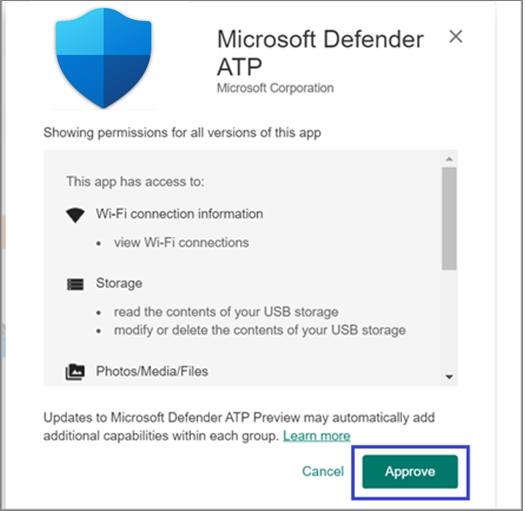
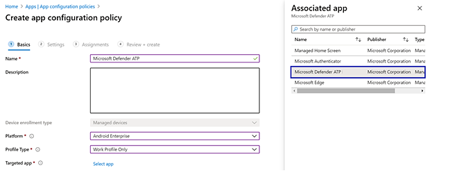

# Bereitstellen von Microsoft Defender für Endpunkt unter Android mit Microsoft Intune

[!INCLUDE [Microsoft 365 Defender rebranding](../../includes/microsoft-defender.md)]

**Gilt für:**
- [Microsoft Defender für Endpunkt](https://go.microsoft.com/fwlink/p/?linkid=2154037)
- [Microsoft 365 Defender](https://go.microsoft.com/fwlink/?linkid=2118804)

> Möchten Sie Microsoft Defender für Endpunkt erleben? [Registrieren Sie sich für eine kostenlose Testversion](https://www.microsoft.com/microsoft-365/windows/microsoft-defender-atp?ocid=docs-wdatp-exposedapis-abovefoldlink)

Erfahren Sie, wie Sie Defender für Endpunkt unter Android auf Intune-Unternehmensportal registrierten Geräten bereitstellen. Weitere Informationen zur Intune-Geräteregistrierung finden Sie unter [Registrieren Ihres Geräts.](/mem/intune/user-help/enroll-device-android-company-portal)

> [!NOTE]
> **Defender für Endpunkt unter Android ist jetzt in [Google Play](https://play.google.com/store/apps/details?id=com.microsoft.scmx) verfügbar**
>
> Sie können von Intune aus eine Verbindung mit Google Play herstellen, um die Defender für Endpunkt-App über Geräteadministrator- und Android-Enterprise Registrierungsmodi bereitzustellen.
>
> Updates für die App erfolgen automatisch über Google Play.

## Bereitstellen auf vom Geräteadministrator registrierten Geräten

**Bereitstellen von Defender für Endpunkt unter Android auf Intune-Unternehmensportal – Geräteadministrator registrierte Geräte**

Erfahren Sie, wie Sie Defender für Endpunkt unter Android auf Intune-Unternehmensportal – Geräteadministrator registrierte Geräte bereitstellen.

### Als Android Store-App hinzufügen

1. Wechseln Sie [in Microsoft Endpoint Manager Admin Center](https://go.microsoft.com/fwlink/?linkid=2109431) zu **Apps** \> **Android Apps** Android \> **\> Store-App hinzufügen,** und wählen **Sie "Auswählen"** aus.

   

2. Geben Sie auf der Seite **"App hinzufügen"** und im Abschnitt *"App-Informationen"* Folgendes ein:

   - **Name**
   - **Beschreibung**
   - **Publisher** als Microsoft.
   - **App Store-URL** als https://play.google.com/store/apps/details?id=com.microsoft.scmx (Defender für Endpunkt-App Google Play Store URL)

   Andere Felder sind optional. Wählen Sie **Weiter** aus.

   

3. Wechseln Sie im Abschnitt *"Zuordnungen"* zum Abschnitt **"Erforderlich",** und wählen Sie **"Gruppe hinzufügen" aus.** Sie können dann die Benutzergruppe(n) auswählen, auf die Sie Defender für Endpunkt für Android-Apps ausrichten möchten. Wählen Sie **"Auswählen"** und dann **"Weiter"** aus.

    > [!NOTE]
    > Die ausgewählte Benutzergruppe sollte aus in Intune registrierten Benutzern bestehen.

    > [!div class="mx-imgBorder"]

    > 

4. Überprüfen Sie im Abschnitt **"Überprüfen und Erstellen",** ob alle eingegebenen Informationen korrekt sind, und wählen Sie dann **"Erstellen"** aus.

    In ein paar Momenten würde die Defender für Endpunkt-App erfolgreich erstellt werden, und eine Benachrichtigung würde in der oberen rechten Ecke der Seite angezeigt.

    

5. Wählen Sie auf der angezeigten Seite "App-Informationen" im Abschnitt **"Monitor"** den **Geräteinstallationsstatus** aus, um zu überprüfen, ob die Geräteinstallation erfolgreich abgeschlossen wurde.

    > [!div class="mx-imgBorder"]
    > 

### Abschließen des Onboardings und Überprüfen des Status

1. Sobald Defender für Endpunkt unter Android auf dem Gerät installiert wurde, wird das App-Symbol angezeigt.

    

2. Tippen Sie auf das Symbol der Microsoft Defender für Endpunkt-App, und folgen Sie den Anweisungen auf dem Bildschirm, um das Onboarding der App abzuschließen. Die Details umfassen die Akzeptanz von Android-Berechtigungen durch Endbenutzer, die von Defender für Endpunkt unter Android benötigt werden.

3. Nach erfolgreichem Onboarding wird das Gerät in der Liste "Geräte" in Microsoft Defender Security Center angezeigt.

    

## Bereitstellen auf Android Enterprise registrierten Geräten

Defender für Endpunkt unter Android unterstützt Android Enterprise registrierte Geräte.

Weitere Informationen zu den von Intune unterstützten Registrierungsoptionen finden Sie unter [Registrierungsoptionen.](/mem/intune/enrollment/android-enroll)

**Derzeit werden persönliche Geräte mit Arbeitsprofil und vollständig verwalteten Benutzergeräteregistrierungen des Unternehmens für die Bereitstellung unterstützt.**

## Hinzufügen von Microsoft Defender für Endpunkt unter Android als verwaltete Google Play-App

Führen Sie die folgenden Schritte aus, um Ihrer verwalteten Google Play-App Microsoft Defender für Endpunkt hinzuzufügen.

1. Wechseln [Sie in Microsoft Endpoint Manager Admin Center](https://go.microsoft.com/fwlink/?linkid=2109431) zu **Apps** \> **Android Apps** \> **Hinzufügen,** und wählen Sie verwaltete Google **Play-App** aus.

    > [!div class="mx-imgBorder"]
    > 

2. Wechseln Sie auf der verwalteten Google Play-Seite, die anschließend geladen wird, zum Suchfeld, und suchen Sie **nach Microsoft Defender.** Ihre Suche sollte die Microsoft Defender für Endpunkt-App in Ihrem verwalteten Google Play anzeigen. Klicken Sie im App-Suchergebnis auf die Microsoft Defender für Endpunkt-App.

    

3. Auf der Seite "App-Beschreibung", die als Nächstes angezeigt wird, sollten Sie App-Details zu Defender für Endpunkt sehen können. Überprüfen Sie die Informationen auf der Seite, und wählen Sie dann **"Genehmigen"** aus.

    > [!div class="mx-imgBorder"]
    > 

4. Ihnen werden die Berechtigungen angezeigt, die Defender für Endpunkt erhält, damit es funktioniert. Überprüfen Sie diese, und wählen Sie dann **"Genehmigen"** aus.

    

5. Ihnen wird die Seite "Genehmigungseinstellungen" angezeigt. Die Seite bestätigt Ihre Einstellung, neue App-Berechtigungen zu behandeln, die Defender für Endpunkt unter Android möglicherweise anfragt. Überprüfen Sie die Auswahl, und wählen Sie Ihre bevorzugte Option aus. Wählen Sie **Fertig** aus.

    Standardmäßig wählt verwaltetes Google Play *"Genehmigt beibehalten" aus, wenn die App neue Berechtigungen anfordert.*

    > [!div class="mx-imgBorder"]
    > 

6. Nachdem die Berechtigungsbehandlungsauswahl getroffen wurde, wählen Sie **"Synchronisieren"** aus, um Microsoft Defender für Endpunkt mit Ihrer App-Liste zu synchronisieren.

    > [!div class="mx-imgBorder"]
    > 

7. Die Synchronisierung wird in wenigen Minuten abgeschlossen.

    

8. Wählen Sie die Schaltfläche **"Aktualisieren"** auf dem Bildschirm "Android-Apps" aus, und Microsoft Defender für Endpunkt sollte in der App-Liste angezeigt werden.

    > [!div class="mx-imgBorder"]
    > 

9. Defender für Endpunkt unterstützt App-Konfigurationsrichtlinien für verwaltete Geräte über Intune. Diese Funktion kann verwendet werden, um zutreffende Android-Berechtigungen automatisch zuzulassen, sodass der Endbenutzer diese Berechtigungen nicht akzeptieren muss.

    1. Wechseln Sie auf der Seite **"Apps"** zu **Richtlinien > App-Konfigurationsrichtlinien > Hinzufügen von > verwalteten Geräten.**

       

    1. Geben Sie auf der Seite **"App-Konfigurationsrichtlinie erstellen"** die folgenden Details ein:

        - Name: Microsoft Defender für Endpunkt.
        - Wählen Sie **Android Enterprise** als Plattform aus.
        - Wählen Sie **"Arbeitsprofil" nur** als Profiltyp aus.
        - Klicken Sie auf **"App auswählen",** wählen Sie **"Microsoft Defender ATP",** **"OK"** und dann **"Weiter"** aus.

        > [!div class="mx-imgBorder"]
        > 

    1. Wechseln Sie auf der **Seite Einstellungen** zum Abschnitt "Berechtigungen" auf "Hinzufügen", um die Liste der unterstützten Berechtigungen anzuzeigen. Wählen Sie im Abschnitt "Berechtigungen hinzufügen" die folgenden Berechtigungen aus:

       - Externer Speicher (gelesen)
       - Externer Speicher (Schreibzugriff)

       Wählen Sie dann **OK** aus.

       > [!div class="mx-imgBorder"]
      > 

    1. Jetzt sollten die beiden aufgeführten Berechtigungen angezeigt werden, und jetzt können Sie beide automatisch auslösen, indem Sie in der Dropdownliste **"Berechtigungsstatus"** die Option "Automatisch auslösen" auswählen und dann **"Weiter"** auswählen.

       > [!div class="mx-imgBorder"]
       > 

    1. Wählen Sie auf der Seite **"Aufgaben"** die Benutzergruppe aus, der diese App-Konfigurationsrichtlinie zugewiesen werden würde. Klicken Sie auf **"Gruppen auswählen", um** die entsprechende Gruppe einzuschließen und auszuwählen, und wählen Sie dann **"Weiter"** aus.  Die hier ausgewählte Gruppe ist in der Regel dieselbe Gruppe, der Sie die Microsoft Defender für Endpunkt-Android-App zuweisen würden.

       > [!div class="mx-imgBorder"]
       > 

    1. Überprüfen Sie auf der Seite **"Überprüfen + Erstellen",** die als Nächstes angezeigt wird, alle Informationen, und wählen Sie dann **"Erstellen"** aus.  

        Die App-Konfigurationsrichtlinie für Defender für Endpunkt, mit der die Speicherberechtigung automatisch erteilt wird, wird jetzt der ausgewählten Benutzergruppe zugewiesen.

        > [!div class="mx-imgBorder"]
        > 

10. Wählen Sie **in** der Liste \> **"Eigenschaftenzuweisungen** \>  \> **bearbeiten"** die Microsoft Defender ATP-App aus.

    

11. Weisen Sie die App einer Benutzergruppe als *erforderliche* App zu. Es wird automatisch während der nächsten Synchronisierung des Geräts über Unternehmensportal App im *Arbeitsprofil* installiert. Diese Zuweisung kann durchgeführt werden, indem Sie zur Gruppe *"Erforderlicher* Abschnitt \> **Hinzufügen" navigieren,** die Benutzergruppe auswählen und auf **"Auswählen"** klicken.

    > [!div class="mx-imgBorder"]
    > 

12. Überprüfen Sie auf der Seite **"Anwendung bearbeiten"** alle oben eingegebenen Informationen. Wählen Sie dann **"Überprüfen" + "Speichern"** und dann **"Erneut speichern"** aus, um die Zuweisung zu starten.

### Automatische Einrichtung von Always-On-VPN

Defender für Endpunkt unterstützt Gerätekonfigurationsrichtlinien für verwaltete Geräte über Intune. Diese Funktion kann für die **automatische Einrichtung von Always-on-VPN** auf Android Enterprise registrierten Geräten genutzt werden, sodass der Endbenutzer während des Onboardings keinen VPN-Dienst einrichten muss.

1. Wählen Sie unter **"Geräte"** die Option **"Konfigurationsprofile**  >  **erstellen**  >  **Profilplattform**  >  **Android Enterprise**

   Wählen Sie basierend auf Ihrem Geräteregistrierungstyp unter einer der folgenden Optionen **Geräteeinschränkungen** aus:
   - **Vollständig verwaltetes, dediziertes und Corporate-Owned Arbeitsprofil**
   - **Persönliches Arbeitsprofil**

   Wählen Sie **Erstellen** aus.

   > 

2. **Konfigurations-Einstellungen** Geben Sie einen **Namen** und eine **Beschreibung** an, um das Konfigurationsprofil eindeutig zu identifizieren.

   > 

3. Wählen Sie **Konnektivität aus,** und konfigurieren Sie VPN:
   - **Always-On-VPN** aktivieren

   Richten Sie einen VPN-Client im Arbeitsprofil ein, um nach Möglichkeit automatisch eine Verbindung mit dem VPN herzustellen und wieder herzustellen. Es kann nur ein VPN-Client für always-on VPN auf einem bestimmten Gerät konfiguriert werden. Stellen Sie daher sicher, dass nicht mehr als eine Always-On-VPN-Richtlinie auf einem einzelnen Gerät bereitgestellt wird.

   - Auswählen **von "Benutzerdefiniert"** in der Dropdownliste des VPN-Clients

   Benutzerdefiniertes VPN ist in diesem Fall Defender für Endpunkt-VPN, das verwendet wird, um das Webschutzfeature bereitzustellen.

   > [!NOTE]
   > Die Microsoft Defender für Endpunkt-App muss auf dem Gerät des Benutzers installiert sein, damit die automatische Einrichtung dieses VPN funktioniert.

   - Geben Sie **die Paket-ID** der Microsoft Defender für Endpunkt-App im Google Play Store ein. Für die Url der Defender-App <https://play.google.com/store/apps/details?id=com.microsoft.scmx> lautet die Paket-ID **"com.microsoft.scmx".**
   - **Sperrmodus** Nicht konfiguriert (Standard)

     

4. **Assignment**

   Wählen Sie auf der Seite **"Aufgaben"**   die Benutzergruppe aus, der diese App-Konfigurationsrichtlinie zugewiesen werden würde. Klicken Sie auf **"Gruppen auswählen",** um die entsprechende Gruppe einzuschließen und auszuwählen, und klicken Sie dann auf **"Weiter".** Die hier ausgewählte Gruppe ist in der Regel dieselbe Gruppe, der Sie die Microsoft Defender für Endpunkt-Android-App zuweisen würden.

     

5. Überprüfen Sie auf der Seite **"Überprüfen + Erstellen",** die als Nächstes angezeigt wird, alle Informationen, und wählen Sie dann **"Erstellen"** aus.
Das Gerätekonfigurationsprofil wird nun der ausgewählten Benutzergruppe zugewiesen.

    

## Abschließen des Onboardings und Überprüfen des Status

1. Bestätigen Sie den Installationsstatus von Microsoft Defender für Endpunkt unter Android, indem Sie auf den **Geräteinstallationsstatus** klicken. Stellen Sie sicher, dass das Gerät hier angezeigt wird.

    > [!div class="mx-imgBorder"]
    > 

2. Auf dem Gerät können Sie den Integrationsstatus überprüfen, indem Sie zum **Arbeitsprofil** wechseln. Vergewissern Sie sich, dass Defender für Endpunkt verfügbar ist und Dass Sie für die **persönlichen Geräte mit Arbeitsprofil** registriert sind.  Wenn Sie für ein **unternehmenseigenes, vollständig verwaltetes Benutzergerät** registriert sind, verfügen Sie über ein einzelnes Profil auf dem Gerät, in dem Sie bestätigen können, dass Defender für Endpunkt verfügbar ist.

    

3. Wenn die App installiert ist, öffnen Sie die App, und akzeptieren Sie die Berechtigungen, und das Onboarding sollte erfolgreich sein.

    

4. In dieser Phase ist das Gerät erfolgreich in Defender für Endpunkt unter Android integriert. Sie können dies auf dem [Microsoft Defender Security Center](https://securitycenter.microsoft.com) überprüfen, indem Sie zur Seite **"Geräte"** navigieren.

    

## Verwandte Themen

- [Übersicht über Microsoft Defender für Endpunkt unter Android](microsoft-defender-endpoint-android.md)
- [Konfigurieren von Funktionen von Microsoft Defender für Endpunkt unter Android](android-configure.md)
