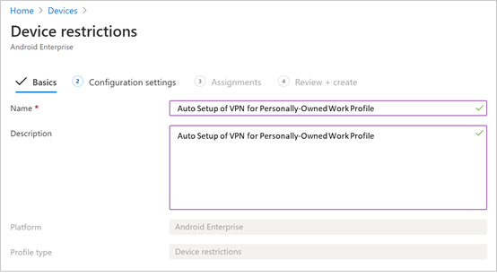
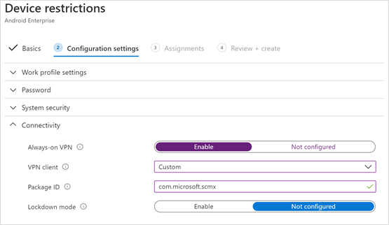

# Bereitstellen von Microsoft Defender for Endpoint für Android mit Microsoft Intune 

[!INCLUDE [Microsoft 365 Defender rebranding](../../includes/microsoft-defender.md)]

**Gilt für:**
- [Microsoft Defender für Endpunkt](https://go.microsoft.com/fwlink/p/?linkid=2154037)
- [Microsoft 365 Defender](https://go.microsoft.com/fwlink/?linkid=2118804)

> Möchten Sie Microsoft Defender for Endpoint erleben? [Registrieren Sie sich für eine kostenlose Testversion.](https://www.microsoft.com/microsoft-365/windows/microsoft-defender-atp?ocid=docs-wdatp-exposedapis-abovefoldlink) 

Erfahren Sie, wie Sie Defender for Endpoint für Android auf registrierten Geräten des Intune-Unternehmensportals bereitstellen. Weitere Informationen zur Registrierung von Intune-Geräten finden Sie  [unter Registrieren Ihres Geräts](https://docs.microsoft.com/mem/intune/user-help/enroll-device-android-company-portal).

> [!NOTE]
> **Defender for Endpoint für Android ist jetzt auf [Google Play verfügbar.](https://play.google.com/store/apps/details?id=com.microsoft.scmx)**  
> Sie können von Intune aus eine Verbindung mit Google Play herstellen, um die Defender for Endpoint-App über geräteadministrator- und Android Enterprise-Entrollungsmodi bereitzustellen.
Updates für die App werden automatisch über Google Play angezeigt.

## Bereitstellen auf vom Geräteadministrator registrierten Geräten

**Bereitstellen von Defender for Endpoint für Android im Intune-Unternehmensportal – Geräteadministrator registrierte Geräte**

Erfahren Sie, wie Sie Defender for Endpoint für Android im Intune-Unternehmensportal – Geräteadministrator registrierte Geräte bereitstellen. 

### Hinzufügen als Android Store-App

1. Wechseln [Sie im Microsoft Endpoint Manager Admin Center](https://go.microsoft.com/fwlink/?linkid=2109431) zu **Apps** \> **Android Apps** Android store \> **\> app** hinzufügen, und wählen Sie **Auswählen aus.**

   

2. Geben Sie **auf der Seite** App hinzufügen und im Abschnitt *App-Informationen* ein: 

   - **Name** 
   - **Beschreibung**
   - **Publisher** als Microsoft.
   - **App Store-URL** als https://play.google.com/store/apps/details?id=com.microsoft.scmx (Defender for Endpoint-App Google Play Store-URL) 

   Andere Felder sind optional. Wählen Sie **Weiter** aus.

   

3. Wechseln Sie *im Abschnitt Zuweisungen* zum Abschnitt **Erforderlich,** und wählen Sie **Gruppe hinzufügen aus.** Sie können dann die Benutzergruppen auswählen, für die Sie Defender for Endpoint für Android-App verwenden möchten. Wählen **Sie Auswählen** und dann Weiter **aus.**

    >[!NOTE]
    >Die ausgewählte Benutzergruppe sollte aus in Intune registrierten Benutzern bestehen.

    > [!div class="mx-imgBorder"]

    > 

4. Überprüfen Sie **im Abschnitt Überprüfen+Erstellen,** ob alle eingegebenen Informationen korrekt sind, und wählen Sie dann **Erstellen aus.**

    In wenigen Momenten wurde die Defender for Endpoint-App erfolgreich erstellt, und eine Benachrichtigung wird oben rechts auf der Seite angezeigt.

    

5. Wählen Sie auf der angezeigten App-Informationsseite  im Abschnitt **Monitor** die Option Geräteinstallationsstatus aus, um sicherzustellen, dass die Geräteinstallation erfolgreich abgeschlossen wurde.

    > [!div class="mx-imgBorder"]
    > 

### Vollständiger Onboarding- und Überprüfungsstatus

1. Sobald Defender for Endpoint für Android auf dem Gerät installiert wurde, wird das App-Symbol angezeigt.

    

2. Tippen Sie auf das Microsoft Defender ATP-App-Symbol, und befolgen Sie die Anweisungen auf dem Bildschirm, um das Onboarding der App zu abschließen. Die Details umfassen die Endbenutzerakzeptanz der von Defender for Endpoint für Android benötigten Android-Berechtigungen.

3. Nach dem erfolgreichen Onboarding wird das Gerät in der Liste Geräte im Microsoft Defender Security Center angezeigt.

    

## Bereitstellen auf registrierten Android Enterprise-Geräten

Defender for Endpoint für Android unterstützt registrierte Android Enterprise-Geräte.

Weitere Informationen zu den von Intune unterstützten Registrierungsoptionen finden Sie unter [Registrierungsoptionen](https://docs.microsoft.com/mem/intune/enrollment/android-enroll).

**Zurzeit werden geräteeigene Geräte mit Geschäftsprofil und vollständig verwalteten Geräteregistrierungen im Besitz des Unternehmens für die Bereitstellung unterstützt.**

## Hinzufügen von Microsoft Defender für Endpoint für Android als verwaltete Google Play-App

Führen Sie die folgenden Schritte aus, um Microsoft Defender for Endpoint-App zu Ihrer verwalteten Google Play hinzuzufügen.

1. Wechseln [Sie im Microsoft Endpoint Manager Admin Center](https://go.microsoft.com/fwlink/?linkid=2109431) zu Apps **Android** \> **Apps** \> **Add,** und wählen Sie **Verwaltete Google Play-App aus.**

    > [!div class="mx-imgBorder"]
    > 

2. Wechseln Sie auf der verwalteten Google Play-Seite, die anschließend geladen wird, zum Suchfeld, und suchen Sie **Microsoft Defender.** Ihre Suche sollte die Microsoft Defender for Endpoint-App in Ihrer verwalteten Google Play anzeigen. Klicken Sie im Apps-Suchergebnis auf die Microsoft Defender for Endpoint-App.

    

3. Auf der Seite App-Beschreibung, die als Nächstes angezeigt wird, sollten Sie app-Details auf Defender for Endpoint anzeigen können. Überprüfen Sie die Informationen auf der Seite, und wählen Sie dann **Genehmigen aus.**

    > [!div class="mx-imgBorder"]
    > 

4. Ihnen werden die Berechtigungen präsentiert, die Defender for Endpoint für die Arbeit erhält. Überprüfen Sie sie, und wählen Sie dann **Genehmigen aus.**

    

5. Ihnen wird die Seite Genehmigungseinstellungen angezeigt. Die Seite bestätigt, dass Sie neue App-Berechtigungen behandeln möchten, die Defender for Endpoint für Android möglicherweise fordert. Überprüfen Sie die Auswahlmöglichkeiten, und wählen Sie Ihre bevorzugte Option aus. Wählen Sie **Fertig** aus.

    Standardmäßig wählt verwaltete Google Play die Option *Genehmigt bleiben aus, wenn App neue Berechtigungen anfordert*

    > [!div class="mx-imgBorder"]
    > 

6. Nachdem die Auswahl für die Berechtigungsbehandlung getroffen wurde, wählen Sie **Synchronisieren** aus, um Microsoft Defender for Endpoint mit Ihrer Apps-Liste zu synchronisieren.

    > [!div class="mx-imgBorder"]
    > 

7. Die Synchronisierung wird in wenigen Minuten abgeschlossen.

    

8. Wählen Sie **die Schaltfläche Aktualisieren** auf dem Bildschirm für Android-Apps aus, und Microsoft Defender ATP sollte in der Liste apps sichtbar sein.

    > [!div class="mx-imgBorder"]
    > 

9. Defender for Endpoint unterstützt App-Konfigurationsrichtlinien für verwaltete Geräte über Intune. Diese Funktion kann verwendet werden, um anwendbare Android-Berechtigungen automatisch zugranaten, sodass der Endbenutzer diese Berechtigungen nicht akzeptieren muss.

    1. Wechseln Sie **auf** der Seite Apps zu **Richtlinien > App-Konfigurationsrichtlinien > Hinzufügen > verwalteten Geräten**.

       

    1. Geben Sie auf der Seite **App-Konfigurationsrichtlinie erstellen** die folgenden Details ein:
    
        - Name: Microsoft Defender ATP.
        - Wählen **Sie Android Enterprise** als Plattform aus.
        - Wählen **Sie Arbeitsprofil nur als** Profiltyp aus.
        - Klicken **Sie auf App auswählen,** wählen Sie Microsoft Defender **ATP** aus, wählen **Sie OK** und dann Weiter **aus.**
    
        > [!div class="mx-imgBorder"]
        > 

    1. Wechseln Sie **auf** der Seite Einstellungen zum Abschnitt Berechtigungen, klicken Sie auf Hinzufügen, um die Liste der unterstützten Berechtigungen zu sehen. Wählen Sie im Abschnitt Berechtigungen hinzufügen die folgenden Berechtigungen aus:

       - Externer Speicher (Lesen)
       - Externer Speicher (Schreiben)

       Wählen Sie dann **OK** aus.

       > [!div class="mx-imgBorder"]
      > 

    1. Sie sollten nun sowohl die aufgeführten Berechtigungen als auch jetzt autogrant  sehen, indem Sie autogrant in der Dropdownliste Berechtigungsstatus auswählen und dann **Weiter auswählen.**

       > [!div class="mx-imgBorder"]
       > 

    1. Wählen Sie **auf** der Seite Zuweisungen die Benutzergruppe aus, der diese App-Konfigurationsrichtlinie zugewiesen werden soll. Klicken **Sie auf Gruppen auswählen, um** die entsprechende Gruppe ein- und auszuwählen, und wählen Sie dann Weiter **aus.**  Die hier ausgewählte Gruppe ist in der Regel dieselbe Gruppe, der Sie Microsoft Defender for Endpoint Android App zuweisen würden. 

       > [!div class="mx-imgBorder"]
       > 
    

     1. Überprüfen Sie **auf der** Seite Überprüfen + Erstellen, die als Nächstes angezeigt wird, alle Informationen, und wählen Sie dann **Erstellen aus.**  
    
        Die App-Konfigurationsrichtlinie für Defender for Endpoint, in der die Speicherberechtigung automatischgraniert wird, wird nun der ausgewählten Benutzergruppe zugewiesen.

        > [!div class="mx-imgBorder"]
        > 

10. Wählen Sie in der Liste Eigenschaftenzuweisungen Bearbeiten die **Option Microsoft Defender ATP-App** \>  \>  \> **aus.**

    

11. Weisen Sie die App *einer* Benutzergruppe als erforderliche App zu. Es wird automatisch  während der nächsten Synchronisierung des Geräts über die Unternehmensportal-App im Arbeitsprofil installiert. Diese Zuordnung kann durchgeführt werden,  indem Sie zum Abschnitt Erforderliche Gruppe hinzufügen navigieren, die Benutzergruppe auswählen und \>  auf **Auswählen klicken.**

    > [!div class="mx-imgBorder"]
    > 

12. Überprüfen Sie **auf** der Seite Anwendung bearbeiten alle oben eingegebenen Informationen. Wählen Sie dann **Überprüfen + Speichern** und dann erneut **speichern** aus, um mit der Zuordnung zu beginnen.

### Automatisches Einrichten von Always-On-VPN 
Defender for Endpoint unterstützt Gerätekonfigurationsrichtlinien für verwaltete Geräte über Intune. Diese Funktion kann für die automatische Einrichtung von **Always-on-VPN** auf registrierten Android Enterprise-Geräten genutzt werden, sodass der Endbenutzer beim Onboarding keinen VPN-Dienst einrichten muss.
1.  Wählen **Sie auf** Geräten **konfigurationsprofile** Profilplattform erstellen Android Enterprise Geräteeinschränkungen auswählen unter einer der folgenden Optionen aus, basierend auf Ihrem  >    >    >   Geräteregistrierungstyp  
- **Vollständig verwaltetes, dediziertes und Corporate-Owned Arbeitsprofil**
- **Persönliches Arbeitsprofil**

Wählen Sie **Erstellen** aus.
 
   > 
    
2. **Konfigurationseinstellungen** Geben Sie **einen Namen und** eine Beschreibung **an,** um das Konfigurationsprofil eindeutig zu identifizieren. 

   > 
   
 3. Wählen Sie **Konnektivität** aus, und konfigurieren Sie VPN:
- Aktivieren **Sie always-on VPN** Setup einen VPN-Client im Arbeitsprofil, um nach Möglichkeit automatisch eine Verbindung mit dem VPN herzustellen und wieder herzustellen. Auf einem bestimmten Gerät kann nur ein VPN-Client für das always-on-VPN konfiguriert werden. Stellen Sie daher sicher, dass nur eine always-on-VPN-Richtlinie auf einem einzelnen Gerät bereitgestellt ist. 
- Wählen **Sie** Benutzerdefiniertes in der Dropdownliste Benutzerdefiniertes VPN in diesem Fall Defender for Endpoint VPN aus, das zum Bereitstellen des Web Protection-Features verwendet wird. 
    > [!NOTE]
    > Die Microsoft Defender ATP-App muss auf dem Gerät des Benutzers installiert sein, damit die automatische Einrichtung dieses VPN funktioniert.

- Geben **Sie die Paket-ID** der Microsoft Defender ATP-App im Google Play Store ein. Für die Defender-App-URL https://play.google.com/store/apps/details?id=com.microsoft.scmx ist Paket-ID **com.microsoft.scmx**  
- **Sperrmodus** Nicht konfiguriert (Standard) 

     
   
4. **Zuordnung** Wählen Sie  **auf**   der Seite Zuweisungen die Benutzergruppe aus, der diese App-Konfigurationsrichtlinie zugewiesen werden soll. Klicken **Sie auf Gruppen auswählen,** um die entsprechende Gruppe ein- und auszuwählen, und klicken Sie dann auf **Weiter**. Die hier ausgewählte Gruppe ist in der Regel dieselbe Gruppe, der Sie Microsoft Defender for Endpoint Android App zuweisen würden. 

     

5. Überprüfen Sie **auf der** Seite Überprüfen + Erstellen, die als Nächstes angezeigt wird, alle Informationen, und wählen Sie dann **Erstellen aus.** Das Gerätekonfigurationsprofil wird nun der ausgewählten Benutzergruppe zugewiesen.    

    

## Vollständiger Onboarding- und Überprüfungsstatus

1. Bestätigen Sie den Installationsstatus von Microsoft Defender for Endpoint für Android, indem Sie auf **Geräteinstallationsstatus klicken.** Stellen Sie sicher, dass das Gerät hier angezeigt wird.

    > [!div class="mx-imgBorder"]
    > 

2. Auf dem Gerät können Sie den Onboardingstatus überprüfen, indem Sie zum **Arbeitsprofil gehen.** Vergewissern Sie sich, dass Defender for Endpoint verfügbar ist und Dass Sie bei den persönlichen Geräten mit **Arbeitsprofil registriert sind.**  Wenn Sie auf einem vollständig verwalteten Gerät des Unternehmens registriert sind, verfügen Sie über ein einzelnes Profil auf dem Gerät, in dem Sie bestätigen **können,** dass Defender for Endpoint verfügbar ist.

    

3. Wenn die App installiert ist, öffnen Sie die App, akzeptieren Sie die Berechtigungen, und das Onboarding sollte erfolgreich sein.

    

4. In dieser Phase wird das Gerät erfolgreich in Defender for Endpoint für Android onboardiert. Sie können dies im [Microsoft Defender Security Center überprüfen,](https://securitycenter.microsoft.com) indem Sie zur Seite **Geräte** navigieren.

    

## Verwandte Themen
- [Übersicht über Microsoft Defender for Endpoint für Android](microsoft-defender-endpoint-android.md)
- [Konfigurieren von Microsoft Defender for Endpoint für Android-Features](android-configure.md)
