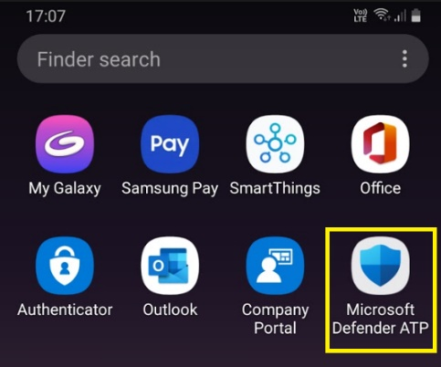
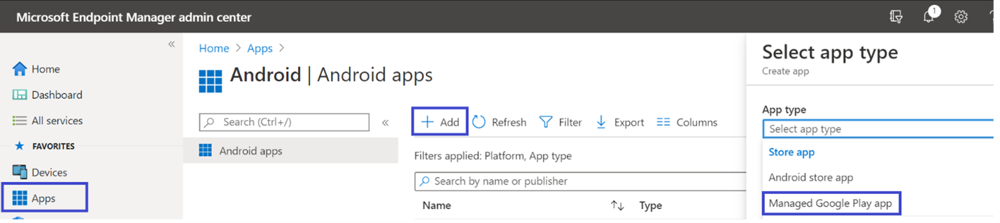
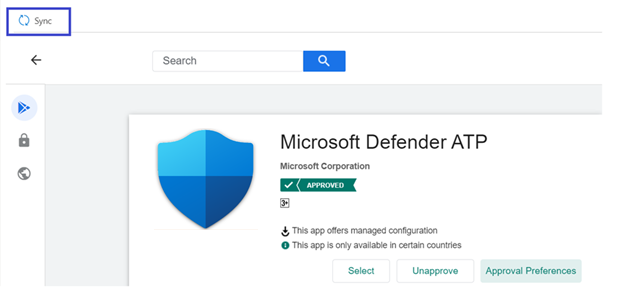

# Bereitstellen von Microsoft Defender für Endpunkt unter Android mit Microsoft IntuneDeploy Microsoft Defender for Endpoint on Android with Microsoft Intune 

[!INCLUDE [Microsoft 365 Defender rebranding](../../includes/microsoft-defender.md)]

**Gilt für:****Applies to:**
- [Microsoft Defender für EndpunktMicrosoft Defender for Endpoint](https://go.microsoft.com/fwlink/p/?linkid=2154037)
- [Microsoft 365 DefenderMicrosoft 365 Defender](https://go.microsoft.com/fwlink/?linkid=2118804)

> Möchten Sie Microsoft Defender für Endpunkt erleben?Want to experience Microsoft Defender for Endpoint? [Registrieren Sie sich für eine kostenlose Testversion.Sign up for a free trial.](https://www.microsoft.com/microsoft-365/windows/microsoft-defender-atp?ocid=docs-wdatp-exposedapis-abovefoldlink) 

Erfahren Sie, wie Sie Defender für Endpunkt unter Android auf Intune-Unternehmensportal registrierten Geräten bereitstellen.Learn how to deploy Defender for Endpoint on Android on Intune Company Portal enrolled devices. Weitere Informationen zur Intune-Geräteregistrierung finden Sie unter [Registrieren Ihres Geräts.](/mem/intune/user-help/enroll-device-android-company-portal)For more information about Intune device enrollment, see  [Enroll your device](/mem/intune/user-help/enroll-device-android-company-portal).

> [!NOTE]
> **Defender für Endpunkt unter Android ist jetzt in [Google Play](https://play.google.com/store/apps/details?id=com.microsoft.scmx) verfügbar****Defender for Endpoint on Android is now available on [Google Play](https://play.google.com/store/apps/details?id=com.microsoft.scmx)**  
> Sie können von Intune aus eine Verbindung mit Google Play herstellen, um die Defender für Endpunkt-App über Geräteadministrator- und Android-Enterprise-Registrierungsmodi bereitzustellen.You can connect to Google Play from Intune to deploy Defender for Endpoint app across Device Administrator and Android Enterprise entrollment modes.
Updates für die App erfolgen automatisch über Google Play.Updates to the app are automatic via Google Play.

## Bereitstellen auf vom Geräteadministrator registrierten GerätenDeploy on Device Administrator enrolled devices

**Bereitstellen von Defender für Endpunkt unter Android auf Intune-Unternehmensportal – Geräteadministrator registrierte Geräte****Deploy Defender for Endpoint on Android on Intune Company Portal - Device Administrator enrolled devices**

Erfahren Sie, wie Sie Defender für Endpunkt unter Android auf Intune-Unternehmensportal – Geräteadministrator registrierte Geräte bereitstellen.Learn how to deploy Defender for Endpoint on Android on Intune Company Portal - Device Administrator enrolled devices. 

### Als Android Store-App hinzufügenAdd as Android store app

1. Wechseln Sie [Microsoft Endpoint Manager Admin Center](https://go.microsoft.com/fwlink/?linkid=2109431) zu **Apps** \> **Android Apps** Android \> **\> Store-App hinzufügen,** und wählen **Sie "Auswählen"** aus.In [Microsoft Endpoint Manager admin center](https://go.microsoft.com/fwlink/?linkid=2109431) , go to **Apps** \> **Android Apps** \> **Add \> Android store app** and choose **Select**.

   

2. Geben Sie auf der Seite **"App hinzufügen"** und im Abschnitt *"App-Informationen"* Folgendes ein:On the **Add app** page and in the *App Information* section enter: 

   - **Name****Name** 
   - **Beschreibung****Description**
   - **Publisher** als Microsoft.**Publisher** as Microsoft.
   - **App Store-URL** als https://play.google.com/store/apps/details?id=com.microsoft.scmx (Defender für Endpunkt-App Google Play Store URL)**App store URL** as https://play.google.com/store/apps/details?id=com.microsoft.scmx (Defender for Endpoint app Google Play Store URL) 

   Andere Felder sind optional.Other fields are optional. Klicken Sie auf **Weiter**.Select **Next**.

   

3. Wechseln Sie im Abschnitt *"Zuordnungen"* zum Abschnitt **"Erforderlich",** und wählen Sie **"Gruppe hinzufügen" aus.**In the *Assignments* section, go to the **Required** section and select **Add group.** Sie können dann die Benutzergruppe(n) auswählen, auf die Sie Defender für Endpunkt für Android-Apps ausrichten möchten.You can then choose the user group(s) that you would like to target Defender for Endpoint on Android app. Wählen Sie **"Auswählen"** und dann **"Weiter"** aus.Choose **Select** and then **Next**.

    >[!NOTE]
    >Die ausgewählte Benutzergruppe sollte aus in Intune registrierten Benutzern bestehen.The selected user group should consist of Intune enrolled users.

    > [!div class="mx-imgBorder"]

    > 

4. Überprüfen Sie im Abschnitt **"Überprüfen und Erstellen",** ob alle eingegebenen Informationen korrekt sind, und wählen Sie dann **"Erstellen"** aus.In the **Review+Create** section, verify that all the information entered is correct and then select **Create**.

    In ein paar Momenten würde die Defender für Endpunkt-App erfolgreich erstellt werden, und eine Benachrichtigung würde in der oberen rechten Ecke der Seite angezeigt.In a few moments, the Defender for Endpoint app would be created successfully, and a notification would show up at the top-right corner of the page.

    

5. Wählen Sie auf der angezeigten Seite "App-Informationen" im Abschnitt **"Monitor"** den **Geräteinstallationsstatus** aus, um zu überprüfen, ob die Geräteinstallation erfolgreich abgeschlossen wurde.In the app information page that is displayed, in the **Monitor** section, select **Device install status** to verify that the device installation has completed successfully.

    > [!div class="mx-imgBorder"]
    > 

### Abschließen des Onboardings und Überprüfen des StatusComplete onboarding and check status

1. Sobald Defender für Endpunkt unter Android auf dem Gerät installiert wurde, wird das App-Symbol angezeigt.Once Defender for Endpoint on Android has been installed on the device, you'll see the app icon.

    

2. Tippen Sie auf das Symbol der Microsoft Defender für Endpunkt-App, und folgen Sie den Anweisungen auf dem Bildschirm, um das Onboarding der App abzuschließen.Tap the Microsoft Defender for Endpoint app icon and follow the on-screen instructions to complete onboarding the app. Die Details umfassen die Akzeptanz von Android-Berechtigungen durch Endbenutzer, die von Defender für Endpunkt unter Android benötigt werden.The details include end-user acceptance of Android permissions required by Defender for Endpoint on Android.

3. Nach dem erfolgreichen Onboarding wird das Gerät in der Geräteliste in Microsoft Defender Security Center angezeigt.Upon successful onboarding, the device will start showing up on the Devices list in Microsoft Defender Security Center.

    

## Bereitstellen auf registrierten Geräten für Android EnterpriseDeploy on Android Enterprise enrolled devices

Defender für Endpunkt unter Android unterstützt Android Enterprise registrierte Geräte.Defender for Endpoint on Android supports Android Enterprise enrolled devices.

Weitere Informationen zu den von Intune unterstützten Registrierungsoptionen finden Sie unter [Registrierungsoptionen.](/mem/intune/enrollment/android-enroll)For more information on the enrollment options supported by Intune, see [Enrollment Options](/mem/intune/enrollment/android-enroll).

**Derzeit werden persönliche Geräte mit Arbeitsprofil und vollständig verwalteten Benutzergeräteregistrierungen des Unternehmens für die Bereitstellung unterstützt.****Currently, Personally owned devices with work profile and Corporate-owned fully managed user device enrollments are supported for deployment.**

## Hinzufügen von Microsoft Defender für Endpunkt unter Android als verwaltete Google Play-AppAdd Microsoft Defender for Endpoint on Android as a Managed Google Play app

Führen Sie die folgenden Schritte aus, um Ihrer verwalteten Google Play-App Microsoft Defender für Endpunkt hinzuzufügen.Follow the steps below to add Microsoft Defender for Endpoint app into your managed Google Play.

1. Wechseln [Sie in Microsoft Endpoint Manager Admin Center](https://go.microsoft.com/fwlink/?linkid=2109431) zu **Apps** \> **Android Apps** \> **Hinzufügen,** und wählen Sie verwaltete Google **Play-App** aus.In [Microsoft Endpoint Manager admin center](https://go.microsoft.com/fwlink/?linkid=2109431) , go to **Apps** \> **Android Apps** \> **Add** and select **Managed Google Play app**.

    > [!div class="mx-imgBorder"]
    > 

2. Wechseln Sie auf der verwalteten Google Play-Seite, die anschließend geladen wird, zum Suchfeld, und suchen Sie **nach Microsoft Defender.**On your managed Google Play page that loads subsequently, go to the search box and lookup **Microsoft Defender.** Ihre Suche sollte die Microsoft Defender für Endpunkt-App in Ihrem verwalteten Google Play anzeigen.Your search should display the Microsoft Defender for Endpoint app in your Managed Google Play. Klicken Sie im App-Suchergebnis auf die Microsoft Defender für Endpunkt-App.Click on the Microsoft Defender for Endpoint app from the Apps search result.

    

3. Auf der Seite "App-Beschreibung", die als Nächstes angezeigt wird, sollten Sie App-Details zu Defender für Endpunkt sehen können.In the App description page that comes up next, you should be able to see app details on Defender for Endpoint. Überprüfen Sie die Informationen auf der Seite, und wählen Sie dann **"Genehmigen"** aus.Review the information on the page and then select **Approve**.

    > [!div class="mx-imgBorder"]
    > 

4. Ihnen werden die Berechtigungen angezeigt, die Defender für Endpunkt erhält, damit es funktioniert.You'll be presented with the permissions that Defender for Endpoint obtains for it to work. Überprüfen Sie diese, und wählen Sie dann **"Genehmigen"** aus.Review them and then select **Approve**.

    

5. Ihnen wird die Seite "Genehmigungseinstellungen" angezeigt.You'll be presented with the Approval settings page. Die Seite bestätigt Ihre Einstellung, neue App-Berechtigungen zu behandeln, die Defender für Endpunkt unter Android möglicherweise anfragt.The page confirms your preference to handle new app permissions that Defender for Endpoint on Android might ask. Überprüfen Sie die Auswahl, und wählen Sie Ihre bevorzugte Option aus.Review the choices and select your preferred option. Wählen Sie **Fertig** aus.Select **Done**.

    Standardmäßig wählt verwaltetes Google Play *"Genehmigt beibehalten" aus, wenn die App neue Berechtigungen anfordert.*By default, managed Google Play selects *Keep approved when app requests new permissions*

    > [!div class="mx-imgBorder"]
    > 

6. Nachdem die Berechtigungsbehandlungsauswahl getroffen wurde, wählen Sie **"Synchronisieren"** aus, um Microsoft Defender für Endpunkt mit Ihrer App-Liste zu synchronisieren.After the permissions handling selection is made, select **Sync** to sync Microsoft Defender for Endpoint to your apps list.

    > [!div class="mx-imgBorder"]
    > 

7. Die Synchronisierung wird in wenigen Minuten abgeschlossen.The sync will complete in a few minutes.

    

8. Wählen Sie die Schaltfläche **"Aktualisieren"** auf dem Bildschirm "Android-Apps" aus, und Microsoft Defender für Endpunkt sollte in der App-Liste angezeigt werden.Select the **Refresh** button in the Android apps screen and Microsoft Defender for Endpoint should be visible in the apps list.

    > [!div class="mx-imgBorder"]
    > 

9. Defender für Endpunkt unterstützt App-Konfigurationsrichtlinien für verwaltete Geräte über Intune.Defender for Endpoint supports App configuration policies for managed devices via Intune. Diese Funktion kann verwendet werden, um zutreffende Android-Berechtigungen automatisch zuzulassen, sodass der Endbenutzer diese Berechtigungen nicht akzeptieren muss.This capability can be leveraged to autogrant applicable Android permission(s), so the end user does not need to accept these permission(s).

    1. Wechseln Sie auf der Seite **"Apps"** zu **Richtlinien > App-Konfigurationsrichtlinien > Hinzufügen von > verwalteten Geräten.**In the **Apps** page, go to **Policy > App configuration policies > Add > Managed devices**.

       

    1. Geben Sie auf der Seite **"App-Konfigurationsrichtlinie erstellen"** die folgenden Details ein:In the **Create app configuration policy** page, enter the following details:
    
        - Name: Microsoft Defender für Endpunkt.Name: Microsoft Defender for Endpoint.
        - Wählen Sie **Android Enterprise** als Plattform aus.Choose **Android Enterprise** as platform.
        - Wählen Sie **"Arbeitsprofil" nur** als Profiltyp aus.Choose **Work Profile only** as Profile Type.
        - Klicken Sie auf **"App auswählen",** **"Microsoft Defender ATP",** **"OK"** und dann **"Weiter".**Click **Select App**, choose **Microsoft Defender ATP**, select **OK** and then **Next**.
    
        > [!div class="mx-imgBorder"]
        > 

    1. Wechseln Sie auf der **Seite Einstellungen** zum Abschnitt "Berechtigungen" auf "Hinzufügen", um die Liste der unterstützten Berechtigungen anzuzeigen.In the **Settings** page, go to the Permissions section click on Add to view the list of supported permissions. Wählen Sie im Abschnitt "Berechtigungen hinzufügen" die folgenden Berechtigungen aus:In the Add Permissions section, select the following permissions:

       - Externer Speicher (gelesen)External storage (read)
       - Externer Speicher (Schreibzugriff)External storage (write)

       Wählen Sie dann **OK** aus.Then select **OK**.

       > [!div class="mx-imgBorder"]
      > 

    1. Jetzt sollten sowohl die aufgeführten Berechtigungen angezeigt werden als auch jetzt können Sie beide automatisch auslösen, indem Sie in der Dropdownliste **"Berechtigungsstatus"** die Option "Automatisch auslösen" auswählen und dann **"Weiter"** auswählen.You should now see both the permissions listed and now you can autogrant both by choosing autogrant in the **Permission state** drop-down and then select **Next**.

       > [!div class="mx-imgBorder"]
       > 

    1. Wählen Sie auf der Seite **"Aufgaben"** die Benutzergruppe aus, der diese App-Konfigurationsrichtlinie zugewiesen werden würde.In the **Assignments** page, select the user group to which this app config policy would be assigned to. Klicken Sie auf **"Gruppen auswählen", um** die entsprechende Gruppe einzuschließen und auszuwählen, und wählen Sie dann **"Weiter"** aus.Click **Select groups to include** and selecting the applicable group and then selecting **Next**.  Die hier ausgewählte Gruppe ist in der Regel dieselbe Gruppe, der Sie die Microsoft Defender für Endpunkt-Android-App zuweisen würden.The group selected here is usually the same group to which you would assign Microsoft Defender for Endpoint Android app. 

       > [!div class="mx-imgBorder"]
       > 
    

     1. Überprüfen Sie auf der Seite **"Überprüfen + Erstellen",** die als Nächstes angezeigt wird, alle Informationen, und wählen Sie dann **"Erstellen"** aus.In the **Review + Create** page that comes up next, review all the information and then select **Create**.  
    
        Die App-Konfigurationsrichtlinie für Defender für Endpunkt, mit der die Speicherberechtigung automatisch erteilt wird, wird jetzt der ausgewählten Benutzergruppe zugewiesen.The app configuration policy for Defender for Endpoint autogranting the storage permission is now assigned to the selected user group.

        > [!div class="mx-imgBorder"]
        > 

10. Wählen Sie **in** der Liste \> **"Eigenschaftenzuweisungen** \>  \> **bearbeiten"** Microsoft Defender ATP App aus.Select **Microsoft Defender ATP** app in the list \> **Properties** \> **Assignments** \> **Edit**.

    

11. Weisen Sie die App einer Benutzergruppe als *erforderliche* App zu.Assign the app as a *Required* app to a user group. Es wird automatisch während der nächsten Synchronisierung des Geräts über Unternehmensportal App im *Arbeitsprofil* installiert.It is automatically installed in the *work profile* during the next sync of the device via Company Portal app. Diese Zuweisung kann durchgeführt werden, indem Sie zur Gruppe *"Erforderlicher* Abschnitt \> **Hinzufügen" navigieren,** die Benutzergruppe auswählen und auf **"Auswählen"** klicken.This assignment can be done by navigating to the *Required* section \> **Add group,** selecting the user group and click **Select**.

    > [!div class="mx-imgBorder"]
    > 

12. Überprüfen Sie auf der Seite **"Anwendung bearbeiten"** alle oben eingegebenen Informationen.In the **Edit Application** page, review all the information that was entered above. Wählen Sie dann **"Überprüfen" + "Speichern"** und dann **"Erneut speichern"** aus, um die Zuweisung zu starten.Then select **Review + Save** and then **Save** again to commence assignment.

### Automatische Einrichtung von Always-On-VPNAuto Setup of Always-on VPN 
Defender für Endpunkt unterstützt Gerätekonfigurationsrichtlinien für verwaltete Geräte über Intune.Defender for Endpoint supports Device configuration policies for managed devices via Intune. Diese Funktion kann für die **automatische Einrichtung von Always-On-VPN** auf Android Enterprise registrierten Geräten genutzt werden, sodass der Endbenutzer während des Onboardings keinen VPN-Dienst einrichten muss.This capability can be leveraged to **Auto setup of Always-on VPN** on Android Enterprise enrolled devices, so the end user does not need to set up VPN service while onboarding.
1.  On **Devices**, select **Configuration Profiles** Create  >  **Profile**  >  **Platform**  >  **Android Enterprise** Select Device **restrictions** under one of the following, based on your device enrollment typeOn **Devices**, select **Configuration Profiles** > **Create Profile** > **Platform** > **Android Enterprise** Select **Device restrictions** under one of the following, based on your device enrollment type 
- **Vollständig verwaltetes, dediziertes und Corporate-Owned Arbeitsprofil****Fully Managed, Dedicated, and Corporate-Owned Work Profile**
- **Persönliches Arbeitsprofil****Personally owned Work Profile**

Wählen Sie **Erstellen** aus.Select **Create**.
 
   > 
    
2. **Konfigurations-Einstellungen** Geben Sie einen **Namen** und eine **Beschreibung** an, um das Konfigurationsprofil eindeutig zu identifizieren.**Configuration Settings** Provide a **Name** and a **Description** to uniquely identify the configuration profile. 

   > 
   
 3. Wählen Sie **Konnektivität aus,** und konfigurieren Sie VPN:Select **Connectivity** and configure VPN:
- Aktivieren Sie **always-on VPN Setup** einen VPN-Client im Arbeitsprofil, um nach Möglichkeit automatisch eine Verbindung mit dem VPN herzustellen und wieder herzustellen.Enable **Always-on VPN** Setup a VPN client in the work profile to automatically connect and reconnect to the VPN whenever possible. Es kann nur ein VPN-Client für always-on VPN auf einem bestimmten Gerät konfiguriert werden. Stellen Sie daher sicher, dass nicht mehr als eine Always-On-VPN-Richtlinie auf einem einzelnen Gerät bereitgestellt wird.Only one VPN client can be configured for always-on VPN on a given device, so be sure to have no more than one always-on VPN policy deployed to a single device. 
- Select **Custom** in VPN client dropdown list Custom VPN in this case is Defender for Endpoint VPN which is used to provide the Web Protection feature.Select **Custom** in VPN client dropdown list Custom VPN in this case is Defender for Endpoint VPN which is used to provide the Web Protection feature. 
    > [!NOTE]
    > Die Microsoft Defender für Endpunkt-App muss auf dem Gerät des Benutzers installiert sein, damit die automatische Einrichtung dieses VPN funktioniert.Microsoft Defender for Endpoint app must be installed on user’s device, in order to functioning of auto setup of this VPN.

- Geben Sie **die Paket-ID** der Microsoft Defender für Endpunkt-App im Google Play Store ein.Enter **Package ID** of the Microsoft Defender for Endpoint app in Google Play store. Für die Url der Defender-App https://play.google.com/store/apps/details?id=com.microsoft.scmx lautet die Paket-ID **"com.microsoft.scmx".**For the Defender app URL https://play.google.com/store/apps/details?id=com.microsoft.scmx, Package ID is **com.microsoft.scmx**  
- **Sperrmodus** Nicht konfiguriert (Standard)**Lockdown mode** Not configured (Default) 

     
   
4. **Zuordnung** Wählen Sie auf der Seite  **"Aufgaben"**   die Benutzergruppe aus, der diese App-Konfigurationsrichtlinie zugewiesen werden würde.**Assignment** In the **Assignments** page, select the user group to which this app config policy would be assigned to. Klicken Sie auf **"Gruppen auswählen",** um die entsprechende Gruppe einzuschließen und auszuwählen, und klicken Sie dann auf **"Weiter".**Click **Select groups** to include and selecting the applicable group and then click **Next**. Die hier ausgewählte Gruppe ist in der Regel dieselbe Gruppe, der Sie die Microsoft Defender für Endpunkt-Android-App zuweisen würden.The group selected here is usually the same group to which you would assign Microsoft Defender for Endpoint Android app. 

     

5. Überprüfen Sie auf der Seite **"Überprüfen + Erstellen",** die als Nächstes angezeigt wird, alle Informationen, und wählen Sie dann **"Erstellen"** aus.In the **Review + Create** page that comes up next, review all the information and then select **Create**. Das Gerätekonfigurationsprofil wird nun der ausgewählten Benutzergruppe zugewiesen.The device configuration profile is now assigned to the selected user group.    

    

## Abschließen des Onboardings und Überprüfen des StatusComplete onboarding and check status

1. Bestätigen Sie den Installationsstatus von Microsoft Defender für Endpunkt unter Android, indem Sie auf den **Geräteinstallationsstatus** klicken.Confirm the installation status of Microsoft Defender for Endpoint on Android by clicking on the **Device Install Status**. Stellen Sie sicher, dass das Gerät hier angezeigt wird.Verify that the device is displayed here.

    > [!div class="mx-imgBorder"]
    > 

2. Auf dem Gerät können Sie den Integrationsstatus überprüfen, indem Sie zum **Arbeitsprofil** wechseln.On the device, you can validate the onboarding status by going to the **work profile**. Vergewissern Sie sich, dass Defender für Endpunkt verfügbar ist und Dass Sie für die **persönlichen Geräte mit Arbeitsprofil** registriert sind.Confirm that Defender for Endpoint is available and that you are enrolled to the **Personally owned devices with work profile**.  Wenn Sie für ein **unternehmenseigenes, vollständig verwaltetes Benutzergerät** registriert sind, verfügen Sie über ein einzelnes Profil auf dem Gerät, in dem Sie bestätigen können, dass Defender für Endpunkt verfügbar ist.If you are enrolled to a **Corporate-owned, fully managed user device**, you will have a single profile on the device where you can confirm that Defender for Endpoint is available.

    

3. Wenn die App installiert ist, öffnen Sie die App, und akzeptieren Sie die Berechtigungen, und das Onboarding sollte erfolgreich sein.When the app is installed, open the app and accept the permissions and then your onboarding should be successful.

    

4. In dieser Phase ist das Gerät erfolgreich in Defender für Endpunkt unter Android integriert.At this stage the device is successfully onboarded onto Defender for Endpoint on Android. Sie können dies auf dem [Microsoft Defender Security Center](https://securitycenter.microsoft.com) überprüfen, indem Sie zur Seite **"Geräte"** navigieren.You can verify this on the [Microsoft Defender Security Center](https://securitycenter.microsoft.com) by navigating to the **Devices** page.

    

## Verwandte ThemenRelated topics
- [Übersicht über Microsoft Defender für Endpunkt unter AndroidOverview of Microsoft Defender for Endpoint on Android](microsoft-defender-endpoint-android.md)
- [Konfigurieren von Funktionen von Microsoft Defender für Endpunkt unter AndroidConfigure Microsoft Defender for Endpoint on Android features](android-configure.md)
