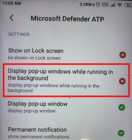

# Problembehandlung bei Microsoft Defender for Endpoint unter Android

[!INCLUDE [Microsoft 365 Defender rebranding](../../includes/microsoft-defender.md)]

**Gilt für:**
- [Microsoft Defender für Endpunkt](https://go.microsoft.com/fwlink/p/?linkid=2154037)
- [Microsoft 365 Defender](https://go.microsoft.com/fwlink/?linkid=2118804)

> Möchten Sie Microsoft Defender for Endpoint erleben? [Registrieren Sie sich für eine kostenlose Testversion.](https://www.microsoft.com/microsoft-365/windows/microsoft-defender-atp?ocid=docs-wdatp-exposedapis-abovefoldlink) 

Beim Onboarding eines Geräts werden möglicherweise Anmeldeprobleme angezeigt, nachdem die App installiert wurde.

Während des Onboardings können Anmeldeprobleme auftreten, nachdem die App auf Ihrem Gerät installiert wurde.

Dieser Artikel enthält Lösungen zur Lösung der Anmeldeprobleme.  

## Anmeldung fehlgeschlagen – unerwarteter Fehler
**Anmeldefehler: Unerwarteter** *Fehler, versuchen Sie es später*

**Nachricht:**

Unerwarteter Fehler, versuchen Sie es später

**Ursache:**

Sie haben eine ältere Version von "Microsoft Authenticator"-App auf Ihrem Gerät installiert.

**Lösung:**

Installieren Sie die neueste Version [und Microsoft Authenticator](https://play.google.com/store/apps/details?androidid=com.azure.authenticator) von Google Play Store und versuchen Sie es erneut.

## Anmelden fehlgeschlagen – ungültige Lizenz

**Fehlgeschlagene Anmeldung:** *Ungültige Lizenz, wenden Sie sich an den Administrator*

**Nachricht:** *Ungültige Lizenz, wenden Sie sich an den Administrator.*

**Ursache:**

Ihnen ist keine Microsoft 365 zugewiesen, oder Ihre Organisation verfügt nicht über eine Lizenz für Microsoft 365 Enterprise Abonnement.

**Lösung:**

Weitere Informationen erhalten Sie von Ihrem Administrator.

## Unsichere Website melden

Phishingwebsites geben sich als vertrauenswürdige Websites aus, um Ihre persönlichen oder finanziellen Informationen zu erhalten. Besuchen Sie [die Seite Feedback zum Netzwerkschutz](https://www.microsoft.com/wdsi/filesubmission/exploitguard/networkprotection) bereitstellen, wenn Sie eine Website melden möchten, bei der es sich um eine Phishingwebsite handelt.

## Phishingseiten werden auf einigen OEM-Geräten nicht blockiert

**Gilt für:** Nur bestimmte OEMs

-   **Xiaomi**

Phishing und schädliche Webbedrohungen, die von Defender for Endpoint für Android erkannt werden, werden auf einigen Xiaomi-Geräten nicht blockiert. Die folgenden Funktionen funktionieren auf diesen Geräten nicht.

**Ursache:**

Die Geräte von Xiaomi enthalten ein neues Berechtigungsmodell. Dadurch wird verhindert, dass Defender for Endpoint für Android Popupfenster angezeigt wird, während es im Hintergrund ausgeführt wird.

Berechtigung für Die Geräte von Xiaomi: "Popupfenster anzeigen, während sie im Hintergrund ausgeführt werden."

**Lösung:**

Aktivieren Sie die erforderliche Berechtigung auf Xiaomi-Geräten.

- Anzeigen von Popupfenstern während der Ausführung im Hintergrund.
