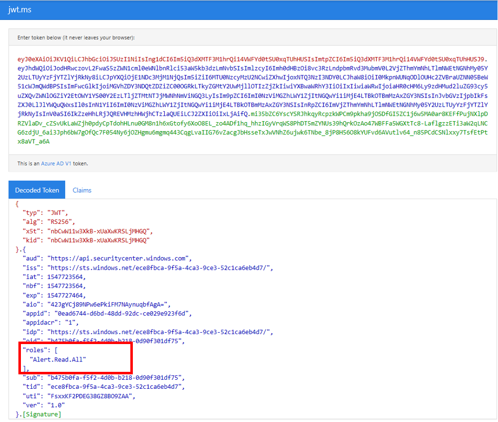

# <a name="microsoft-defender-for-endpoint-api---hello-world"></a>Microsoft Defender für Endpunkt-API – Hello World 

[!INCLUDE [Microsoft 365 Defender rebranding](../../includes/microsoft-defender.md)]


**Gilt für:** 
- [Microsoft Defender für Endpunkt](https://go.microsoft.com/fwlink/?linkid=2154037)


- Möchten Sie Microsoft Defender for Endpoint erleben? [Registrieren Sie sich für eine kostenlose Testversion.](https://www.microsoft.com/microsoft-365/windows/microsoft-defender-atp?ocid=docs-wdatp-exposedapis-abovefoldlink) 

[!include[Microsoft Defender for Endpoint API URIs for US Government](../../includes/microsoft-defender-api-usgov.md)]

[!include[Improve request performance](../../includes/improve-request-performance.md)]


## <a name="get-alerts-using-a-simple-powershell-script"></a>Warnungen mithilfe eines einfachen PowerShell-Skripts erhalten

### <a name="how-long-it-takes-to-go-through-this-example"></a>Wie lange dauert es, dieses Beispiel zu durchgehen?
Es dauert nur 5 Minuten in zwei Schritten:
- Anwendungsregistrierung
- Verwenden von Beispielen: Erfordert nur kopieren/einfügen eines kurzen PowerShell-Skripts

### <a name="do-i-need-a-permission-to-connect"></a>Benötigen Sie eine Berechtigung zum Herstellen einer Verbindung?
Für die Phase der Anwendungsregistrierung müssen Sie über eine **globale Administratorrolle** in Ihrem Azure Active Directory (Azure AD)-Mandanten verfügen.

### <a name="step-1---create-an-app-in-azure-active-directory"></a>Schritt 1 : Erstellen einer App in Azure Active Directory

1. Melden Sie sich mit Ihrem globalen **Administrator bei** [Azure](https://portal.azure.com) an.

2. Navigieren Sie zu **Azure Active Directory**  >  **App-Registrierungen** Neue  >  **Registrierung**. 

   

3. Wählen Sie im Registrierungsformular einen Namen für Ihre Anwendung aus, und klicken Sie dann auf **Registrieren**.

4. Ermöglichen Sie Ihrer Anwendung den Zugriff auf Defender for Endpoint, und weisen Sie ihm die Berechtigung **"Alle Warnungen lesen"** zu:

   - Klicken Sie auf der Anwendungsseite auf **API-Berechtigungen**  >    >  **Berechtigungs-APIs** hinzufügen, die meine > **WindowsDefenderATP** verwendet, und klicken Sie auf **WindowsDefenderATP**.

   - **Hinweis:** WindowsDefenderATP wird nicht in der ursprünglichen Liste angezeigt. Sie müssen damit beginnen, den Namen in das Textfeld zu schreiben, damit er angezeigt wird.

   

   - Wählen **Sie Anwendungsberechtigungen**  >  **Alert.Read.All >** Klicken Sie auf Berechtigungen **hinzufügen**

   

   **Wichtiger Hinweis:** Sie müssen die entsprechenden Berechtigungen auswählen. "Alle Warnungen lesen" ist nur ein Beispiel!

     Zum Beispiel

     - Wählen [Sie zum Ausführen erweiterter](run-advanced-query-api.md)Abfragen die Berechtigung "Erweiterte Abfragen ausführen" aus.
     - Wählen [Sie zum Isolieren](isolate-machine.md)eines Computers die Berechtigung "Computer isolieren" aus.
     - Um zu bestimmen, welche Berechtigung Sie benötigen, schauen Sie sich den Abschnitt **Berechtigungen** in der API an, die Sie aufrufen möchten.

5. Klicken Sie **auf Zustimmung erteilen**

    - **Hinweis**: Jedes Mal, wenn Sie die Berechtigung hinzufügen, müssen Sie auf Zustimmung erteilen **klicken,** damit die neue Berechtigung wirksam wird.

    

6. Fügen Sie der Anwendung einen geheimen Schlüssel hinzu.

    - Klicken **Sie auf Zertifikate &** Schlüssel, fügen Sie dem Geheimen eine Beschreibung hinzu, und klicken Sie auf **Hinzufügen**.

    **Wichtig:** Kopieren Sie nach dem Klicken auf Hinzufügen **den generierten geheimen Wert**. Sie können nach dem Verlassen nicht mehr abrufen!

    

7. Notieren Sie sich Ihre Anwendungs-ID und Ihre Mandanten-ID:

   - Wechseln Sie auf der Anwendungsseite zu **Übersicht,** und kopieren Sie Folgendes:

   


Fertig! Sie haben eine Anwendung erfolgreich registriert!

### <a name="step-2---get-a-token-using-the-app-and-use-this-token-to-access-the-api"></a>Schritt 2 : Abrufen eines Tokens mithilfe der App und Verwenden dieses Tokens für den Zugriff auf die API.

-   Kopieren Sie das skript unten in PowerShell ISE oder in einen **Text-Editor,** und speichern Sie es als "Get-Token.ps1"
-   Durch Ausführen dieses Skripts wird ein Token generiert und im Arbeitsordner unter dem Namen "**Latest-token.txt**" gespeichert.

```
# That code gets the App Context Token and save it to a file named "Latest-token.txt" under the current directory
# Paste below your Tenant ID, App ID and App Secret (App key).

$tenantId = '' ### Paste your tenant ID here
$appId = '' ### Paste your Application ID here
$appSecret = '' ### Paste your Application secret here

$resourceAppIdUri = 'https://api.securitycenter.microsoft.com'
$oAuthUri = "https://login.microsoftonline.com/$TenantId/oauth2/token"
$authBody = [Ordered] @{
    resource = "$resourceAppIdUri"
    client_id = "$appId"
    client_secret = "$appSecret"
    grant_type = 'client_credentials'
}
$authResponse = Invoke-RestMethod -Method Post -Uri $oAuthUri -Body $authBody -ErrorAction Stop
$token = $authResponse.access_token
Out-File -FilePath "./Latest-token.txt" -InputObject $token
return $token
```

-   Sanity Check:<br>
Führen Sie das Skript aus.<br>
Wechseln Sie in Ihrem Browser zu: https://jwt.ms/ <br>
Kopieren Sie das Token (den Inhalt der Latest-token.txt Datei).<br>
Fügen Sie in das obere Feld ein.<br>
Suchen Sie nach dem Abschnitt "Roles". Suchen Sie die Rolle Alert.Read.All.



### <a name="lets-get-the-alerts"></a>Ermöglicht das Erhalten der Warnungen!

-   Das folgende Skript verwendet **Get-Token.ps1** für den Zugriff auf die API und erhalten die letzten 48 Stunden Warnungen.
-   Speichern Sie dieses Skript in dem Ordner, in dem Sie das vorherige Skript gespeichert **haben,Get-Token.ps1.** 
-   Das Skript erstellt zwei Dateien (json und csv) mit den Daten im gleichen Ordner wie die Skripts.

```
# Returns Alerts created in the past 48 hours.

$token = ./Get-Token.ps1       #run the script Get-Token.ps1  - make sure you are running this script from the same folder of Get-Token.ps1

# Get Alert from the last 48 hours. Make sure you have alerts in that time frame.
$dateTime = (Get-Date).ToUniversalTime().AddHours(-48).ToString("o")       

# The URL contains the type of query and the time filter we create above
# Read more about other query options and filters at   Https://TBD- add the documentation link
$url = "https://api.securitycenter.microsoft.com/api/alerts?`$filter=alertCreationTime ge $dateTime"

# Set the WebRequest headers
$headers = @{ 
    'Content-Type' = 'application/json'
    Accept = 'application/json'
    Authorization = "Bearer $token" 
}

# Send the webrequest and get the results. 
$response = Invoke-WebRequest -Method Get -Uri $url -Headers $headers -ErrorAction Stop

# Extract the alerts from the results. 
$alerts =  ($response | ConvertFrom-Json).value | ConvertTo-Json

# Get string with the execution time. We concatenate that string to the output file to avoid overwrite the file
$dateTimeForFileName = Get-Date -Format o | foreach {$_ -replace ":", "."}    

# Save the result as json and as csv
$outputJsonPath = "./Latest Alerts $dateTimeForFileName.json"     
$outputCsvPath = "./Latest Alerts $dateTimeForFileName.csv"

Out-File -FilePath $outputJsonPath -InputObject $alerts
($alerts | ConvertFrom-Json) | Export-CSV $outputCsvPath -NoTypeInformation 
```

Sie sind alle fertig! Sie haben gerade erfolgreich:
-   Erstellt und registriert und Anwendung
-   Erteilte Berechtigung für diese Anwendung zum Lesen von Warnungen
-   Die API wurde verbunden
-   Zurückgeben von in den letzten 48 Stunden erstellten Warnungen mit einem PowerShell-Skript


## <a name="related-topic"></a>Verwandtes Thema
- [Microsoft Defender für Endpunkt-APIs](exposed-apis-list.md)
- [Zugreifen auf Microsoft Defender for Endpoint mit Anwendungskontext](exposed-apis-create-app-webapp.md)
- [Zugreifen auf Microsoft Defender for Endpoint mit Benutzerkontext](exposed-apis-create-app-nativeapp.md)
