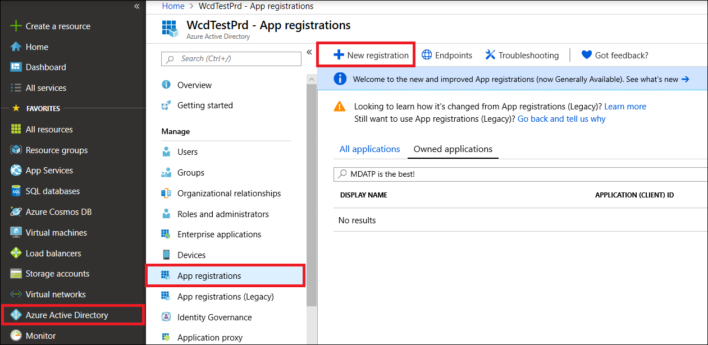

# <a name="microsoft-defender-for-endpoint-api---hello-world"></a><span data-ttu-id="e5d26-104">Microsoft Defender für Endpunkt-API – Hello World</span><span class="sxs-lookup"><span data-stu-id="e5d26-104">Microsoft Defender for Endpoint API - Hello World</span></span> 

[!INCLUDE [Microsoft 365 Defender rebranding](../../includes/microsoft-defender.md)]


<span data-ttu-id="e5d26-105">**Gilt für:**</span><span class="sxs-lookup"><span data-stu-id="e5d26-105">**Applies to:**</span></span> 
- [<span data-ttu-id="e5d26-106">Microsoft Defender für Endpunkt</span><span class="sxs-lookup"><span data-stu-id="e5d26-106">Microsoft Defender for Endpoint</span></span>](https://go.microsoft.com/fwlink/?linkid=2154037)


- <span data-ttu-id="e5d26-107">Möchten Sie Microsoft Defender für Endpunkt erleben?</span><span class="sxs-lookup"><span data-stu-id="e5d26-107">Want to experience Microsoft Defender for Endpoint?</span></span> [<span data-ttu-id="e5d26-108">Registrieren Sie sich für eine kostenlose Testversion.</span><span class="sxs-lookup"><span data-stu-id="e5d26-108">Sign up for a free trial.</span></span>](https://www.microsoft.com/microsoft-365/windows/microsoft-defender-atp?ocid=docs-wdatp-exposedapis-abovefoldlink) 

[!include[Microsoft Defender for Endpoint API URIs for US Government](../../includes/microsoft-defender-api-usgov.md)]

[!include[Improve request performance](../../includes/improve-request-performance.md)]


## <a name="get-alerts-using-a-simple-powershell-script"></a><span data-ttu-id="e5d26-109">Abrufen von Warnungen mithilfe eines einfachen PowerShell-Skripts</span><span class="sxs-lookup"><span data-stu-id="e5d26-109">Get Alerts using a simple PowerShell script</span></span>

### <a name="how-long-it-takes-to-go-through-this-example"></a><span data-ttu-id="e5d26-110">Wie lange dauert es, bis dieses Beispiel durchgeht?</span><span class="sxs-lookup"><span data-stu-id="e5d26-110">How long it takes to go through this example?</span></span>
<span data-ttu-id="e5d26-111">Es dauert nur 5 Minuten, wenn Sie in zwei Schritten fertig sind:</span><span class="sxs-lookup"><span data-stu-id="e5d26-111">It only takes 5 minutes done in two steps:</span></span>
- <span data-ttu-id="e5d26-112">Anwendungsregistrierung</span><span class="sxs-lookup"><span data-stu-id="e5d26-112">Application registration</span></span>
- <span data-ttu-id="e5d26-113">Verwenden von Beispielen: Erfordert nur das Kopieren/Einfügen eines kurzen PowerShell-Skripts.</span><span class="sxs-lookup"><span data-stu-id="e5d26-113">Use examples: only requires copy/paste of a short PowerShell script</span></span>

### <a name="do-i-need-a-permission-to-connect"></a><span data-ttu-id="e5d26-114">Benöte ich eine Berechtigung zum Herstellen einer Verbindung?</span><span class="sxs-lookup"><span data-stu-id="e5d26-114">Do I need a permission to connect?</span></span>
<span data-ttu-id="e5d26-115">Für die Phase der Anwendungsregistrierung benötigen Sie eine **globale Administratorrolle** in Ihrem Azure Active Directory (Azure AD)-Mandanten.</span><span class="sxs-lookup"><span data-stu-id="e5d26-115">For the Application registration stage, you must have a **Global administrator** role in your Azure Active Directory (Azure AD) tenant.</span></span>

### <a name="step-1---create-an-app-in-azure-active-directory"></a><span data-ttu-id="e5d26-116">Schritt 1: Erstellen einer App in Azure Active Directory</span><span class="sxs-lookup"><span data-stu-id="e5d26-116">Step 1 - Create an App in Azure Active Directory</span></span>

1. <span data-ttu-id="e5d26-117">Melden Sie sich mit Ihrem **globalen Administratorbenutzer** bei [Azure](https://portal.azure.com) an.</span><span class="sxs-lookup"><span data-stu-id="e5d26-117">Log on to [Azure](https://portal.azure.com) with your **Global administrator** user.</span></span>

2. <span data-ttu-id="e5d26-118">Navigieren Sie zu **Azure Active Directory**  >  **App-Registrierungen**  >  **Neuregistrierung.**</span><span class="sxs-lookup"><span data-stu-id="e5d26-118">Navigate to **Azure Active Directory** > **App registrations** > **New registration**.</span></span> 

   

3. <span data-ttu-id="e5d26-120">Wählen Sie im Registrierungsformular einen Namen für Ihre Anwendung aus, und klicken Sie dann auf **"Registrieren".**</span><span class="sxs-lookup"><span data-stu-id="e5d26-120">In the registration form, choose a name for your application and then click **Register**.</span></span>

4. <span data-ttu-id="e5d26-121">Zulassen, dass Ihre Anwendung auf Defender für Endpunkt zugreift und ihr die Berechtigung **"Alle Warnungen lesen"** zuweist:</span><span class="sxs-lookup"><span data-stu-id="e5d26-121">Allow your Application to access Defender for Endpoint and assign it **'Read all alerts'** permission:</span></span>

   - <span data-ttu-id="e5d26-122">Klicken Sie auf der Anwendungsseite auf **API-Berechtigungen**  >  **Hinzufügen von** Berechtigungs-APIs, die  >  meine Organisation > Typ **WindowsDefenderATP** **verwendet,** und klicken Sie auf **WindowsDefenderATP.**</span><span class="sxs-lookup"><span data-stu-id="e5d26-122">On your application page, click **API Permissions** > **Add permission** > **APIs my organization uses** > type **WindowsDefenderATP** and click on **WindowsDefenderATP**.</span></span>

   - <span data-ttu-id="e5d26-123">**Hinweis:** WindowsDefenderATP wird nicht in der ursprünglichen Liste angezeigt.</span><span class="sxs-lookup"><span data-stu-id="e5d26-123">**Note**: WindowsDefenderATP does not appear in the original list.</span></span> <span data-ttu-id="e5d26-124">Sie müssen mit dem Schreiben des Namens in das Textfeld beginnen, damit es angezeigt wird.</span><span class="sxs-lookup"><span data-stu-id="e5d26-124">You need to start writing its name in the text box to see it appear.</span></span>

   

   - <span data-ttu-id="e5d26-126">Auswählen von **Anwendungsberechtigungen**  >  **Alert.Read.All** > Klicken Sie auf **"Berechtigungen hinzufügen".**</span><span class="sxs-lookup"><span data-stu-id="e5d26-126">Choose **Application permissions** > **Alert.Read.All** > Click on **Add permissions**</span></span>

   

   <span data-ttu-id="e5d26-128">**Wichtiger Hinweis:** Sie müssen die entsprechenden Berechtigungen auswählen.</span><span class="sxs-lookup"><span data-stu-id="e5d26-128">**Important note**: You need to select the relevant permissions.</span></span> <span data-ttu-id="e5d26-129">"Alle Warnungen lesen" ist nur ein Beispiel!</span><span class="sxs-lookup"><span data-stu-id="e5d26-129">'Read All Alerts' is only an example!</span></span>

     <span data-ttu-id="e5d26-130">Zum Beispiel</span><span class="sxs-lookup"><span data-stu-id="e5d26-130">For instance,</span></span>

     - <span data-ttu-id="e5d26-131">Wählen Sie zum [Ausführen erweiterter Abfragen](run-advanced-query-api.md)die Berechtigung "Erweiterte Abfragen ausführen" aus.</span><span class="sxs-lookup"><span data-stu-id="e5d26-131">To [run advanced queries](run-advanced-query-api.md), select 'Run advanced queries' permission</span></span>
     - <span data-ttu-id="e5d26-132">Um [einen Computer zu isolieren,](isolate-machine.md)wählen Sie die Berechtigung "Computer isolieren" aus.</span><span class="sxs-lookup"><span data-stu-id="e5d26-132">To [isolate a machine](isolate-machine.md), select 'Isolate machine' permission</span></span>
     - <span data-ttu-id="e5d26-133">Um zu bestimmen, welche Berechtigung Sie benötigen, sehen Sie sich den Abschnitt **"Berechtigungen"** in der API an, die Sie aufrufen möchten.</span><span class="sxs-lookup"><span data-stu-id="e5d26-133">To determine which permission you need, please look at the **Permissions** section in the API you are interested to call.</span></span>

5. <span data-ttu-id="e5d26-134">Klicken Sie auf **"Zustimmung erteilen".**</span><span class="sxs-lookup"><span data-stu-id="e5d26-134">Click **Grant consent**</span></span>

    - <span data-ttu-id="e5d26-135">**Hinweis:** Jedes Mal, wenn Sie eine Berechtigung hinzufügen, müssen Sie auf **"Zustimmung erteilen"** klicken, damit die neue Berechtigung wirksam wird.</span><span class="sxs-lookup"><span data-stu-id="e5d26-135">**Note**: Every time you add permission you must click on **Grant consent** for the new permission to take effect.</span></span>

    

6. <span data-ttu-id="e5d26-137">Fügen Sie der Anwendung einen geheimen Schlüssel hinzu.</span><span class="sxs-lookup"><span data-stu-id="e5d26-137">Add a secret to the application.</span></span>

    - <span data-ttu-id="e5d26-138">Klicken Sie auf **"Zertifikate & geheime Schlüssel",** fügen Sie eine Beschreibung zum geheimen Schlüssel hinzu, und klicken Sie auf **"Hinzufügen".**</span><span class="sxs-lookup"><span data-stu-id="e5d26-138">Click **Certificates & secrets**, add description to the secret and click **Add**.</span></span>

    <span data-ttu-id="e5d26-139">**Wichtig:** Kopieren Sie nach dem Klicken auf "Hinzufügen" **den generierten geheimen Wert.**</span><span class="sxs-lookup"><span data-stu-id="e5d26-139">**Important**: After click Add, **copy the generated secret value**.</span></span> <span data-ttu-id="e5d26-140">Sie können nach dem Verlassen nicht mehr abrufen!</span><span class="sxs-lookup"><span data-stu-id="e5d26-140">You won't be able to retrieve after you leave!</span></span>

    

7. <span data-ttu-id="e5d26-142">Notieren Sie Ihre Anwendungs-ID und Ihre Mandanten-ID:</span><span class="sxs-lookup"><span data-stu-id="e5d26-142">Write down your application ID and your tenant ID:</span></span>

   - <span data-ttu-id="e5d26-143">Wechseln Sie auf der Anwendungsseite zu **"Übersicht",** und kopieren Sie Folgendes:</span><span class="sxs-lookup"><span data-stu-id="e5d26-143">On your application page, go to **Overview** and copy the following:</span></span>

   


<span data-ttu-id="e5d26-145">fertig!</span><span class="sxs-lookup"><span data-stu-id="e5d26-145">Done!</span></span> <span data-ttu-id="e5d26-146">Sie haben eine Anwendung erfolgreich registriert!</span><span class="sxs-lookup"><span data-stu-id="e5d26-146">You have successfully registered an application!</span></span>

### <a name="step-2---get-a-token-using-the-app-and-use-this-token-to-access-the-api"></a><span data-ttu-id="e5d26-147">Schritt 2: Abrufen eines Tokens mithilfe der App und Verwenden dieses Tokens für den Zugriff auf die API.</span><span class="sxs-lookup"><span data-stu-id="e5d26-147">Step 2 - Get a token using the App and use this token to access the API.</span></span>

-   <span data-ttu-id="e5d26-148">Kopieren Sie das folgende Skript in PowerShell ISE oder in einen Text-Editor, und speichern Sie es als "**Get-Token.ps1**"</span><span class="sxs-lookup"><span data-stu-id="e5d26-148">Copy the script below to PowerShell ISE or to a text editor, and save it as "**Get-Token.ps1**"</span></span>
-   <span data-ttu-id="e5d26-149">Durch Ausführen dieses Skripts wird ein Token generiert und im Arbeitsordner unter dem Namen **"Latest-token.txt"** gespeichert.</span><span class="sxs-lookup"><span data-stu-id="e5d26-149">Running this script will generate a token and will save it in the working folder under the name "**Latest-token.txt**".</span></span>

```
# That code gets the App Context Token and save it to a file named "Latest-token.txt" under the current directory
# Paste below your Tenant ID, App ID and App Secret (App key).

$tenantId = '' ### Paste your tenant ID here
$appId = '' ### Paste your Application ID here
$appSecret = '' ### Paste your Application secret here

$resourceAppIdUri = 'https://api.securitycenter.microsoft.com'
$oAuthUri = "https://login.microsoftonline.com/$TenantId/oauth2/token"
$authBody = [Ordered] @{
    resource = "$resourceAppIdUri"
    client_id = "$appId"
    client_secret = "$appSecret"
    grant_type = 'client_credentials'
}
$authResponse = Invoke-RestMethod -Method Post -Uri $oAuthUri -Body $authBody -ErrorAction Stop
$token = $authResponse.access_token
Out-File -FilePath "./Latest-token.txt" -InputObject $token
return $token
```

-   <span data-ttu-id="e5d26-150">Sanity Check:</span><span class="sxs-lookup"><span data-stu-id="e5d26-150">Sanity Check:</span></span><br>
<span data-ttu-id="e5d26-151">Führen Sie das Skript aus.</span><span class="sxs-lookup"><span data-stu-id="e5d26-151">Run the script.</span></span><br>
<span data-ttu-id="e5d26-152">Wechseln Sie in Ihrem Browser zu: https://jwt.ms/</span><span class="sxs-lookup"><span data-stu-id="e5d26-152">In your browser go to: https://jwt.ms/</span></span> <br>
<span data-ttu-id="e5d26-153">Kopieren Sie das Token (den Inhalt der Latest-token.txt-Datei).</span><span class="sxs-lookup"><span data-stu-id="e5d26-153">Copy the token (the content of the Latest-token.txt file).</span></span><br>
<span data-ttu-id="e5d26-154">In das obere Feld einfügen.</span><span class="sxs-lookup"><span data-stu-id="e5d26-154">Paste in the top box.</span></span><br>
<span data-ttu-id="e5d26-155">Suchen Sie nach dem Abschnitt "Rollen".</span><span class="sxs-lookup"><span data-stu-id="e5d26-155">Look for the "roles" section.</span></span> <span data-ttu-id="e5d26-156">Suchen Sie die Rolle "Alert.Read.All".</span><span class="sxs-lookup"><span data-stu-id="e5d26-156">Find the Alert.Read.All role.</span></span>


### <a name="lets-get-the-alerts"></a><span data-ttu-id="e5d26-158">Hiermit erhalten Sie die Warnungen!</span><span class="sxs-lookup"><span data-stu-id="e5d26-158">Lets get the Alerts!</span></span>

-   <span data-ttu-id="e5d26-159">Das folgende Skript verwendet **Get-Token.ps1** für den Zugriff auf die API und erhält die warnungen der letzten 48 Stunden.</span><span class="sxs-lookup"><span data-stu-id="e5d26-159">The script below will use **Get-Token.ps1** to access the API and will get the past 48 hours Alerts.</span></span>
-   <span data-ttu-id="e5d26-160">Speichern Sie dieses Skript in dem Ordner, in dem Sie das vorherige Skript **Get-Token.ps1** gespeichert haben.</span><span class="sxs-lookup"><span data-stu-id="e5d26-160">Save this script in the same folder you saved the previous script **Get-Token.ps1**.</span></span> 
-   <span data-ttu-id="e5d26-161">Das Skript erstellt zwei Dateien (JSON und CSV) mit den Daten im selben Ordner wie die Skripts.</span><span class="sxs-lookup"><span data-stu-id="e5d26-161">The script creates two files (json and csv) with the data in the same folder as the scripts.</span></span>

```
# Returns Alerts created in the past 48 hours.

$token = ./Get-Token.ps1       #run the script Get-Token.ps1  - make sure you are running this script from the same folder of Get-Token.ps1

# Get Alert from the last 48 hours. Make sure you have alerts in that time frame.
$dateTime = (Get-Date).ToUniversalTime().AddHours(-48).ToString("o")       

# The URL contains the type of query and the time filter we create above
# Read more about other query options and filters at   Https://TBD- add the documentation link
$url = "https://api.securitycenter.microsoft.com/api/alerts?`$filter=alertCreationTime ge $dateTime"

# Set the WebRequest headers
$headers = @{ 
    'Content-Type' = 'application/json'
    Accept = 'application/json'
    Authorization = "Bearer $token" 
}

# Send the webrequest and get the results. 
$response = Invoke-WebRequest -Method Get -Uri $url -Headers $headers -ErrorAction Stop

# Extract the alerts from the results. 
$alerts =  ($response | ConvertFrom-Json).value | ConvertTo-Json

# Get string with the execution time. We concatenate that string to the output file to avoid overwrite the file
$dateTimeForFileName = Get-Date -Format o | foreach {$_ -replace ":", "."}    

# Save the result as json and as csv
$outputJsonPath = "./Latest Alerts $dateTimeForFileName.json"     
$outputCsvPath = "./Latest Alerts $dateTimeForFileName.csv"

Out-File -FilePath $outputJsonPath -InputObject $alerts
($alerts | ConvertFrom-Json) | Export-CSV $outputCsvPath -NoTypeInformation 
```

<span data-ttu-id="e5d26-162">Sie sind fertig!</span><span class="sxs-lookup"><span data-stu-id="e5d26-162">You’re all done!</span></span> <span data-ttu-id="e5d26-163">Sie haben gerade folgendes erfolgreich:</span><span class="sxs-lookup"><span data-stu-id="e5d26-163">You have just successfully:</span></span>
-   <span data-ttu-id="e5d26-164">Erstellt und registriert und Anwendung</span><span class="sxs-lookup"><span data-stu-id="e5d26-164">Created and registered and application</span></span>
-   <span data-ttu-id="e5d26-165">Dieser Anwendung wurde die Berechtigung zum Lesen von Warnungen erteilt.</span><span class="sxs-lookup"><span data-stu-id="e5d26-165">Granted permission for that application to read alerts</span></span>
-   <span data-ttu-id="e5d26-166">Die API wurde verbunden</span><span class="sxs-lookup"><span data-stu-id="e5d26-166">Connected the API</span></span>
-   <span data-ttu-id="e5d26-167">Verwenden eines PowerShell-Skripts zum Zurückgeben von Warnungen, die in den letzten 48 Stunden erstellt wurden</span><span class="sxs-lookup"><span data-stu-id="e5d26-167">Used a PowerShell script to return alerts created in the past 48 hours</span></span>


## <a name="related-topic"></a><span data-ttu-id="e5d26-168">Verwandtes Thema</span><span class="sxs-lookup"><span data-stu-id="e5d26-168">Related topic</span></span>
- [<span data-ttu-id="e5d26-169">Microsoft Defender für Endpunkt-APIs</span><span class="sxs-lookup"><span data-stu-id="e5d26-169">Microsoft Defender for Endpoint APIs</span></span>](exposed-apis-list.md)
- [<span data-ttu-id="e5d26-170">Zugreifen auf Microsoft Defender für Endpunkt mit Anwendungskontext</span><span class="sxs-lookup"><span data-stu-id="e5d26-170">Access Microsoft Defender for Endpoint with application context</span></span>](exposed-apis-create-app-webapp.md)
- [<span data-ttu-id="e5d26-171">Zugreifen auf Microsoft Defender für Endpunkt mit Benutzerkontext</span><span class="sxs-lookup"><span data-stu-id="e5d26-171">Access Microsoft Defender for Endpoint with user context</span></span>](exposed-apis-create-app-nativeapp.md)
