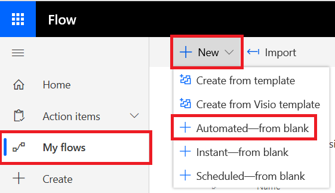

# Microsoft Power Automate (früher Microsoft Flow) und Azure-FunktionenMicrosoft Power Automate (formerly Microsoft Flow), and Azure Functions

[!INCLUDE [Microsoft 365 Defender rebranding](../../includes/microsoft-defender.md)]

**Gilt für:****Applies to:**
- [Microsoft Defender für EndpunktMicrosoft Defender for Endpoint](https://go.microsoft.com/fwlink/p/?linkid=2154037)
- [Microsoft 365 DefenderMicrosoft 365 Defender](https://go.microsoft.com/fwlink/?linkid=2118804)

- Möchten Sie Microsoft Defender für Endpunkt erleben?Want to experience Microsoft Defender for Endpoint? [Registrieren Sie sich für eine kostenlose Testversion.Sign up for a free trial.](https://www.microsoft.com/microsoft-365/windows/microsoft-defender-atp?ocid=docs-wdatp-exposedapis-abovefoldlink) 

Die Automatisierung von Sicherheitsverfahren ist eine Standardanforderung für jedes moderne Security Operations Center.Automating security procedures is a standard requirement for every modern Security Operations Center. Der Mangel an professionellen Cyber defendern zwingt SOC, auf die effizienteste Weise zu arbeiten, und Automatisierung ist ein Muss.The lack of professional cyber defenders forces SOC to work in the most efficient way and automation is a must. Microsoft Power Automate unterstützt verschiedene Connectors, die genau dafür erstellt wurden.Microsoft Power Automate supports different connectors that were built exactly for that. Sie können innerhalb weniger Minuten eine End-to-End-Prozedurautomatisierung erstellen.You can build an end-to-end procedure automation within a few minutes.

Die Microsoft Defender-API verfügt über einen offiziellen Flow Connector mit vielen Funktionen.Microsoft Defender API has an official Flow Connector with many capabilities.

> [!NOTE]
> Weitere Informationen zu den Voraussetzungen für die Lizenzierung von Premium-Connectors finden Sie unter ["Lizenzierung für Premium-Connectors".](https://docs.microsoft.com/power-automate/triggers-introduction#licensing-for-premium-connectors)For more details about premium connectors licensing prerequisites, see [Licensing for premium connectors](https://docs.microsoft.com/power-automate/triggers-introduction#licensing-for-premium-connectors).

## VerwendungsbeispielUsage example

Im folgenden Beispiel wird veranschaulicht, wie Sie ein Flow erstellen, das jedes Mal ausgelöst wird, wenn eine neue Warnung auf Ihrem Mandanten auftritt.The following example demonstrates how to create a Flow that is triggered any time a new Alert occurs on your tenant.

1. Melden Sie sich bei [Microsoft Power Automate](https://flow.microsoft.com)an.Log in to [Microsoft Power Automate](https://flow.microsoft.com).

2. Wechseln Sie zu **"My flows**  >  **New**  >  **Automated-from blank".**Go to **My flows** > **New** > **Automated-from blank**.

    

3. Wählen Sie einen Namen für Ihre Flow aus, suchen Sie nach "Microsoft Defender ATP Triggers" als Auslöser, und wählen Sie dann den neuen Trigger "Alerts" aus.Choose a name for your Flow, search for "Microsoft Defender ATP Triggers" as the trigger, and then select the new Alerts trigger.

    

Jetzt haben Sie eine Flow, die jedes Mal ausgelöst wird, wenn eine neue Warnung auftritt.Now you have a Flow that is triggered every time a new Alert occurs.

Sie müssen nur noch die nächsten Schritte auswählen.All you need to do now is choose your next steps.
Sie können das Gerät beispielsweise isolieren, wenn der Schweregrad der Warnung hoch ist, und eine E-Mail darüber senden.For example, you can isolate the device if the Severity of the Alert is High and send an email about it.
Der Warnungsauslöser stellt nur die Warnungs-ID und die Computer-ID bereit.The Alert trigger provides only the Alert ID and the Machine ID. Sie können den Connector verwenden, um diese Entitäten zu erweitern.You can use the connector to expand these entities.

### Abrufen der Warnungsentität mithilfe des ConnectorsGet the Alert entity using the connector

1. Wählen Sie **Microsoft Defender ATP** für den neuen Schritt aus.Choose **Microsoft Defender ATP** for the new step.

2. Wählen Sie **Warnungen aus – Rufen Sie die api für einzelne Warnungen** ab.Choose **Alerts - Get single alert API**.

3. Legen Sie die **Warnungs-ID** aus dem letzten Schritt als **Eingabe** fest.Set the **Alert ID** from the last step as **Input**.

    

### Isolieren des Geräts, wenn der Schweregrad der Warnung hoch istIsolate the device if the Alert's severity is High

1. Fügen Sie **"Bedingung"** als neuen Schritt hinzu.Add **Condition** as a new step.

2. Überprüfen Sie, ob der Schweregrad der Warnung **"Hoch" ist.**Check if the Alert severity **is equal to** High.

   Wenn ja, fügen Sie die **Microsoft Defender ATP – Computeraktion isolieren** mit der Computer-ID und einem Kommentar hinzu.If yes, add the **Microsoft Defender ATP - Isolate machine** action with the Machine ID and a comment.

    

3. Fügen Sie einen neuen Schritt für die E-Mail-Nachricht über die Warnung und die Isolation hinzu.Add a new step for emailing about the Alert and the Isolation. Es gibt mehrere E-Mail-Connectors, die sehr einfach zu verwenden sind, z. B. Outlook oder Gmail.There are multiple email connectors that are very easy to use, such as Outlook or Gmail.

4. Speichern Sie Ihren Flow.Save your flow.

Sie können auch einen **geplanten** Fluss erstellen, der Abfragen der erweiterten Suche ausführt und vieles mehr!You can also create a **scheduled** flow that runs Advanced Hunting queries and much more!

## Verwandtes ThemaRelated topic
- [Microsoft Defender für Endpunkt-APIsMicrosoft Defender for Endpoint APIs](apis-intro.md)
