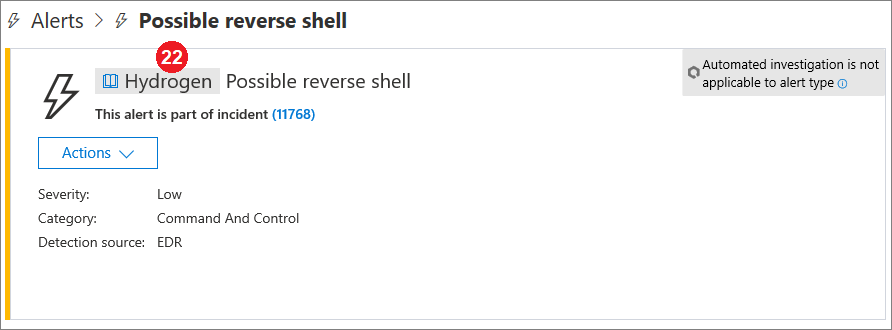

# Microsoft Defender for Endpoint Detections-API-FelderMicrosoft Defender for Endpoint detections API fields

[!INCLUDE [Microsoft 365 Defender rebranding](../../includes/microsoft-defender.md)]

**Gilt für:****Applies to:**
- [Microsoft Defender für EndpunktMicrosoft Defender for Endpoint](https://go.microsoft.com/fwlink/p/?linkid=2154037)
- [Microsoft 365 DefenderMicrosoft 365 Defender](https://go.microsoft.com/fwlink/?linkid=2118804)

>Möchten Sie Defender for Endpoint erleben?Want to experience Defender for Endpoint? [Registrieren Sie sich für eine kostenlose Testversion.Sign up for a free trial.](https://www.microsoft.com/microsoft-365/windows/microsoft-defender-atp?ocid=docs-wdatp-apiportalmapping-abovefoldlink)

Erfahren Sie, welche Datenfelder im Rahmen der Erkennungs-API verfügbar gemacht werden und wie sie Microsoft Defender Security Center.Understand what data fields are exposed as part of the detections API and how they map to Microsoft Defender Security Center.

>[!Note]
>- [Defender for Endpoint Alert](alerts.md) besteht aus einer oder mehreren Erkennungen.[Defender for Endpoint Alert](alerts.md) is composed from one or more detections.
>- **Microsoft Defender ATP Die Erkennung** besteht aus dem verdächtigen Ereignis, das auf dem Gerät aufgetreten ist, und den **zugehörigen Warnungsdetails.****Microsoft Defender ATP Detection** is composed from the suspicious event occurred on the Device and its related **Alert** details.
>- Die Microsoft Defender for Endpoint Alert-API ist die neueste API für den Warnungsverbrauch und enthält eine detaillierte Liste der zugehörigen Nachweise für jede Warnung.The Microsoft Defender for Endpoint Alert API is the latest API for alert consumption and contain a detailed list of related evidence for each alert. Weitere Informationen finden Sie unter [Warnungsmethoden und -eigenschaften und](alerts.md) [Warnungen auflisten.](get-alerts.md)For more information, see [Alert methods and properties](alerts.md) and [List alerts](get-alerts.md).

## Erkennungen von API-Feldern und PortalzuordnungDetections API fields and portal mapping
In der folgenden Tabelle sind die verfügbaren Felder aufgeführt, die in der Erkennungs-API-Nutzlast verfügbar sind.The following table lists the available fields exposed in the detections API payload. Es enthält Beispiele für die aufgefüllten Werte und einen Verweis darauf, wie Daten im Portal widerspiegelt werden.It shows examples for the populated values and a reference on how data is reflected on the portal.

Die Spalte ArcSight-Feld enthält die Standardzuordnung zwischen den Feldern Defender for Endpoint und den integrierten Feldern in ArcSight.The ArcSight field column contains the default mapping between the Defender for Endpoint fields and the built-in fields in ArcSight. Sie können die Zuordnungsdatei aus dem Portal herunterladen, wenn Sie das SIEM-Integrationsfeature aktivieren, und sie an die Anforderungen Ihrer Organisation anpassen.You can download the mapping file from the portal when you enable the SIEM integration feature and you can modify it to match the  needs of your organization. Weitere Informationen finden Sie unter [Aktivieren der SIEM-Integration in Defender for Endpoint](enable-siem-integration.md).For more information, see [Enable SIEM integration in Defender for Endpoint](enable-siem-integration.md).

Feldnummern entsprechen den Zahlen in den folgenden Bildern.Field numbers match the numbers in the images below.

> [!div class="mx-tableFixed"]
> 
> | PortalbeschriftungPortal   label   | NAME des SIEM-FeldsSIEM field name           | ArcSight-FeldArcSight field      | BeispielwertExample value                                                                      | BeschreibungDescription                                                                                                                                                                    |
> |------------------|---------------------------|---------------------|------------------------------------------------------------------------------------|--------------------------------------------------------------------------------------------------------------------------------------------------------------------------------|
> | 11                | AlertTitleAlertTitle                | namename                | Microsoft Defender AV erkannte Schadsoftware mit hohem Schweregrad "Mikatz"Microsoft Defender AV detected 'Mikatz' high-severity malware | Wert, der für jede Erkennung verfügbar ist.Value available for every Detection.                                                                                                                                               |
> | 22                | SeveritySeverity                  | deviceSeveritydeviceSeverity      | HochHigh                                                                             | Wert, der für jede Erkennung verfügbar ist.Value available for every Detection.                                                                                                                                               |
> | 33                | KategorieCategory                  | deviceEventCategorydeviceEventCategory | SchadsoftwareMalware                                                               | Wert, der für jede Erkennung verfügbar ist.Value available for every Detection.                                                                                                                                               |
> | 4 4                | ErkennungsquelleDetection source                    | sourceServiceNamesourceServiceName   | AntivirusAntivirus                                                                 | Microsoft Defender Antivirus oder Defender for Endpoint.Microsoft Defender Antivirus or  Defender for Endpoint. Wert, der für jede Erkennung verfügbar ist.Value available for every Detection.                                                                                         |
> | 5 5                | MachineNameMachineName               | sourceHostNamesourceHostName      | desktop-4a5ngd6desktop-4a5ngd6                                                                           | Wert, der für jede Erkennung verfügbar ist.Value available for every Detection.                                                                                                                                               |
> | 6 6                | FileNameFileName                  | fileNamefileName            | Robocopy.exeRobocopy.exe                                                                       | Verfügbar für Erkennungen, die einer Datei oder einem Prozess zugeordnet sind.Available for detections associated   with a file or process.                                                                                                                      |
> | 7 7                | FilePathFilePath                  | filePathfilePath            | C:\Windows\System32\Robocopy.exeC:\Windows\System32\Robocopy.exe                                                   | Verfügbar für Erkennungen, die einer Datei oder einem Prozess zugeordnet sind.Available for detections associated   with a file or process.                                                                                                                     |
> | 8 8                | UserDomainUserDomain                | sourceNtDomainsourceNtDomain      | CONTOSOCONTOSO                                                                            | Die Domäne des Benutzerkontexts, in dem die Aktivität ausgeführt wird und für verhaltensbasierte Erkennungen von Defender for Endpoint verfügbar ist.The domain of the user context   running the activity, available for Defender for Endpoint behavioral based detections.                                                           |
> | 9 9                | UserNameUserName                  | sourceUserNamesourceUserName      | liz.beanliz.bean                                                                           | Der Benutzerkontext, in dem die Aktivität ausgeführt wird, verfügbar für verhaltensbasierte Erkennungen von Defender for Endpoint.The user context running the   activity, available for Defender for Endpoint behavioral based detections.                                                                           |
> | 1010               | Sha1Sha1                      | fileHashfileHash            | 3da065e07b990034e9db7842167f70b63aa53293da065e07b990034e9db7842167f70b63aa5329                                           | Verfügbar für Erkennungen, die einer Datei oder einem Prozess zugeordnet sind.Available for detections associated   with a file or process.                                                                                                                      |
> | 1111               | Sha256Sha256                    | deviceCustomString6deviceCustomString6 | ebf54f745dc81e1958f75e4ca91dd0ab989fc9787bb6b0bf993e2f5ebf54f745dc81e1958f75e4ca91dd0ab989fc9787bb6b0bf993e2f5                   | Verfügbar für Microsoft Defender AV-Erkennungen.Available for Microsoft Defender AV detections.                                                                                                                                    |
> | 12 12               | Md5Md5                       | deviceCustomString5deviceCustomString5 | db979c04a99b96d370988325bb5a8b21db979c04a99b96d370988325bb5a8b21                                                   | Verfügbar für Microsoft Defender AV-Erkennungen.Available for Microsoft Defender AV detections.                                                                                                                                    |
> | 1313               | ThreatNameThreatName                | deviceCustomString1deviceCustomString1  | HackTool:Win32/Mikatz!dhaHackTool:Win32/Mikatz!dha                                                         | Verfügbar für Microsoft Defender AV-Erkennungen.Available for Microsoft Defender AV detections.                                                                                                                                    |
> | 14 14               | IpAddressIpAddress                 | sourceAddresssourceAddress       | 218.90.204.141218.90.204.141                                                                     | Verfügbar für Erkennungen, die Netzwerkereignissen zugeordnet sind.Available for detections associated   to network events. Beispiel: "Kommunikation mit einem zielschädlichen Netzwerk".For example, 'Communication to a malicious network   destination'.                                                        |
> | 15 15               | UrlUrl                       | requestUrlrequestUrl          | down.esales360.cndown.esales360.cn                                                                  | Verfügbar für Erkennungen, die Netzwerkereignissen zugeordnet sind.Available for detections associated to   network events. Beispiel: "Kommunikation mit einem zielschädlichen Netzwerk".For example, 'Communication to a malicious network   destination'.                                                         |
> | 16 16               | RemediationIsSuccessRemediationIsSuccess      | deviceCustomNumber2deviceCustomNumber2 | TRUETRUE                                                                               | Verfügbar für Microsoft Defender AV-Erkennungen.Available for Microsoft Defender AV detections. Der ArcSight-Wert ist 1, wenn TRUE und 0, wenn FALSE.ArcSight value is 1 when TRUE and 0 when FALSE.                                                                                    |
> | 17 17               | WasExecutingWhileDetectedWasExecutingWhileDetected | deviceCustomNumber1deviceCustomNumber1 | FALSEFALSE                                                                              | Verfügbar für Microsoft Defender AV-Erkennungen.Available for Microsoft Defender AV detections. Der ArcSight-Wert ist 1, wenn TRUE und 0, wenn FALSE.ArcSight value is 1 when TRUE and 0 when FALSE.                                                                                    |
> | 18 18               | AlertIdAlertId                   | externalIdexternalId          | 636210704265059241_673569822636210704265059241_673569822                                                       | Wert, der für jede Erkennung verfügbar ist.Value available for every Detection.                                                                                                                                               |
> | 1919               | LinkToWDATPLinkToWDATP               | flexString1flexString1         | `https://securitycenter.windows.com/alert/636210704265059241_673569822`            | Wert, der für jede Erkennung verfügbar ist.Value available for every Detection.                                                                                                                                               |
> | 2020               | AlertTimeAlertTime                 | deviceReceiptTimedeviceReceiptTime   | 2017-05-07T01:56:59.3191352Z2017-05-07T01:56:59.3191352Z                                                       | Der Zeitpunkt, zu dem das Ereignis aufgetreten ist.The time the event occurred. Wert, der für jede Erkennung verfügbar ist.Value available for every Detection.                                                                                       |
> |  2121               | MachineDomainMachineDomain             | sourceDnsDomainsourceDnsDomain     | contoso.comcontoso.com                                                                        | Domänenname für AAD-beigetretene Geräte nicht relevant.Domain name not relevant for AAD   joined devices. Wert, der für jede Erkennung verfügbar ist.Value available for every Detection.                                                                                           |
> | 2222               | AkteurActor                     | deviceCustomString4deviceCustomString4 | BORONBORON                                                                                   | Verfügbar für Warnungen im Zusammenhang mit einer bekannten Akteurgruppe.Available for alerts related to a   known actor group.                                                                                                                         |
> | 21+521+5             | ComputerDnsNameComputerDnsName           | Keine ZuordnungNo mapping          | liz-bean.contoso.comliz-bean.contoso.com                                                               | Der vollqualifizierte Domänenname des Geräts.The device fully qualified   domain name. Wert, der für jede Erkennung verfügbar ist.Value available for every Detection.                                                                                                    |
> |                  | LogOnUsersLogOnUsers                | sourceUserIdsourceUserId        | contoso\liz-bean;   contoso\jay-hardeecontoso\liz-bean;   contoso\jay-hardee                                             | Die Domäne und der Benutzer der interaktiven Anmeldebenutzer zum Zeitpunkt des Ereignisses.The domain and user of the   interactive logon user/s at the time of the event. Hinweis: Für Geräte auf Windows 10 Version 1607 sind die Domäneninformationen nicht verfügbar.Note: For devices on   Windows 10 version 1607, the domain information will not be available. |
> |                  | InternalIPv4ListInternalIPv4List          | Keine ZuordnungNo mapping          | 192.168.1.7, 10.1.14.1192.168.1.7, 10.1.14.1                                                             | Liste der internen IPV4-IPs für aktive Netzwerkschnittstellen.List of IPV4 internal IPs for active network interfaces.                                                                                                                                                                               |
> |                  | InternalIPv6ListInternalIPv6List          | Keine ZuordnungNo mapping          | fd30:0000:0000:0001:ff4e:003e:0009:000e, FE80:CD00:0000:0CDE:1257:0000:211E:729Cfd30:0000:0000:0001:ff4e:003e:0009:000e,   FE80:CD00:0000:0CDE:1257:0000:211E:729C | Liste der internen IPV6-IPs für aktive Netzwerkschnittstellen.List of IPV6 internal IPs for active network interfaces.                                                                                                                                                                               |
| | LinkToMTPLinkToMTP | Keine ZuordnungNo mapping | `https://security.microsoft.com/alert/da637370718981685665_16349121` | Wert, der für jede Erkennung verfügbar ist.Value available for every Detection.
| | IncidentLinkToMTPIncidentLinkToMTP | Keine ZuordnungNo mapping | `"https://security.microsoft.com/incidents/byalert?alertId=da637370718981685665_16349121&source=SIEM` | Wert, der für jede Erkennung verfügbar ist.Value available for every Detection.
| | IncidentLinkToWDATPIncidentLinkToWDATP | Keine ZuordnungNo mapping | `https://securitycenter.windows.com/incidents/byalert?alertId=da637370718981685665_16349121&source=SIEM` | Wert, der für jede Erkennung verfügbar ist.Value available for every Detection.
> | Internes FeldInternal   field | LastProcessedTimeUtcLastProcessedTimeUtc      | Keine ZuordnungNo mapping          | 2017-05-07T01:56:58.9936648Z2017-05-07T01:56:58.9936648Z                                                       | Zeitpunkt, zu dem das Ereignis am Back-End-End eintraf.Time when event arrived at the   backend. Dieses Feld kann beim Festlegen des Anforderungsparameters für den Zeitraum verwendet werden, in dem Erkennungen abgerufen werden.This field can be used when setting the request parameter for the range of time that detections are retrieved.                         |
> |                  | Nicht Teil des SchemasNot part of the schema    | deviceVendordeviceVendor        |                                                                                    | Statischer Wert in der ArcSight-Zuordnung – "Microsoft".Static value in the ArcSight   mapping - 'Microsoft'.                                                                                                                          |
> |                  | Nicht Teil des SchemasNot part of the schema    | deviceProductdeviceProduct       |                                                                                    | Statischer Wert in der ArcSight-Zuordnung – "Microsoft Defender ATP".Static value in the ArcSight   mapping - 'Microsoft Defender ATP'.                                                                                                               |
> |                  | Nicht Teil des SchemasNot part of the schema    | deviceVersiondeviceVersion       |                                                                                    | Statischer Wert in der ArcSight-Zuordnung - "2.0", der zum Identifizieren der Zuordnungsversionen verwendet wird.Static value in the ArcSight   mapping - '2.0', used to identify the mapping versions.                                                                                         

## Verwandte ThemenRelated topics
- [Aktivieren der SIEM-Integration in Microsoft Defender for EndpointEnable SIEM integration in Microsoft Defender for Endpoint](enable-siem-integration.md)
- [Konfigurieren von ArcSight zum Ziehen von Microsoft Defender for Endpoint-ErkennungenConfigure ArcSight to pull Microsoft Defender for Endpoint detections](configure-arcsight.md)
- [Abrufen von Microsoft Defender for Endpoint-Erkennungen mithilfe der REST-APIPull Microsoft Defender for Endpoint detections using REST API](pull-alerts-using-rest-api.md)
- [Behandeln von Problemen mit der Integration von SIEM-ToolsTroubleshoot SIEM tool integration issues](troubleshoot-siem.md)
