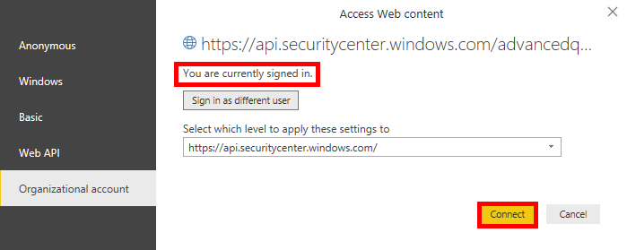

# <a name="create-custom-reports-using-power-bi"></a><span data-ttu-id="91acc-104">Erstellen benutzerdefinierter Berichte mithilfe von Power BI</span><span class="sxs-lookup"><span data-stu-id="91acc-104">Create custom reports using Power BI</span></span>

[!INCLUDE [Microsoft 365 Defender rebranding](../../includes/microsoft-defender.md)]

<span data-ttu-id="91acc-105">**Gilt für:**</span><span class="sxs-lookup"><span data-stu-id="91acc-105">**Applies to:**</span></span>
- [<span data-ttu-id="91acc-106">Microsoft Defender für Endpunkt</span><span class="sxs-lookup"><span data-stu-id="91acc-106">Microsoft Defender for Endpoint</span></span>](https://go.microsoft.com/fwlink/p/?linkid=2154037)
- [<span data-ttu-id="91acc-107">Microsoft 365 Defender</span><span class="sxs-lookup"><span data-stu-id="91acc-107">Microsoft 365 Defender</span></span>](https://go.microsoft.com/fwlink/?linkid=2118804)


- <span data-ttu-id="91acc-108">Möchten Sie Microsoft Defender for Endpoint erleben?</span><span class="sxs-lookup"><span data-stu-id="91acc-108">Want to experience Microsoft Defender for Endpoint?</span></span> [<span data-ttu-id="91acc-109">Registrieren Sie sich für eine kostenlose Testversion.</span><span class="sxs-lookup"><span data-stu-id="91acc-109">Sign up for a free trial.</span></span>](https://www.microsoft.com/microsoft-365/windows/microsoft-defender-atp?ocid=docs-wdatp-exposedapis-abovefoldlink) 

[!include[Microsoft Defender for Endpoint API URIs for US Government](../../includes/microsoft-defender-api-usgov.md)]

[!include[Improve request performance](../../includes/improve-request-performance.md)]

<span data-ttu-id="91acc-110">In diesem Abschnitt erfahren Sie, wie Sie zusätzlich zu Defender for Endpoint-APIs einen Power BI-Bericht erstellen.</span><span class="sxs-lookup"><span data-stu-id="91acc-110">In this section you will learn create a Power BI report on top of Defender for Endpoint APIs.</span></span>

<span data-ttu-id="91acc-111">Im ersten Beispiel wird veranschaulicht, wie Sie Power BI mit der Erweiterten Such-API verbinden, und im zweiten Beispiel wird eine Verbindung mit unseren OData-APIs, z. B. Computeraktionen oder Warnungen, veranschaulicht.</span><span class="sxs-lookup"><span data-stu-id="91acc-111">The first example demonstrates how to connect Power BI to Advanced Hunting API and the second example demonstrates a connection to our OData APIs, such as Machine Actions or Alerts.</span></span>

## <a name="connect-power-bi-to-advanced-hunting-api"></a><span data-ttu-id="91acc-112">Verbinden von Power BI mit advanced Hunting API</span><span class="sxs-lookup"><span data-stu-id="91acc-112">Connect Power BI to Advanced Hunting API</span></span>

- <span data-ttu-id="91acc-113">Öffnen von Microsoft Power BI</span><span class="sxs-lookup"><span data-stu-id="91acc-113">Open Microsoft Power BI</span></span>

- <span data-ttu-id="91acc-114">Klicken **Sie auf Daten leere Abfrage**  >  **erhalten**</span><span class="sxs-lookup"><span data-stu-id="91acc-114">Click **Get Data** > **Blank Query**</span></span>

    

- <span data-ttu-id="91acc-116">Klicken Sie **auf Erweiterter Editor**</span><span class="sxs-lookup"><span data-stu-id="91acc-116">Click **Advanced Editor**</span></span>

    

- <span data-ttu-id="91acc-118">Kopieren Sie den folgenden Text, und fügen Sie ihn in den Editor ein:</span><span class="sxs-lookup"><span data-stu-id="91acc-118">Copy the below and paste it in the editor:</span></span>

```
    let 
        AdvancedHuntingQuery = "DeviceEvents | where ActionType contains 'Anti' | limit 20",

        HuntingUrl = "https://api.securitycenter.microsoft.com/api/advancedqueries",

        Response = Json.Document(Web.Contents(HuntingUrl, [Query=[key=AdvancedHuntingQuery]])),

        TypeMap = #table(
            { "Type", "PowerBiType" },
            {
                { "Double",   Double.Type },
                { "Int64",    Int64.Type },
                { "Int32",    Int32.Type },
                { "Int16",    Int16.Type },
                { "UInt64",   Number.Type },
                { "UInt32",   Number.Type },
                { "UInt16",   Number.Type },
                { "Byte",     Byte.Type },
                { "Single",   Single.Type },
                { "Decimal",  Decimal.Type },
                { "TimeSpan", Duration.Type },
                { "DateTime", DateTimeZone.Type },
                { "String",   Text.Type },
                { "Boolean",  Logical.Type },
                { "SByte",    Logical.Type },
                { "Guid",     Text.Type }
            }),

        Schema = Table.FromRecords(Response[Schema]),
        TypedSchema = Table.Join(Table.SelectColumns(Schema, {"Name", "Type"}), {"Type"}, TypeMap , {"Type"}),
        Results = Response[Results],
        Rows = Table.FromRecords(Results, Schema[Name]),
        Table = Table.TransformColumnTypes(Rows, Table.ToList(TypedSchema, (c) => {c{0}, c{2}}))

    in Table

```

- <span data-ttu-id="91acc-119">Klicken Sie auf **Fertig**</span><span class="sxs-lookup"><span data-stu-id="91acc-119">Click **Done**</span></span>

- <span data-ttu-id="91acc-120">Klicken **Sie auf Anmeldeinformationen bearbeiten**</span><span class="sxs-lookup"><span data-stu-id="91acc-120">Click **Edit Credentials**</span></span>

    

- <span data-ttu-id="91acc-122">Auswählen **des Organisationskontos**  >  **Anmelden**</span><span class="sxs-lookup"><span data-stu-id="91acc-122">Select **Organizational account** > **Sign in**</span></span>

    

- <span data-ttu-id="91acc-124">Geben Sie Ihre Anmeldeinformationen ein, und warten Sie, bis sie angemeldet sind</span><span class="sxs-lookup"><span data-stu-id="91acc-124">Enter your credentials and wait to be signed in</span></span>

- <span data-ttu-id="91acc-125">Klicken Sie **auf Verbinden**</span><span class="sxs-lookup"><span data-stu-id="91acc-125">Click **Connect**</span></span>

    

- <span data-ttu-id="91acc-127">Jetzt werden die Ergebnisse Ihrer Abfrage als Tabelle angezeigt, und Sie können mit dem Erstellen von Visualisierungen beginnen.</span><span class="sxs-lookup"><span data-stu-id="91acc-127">Now the results of your query will appear as table and you can start build visualizations on top of it!</span></span>

- <span data-ttu-id="91acc-128">Sie können diese Tabelle duplizieren, umbenennen und die Erweiterte Suche bearbeiten, um beliebige Daten zu erhalten.</span><span class="sxs-lookup"><span data-stu-id="91acc-128">You can duplicate this table, rename it and edit the Advanced Hunting query inside to get any data you would like.</span></span>

## <a name="connect-power-bi-to-odata-apis"></a><span data-ttu-id="91acc-129">Verbinden von Power BI mit OData-APIs</span><span class="sxs-lookup"><span data-stu-id="91acc-129">Connect Power BI to OData APIs</span></span>

- <span data-ttu-id="91acc-130">Der einzige Unterschied zum obigen Beispiel ist die Abfrage innerhalb des Editors.</span><span class="sxs-lookup"><span data-stu-id="91acc-130">The only difference from the above example is the query inside the editor.</span></span> 

- <span data-ttu-id="91acc-131">Kopieren Sie die folgende Datei, und fügen Sie sie in den Editor ein, um alle **Computeraktionen aus** Ihrer Organisation zu ziehen:</span><span class="sxs-lookup"><span data-stu-id="91acc-131">Copy the below and paste it in the editor to pull all **Machine Actions** from your organization:</span></span>

```
    let

        Query = "MachineActions",

        Source = OData.Feed("https://api.securitycenter.microsoft.com/api/" & Query, null, [Implementation="2.0", MoreColumns=true])
    in
        Source

```

- <span data-ttu-id="91acc-132">Sie können dasselbe für Warnungen **und** **Computer tun.**</span><span class="sxs-lookup"><span data-stu-id="91acc-132">You can do the same for **Alerts** and **Machines**.</span></span>

- <span data-ttu-id="91acc-133">Sie können auch OData-Abfragen für Abfragenfilter verwenden. Weitere Informationen finden Sie unter [Using OData Queries](exposed-apis-odata-samples.md)</span><span class="sxs-lookup"><span data-stu-id="91acc-133">You also can use OData queries for queries filters, see [Using OData Queries](exposed-apis-odata-samples.md)</span></span>


## <a name="power-bi-dashboard-samples-in-github"></a><span data-ttu-id="91acc-134">Power BI-Dashboardbeispiele in GitHub</span><span class="sxs-lookup"><span data-stu-id="91acc-134">Power BI dashboard samples in GitHub</span></span>
<span data-ttu-id="91acc-135">Weitere Informationen finden Sie in den [Power BI-Berichtsvorlagen](https://github.com/microsoft/MicrosoftDefenderATP-PowerBI).</span><span class="sxs-lookup"><span data-stu-id="91acc-135">For more information see the [Power BI report templates](https://github.com/microsoft/MicrosoftDefenderATP-PowerBI).</span></span>

## <a name="sample-reports"></a><span data-ttu-id="91acc-136">Beispielberichte</span><span class="sxs-lookup"><span data-stu-id="91acc-136">Sample reports</span></span>
<span data-ttu-id="91acc-137">Anzeigen der Microsoft Defender ATP Power BI-Berichtsbeispiele.</span><span class="sxs-lookup"><span data-stu-id="91acc-137">View the Microsoft Defender ATP Power BI report samples.</span></span> <span data-ttu-id="91acc-138">Weitere Informationen finden Sie unter [Durchsuchen von Codebeispielen](https://docs.microsoft.com/samples/browse/?products=mdatp).</span><span class="sxs-lookup"><span data-stu-id="91acc-138">For more information, see [Browse code samples](https://docs.microsoft.com/samples/browse/?products=mdatp).</span></span>


## <a name="related-topic"></a><span data-ttu-id="91acc-139">Verwandtes Thema</span><span class="sxs-lookup"><span data-stu-id="91acc-139">Related topic</span></span>
- [<span data-ttu-id="91acc-140">Defender für Endpunkt-APIs</span><span class="sxs-lookup"><span data-stu-id="91acc-140">Defender for Endpoint APIs</span></span>](apis-intro.md)
- [<span data-ttu-id="91acc-141">Erweiterte Suche-API</span><span class="sxs-lookup"><span data-stu-id="91acc-141">Advanced Hunting API</span></span>](run-advanced-query-api.md)
- [<span data-ttu-id="91acc-142">Verwenden von OData-Abfragen</span><span class="sxs-lookup"><span data-stu-id="91acc-142">Using OData Queries</span></span>](exposed-apis-odata-samples.md)
