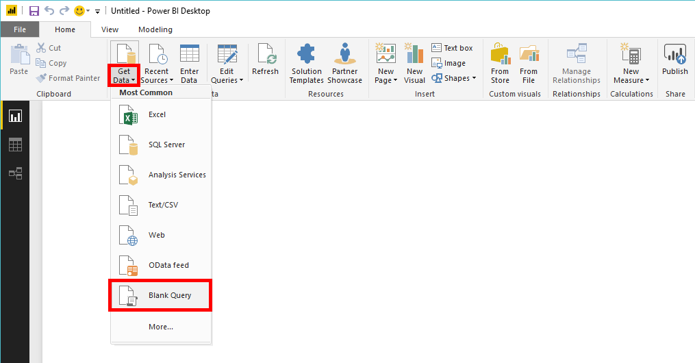
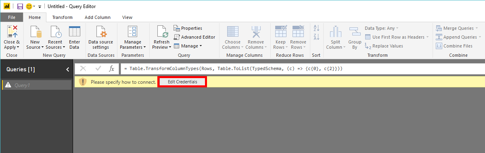
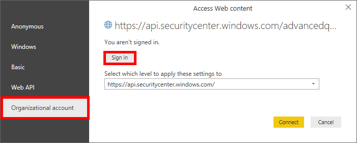

# <a name="create-custom-reports-using-power-bi"></a>Erstellen von benutzerdefinierten Berichten mit Power BI

[!INCLUDE [Microsoft 365 Defender rebranding](../../includes/microsoft-defender.md)]

**Gilt für:**
- [Microsoft Defender für Endpunkt](https://go.microsoft.com/fwlink/p/?linkid=2154037)
- [Microsoft 365 Defender](https://go.microsoft.com/fwlink/?linkid=2118804)


- Möchten Sie Microsoft Defender für Endpunkt erleben? [Registrieren Sie sich für eine kostenlose Testversion](https://www.microsoft.com/microsoft-365/windows/microsoft-defender-atp?ocid=docs-wdatp-exposedapis-abovefoldlink)

[!include[Microsoft Defender for Endpoint API URIs for US Government](../../includes/microsoft-defender-api-usgov.md)]

[!include[Improve request performance](../../includes/improve-request-performance.md)]

In diesem Abschnitt erfahren Sie, wie Sie einen Power BI Bericht über Defender für Endpunkt-APIs erstellen.

Im ersten Beispiel wird veranschaulicht, wie Power BI mit der API für die erweiterte Suche verbunden werden, und im zweiten Beispiel wird eine Verbindung mit unseren OData-APIs wie Computeraktionen oder Warnungen veranschaulicht.

## <a name="connect-power-bi-to-advanced-hunting-api"></a>Verbinden Power BI zur API für die erweiterte Suche

- Öffnen von Microsoft Power BI

- Klicken Sie auf  >  **"Leere Daten abrufen"**

  

- Klicken Sie auf **"Erweiterter Editor"**

  

- Kopieren Sie die folgende Datei, und fügen Sie sie in den Editor ein:

```
    let
        AdvancedHuntingQuery = "DeviceEvents | where ActionType contains 'Anti' | limit 20",

        HuntingUrl = "https://api.securitycenter.microsoft.com/api/advancedqueries",

        Response = Json.Document(Web.Contents(HuntingUrl, [Query=[key=AdvancedHuntingQuery]])),

        TypeMap = #table(
            { "Type", "PowerBiType" },
            {
                { "Double",   Double.Type },
                { "Int64",    Int64.Type },
                { "Int32",    Int32.Type },
                { "Int16",    Int16.Type },
                { "UInt64",   Number.Type },
                { "UInt32",   Number.Type },
                { "UInt16",   Number.Type },
                { "Byte",     Byte.Type },
                { "Single",   Single.Type },
                { "Decimal",  Decimal.Type },
                { "TimeSpan", Duration.Type },
                { "DateTime", DateTimeZone.Type },
                { "String",   Text.Type },
                { "Boolean",  Logical.Type },
                { "SByte",    Logical.Type },
                { "Guid",     Text.Type }
            }),

        Schema = Table.FromRecords(Response[Schema]),
        TypedSchema = Table.Join(Table.SelectColumns(Schema, {"Name", "Type"}), {"Type"}, TypeMap , {"Type"}),
        Results = Response[Results],
        Rows = Table.FromRecords(Results, Schema[Name]),
        Table = Table.TransformColumnTypes(Rows, Table.ToList(TypedSchema, (c) => {c{0}, c{2}}))

    in Table
```

- Klicken Sie auf **"Fertig".**

- Klicken Sie auf **"Anmeldeinformationen bearbeiten".**

    

- Organisationskonto   >  **anmelden** auswählen

    

- Geben Sie Ihre Anmeldeinformationen ein, und warten Sie, bis Sie angemeldet sind.

- Klicken Sie auf **Verbinden**

    

- Jetzt werden die Ergebnisse Ihrer Abfrage als Tabelle angezeigt, und Sie können mit der Erstellung von Visualisierungen beginnen.

- Sie können diese Tabelle duplizieren, umbenennen und die Abfrage "Erweiterte Suche" darin bearbeiten, um alle gewünschten Daten abzurufen.

## <a name="connect-power-bi-to-odata-apis"></a>Verbinden Power BI zu OData-APIs

- Der einzige Unterschied zum obigen Beispiel ist die Abfrage innerhalb des Editors.

- Kopieren Sie die folgende Datei, und fügen Sie sie in den Editor ein, um alle **Computeraktionen** aus Ihrer Organisation abzurufen:

```
    let

        Query = "MachineActions",

        Source = OData.Feed("https://api.securitycenter.microsoft.com/api/" & Query, null, [Implementation="2.0", MoreColumns=true])
    in
        Source
```

- Sie können dies auch für **Warnungen** und **Computer** tun.
- Sie können auch OData-Abfragen für Abfragefilter verwenden. Weitere Informationen finden Sie unter [Verwenden von OData-Abfragen](exposed-apis-odata-samples.md)

## <a name="power-bi-dashboard-samples-in-github"></a>Power BI-Dashboardbeispiele in GitHub

Weitere Informationen finden Sie in den [Power BI Berichtsvorlagen.](https://github.com/microsoft/MicrosoftDefenderATP-PowerBI)

## <a name="sample-reports"></a>Beispielberichte

Sehen Sie sich die Microsoft Defender für Endpunkt-Power BI Berichtsbeispiele an. Weitere Informationen finden Sie unter [Durchsuchen von Codebeispielen.](/samples/browse/?products=mdatp)

## <a name="related-topics"></a>Verwandte Themen

- [Defender für Endpunkt-APIs](apis-intro.md)
- [Erweiterte Bedrohungssuche-API](run-advanced-query-api.md)
- [Verwenden von OData-Abfragen](exposed-apis-odata-samples.md)
