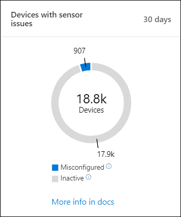

# Überprüfen des Sensorintestatus in Microsoft Defender for Endpoint

[!INCLUDE [Microsoft 365 Defender rebranding](../../includes/microsoft-defender.md)]

**Gilt für:**
- [Microsoft Defender für Endpunkt](https://go.microsoft.com/fwlink/p/?linkid=2154037)
- [Microsoft 365 Defender](https://go.microsoft.com/fwlink/?linkid=2118804)

>Möchten Sie Defender for Endpoint erleben? [Registrieren Sie sich für eine kostenlose Testversion.](https://www.microsoft.com/microsoft-365/windows/microsoft-defender-atp?ocid=docs-wdatp-checksensor-abovefoldlink)

Die **Kachel Geräte mit Sensorproblemen** befindet sich im Dashboard für Sicherheitsvorgänge. Diese Kachel enthält Informationen zur Fähigkeit des einzelnen Geräts, Sensordaten zur Verfügung zu stellen und mit dem Defender for Endpoint-Dienst zu kommunizieren. Es berichtet, wie viele Geräte Aufmerksamkeit erfordern und hilft Ihnen, problematische Geräte zu identifizieren und Maßnahmen zur Korrektur bekannter Probleme zu ergreifen.

Auf der Kachel befinden sich zwei Statusindikatoren, die Informationen zur Anzahl der Geräte bereitstellen, die dem Dienst nicht ordnungsgemäß melden:
- **Falsch konfiguriert** – Diese Geräte melden möglicherweise teilweise Sensordaten an den Defender for Endpoint-Dienst und können Konfigurationsfehler haben, die korrigiert werden müssen.
- **Inaktiv** : Geräte, die die Berichterstellung an den Defender for Endpoint-Dienst im letzten Monat für mehr als sieben Tage beendet haben.

Wenn Sie auf eine der Gruppen klicken, werden Sie zur **Geräteliste ,** gefiltert nach Ihrer Wahl, gefiltert.

In **der Liste Geräte** können Sie die Integritätsstatusliste nach dem folgenden Status filtern:
- **Aktiv** – Geräte, die aktiv an den Defender for Endpoint-Dienst melden.
- **Falsch konfiguriert –** Diese Geräte melden möglicherweise teilweise Sensordaten an den Defender for Endpoint-Dienst, haben jedoch Konfigurationsfehler, die korrigiert werden müssen. Falsch konfigurierte Geräte können entweder eine oder eine Kombination der folgenden Probleme haben:
  - **Keine Sensordaten** – Geräte haben das Senden von Sensordaten beendet. Vom Gerät können eingeschränkte Warnungen ausgelöst werden.
  - **Beeinträchtigte Kommunikation** : Die Kommunikation mit dem Gerät ist beeinträchtigt. Das Senden von Dateien für eine tiefe Analyse, das Blockieren von Dateien, das Isolieren des Geräts vom Netzwerk und andere Aktionen, die eine Kommunikation mit dem Gerät erfordern, funktionieren möglicherweise nicht.
- **Inaktiv** – Geräte, die die Berichterstellung an den Defender for Endpoint-Dienst beendet haben.

Sie können die gesamte Liste auch im CSV-Format mit dem **Export-Feature** herunterladen. Weitere Informationen zu Filtern finden Sie unter [Anzeigen und Organisieren der Geräteliste](machines-view-overview.md).

>[!NOTE]
>Exportieren Sie die Liste im CSV-Format, um die ungefilterten Daten anzeigen zu können. Die CSV-Datei enthält alle Geräte in der Organisation, unabhängig davon, welche Filterung in der Ansicht selbst angewendet wird. Je nachdem, wie groß Ihre Organisation ist, kann es sehr viel Zeit dauern, bis sie heruntergeladen wird.

Sie können die Gerätedetails anzeigen, wenn Sie auf ein falsch konfiguriertes oder inaktives Gerät klicken.

## Verwandtes Thema
- [Beheben fehlerhafter Sensoren in Defender for Endpoint](fix-unhealthy-sensors.md)
