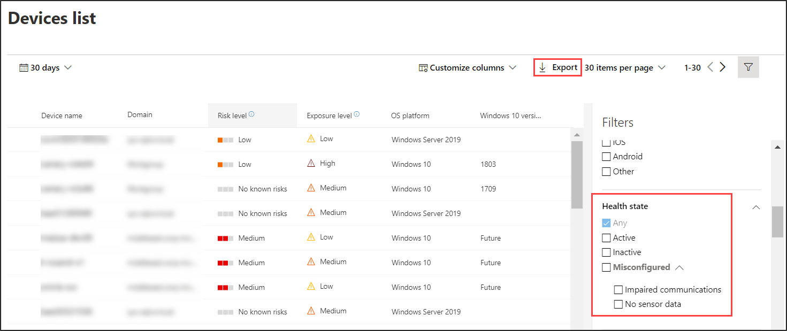

# Überprüfen des Sensorintestatus in Microsoft Defender for EndpointCheck sensor health state in Microsoft Defender for Endpoint

[!INCLUDE [Microsoft 365 Defender rebranding](../../includes/microsoft-defender.md)]

**Gilt für:****Applies to:**
- [Microsoft Defender für EndpunktMicrosoft Defender for Endpoint](https://go.microsoft.com/fwlink/p/?linkid=2154037)
- [Microsoft 365 DefenderMicrosoft 365 Defender](https://go.microsoft.com/fwlink/?linkid=2118804)

>Möchten Sie Defender for Endpoint erleben?Want to experience Defender for Endpoint? [Registrieren Sie sich für eine kostenlose Testversion.Sign up for a free trial.](https://www.microsoft.com/microsoft-365/windows/microsoft-defender-atp?ocid=docs-wdatp-checksensor-abovefoldlink)

Die **Kachel Geräte mit Sensorproblemen** befindet sich im Dashboard für Sicherheitsvorgänge.The **Devices with sensor issues** tile is found on the Security Operations dashboard. Diese Kachel enthält Informationen zur Fähigkeit des einzelnen Geräts, Sensordaten zur Verfügung zu stellen und mit dem Defender for Endpoint-Dienst zu kommunizieren.This tile provides information on the individual device’s ability to provide sensor data and communicate with the Defender for Endpoint service. Es berichtet, wie viele Geräte Aufmerksamkeit erfordern und hilft Ihnen, problematische Geräte zu identifizieren und Maßnahmen zur Korrektur bekannter Probleme zu ergreifen.It reports how many devices require attention and helps you identify problematic devices and take action to correct known issues.

Auf der Kachel befinden sich zwei Statusindikatoren, die Informationen zur Anzahl der Geräte bereitstellen, die dem Dienst nicht ordnungsgemäß melden:There are two status indicators on the tile that provide information on the number of devices that are not reporting properly to the service:
- **Falsch konfiguriert** – Diese Geräte melden möglicherweise teilweise Sensordaten an den Defender for Endpoint-Dienst und können Konfigurationsfehler haben, die korrigiert werden müssen.**Misconfigured** - These devices might partially be reporting sensor data to the Defender for Endpoint service and might have configuration errors that need to be corrected.
- **Inaktiv** : Geräte, die die Berichterstellung an den Defender for Endpoint-Dienst im letzten Monat für mehr als sieben Tage beendet haben.**Inactive** - Devices that have stopped reporting to the Defender for Endpoint service for more than seven days in the past month.

Wenn Sie auf eine der Gruppen klicken, werden Sie zur **Geräteliste ,** gefiltert nach Ihrer Wahl, gefiltert.Clicking any of the groups directs you to **Devices list**, filtered according to your choice.

In **der Liste Geräte** können Sie die Integritätsstatusliste nach dem folgenden Status filtern:On **Devices list**, you can filter the health state list by the following status:
- **Aktiv** – Geräte, die aktiv an den Defender for Endpoint-Dienst melden.**Active** - Devices that are actively reporting to the Defender for Endpoint service.
- **Falsch konfiguriert –** Diese Geräte melden möglicherweise teilweise Sensordaten an den Defender for Endpoint-Dienst, haben jedoch Konfigurationsfehler, die korrigiert werden müssen.**Misconfigured** - These devices might partially be reporting sensor data to the Defender for Endpoint service but have configuration errors that need to be corrected. Falsch konfigurierte Geräte können entweder eine oder eine Kombination der folgenden Probleme haben:Misconfigured devices can have either one or a combination of the following issues:
  - **Keine Sensordaten** – Geräte haben das Senden von Sensordaten beendet.**No sensor data** - Devices has stopped sending sensor data. Vom Gerät können eingeschränkte Warnungen ausgelöst werden.Limited alerts can be triggered from the device.
  - **Beeinträchtigte Kommunikation** : Die Kommunikation mit dem Gerät ist beeinträchtigt.**Impaired communications** - Ability to communicate with device is impaired. Das Senden von Dateien für eine tiefe Analyse, das Blockieren von Dateien, das Isolieren des Geräts vom Netzwerk und andere Aktionen, die eine Kommunikation mit dem Gerät erfordern, funktionieren möglicherweise nicht.Sending files for deep analysis, blocking files, isolating device from network and other actions that require communication with the device may not work.
- **Inaktiv** – Geräte, die die Berichterstellung an den Defender for Endpoint-Dienst beendet haben.**Inactive** - Devices that have stopped reporting to the Defender for Endpoint service.

Sie können die gesamte Liste auch im CSV-Format mit dem **Export-Feature** herunterladen.You can also download the entire list in CSV format using the **Export** feature. Weitere Informationen zu Filtern finden Sie unter [Anzeigen und Organisieren der Geräteliste](machines-view-overview.md).For more information on filters, see [View and organize the Devices list](machines-view-overview.md).

>[!NOTE]
>Exportieren Sie die Liste im CSV-Format, um die ungefilterten Daten anzeigen zu können.Export the list in CSV format to display the unfiltered data. Die CSV-Datei enthält alle Geräte in der Organisation, unabhängig davon, welche Filterung in der Ansicht selbst angewendet wird. Je nachdem, wie groß Ihre Organisation ist, kann es sehr viel Zeit dauern, bis sie heruntergeladen wird.The CSV file will include all devices in the organization, regardless of any filtering applied in the view itself and can take a significant amount of time to download, depending on how large your organization is.

Sie können die Gerätedetails anzeigen, wenn Sie auf ein falsch konfiguriertes oder inaktives Gerät klicken.You can view the device details when you click on a misconfigured or inactive device.

## Verwandtes ThemaRelated topic
- [Beheben fehlerhafter Sensoren in Defender for EndpointFix unhealthy sensors in Defender for Endpoint](fix-unhealthy-sensors.md)
