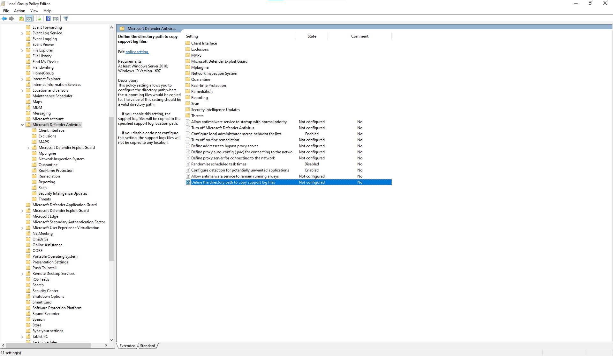

# <a name="collect-microsoft-defender-av-diagnostic-data"></a><span data-ttu-id="7d730-104">Sammeln von Microsoft Defender AV-Diagnosedaten</span><span class="sxs-lookup"><span data-stu-id="7d730-104">Collect Microsoft Defender AV diagnostic data</span></span>

[!INCLUDE [Microsoft 365 Defender rebranding](../../includes/microsoft-defender.md)]


<span data-ttu-id="7d730-105">**Gilt für:**</span><span class="sxs-lookup"><span data-stu-id="7d730-105">**Applies to:**</span></span>

- [<span data-ttu-id="7d730-106">Microsoft Defender für Endpunkt</span><span class="sxs-lookup"><span data-stu-id="7d730-106">Microsoft Defender for Endpoint</span></span>](/microsoft-365/security/defender-endpoint/)

<span data-ttu-id="7d730-107">In diesem Artikel wird beschrieben, wie Sie Diagnosedaten sammeln, die von Microsoft Support- und Engineeringteams zur Problembehandlung bei der Verwendung von Microsoft Defender AV verwendet werden können.</span><span class="sxs-lookup"><span data-stu-id="7d730-107">This article describes how to collect diagnostic data that can be used by Microsoft support and engineering teams to help troubleshoot issues you might encounter when using the Microsoft Defender AV.</span></span>

> [!NOTE]
> <span data-ttu-id="7d730-108">Im Rahmen des Untersuchungs- oder Reaktionsprozesses können Sie ein Untersuchungspaket von einem Gerät erfassen.</span><span class="sxs-lookup"><span data-stu-id="7d730-108">As part of the investigation or response process, you can collect an investigation package from a device.</span></span> <span data-ttu-id="7d730-109">So geht's: [Erfassen des Untersuchungspakets von Geräten](/windows/security/threat-protection/microsoft-defender-atp/respond-machine-alerts#collect-investigation-package-from-devices).</span><span class="sxs-lookup"><span data-stu-id="7d730-109">Here's how: [Collect investigation package from devices](/windows/security/threat-protection/microsoft-defender-atp/respond-machine-alerts#collect-investigation-package-from-devices).</span></span>

<span data-ttu-id="7d730-110">Rufen Sie auf mindestens zwei Geräten mit demselben Problem die .cab diagnosedatei ab, indem Sie die folgenden Schritte ausführen:</span><span class="sxs-lookup"><span data-stu-id="7d730-110">On at least two devices that are experiencing the same issue, obtain the .cab diagnostic file by taking the following steps:</span></span>

1. <span data-ttu-id="7d730-111">Öffnen Sie eine Administratorversion der Eingabeaufforderung wie folgt:</span><span class="sxs-lookup"><span data-stu-id="7d730-111">Open an administrator-level version of the command prompt as follows:</span></span>

    <span data-ttu-id="7d730-112">a.</span><span class="sxs-lookup"><span data-stu-id="7d730-112">a.</span></span> <span data-ttu-id="7d730-113">Öffnen Sie das **Startmenü.**</span><span class="sxs-lookup"><span data-stu-id="7d730-113">Open the **Start** menu.</span></span>

    <span data-ttu-id="7d730-114">b.</span><span class="sxs-lookup"><span data-stu-id="7d730-114">b.</span></span> <span data-ttu-id="7d730-115">Geben **Sie cmd ein.**</span><span class="sxs-lookup"><span data-stu-id="7d730-115">Type **cmd**.</span></span> <span data-ttu-id="7d730-116">Klicken Sie mit der rechten Maustaste **auf Eingabeaufforderung,** und klicken **Sie auf Als Administrator ausführen**.</span><span class="sxs-lookup"><span data-stu-id="7d730-116">Right-click on **Command Prompt** and click **Run as administrator**.</span></span>

    <span data-ttu-id="7d730-117">c.</span><span class="sxs-lookup"><span data-stu-id="7d730-117">c.</span></span> <span data-ttu-id="7d730-118">Geben Sie Administratoranmeldeinformationen ein, oder genehmigen Sie die Eingabeaufforderung.</span><span class="sxs-lookup"><span data-stu-id="7d730-118">Enter administrator credentials or approve the prompt.</span></span>

2. <span data-ttu-id="7d730-119">Navigieren Sie zum Microsoft Defender-Verzeichnis.</span><span class="sxs-lookup"><span data-stu-id="7d730-119">Navigate to the Microsoft Defender directory.</span></span> <span data-ttu-id="7d730-120">Der Standardwert ist `C:\Program Files\Windows Defender`.</span><span class="sxs-lookup"><span data-stu-id="7d730-120">By default, this is `C:\Program Files\Windows Defender`.</span></span>

> [!NOTE]
> <span data-ttu-id="7d730-121">Wenn Sie eine aktualisierte [Microsoft Defender Platform-Version ausführen,](https://support.microsoft.com/help/4052623/update-for-microsoft-defender-antimalware-platform)führen Sie bitte an `MpCmdRun` folgendem Speicherort aus: `C:\ProgramData\Microsoft\Windows Defender\Platform\<version>` .</span><span class="sxs-lookup"><span data-stu-id="7d730-121">If you're running an [updated Microsoft Defender Platform version](https://support.microsoft.com/help/4052623/update-for-microsoft-defender-antimalware-platform), please run `MpCmdRun` from the following location: `C:\ProgramData\Microsoft\Windows Defender\Platform\<version>`.</span></span>

3. <span data-ttu-id="7d730-122">Geben Sie den folgenden Befehl ein, und drücken Sie dann die **EINGABETASTE.**</span><span class="sxs-lookup"><span data-stu-id="7d730-122">Type the following command, and then press **Enter**</span></span>  

    ```Dos
    mpcmdrun.exe -GetFiles
    ```
  
4. <span data-ttu-id="7d730-123">Eine .cab wird generiert, die verschiedene Diagnoseprotokolle enthält.</span><span class="sxs-lookup"><span data-stu-id="7d730-123">A .cab file will be generated that contains various diagnostic logs.</span></span> <span data-ttu-id="7d730-124">Der Speicherort der Datei wird in der Ausgabe in der Eingabeaufforderung angegeben.</span><span class="sxs-lookup"><span data-stu-id="7d730-124">The location of the file will be specified in the output in the command prompt.</span></span> <span data-ttu-id="7d730-125">Standardmäßig ist der Speicherort `C:\ProgramData\Microsoft\Microsoft Defender\Support\MpSupportFiles.cab` .</span><span class="sxs-lookup"><span data-stu-id="7d730-125">By default, the location is `C:\ProgramData\Microsoft\Microsoft Defender\Support\MpSupportFiles.cab`.</span></span>

> [!NOTE]
> <span data-ttu-id="7d730-126">Verwenden Sie den folgenden Befehl, um die Cabdatei an einen anderen Pfad oder eine andere UNC-Freigabe umzuleiten: `mpcmdrun.exe -GetFiles -SupportLogLocation <path>`</span><span class="sxs-lookup"><span data-stu-id="7d730-126">To redirect the cab file to a a different path or UNC share, use the following command: `mpcmdrun.exe -GetFiles -SupportLogLocation <path>`</span></span>  <br/><span data-ttu-id="7d730-127">Weitere Informationen finden Sie unter [Redirect diagnostic data to a UNC share](#redirect-diagnostic-data-to-a-unc-share).</span><span class="sxs-lookup"><span data-stu-id="7d730-127">For more information, see [Redirect diagnostic data to a UNC share](#redirect-diagnostic-data-to-a-unc-share).</span></span>

5. <span data-ttu-id="7d730-128">Kopieren Sie .cab Dateien an einen Speicherort, auf den vom Microsoft-Support zugegriffen werden kann.</span><span class="sxs-lookup"><span data-stu-id="7d730-128">Copy these .cab files to a location that can be accessed by Microsoft support.</span></span> <span data-ttu-id="7d730-129">Ein Beispiel könnte ein kennwortgeschützter OneDrive sein, den Sie für uns freigeben können.</span><span class="sxs-lookup"><span data-stu-id="7d730-129">An example could be a password-protected OneDrive folder that you can share with us.</span></span>

> [!NOTE]
><span data-ttu-id="7d730-130">Wenn Sie ein Problem mit der Updatekonformität haben, senden Sie eine E-Mail mithilfe der Update Compliance-Support-E-Mail-Vorlage, und füllen Sie die Vorlage mit den folgenden Informationen aus: <a href="mailto:ucsupport@microsoft.com?subject=WDAV assessment issue&body=I%20am%20encountering%20the%20following%20issue%20when%20using%20Windows%20Defender%20AV%20in%20Update%20Compliance%3a%20%0d%0aI%20have%20provided%20at%20least%202%20support%20.cab%20files%20at%20the%20following%20location%3a%20%3Caccessible%20share%2c%20including%20access%20details%20such%20as%20password%3E%0d%0aMy%20OMS%20workspace%20ID%20is%3a%20%0d%0aPlease%20contact%20me%20at%3a"></a></span><span class="sxs-lookup"><span data-stu-id="7d730-130">If you have a problem with Update compliance, send an email using the <a href="mailto:ucsupport@microsoft.com?subject=WDAV assessment issue&body=I%20am%20encountering%20the%20following%20issue%20when%20using%20Windows%20Defender%20AV%20in%20Update%20Compliance%3a%20%0d%0aI%20have%20provided%20at%20least%202%20support%20.cab%20files%20at%20the%20following%20location%3a%20%3Caccessible%20share%2c%20including%20access%20details%20such%20as%20password%3E%0d%0aMy%20OMS%20workspace%20ID%20is%3a%20%0d%0aPlease%20contact%20me%20at%3a">Update Compliance support email template</a>, and fill out the template with the following information:</span></span>
>```
> I am encountering the following issue when using Microsoft Defender Antivirus in Update Compliance:
> I have provided at least 2 support .cab files at the following location:  
> <accessible share, including access details such as password>
>
>    My OMS workspace ID is:
>
>    Please contact me at:

## <a name="redirect-diagnostic-data-to-a-unc-share"></a><span data-ttu-id="7d730-131">Umleiten von Diagnosedaten zu einer UNC-Freigabe</span><span class="sxs-lookup"><span data-stu-id="7d730-131">Redirect diagnostic data to a UNC share</span></span>
<span data-ttu-id="7d730-132">Zum Sammeln von Diagnosedaten in einem zentralen Repository können Sie den Parameter SupportLogLocation angeben.</span><span class="sxs-lookup"><span data-stu-id="7d730-132">To collect diagnostic data on a central repository, you can specify the SupportLogLocation parameter.</span></span>

```Dos
mpcmdrun.exe -GetFiles -SupportLogLocation <path>
```

<span data-ttu-id="7d730-133">Kopiert die Diagnosedaten in den angegebenen Pfad.</span><span class="sxs-lookup"><span data-stu-id="7d730-133">Copies the diagnostic data to the specified path.</span></span> <span data-ttu-id="7d730-134">Wenn der Pfad nicht angegeben ist, werden die Diagnosedaten an den in der Konfiguration des Speicherorts des Supportprotokolls angegebenen Speicherort kopiert.</span><span class="sxs-lookup"><span data-stu-id="7d730-134">If the path is not specified, the diagnostic data will be copied to the location specified in the Support Log Location Configuration.</span></span>

<span data-ttu-id="7d730-135">Wenn der Parameter SupportLogLocation verwendet wird, wird eine Ordnerstruktur wie folgt im Zielpfad erstellt:</span><span class="sxs-lookup"><span data-stu-id="7d730-135">When the SupportLogLocation parameter is used, a folder structure like as follows will be created in the destination path:</span></span>

```Dos
<path>\<MMDD>\MpSupport-<hostname>-<HHMM>.cab
```

| <span data-ttu-id="7d730-136">Feld</span><span class="sxs-lookup"><span data-stu-id="7d730-136">field</span></span>  | <span data-ttu-id="7d730-137">Beschreibung</span><span class="sxs-lookup"><span data-stu-id="7d730-137">Description</span></span>   |
|:----|:----|
| <span data-ttu-id="7d730-138">path</span><span class="sxs-lookup"><span data-stu-id="7d730-138">path</span></span> | <span data-ttu-id="7d730-139">Der In der Befehlszeile angegebene oder aus der Konfiguration abgerufene Pfad</span><span class="sxs-lookup"><span data-stu-id="7d730-139">The path as specified on the command line or retrieved from configuration</span></span>
| <span data-ttu-id="7d730-140">MMDD</span><span class="sxs-lookup"><span data-stu-id="7d730-140">MMDD</span></span> | <span data-ttu-id="7d730-141">Monat und Tag, an dem die Diagnosedaten gesammelt wurden (z. B. 0530)</span><span class="sxs-lookup"><span data-stu-id="7d730-141">Month and day when the diagnostic data was collected (for example, 0530)</span></span>
| <span data-ttu-id="7d730-142">hostname</span><span class="sxs-lookup"><span data-stu-id="7d730-142">hostname</span></span> | <span data-ttu-id="7d730-143">Der Hostname des Geräts, auf dem die Diagnosedaten erfasst wurden</span><span class="sxs-lookup"><span data-stu-id="7d730-143">The hostname of the device on which the diagnostic data was collected</span></span>
| <span data-ttu-id="7d730-144">HHMM</span><span class="sxs-lookup"><span data-stu-id="7d730-144">HHMM</span></span> | <span data-ttu-id="7d730-145">Stunden und Minuten, in denen die Diagnosedaten erfasst wurden (z. B. 1422)</span><span class="sxs-lookup"><span data-stu-id="7d730-145">Hours and minutes when the diagnostic data was collected (for example, 1422)</span></span>

> [!NOTE]
> <span data-ttu-id="7d730-146">Stellen Sie bei der Verwendung einer Dateifreigabe sicher, dass das zum Sammeln des Diagnosepakets verwendete Konto Schreibzugriff auf die Freigabe hat.</span><span class="sxs-lookup"><span data-stu-id="7d730-146">When using a file share please make sure that account used to collect the diagnostic package has write access to the share.</span></span>  

## <a name="specify-location-where-diagnostic-data-is-created"></a><span data-ttu-id="7d730-147">Angeben des Speicherorts, an dem Diagnosedaten erstellt werden</span><span class="sxs-lookup"><span data-stu-id="7d730-147">Specify location where diagnostic data is created</span></span>

<span data-ttu-id="7d730-148">Sie können auch angeben, wo die Diagnosedatei .cab mithilfe eines Gruppenrichtlinienobjekts (Group Policy Object, GPO) erstellt wird.</span><span class="sxs-lookup"><span data-stu-id="7d730-148">You can also specify where the diagnostic .cab file will be created using a Group Policy Object (GPO).</span></span> 

1. <span data-ttu-id="7d730-149">Öffnen Sie den Editor für lokale Gruppenrichtlinien, und suchen Sie das SupportLogLocation-GPO unter: `HKEY_LOCAL_MACHINE\SOFTWARE\Policies\Microsoft\Windows Defender\SupportLogLocation`</span><span class="sxs-lookup"><span data-stu-id="7d730-149">Open the Local Group Policy Editor and find the SupportLogLocation GPO at: `HKEY_LOCAL_MACHINE\SOFTWARE\Policies\Microsoft\Windows Defender\SupportLogLocation`</span></span>
   
1. <span data-ttu-id="7d730-150">Wählen **Sie Definieren des Verzeichnispfads zum Kopieren von Unterstützungsprotokolldateien aus.**</span><span class="sxs-lookup"><span data-stu-id="7d730-150">Select **Define the directory path to copy support log files**.</span></span>

      
        
       
3. <span data-ttu-id="7d730-153">Wählen Sie im Richtlinien-Editor Aktiviert **aus.**</span><span class="sxs-lookup"><span data-stu-id="7d730-153">Inside the policy editor, select **Enabled**.</span></span>
       
4. <span data-ttu-id="7d730-154">Geben Sie den Verzeichnispfad an, in den Sie die Unterstützungsprotokolldateien im Feld **Optionen kopieren** möchten.</span><span class="sxs-lookup"><span data-stu-id="7d730-154">Specify the directory path where you want to copy the support log files in the **Options** field.</span></span>
     <span data-ttu-id="7d730-155"></span><span class="sxs-lookup"><span data-stu-id="7d730-155"></span></span> 
5. <span data-ttu-id="7d730-156">Wählen **Sie OK** oder Übernehmen **aus.**</span><span class="sxs-lookup"><span data-stu-id="7d730-156">Select **OK** or **Apply**.</span></span>

## <a name="see-also"></a><span data-ttu-id="7d730-157">Siehe auch</span><span class="sxs-lookup"><span data-stu-id="7d730-157">See also</span></span>

- [<span data-ttu-id="7d730-158">Problembehandlung Microsoft Defender Antivirus Berichterstellung</span><span class="sxs-lookup"><span data-stu-id="7d730-158">Troubleshoot Microsoft Defender Antivirus reporting</span></span>](troubleshoot-reporting.md)