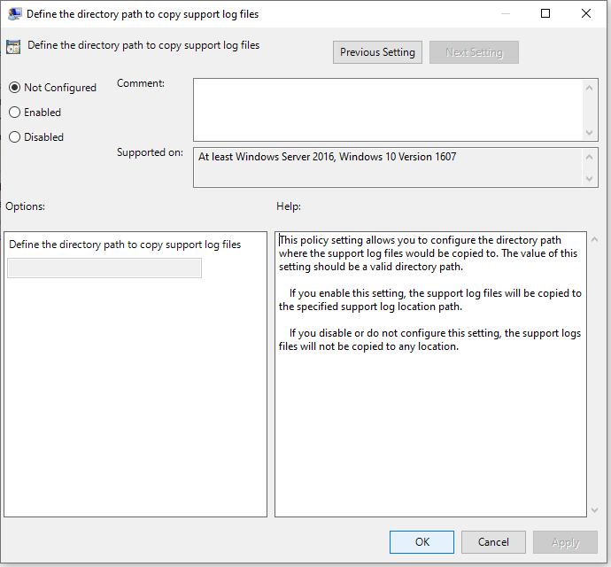

# <a name="collect-microsoft-defender-av-diagnostic-data"></a>Sammeln von Microsoft Defender AV-Diagnosedaten

[!INCLUDE [Microsoft 365 Defender rebranding](../../includes/microsoft-defender.md)]


**Gilt für:**

- [Microsoft Defender für Endpunkt](/microsoft-365/security/defender-endpoint/)

In diesem Artikel wird beschrieben, wie Sie Diagnosedaten sammeln, die von Microsoft Support- und Engineeringteams zur Problembehandlung bei der Verwendung von Microsoft Defender AV verwendet werden können.

> [!NOTE]
> Im Rahmen des Untersuchungs- oder Reaktionsprozesses können Sie ein Untersuchungspaket von einem Gerät erfassen. So geht's: [Erfassen des Untersuchungspakets von Geräten](/windows/security/threat-protection/microsoft-defender-atp/respond-machine-alerts#collect-investigation-package-from-devices).

Rufen Sie auf mindestens zwei Geräten mit demselben Problem die Cab-Diagnosedatei ab, indem Sie die folgenden Schritte ausführen:

1. Öffnen Sie eine Administratorversion der Eingabeaufforderung wie folgt:

    a. Öffnen Sie das **Startmenü.**

    b. Geben **Sie cmd ein.** Klicken Sie mit der rechten Maustaste **auf Eingabeaufforderung,** und klicken **Sie auf Als Administrator ausführen**.

    c. Geben Sie Administratoranmeldeinformationen ein, oder genehmigen Sie die Eingabeaufforderung.

2. Navigieren Sie zum Microsoft Defender-Verzeichnis. Der Standardwert ist `C:\Program Files\Windows Defender`.

> [!NOTE]
> Wenn Sie eine aktualisierte [Microsoft Defender Platform-Version ausführen,](https://support.microsoft.com/help/4052623/update-for-microsoft-defender-antimalware-platform)führen Sie bitte an `MpCmdRun` folgendem Speicherort aus: `C:\ProgramData\Microsoft\Windows Defender\Platform\<version>` .

3. Geben Sie den folgenden Befehl ein, und drücken Sie dann die **EINGABETASTE.**  

    ```Dos
    mpcmdrun.exe -GetFiles
    ```
  
4. Es wird eine CAB-Datei generiert, die verschiedene Diagnoseprotokolle enthält. Der Speicherort der Datei wird in der Ausgabe in der Eingabeaufforderung angegeben. Standardmäßig ist der Speicherort `C:\ProgramData\Microsoft\Microsoft Defender\Support\MpSupportFiles.cab` .

> [!NOTE]
> Verwenden Sie den folgenden Befehl, um die Cabdatei an einen anderen Pfad oder eine andere UNC-Freigabe umzuleiten: `mpcmdrun.exe -GetFiles -SupportLogLocation <path>`  <br/>Weitere Informationen finden Sie unter [Redirect diagnostic data to a UNC share](#redirect-diagnostic-data-to-a-unc-share).

5. Kopieren Sie diese CAB-Dateien an einen Speicherort, auf den vom Microsoft-Support zugegriffen werden kann. Ein Beispiel könnte ein kennwortgeschützter OneDrive-Ordner sein, den Sie für uns freigeben können.

> [!NOTE]
>Wenn Sie ein Problem mit der Updatekonformität haben, senden Sie eine E-Mail mithilfe der Update Compliance-Support-E-Mail-Vorlage, und füllen Sie die Vorlage mit den folgenden Informationen aus: <a href="mailto:ucsupport@microsoft.com?subject=WDAV assessment issue&body=I%20am%20encountering%20the%20following%20issue%20when%20using%20Windows%20Defender%20AV%20in%20Update%20Compliance%3a%20%0d%0aI%20have%20provided%20at%20least%202%20support%20.cab%20files%20at%20the%20following%20location%3a%20%3Caccessible%20share%2c%20including%20access%20details%20such%20as%20password%3E%0d%0aMy%20OMS%20workspace%20ID%20is%3a%20%0d%0aPlease%20contact%20me%20at%3a"></a>
>```
> I am encountering the following issue when using Microsoft Defender Antivirus in Update Compliance:
> I have provided at least 2 support .cab files at the following location:  
> <accessible share, including access details such as password>
>
>    My OMS workspace ID is:
>
>    Please contact me at:

## <a name="redirect-diagnostic-data-to-a-unc-share"></a>Umleiten von Diagnosedaten zu einer UNC-Freigabe
Zum Sammeln von Diagnosedaten in einem zentralen Repository können Sie den Parameter SupportLogLocation angeben.

```Dos
mpcmdrun.exe -GetFiles -SupportLogLocation <path>
```

Kopiert die Diagnosedaten in den angegebenen Pfad. Wenn der Pfad nicht angegeben ist, werden die Diagnosedaten an den in der Konfiguration des Speicherorts des Supportprotokolls angegebenen Speicherort kopiert.

Wenn der Parameter SupportLogLocation verwendet wird, wird eine Ordnerstruktur wie folgt im Zielpfad erstellt:

```Dos
<path>\<MMDD>\MpSupport-<hostname>-<HHMM>.cab
```

| Feld  | Beschreibung   |
|:----|:----|
| path | Der In der Befehlszeile angegebene oder aus der Konfiguration abgerufene Pfad
| MMDD | Monat und Tag, an dem die Diagnosedaten gesammelt wurden (z. B. 0530)
| hostname | Der Hostname des Geräts, auf dem die Diagnosedaten erfasst wurden
| HHMM | Stunden und Minuten, in denen die Diagnosedaten erfasst wurden (z. B. 1422)

> [!NOTE]
> Stellen Sie bei der Verwendung einer Dateifreigabe sicher, dass das zum Sammeln des Diagnosepakets verwendete Konto Schreibzugriff auf die Freigabe hat.  

## <a name="specify-location-where-diagnostic-data-is-created"></a>Angeben des Speicherorts, an dem Diagnosedaten erstellt werden

Sie können auch angeben, wo die Diagnose-CAB-Datei mithilfe eines Gruppenrichtlinienobjekts (Group Policy Object, GPO) erstellt wird. 

1. Öffnen Sie den Editor für lokale Gruppenrichtlinien, und suchen Sie das SupportLogLocation-GPO unter: `HKEY_LOCAL_MACHINE\SOFTWARE\Policies\Microsoft\Windows Defender\SupportLogLocation`
   
1. Wählen **Sie Definieren des Verzeichnispfads zum Kopieren von Unterstützungsprotokolldateien aus.**

      
        
       
3. Wählen Sie im Richtlinien-Editor Aktiviert **aus.**
       
4. Geben Sie den Verzeichnispfad an, in den Sie die Unterstützungsprotokolldateien im Feld **Optionen kopieren** möchten.
      
5. Wählen **Sie OK** oder Übernehmen **aus.**

## <a name="see-also"></a>Siehe auch

- [Behandeln von Microsoft Defender Antivirus-Berichten](troubleshoot-reporting.md)