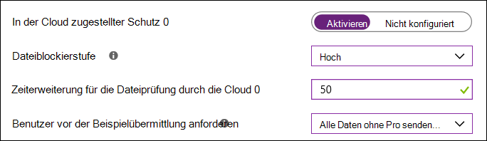

# Aktivieren von „Beim ersten Sichten blockieren“Turn on block at first sight

**Gilt für:****Applies to:**

- [Microsoft Defender für EndpunktMicrosoft Defender for Endpoint](/microsoft-365/security/defender-endpoint/)

Dieser Artikel beschreibt ein Antivirus-/Antimalware-Feature, die als „Beim ersten Sichten blockieren“ bekannt ist, und er beschreibt, wie Sie „Beim ersten Sichten blockieren“ für Ihre Organisation aktivieren.This article describes an antivirus/antimalware feature known as "block at first sight", and describes how to enable block at first sight for your organization. 

> [!TIP]
> Dieser Artikel ist für Unternehmensadministratoren und IT-Profis gedacht, welche die Sicherheitseinstellungen für Organisationen verwalten.This article is intended for enterprise admins and IT Pros who manage security settings for organizations. Wenn Sie kein Unternehmensadministrator oder IT-Profi sind, aber Fragen bezüglich „Beim ersten Sichten blockieren“ haben, lesen Sie den Abschnitt [Kein Unternehmensadministrator oder IT-Profi?](#not-an-enterprise-admin-or-it-pro).If you are not an enteprise admin or IT Pro but you have questions about block at first sight, see the [Not an enterprise admin or IT Pro?](#not-an-enterprise-admin-or-it-pro) section.

## Was ist „Beim ersten Sichten blockieren“?What is "block at first sight"?

„Beim ersten Sichten blockieren“ ist ein Bedrohungsschutzfeature der nächsten Generation, das neue Malware erkennt und sie innerhalb von Sekunden blockiert.Block at first sight is a threat protection feature of next-generation protection that detects new malware and blocks it within seconds. „Beim ersten Sichten blockieren“ ist aktiviert, wenn gewisse Sicherheitseinstellungen aktiviert sind.Block at first sight is enabled when certain security settings are enabled. Dazu zählen die folgenden Einstellungen:These settings include:

- Aus der Cloud bereitgestellter Schutz;Cloud-delivered protection; 
- Ein angegebenes Zeitlimit für die Stichprobenübermittlung (z. B. 50 Sekunden); undA specified sample submission timeout (such as 50 seconds); and 
- Eine Dateiblockierungsstufe von „hoch“.A file-blocking level of high. 

In den meisten Unternehmensorganisationen werden die Einstellungen, die für das Aktivieren von „Beim ersten Sichten blockieren“ benötigt werden, mit Microsoft Defender Antivirus-Bereitstellungen konfiguriert.In most enterprise organizations, the settings needed to enable block at first sight are configured with Microsoft Defender Antivirus deployments. 

## So funktioniert esHow it works

Wenn Microsoft Defender Antivirus eine verdächtige, aber nicht erkannte Datei findet, wird unser Back-End für Cloudschutz abgefragt.When Microsoft Defender Antivirus encounters a suspicious but undetected file, it queries our cloud protection backend. Das Cloud-Back-End wendet Heuristiken, maschinelles Lernen und automatisiertes Analysieren der Datei an, um festzustellen, ob die Dateien bösartig oder keine Bedrohung sind.The cloud backend applies heuristics, machine learning, and automated analysis of the file to determine whether the files are malicious or not a threat.

Microsoft Defender Antivirus verwendet mehrere Erkennungs- und Präventionstechnologien, um präzisen, intelligenten und Echtzeit-Schutz zu bieten.Microsoft Defender Antivirus uses multiple detection and prevention technologies to deliver accurate, intelligent, and real-time protection. 

  

> [!TIP]
> Weitere Informationen finden Sie unter [(Blog) Lernen Sie die fortschrittlichen Technologien kennen, die den Kern des Schutzes der nächsten Generation für Microsoft Defender für Endpunkt bilden](https://www.microsoft.com/security/blog/2019/06/24/inside-out-get-to-know-the-advanced-technologies-at-the-core-of-microsoft-defender-atp-next-generation-protection/).To learn more, see [(Blog) Get to know the advanced technologies at the core of Microsoft Defender for Endpoint next-generation protection](https://www.microsoft.com/security/blog/2019/06/24/inside-out-get-to-know-the-advanced-technologies-at-the-core-of-microsoft-defender-atp-next-generation-protection/).

## Einige Dinge, die man über „Beim ersten Sichten blockieren“ wissen sollteA few things to know about block at first sight

- In Windows 10, Version 1803, können mit „Beim ersten Sichten blockieren“ nicht portable ausführbare Dateien (wie JS, VBS oder Makros) und ausführbare Dateien blockiert werden.In Windows 10, version 1803 or later, block at first sight can block non-portable executable files (such as JS, VBS, or macros) and executable files.

- Das Feature „Beim ersten Sichten blockieren“ nutzt das Back-End für Cloudschutz nur für ausführbare und nicht portable ausführbare Dateien, die aus dem Internet heruntergeladen wurden oder aus der Internetzone stammen.Block at first sight only uses the cloud protection backend for executable files and non-portable executable files that are downloaded from the Internet, or that originate from the Internet zone. Ein Hashwert der EXE-Datei wird über das Cloud-Back-End überprüft, um zu ermitteln, ob es sich um eine zuvor nicht erkannte Datei handelt.A hash value of the .exe file is checked via the cloud backend to determine if the file is a previously undetected file.

- Wenn das Cloud-Back-End keinen Entscheid fällen kann, sperrt Microsoft Defender Antivirus die Datei und lädt eine Kopie in die Cloud hoch.If the cloud backend is unable to make a determination, Microsoft Defender Antivirus locks the file and uploads a copy to the cloud. Die Cloud führt weitere Analysen durch, um zu einer Entscheidung zu kommen, bevor entweder die Datei ausgeführt werden darf, oder bei jedem zukünftigen Auftreten blockiert wird, je nachdem, ob die Datei als bösartig oder als keine Bedrohung eingestuft wurde.The cloud performs more analysis to reach a determination before it either allows the file to run or blocks it in all future encounters, depending on whether it determines the file to be malicious or not a threat.

- In vielen Fällen kann dieser Prozess die Reaktionszeit auf neue Schadsoftware von Stunden auf Sekunden reduzieren.In many cases, this process can reduce the response time for new malware from hours to seconds.

- Sie können [angeben, wie lange die Ausführung einer Datei verhindert werden soll](configure-cloud-block-timeout-period-microsoft-defender-antivirus.md), während der cloudbasierte Schutzdienst die Datei analysiert.You can [specify how long a file should be prevented from running](configure-cloud-block-timeout-period-microsoft-defender-antivirus.md) while the cloud-based protection service analyzes the file. Sie können auch [die Nachricht auf den Desktops des Benutzers anpassen](/windows/security/threat-protection//windows-defender-security-center/wdsc-customize-contact-information.md), wenn eine Datei blockiert ist.And, you can [customize the message displayed on users' desktops](/windows/security/threat-protection//windows-defender-security-center/wdsc-customize-contact-information.md) when a file is blocked. Sie können den Firmennamen, die Kontaktinformationen und die Nachrichten-URL ändern.You can change the company name, contact information, and message URL.

## Aktivieren von „Beim ersten Sichten blockieren“ mit Microsoft IntuneTurn on block at first sight with Microsoft Intune

> [!TIP]
> Microsoft Intune ist jetzt Bestandteil von Microsoft Endpoint Manager.Microsoft Intune is now part of Microsoft Endpoint Manager.

1. Navigieren Sie im Microsoft Endpoint Manager-Admin Center ([https://endpoint.microsoft.com](https://endpoint.microsoft.com)) zu **Geräte** > **Konfigurationsprofile**.In the Microsoft Endpoint Manager admin center ([https://endpoint.microsoft.com](https://endpoint.microsoft.com)), navigate to **Devices** > **Configuration profiles**.

2. Wählen oder erstellen Sie ein Profil mit dem Profiltyp **Geräteeinschränkungen**.Select or create a profile using the **Device restrictions** profile type.

3. Setzen oder bestätigen Sie in den **Konfigurationseinstellungen** des Profils für die Geräteeinschränkungen die folgenden Einstellungen unter **Microsoft Defender Antivirus**:In the **Configuration settings** for the Device restrictions profile, set or confirm the following settings under **Microsoft Defender Antivirus**:

   - **Aus der Cloud bereitgestellter Schutz**: Aktiviert**Cloud-delivered protection**: Enabled
   - **Dateiblockierungsstufe**: Hoch**File Blocking Level**: High
   - **Zeitverlängerung für Dateiüberprüfung durch die Cloud**: 50**Time extension for file scanning by the cloud**: 50
   - **Benutzer vor Stichprobenübermittlung auffordern**: Alle Daten ohne Aufforderung senden**Prompt users before sample submission**: Send all data without prompting

   

4. Speichern Sie Ihre Einstellungen.Save your settings.

> [!TIP]
> - Das Festlegen der Dateiblockierungsstufe auf **Hoch** wendet eine starke Erkennungsleistung an.Setting the file blocking level to **High** applies a strong level of detection. Im unwahrscheinlichen Fall, dass die Dateisperrung zu einer falsch positiven Erkennung legitimer Dateien führt, kann Ihr Sicherheitsteam [in Quarantäne gestellten Dateien wiederherstellen](./restore-quarantined-files-microsoft-defender-antivirus.md).In the unlikely event that file blocking causes a false positive detection of legitimate files, your security operations team can [restore quarantined files](./restore-quarantined-files-microsoft-defender-antivirus.md).
> - Weitere Informationen zum Konfigurieren von Microsoft Defender Antivirus-Geräteeinschränkungen in Intune finden Sie unter [Konfigurieren von Einstellungen für Geräteeinschränkungen in Microsoft Intune](/intune/device-restrictions-configure).For more information about configuring Microsoft Defender Antivirus device restrictions in Intune, see [Configure device restriction settings in Microsoft Intune](/intune/device-restrictions-configure).
> - Eine Liste der Microsoft Defender Antivirus-Geräteeinschränkungen in Intune finden Sie unter [Einstellungen für Geräteeinschränkungen für Windows 10 (und neuer) in Intune](/intune/device-restrictions-windows-10#microsoft-defender-antivirus).For a list of Microsoft Defender Antivirus device restrictions in Intune, see [Device restriction for Windows 10 (and newer) settings in Intune](/intune/device-restrictions-windows-10#microsoft-defender-antivirus).

## Aktivieren von „Beim ersten Sichten blockieren“ mit Microsoft Endpoint ManagerTurn on block at first sight with Microsoft Endpoint Manager

> [!TIP]
> Wenn Sie den Microsoft Endpoint Configuration Manager suchen, finden Sie ihn jetzt als Teil von Microsoft Endpoint Manager.If you're looking for Microsoft Endpoint Configuration Manager, it's now part of Microsoft Endpoint Manager.

1. Im Microsoft Endpoint Manager ([https://endpoint.microsoft.com](https://endpoint.microsoft.com)) gehen sie zu **Endpunktsicherheit** > **Antivirus**.In Microsoft Endpoint Manager ([https://endpoint.microsoft.com](https://endpoint.microsoft.com)), go to **Endpoint security** > **Antivirus**.

2. Wählen Sie eine bestehende Richtlinie aus, oder erstellen Sie eine neue Richtlinie mit dem Profiltyp **Microsoft Defender Antivirus**.Select an existing policy, or create a new policy using the **Microsoft Defender Antivirus** profile type.

3. Legen Sie die folgenden Konfigurationseinstellungen fest, oder bestätigen Sie diese:Set or confirm the following configuration settings:

   - **Aus der Cloud bereitgestellten Schutz aktivieren**: Ja**Turn on cloud-delivered protection**: Yes
   - **Aus der Cloud bereitgestellte Schutzstufe**: Hoch**Cloud-delivered protection level**: High
   - **Defender Cloud – erweitertes Zeitlimit in Sekunden**: 50**Defender Cloud Extended Timeout in Seconds**: 50

   :::image type="content" source="images/endpointmgr-antivirus-cloudprotection.png" alt-text="„Beim ersten Sichten blockieren“ in Endpoint Manager":::

4. Wenden Sie das Microsoft Defender Antivirus-Profil auf eine Gruppe an, wie z. B. **Alle Benutzer**, **Alle Geräte** oder **Alle Benutzer und Geräte**.Apply the Microsoft Defender Antivirus profile to a group, such as **All users**, **All devices**, or **All users and devices**.

## Aktivieren von „Beim ersten Sichten blockieren“ mit der GruppenrichtlinieTurn on block at first sight with Group Policy

> [!NOTE]
> Wir empfehlen, Intune oder Microsoft Endpoint Manager zu verwenden, um „Beim ersten Sichten blockieren“ zu aktivieren.We recommend using Intune or Microsoft Endpoint Manager to turn on block at first sight. 

1. Öffnen Sie auf dem Computer, der Ihre Gruppenrichtlinie verwaltet, die [Gruppenrichtlinien-Verwaltungskonsole](/previous-versions/windows/it-pro/windows-server-2008-R2-and-2008/cc731212(v=ws.11)), klicken Sie mit der rechten Maustaste auf das Gruppenrichtlinienobjekt, das Sie konfigurieren möchten, und wählen Sie **Bearbeiten** aus.On your Group Policy management computer, open the [Group Policy Management Console](/previous-versions/windows/it-pro/windows-server-2008-R2-and-2008/cc731212(v=ws.11)), right-click the Group Policy Object you want to configure and select **Edit**. 

2. Gehen Sie mithilfe des **Gruppenrichtlinien-Verwaltungseditors** zu **Computer-Konfiguration** > **Administrative Vorlagen** > **Windows-Komponenten** > **Microsoft Defender Antivirus** > **MAPS**.Using the **Group Policy Management Editor** go to **Computer configuration** > **Administrative templates** > **Windows Components** > **Microsoft Defender Antivirus** > **MAPS**. 

3. Doppelklicken Sie im Abschnitt MAPS auf **Konfigurieren des Features „Beim ersten Sichten blockieren“**, legen Sie es auf **Aktiviert** fest, und wählen Sie dann **OK** aus.In the MAPS section, double-click **Configure the 'Block at First Sight' feature**, and set it to **Enabled**, and then select **OK**.

    > [!IMPORTANT]
    > Das Festlegen auf **Immer auffordern (0)** wird den Schutzzustand des Geräts verringern.Setting to **Always prompt (0)** will lower the protection state of the device. Das Festlegen auf **Niemals senden (2)** bedeutet, dass „Beim ersten Sichten blockieren“ nicht funktioniert.Setting to **Never send (2)** means block at first sight will not function.

4. Doppelklicken Sie im Abschnitt MAPS auf **Dateistichproben senden, wenn eine weitere Analyse erforderlich ist**, und legen Sie dies auf **Aktiviert** fest.In the MAPS section, double-click **Send file samples when further analysis is required**, and set it to **Enabled**. Wählen Sie unter **Dateistichproben senden, wenn eine weitere Analyse erforderlich ist** die Option **Alle Stichproben senden** aus und dann **OK**.Under **Send file samples when further analysis is required**, select **Send all samples**, and then select **OK**.

5. Stellen Sie Ihr Gruppenrichtlinien-Objekt erneut in Ihrem Netzwerk bereit, so wie Sie dies normalerweise tun.Redeploy your Group Policy Object across your network as you usually do.

## Bestätigen der Aktivierung von „Beim ersten Sichten blockieren“ auf einzelnen ClientgerätenConfirm block at first sight is enabled on individual client devices

Mit der Windows-Sicherheit-App können Sie überprüfen, ob „Beim ersten Sichten blockieren“ auf einzelnen Clientgeräten aktiviert ist.You can confirm that block at first sight is enabled on individual client devices using the Windows Security app. Die Option „Beim ersten Sichten blockieren“ wird automatisch aktiviert, solange **Aus der Cloud bereitgestellter Schutz** und **Automatische Übermittlung von Stichproben** beide aktiviert sind.Block at first sight is automatically enabled as long as **Cloud-delivered protection** and **Automatic sample submission** are both turned on.

1. Öffnen Sie die Windows-Sicherheit-App.Open the Windows Security app.

2. Wählen Sie **Viren- & Bedrohungsschutz** und dann unter **Einstellungen für Viren- & Bedrohungsschutz** die Option **Einstellungen verwalten** aus.Select **Virus & threat protection**, and then, under **Virus & threat protection settings**, select **Manage Settings**.

   

3. Bestätigen Sie, dass **Aus der Cloud bereitgestellter Schutz** und **Automatische Übermittlung von Stichproben** beide aktiviert sind.Confirm that **Cloud-delivered protection** and **Automatic sample submission** are both turned on.

> [!NOTE]
> - Wenn die erforderlichen Einstellungen konfiguriert sind und mithilfe von Gruppenrichtlinien bereitgestellt werden, sind die Einstellungen in diesem Abschnitt grau hinterlegt und stehen auf einzelnen Endpunkten nicht zur Verfügung.If the prerequisite settings are configured and deployed using Group Policy, the settings described in this section will be greyed-out and unavailable for use on individual endpoints. 
> - Änderungen, die über ein Gruppenrichtlinienobjekt vorgenommen wurden, müssen zunächst auf einzelnen Endpunkten bereitgestellt werden, bevor die Einstellung in den Windows-Einstellungen aktualisiert wird.Changes made through a Group Policy Object must first be deployed to individual endpoints before the setting will be updated in Windows Settings.

## Validieren, dass „Beim ersten Sichten blockieren“ funktioniertValidate block at first sight is working

Um zu validieren, ob das Feature funktioniert, laden Sie die [Beispieldatei „Beim ersten Sichten blockieren“](https://demo.wd.microsoft.com/Page/BAFS) herunter.To validate that the feature is working, download the [Block at first sight sample file](https://demo.wd.microsoft.com/Page/BAFS). Zum Herunterladen der Datei benötigen Sie ein Konto in Azure AD, dem entweder die Rolle „Sicherheitsadministrator“ oder „Globaler Administrator“ zugewiesen ist.To download the file, you will need an account in Azure AD that has either the Security Administrator or Global Administrator role assigned.

Um zu validieren, ob der Cloud-aktivierte Schutz funktioniert, folgen Sie der Anleitung in [Validieren der Verbindungen zwischen Ihrem Netzwerk und der Cloud](configure-network-connections-microsoft-defender-antivirus.md#validate-connections-between-your-network-and-the-cloud).To validate that cloud-enabled protection is working, follow the guidance in [Validate connections between your network and the cloud](configure-network-connections-microsoft-defender-antivirus.md#validate-connections-between-your-network-and-the-cloud). 

## Deaktivieren von „Beim ersten Sichten blockieren“Turn off block at first sight

> [!CAUTION]
> Das Deaktivieren der Option „Beim ersten Sichten blockieren“ wird den Schutzstatus Ihres Geräts / Ihrer Geräte und Ihres Netzwerks verringern.Turning off block at first sight will lower the protection state of your device(s) and your network.

Sie könnten „Beim ersten Sichten blockieren“ deaktivieren, wenn Sie die erforderlichen Einstellungen beibehalten möchten, ohne die Schutzeinstellung „Beim ersten Sichten blockieren“ tatsächlich zu verwenden.You might choose to disable block at first sight if you want to retain the prerequisite settings without actually using block at first sight protection. Sie könnten „Beim ersten Sichten blockieren“ temporär deaktivieren, um zu sehen, wie sich dieses Feature auf Ihr Netzwerk auswirkt.You might temporarily turn block at first sight off to see how this feature affects your network. Wir empfehlen jedoch nicht, den Schutz von „Beim ersten Sichten blockieren“ permanent zu deaktivieren.However, we do not recommend disabling block at first sight protection permanently.

### Deaktivieren von „Beim ersten Sichten blockieren“ mit Microsoft Endpoint ManagerTurn off block at first sight with Microsoft Endpoint Manager

1. Gehen Sie zum Microsoft Endpoint Manager Admin Center ([https://endpoint.microsoft.com](https://endpoint.microsoft.com)) und melden Sie sich an.Go to Microsoft Endpoint Manager admin center ([https://endpoint.microsoft.com](https://endpoint.microsoft.com)) and sign in.

2. Gehen Sie zu **Endpunktsicherheit** > **Antivirus**, und wählen Sie dann Ihre Microsoft Defender Antivirus-Richtlinie aus.Go to **Endpoint security** > **Antivirus**, and then select your Microsoft Defender Antivirus policy.

3. Wählen Sie unter **Verwalten** die Option **Eigenschaften** aus.Under **Manage**, choose **Properties**.

4. Wählen Sie direkt neben **Konfigurationseinstellungen** die Option **Bearbeiten** aus.Next to **Configuration settings**, choose **Edit**.

5. Ändern Sie eine oder mehrere der folgenden Einstellungen:Change one or more of the following settings:

   - Legen Sie **Aus der Cloud bereitgestellter Schutz aktivieren** auf **Nein** oder **Nicht konfiguriert** fest.Set **Turn on cloud-delivered protection** to **No** or **Not configured**.
   - Legen Sie **Aus der Cloud bereitgestellte Schutzebene** auf **Nicht konfiguriert** fest.Set **Cloud-delivered protection level** to **Not configured**.
   - Deaktivieren Sie das Kontrollkästchen **Defender Cloud – erweitertes Zeitlimit in Sekunden**.Clear the check box for **Defender Cloud Extended Timeout In Seconds**.

6. Überprüfen und Speichern Sie Ihre Einstellungen.Review and save your settings.

### Deaktivieren von „Beim ersten Sichten blockieren“ mit der GruppenrichtlinieTurn off block at first sight with Group Policy

1. Öffnen Sie auf dem Computer, der Ihre Gruppenrichtlinie verwaltet, die [Gruppenrichtlinien-Verwaltungskonsole](/previous-versions/windows/it-pro/windows-server-2008-R2-and-2008/cc731212(v=ws.11)), klicken Sie mit der rechten Maustaste auf das Gruppenrichtlinienobjekt, das Sie konfigurieren möchten, und wählen Sie dann **Bearbeiten** aus.On your Group Policy management computer, open the [Group Policy Management Console](/previous-versions/windows/it-pro/windows-server-2008-R2-and-2008/cc731212(v=ws.11)), right-click the Group Policy Object you want to configure, and then select **Edit**.

2. Gehen Sie mithilfe des **Gruppenrichtlinien-Verwaltungs-Editor** zu **Computerkonfiguration**, und wählen Sie **Administrative Vorlagen** aus.Using the **Group Policy Management Editor** go to **Computer configuration** and select **Administrative templates**.

3. Erweitern Sie die Struktur bis zu **Windows-Komponenten** > **Microsoft Defender Antivirus** > **MAPS**.Expand the tree through **Windows components** > **Microsoft Defender Antivirus** > **MAPS**.

4. Doppelklicken Sie auf **Konfigurieren des Features „Beim ersten Sichten blockieren“**, und legen Sie die Option auf **Deaktiviert** fest.Double-click **Configure the 'Block at First Sight' feature** and set the option to **Disabled**.

    > [!NOTE]
    > Das Deaktivieren von „Beim ersten Sichten blockieren“ deaktiviert oder verändert die erforderlichen Gruppenrichtlinien nicht.Disabling block at first sight does not disable or alter the prerequisite group policies.

## Kein Unternehmensadministrator oder IT-Profi?Not an enterprise admin or IT Pro?

Wenn Sie kein Unternehmensadministrator oder IT-Profi sind, aber Fragen bezüglich „Beim ersten Sichten blockieren“ haben, dann ist dieser Abschnitt für Sie.If you are not an enterprise admin or IT Pro, but you have questions about block at first sight, this section is for you. „Beim ersten Sichten blockieren“ ist ein Bedrohungsschutzfeature, das neue Malware erkennt und sie innerhalb von Sekunden blockiert.Block at first sight is a threat protection feature that detects and blocks malware within seconds. Obwohl es keine spezifische Einstellung gibt, die „Beim ersten Sichten blockieren“ genannt wird, wird das Feature aktiviert, wenn gewisse Einstellungen auf Ihrem Gerät konfiguriert sind.Although there isn't a specific setting called "Block at first sight," the feature is enabled when certain settings are configured on your device.

### So aktivieren oder deaktivieren Sie „Beim ersten Sichten blockieren“ auf Ihrem eigenen GerätHow to manage block at first sight on or off on your own device

Wenn Sie ein persönliches Gerät haben, das nicht von einer Organisation verwaltet wird, dann fragen Sie sich möglicherweise, wie Sie „Beim ersten Sichten blockieren“ aktivieren oder deaktivieren können.If you have a personal device that is not managed by an organization, you might be wondering how to turn block at first sight on or off. Sie können die Windows-Sicherheit-App verwenden, um „Beim ersten Sichten blockieren“ zu verwalten.You can use the Windows Security app to manage block at first sight.

1. Öffnen Sie auf Ihrem Windows 10-Computer die Windows-Sicherheit-App.On your Windows 10 computer, open the Windows Security app.

2. Wählen Sie **Viren- und Bedrohungsschutz** aus.Select **Virus & threat protection**.

3. Wählen Sie unter **Einstellungen für Viren- & Bedrohungsschutz** die Option **Einstellungen verwalten** aus.Under **Virus & threat protection settings**, select **Manage settings**.

4. Führen Sie einen der folgenden Schritte aus:Take one of the following steps:

   - Um „Beim ersten Sichten blockieren“ zu aktivieren, stellen Sie sicher, dass sowohl **Aus der Cloud bereitgestellter Schutz** wie auch **Automatische Übermittlung von Stichproben** aktiviert sind.To enable block at first sight, make sure that both **Cloud-delivered protection** and **Automatic sample submission** are both turned on.

   - Um „Beim ersten Sichten blockieren“ zu deaktivieren, deaktivieren Sie **Aus der Cloud bereitgestellter Schutz** oder **Automatische Übermittlung von Stichproben**.To disable block at first sight, turn off **Cloud-delivered protection** or **Automatic sample submission**.  
    
     > [!CAUTION]
     > Das Deaktivieren von „Beim ersten Sichten blockieren“ verringert die Schutzebene für Ihr Gerät.Turning off block at first sight lowers the level of protection for your device. Wir empfehlen nicht, „Beim ersten Sichten blockieren“ permanent zu deaktivieren.We do not recommend permanently disabling block at first sight. 

## Siehe auchSee also

- [Microsoft Defender Antivirus in Windows 10Microsoft Defender Antivirus in Windows 10](microsoft-defender-antivirus-in-windows-10.md)
- [Aus der Cloud bereitgestellten Schutz aktivierenEnable cloud-delivered protection](enable-cloud-protection-microsoft-defender-antivirus.md)
- [Mit Windows-Sicherheit geschützt bleibenStay protected with Windows Security](https://support.microsoft.com/windows/stay-protected-with-windows-security-2ae0363d-0ada-c064-8b56-6a39afb6a963)
